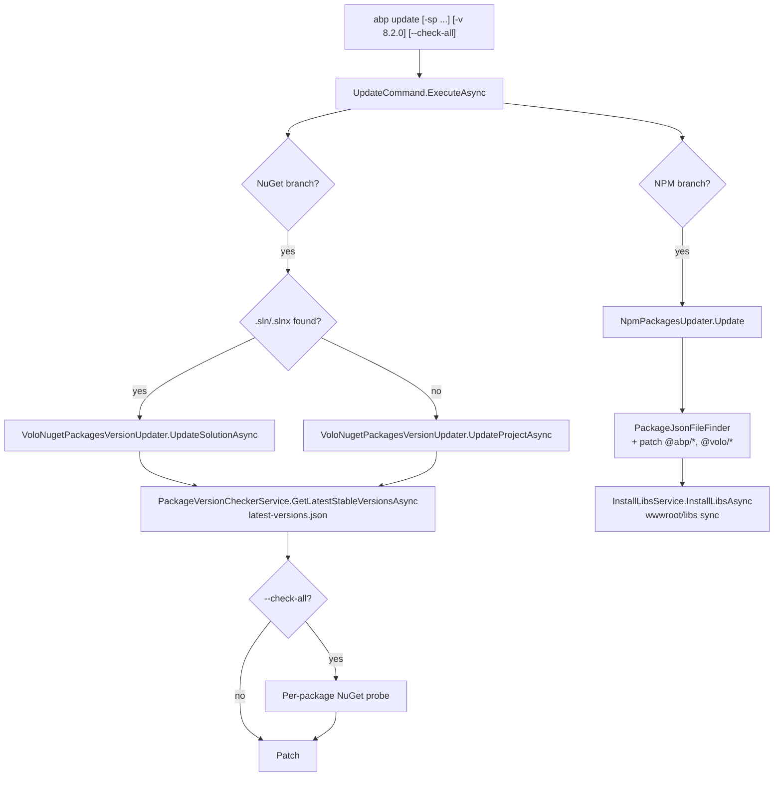

# `abp update` — Bumping ABP packages in a solution

`abp update` keeps an existing ABP solution on the latest versions of `Volo.Abp.*` NuGet packages and `@abp/*` NPM packages. Unlike `dotnet outdated` it knows about both halves of the stack, understands the ABP nightly/preview/RC release channels, can target a single `*.csproj` or every solution file under a directory, and dual-publishes the LeptonX theme version alongside the framework version. The command itself lives in `framework/src/Volo.Abp.Cli.Core/Volo/Abp/Cli/Commands/UpdateCommand.cs`; its two collaborators — `VoloNugetPackagesVersionUpdater` and `NpmPackagesUpdater` — live under `ProjectModification/`.

## `UpdateCommand` shape

```csharp
// framework/src/Volo.Abp.Cli.Core/Volo/Abp/Cli/Commands/UpdateCommand.cs
public class UpdateCommand : IConsoleCommand, ITransientDependency
{
    public const string Name = "update";

    public ILogger<UpdateCommand> Logger { get; set; }

    private readonly VoloNugetPackagesVersionUpdater _nugetPackagesVersionUpdater;
    private readonly NpmPackagesUpdater _npmPackagesUpdater;
    private readonly ITelemetryService _telemetryService;

    public UpdateCommand(VoloNugetPackagesVersionUpdater nugetPackagesVersionUpdater,
                        NpmPackagesUpdater npmPackagesUpdater,
                        ITelemetryService telemetryService)
    {
        _nugetPackagesVersionUpdater = nugetPackagesVersionUpdater;
        _npmPackagesUpdater = npmPackagesUpdater;
        _telemetryService = telemetryService;
        Logger = NullLogger<UpdateCommand>.Instance;
    }
    // ...
}
```

The constructor receives two updaters and a telemetry service. Both updaters are concrete `ITransientDependency` classes in `framework/src/Volo.Abp.Cli.Core/Volo/Abp/Cli/ProjectModification/` and are resolved fresh per command invocation.

## `ExecuteAsync` — branching by flag

```csharp
public async Task ExecuteAsync(CommandLineArgs commandLineArgs)
{
    await using var _ = _telemetryService.TrackActivityAsync(ActivityNameConsts.AbpCliCommandsUpdate);
    var updateNpm = commandLineArgs.Options.ContainsKey(Options.Packages.Npm);
    var updateNuget = commandLineArgs.Options.ContainsKey(Options.Packages.NuGet);

    var directory = commandLineArgs.Options.GetOrNull(Options.SolutionPath.Short, Options.SolutionPath.Long)
                    ?? Directory.GetCurrentDirectory();
    var version = commandLineArgs.Options.GetOrNull(Options.Version.Short, Options.Version.Long);
    var leptonXVersion = commandLineArgs.Options.GetOrNull(Options.LeptonXVersion.Short, Options.LeptonXVersion.Long);

    if (updateNuget || !updateNpm)
        await UpdateNugetPackages(commandLineArgs, directory, version, leptonXVersion);

    if (updateNpm || !updateNuget)
        await UpdateNpmPackages(directory, version, leptonXVersion);
}
```

Two binary flags (`--nuget`, `--npm`) decide which updater runs. With neither flag set, **both** run — `(updateNuget || !updateNpm)` is `true` and so is `(updateNpm || !updateNuget)`. With `--npm` only, the second condition matches and the first does not; with `--nuget` only, the inverse.

The activity wrapper `_telemetryService.TrackActivityAsync(ActivityNameConsts.AbpCliCommandsUpdate)` records the run; see `framework/src/Volo.Abp.Cli.Core/Volo/Abp/Cli/Telemetry/` for the activity sink.

## NuGet update path

`UpdateNugetPackages` decides between solution mode and project mode. It also accepts a `--check-all` flag that switches `VoloNugetPackagesVersionUpdater` from "use the cached `latest-versions.json` for every package" to "ping NuGet for each package separately":

```csharp
var solutions = new List<string>();
var givenSolution = commandLineArgs.Options.GetOrNull(Options.SolutionName.Short, Options.SolutionName.Long);

if (givenSolution.IsNullOrWhiteSpace())
{
    solutions.AddRange(Directory.GetFiles(directory, "*.sln", SearchOption.AllDirectories));
    solutions.AddRange(Directory.GetFiles(directory, "*.slnx", SearchOption.AllDirectories));
}
else
{
    solutions.Add(givenSolution);
}

var checkAll = commandLineArgs.Options.ContainsKey(Options.CheckAll.Long);

if (solutions.Any())
{
    foreach (var solution in solutions)
    {
        var solutionName = Path.GetFileName(solution).RemovePostFix(".slnx", ".sln");
        await _nugetPackagesVersionUpdater.UpdateSolutionAsync(solution, checkAll: checkAll,
            version: version, leptonXVersion: leptonXVersion);
        Logger.LogInformation("Volo packages are updated in {SolutionName} solution", solutionName);
    }
    return;
}

var project = Directory.GetFiles(directory, "*.csproj").FirstOrDefault();
if (project != null)
{
    var projectName = Path.GetFileName(project).RemovePostFix(".csproj");
    await _nugetPackagesVersionUpdater.UpdateProjectAsync(project, checkAll: checkAll,
        version: version, leptonXVersion: leptonXVersion);
    Logger.LogInformation("Volo packages are updated in {ProjectName} project", projectName);
    return;
}

throw new CliUsageException(
    "No solution or project found in this directory." +
    Environment.NewLine + Environment.NewLine + GetUsageInfo());
```

Two notes:

- **Recursive solution discovery.** When `--solution-name` is omitted, `Directory.GetFiles(..., "*.sln", SearchOption.AllDirectories)` recurses, so `abp update -sp ~/Source` happily updates every solution under that folder.
- **Project fallback.** When no solution is found at all, the command falls back to the first `*.csproj` in the directory — handy for module/template projects whose `.sln` is generated by `abp new`.

## `VoloNugetPackagesVersionUpdater`

`VoloNugetPackagesVersionUpdater` (`framework/src/Volo.Abp.Cli.Core/Volo/Abp/Cli/ProjectModification/VoloNugetPackagesVersionUpdater.cs`) does the heavy lifting. Its constructor pulls in two collaborators:

```csharp
public VoloNugetPackagesVersionUpdater(PackageVersionCheckerService packageVersionCheckerService,
                                      MyGetPackageListFinder myGetPackageListFinder)
{
    _packageVersionCheckerService = packageVersionCheckerService;
    _myGetPackageListFinder = myGetPackageListFinder;
    Logger = NullLogger<VoloNugetPackagesVersionUpdater>.Instance;
}
```

- `PackageVersionCheckerService` (`framework/src/Volo.Abp.Cli.Core/Volo/Abp/Cli/Version/PackageVersionCheckerService.cs`) is the same service `CliService` uses to detect a new CLI version. For `update`, the key method is `GetLatestStableVersionsAsync()`.
- `MyGetPackageListFinder` (`framework/src/Volo.Abp.Cli.Core/Volo/Abp/Cli/ProjectModification/MyGetPackageListFinder.cs`) lists nightly packages from `myget.org/F/abp-nightly` — used when `includePreviews` or `includeNightlyPreviews` is requested.

### Where the "latest" version comes from

`GetLatestStableVersionsAsync()` does not call NuGet at all. It calls `CliUrls.LatestVersionCheckFullPath`, which is hard-coded in `framework/src/Volo.Abp.Cli.Core/Volo/Abp/Cli/CliUrls.cs`:

```csharp
public static string LatestVersionCheckFullPath =
    "https://raw.githubusercontent.com/abpframework/abp/dev/latest-versions.json";
```

The JSON at that URL is a list of `LatestStableVersionResult` objects. `PackageVersionCheckerService.GetLatestStableVersionsInternalAsync` fetches it via the `CliConsts.GithubHttpClientName` named client, deserialises, filters to `Type == "stable"`, and orders by `SemanticVersion`:

```csharp
// framework/src/Volo.Abp.Cli.Core/Volo/Abp/Cli/Version/PackageVersionCheckerService.cs
var content = await responseMessage.Content.ReadAsStringAsync();
var result = JsonSerializer.Deserialize<List<LatestStableVersionResult>>(content);
return result.Where(q => q.Type.ToLowerInvariant() == "stable")
             .OrderByDescending(q => SemanticVersion.Parse(q.Version))
             .ToList();
```

A single GitHub request returns the entire version matrix (framework version, LeptonX version, module versions), so the typical "update everything" path only makes one network call before patching all the `.csproj` files in parallel.

### Solution loop

`UpdateSolutionAsync` first resolves the project list via `ProjectFinder.GetProjectFiles(solutionPath)` (`framework/src/Volo.Abp.Cli.Core/Volo/Abp/Cli/ProjectModification/ProjectFinder.cs`) and then runs an `async Task UpdateAsync(string filePath)` closure for each project file in parallel using `Task.WaitAll(projectPaths.Select(UpdateAsync).ToArray())`. Each closure:

1. Opens the `*.csproj` with `FileShare.None` to lock concurrent runs out.
2. Reads the content with `StreamReader(fs, Encoding.Default, detectEncodingFromByteOrderMarks: true)` to preserve the file's existing encoding/BOM.
3. Calls `UpdateVoloPackagesAsync(fileContent, includePreviews, includeReleaseCandidates, switchToStable, latestVersionInfo.Version, latestReleaseCandidateVersionInfo.Version, latestVersionFromMyGet, version, leptonXVersion, latestStableVersions: latestStableVersions)` to produce a new content string.
4. Seeks to zero, truncates, and writes the updated content back with `VoloNugetPackagesVersionUpdater.DefaultEncoding` (UTF-8).

Each call to `UpdateVoloPackagesAsync` consults `latestStableVersions` first for every `Volo.Abp.*` and `Volo.LeptonX.*` PackageReference; if the `--check-all` switch was passed it instead queries `PackageVersionCheckerService.GetLatestVersionOrNullAsync(packageId, ...)` per package, which is slower but handles the case where one module has shipped a hotfix that has not yet been merged into `latest-versions.json`.

### Project mode

`UpdateProjectAsync` is the single-project sibling, used when `UpdateCommand` falls back to the `*.csproj` branch. Logic mirrors the solution path but skips the parallelism, opens the project file with the same `FileShare.None` lock, and writes back with `sr.CurrentEncoding` so existing UTF-16/UTF-8 BOMs are preserved instead of being silently rewritten.

## NPM update path

`UpdateNpmPackages` is one line:

```csharp
private async Task UpdateNpmPackages(string directory, string version, string leptonXVersion)
{
    await _npmPackagesUpdater.Update(directory, version: version, leptonXVersion: leptonXVersion);
}
```

`NpmPackagesUpdater` (`framework/src/Volo.Abp.Cli.Core/Volo/Abp/Cli/ProjectModification/NpmPackagesUpdater.cs`) walks the directory for `package.json` files using `PackageJsonFileFinder` (also under `ProjectModification/`), then for each file:

1. Reads dependencies/devDependencies.
2. For every `@abp/*` and `@volo/*` entry, asks NPM for the matching version (with the same channel logic as the NuGet path).
3. Patches the version in place.
4. After all files are rewritten, calls `InstallLibsService.InstallLibsAsync(...)` so any updated `@abp/aspnetcore.components.web.theming` package is copied into `wwwroot/libs`. The same `IInstallLibsService` the `install-libs` command uses is reused here — see [install-libs](/cli/install-libs).

`NpmGlobalPackagesChecker` (also under `ProjectModification/`) is consulted before the run to warn the user when global tools like `gulp` or `yarn` are missing — those tools are required by `InstallLibsService` to finish the job.

## Update flow



## Options

`UpdateCommand.Options` (defined at the bottom of `UpdateCommand.cs`) exposes:

| Option | Short / Long | Effect |
| --- | --- | --- |
| Packages.NuGet | `--nuget` | Only update NuGet packages. |
| Packages.Npm | `--npm` | Only update NPM packages. |
| SolutionPath | `-sp` / `--solution-path` | Override `Directory.GetCurrentDirectory()` for both updaters. |
| SolutionName | `-sn` / `--solution-name` | Skip recursion and target one solution file. |
| CheckAll | `--check-all` | Bypass the `latest-versions.json` shortcut, probe each package individually. |
| Version | `-v` / `--version` | Pin every `Volo.Abp.*` package to an explicit version. |
| LeptonXVersion | `-lv` / `--leptonx-version` | Pin every `Volo.LeptonX.*` package to an explicit version. |

The `-p|--include-previews` flag listed in `GetUsageInfo` is honoured by the inner updaters (`UpdateSolutionAsync(includePreviews: ...)`), but `UpdateCommand.ExecuteAsync` does not currently forward it — that branch is exercised by `SwitchToPreviewCommand` instead (see below).

## The `switch-to-*` channel commands

`UpdateCommand` is the day-to-day "keep me on latest stable" tool. Switching between release channels (stable / preview / RC / nightly / local) is the job of the small `Switch*Command` family registered alongside it:

| Command | Class | Source path |
| --- | --- | --- |
| `switch-to-stable` | `SwitchToStableCommand` | `framework/src/Volo.Abp.Cli.Core/Volo/Abp/Cli/Commands/SwitchToStableCommand.cs` |
| `switch-to-preview` | `SwitchToPreviewCommand` | `framework/src/Volo.Abp.Cli.Core/Volo/Abp/Cli/Commands/SwitchToPreviewCommand.cs` |
| `switch-to-prerc` | `SwitchToPreRcCommand` | `framework/src/Volo.Abp.Cli.Core/Volo/Abp/Cli/Commands/SwitchToPreRcCommand.cs` |
| `switch-to-nightly` | `SwitchToNightlyCommand` | `framework/src/Volo.Abp.Cli.Core/Volo/Abp/Cli/Commands/SwitchToNightlyCommand.cs` |
| `switch-to-local` | `SwitchToLocal` | `framework/src/Volo.Abp.Cli.Core/Volo/Abp/Cli/Commands/SwitchToLocalCommand.cs` |

Every one of them is six lines plus help text and forwards to `PackagePreviewSwitcher` (`framework/src/Volo.Abp.Cli.Core/Volo/Abp/Cli/ProjectModification/PackagePreviewSwitcher.cs`):

```csharp
public class SwitchToStableCommand : IConsoleCommand, ITransientDependency
{
    public const string Name = "switch-to-stable";

    private readonly PackagePreviewSwitcher _packagePreviewSwitcher;

    public SwitchToStableCommand(PackagePreviewSwitcher packagePreviewSwitcher)
    {
        _packagePreviewSwitcher = packagePreviewSwitcher;
    }

    public async Task ExecuteAsync(CommandLineArgs commandLineArgs)
    {
        await _packagePreviewSwitcher.SwitchToStable(commandLineArgs);
    }
    // ...
}
```

`PackagePreviewSwitcher` composes three collaborators:

```csharp
public PackagePreviewSwitcher(PackageSourceManager packageSourceManager,
                             NpmPackagesUpdater npmPackagesUpdater,
                             VoloNugetPackagesVersionUpdater nugetPackagesVersionUpdater)
{
    _packageSourceManager = packageSourceManager;
    _npmPackagesUpdater = npmPackagesUpdater;
    _nugetPackagesVersionUpdater = nugetPackagesVersionUpdater;
    // ...
}
```

- `PackageSourceManager` (`framework/src/Volo.Abp.Cli.Core/Volo/Abp/Cli/ProjectModification/PackageSourceManager.cs`) edits/creates `NuGet.Config` so the right feed (NuGet stable, MyGet nightly, MyGet RC) is enabled.
- `_nugetPackagesVersionUpdater.UpdateSolutionAsync` runs with the relevant `includePreviews` / `includeReleaseCandidates` / `switchToStable` flag.
- `_npmPackagesUpdater.Update` mirrors the change on the NPM side.

Both `SwitchToPreview` and `SwitchToStable` enter through `GetSolutionPaths(commandLineArgs)` / `GetProjectPaths(commandLineArgs)` — the same helpers `UpdateCommand` would use — and the two NPM/NuGet updaters end up doing the same in-place file patching they would do under `abp update`.

## Cross-references to other CLI surfaces

- `NewCommand` calls `_nugetPackagesVersionUpdater` indirectly: its `RunInstallLibsForWebTemplateAsync` step runs after the template is extracted, and the template pipeline already bakes in the current versions during scaffolding — see [new](/cli/new-command).
- `BuildCommand` is independent; it never edits project files, only invokes `dotnet build` — see [build](/cli/build-command).
- `MyGetPackageListFinder` is also consumed by `CliService.CheckCliVersionAsync` to detect nightly CLI updates — see [Program Entry](/cli/program-entry).

## Telemetry & exit codes

`ExecuteAsync` always wraps the entire run in a `using` over `_telemetryService.TrackActivityAsync(ActivityNameConsts.AbpCliCommandsUpdate)`. Failures bubble up as ordinary exceptions; `CliService.RunAsync` catches them, records an error activity via `AddErrorActivityAsync`, and rethrows — propagating a non-zero exit code to the calling shell. The detailed exception flow lives in `framework/src/Volo.Abp.Cli.Core/Volo/Abp/Cli/CliService.cs`.

## Recap

| Concern | Where it lives |
| --- | --- |
| Command + option parsing | `framework/src/Volo.Abp.Cli.Core/Volo/Abp/Cli/Commands/UpdateCommand.cs` |
| `*.csproj` rewriting | `framework/src/Volo.Abp.Cli.Core/Volo/Abp/Cli/ProjectModification/VoloNugetPackagesVersionUpdater.cs` |
| `package.json` rewriting | `framework/src/Volo.Abp.Cli.Core/Volo/Abp/Cli/ProjectModification/NpmPackagesUpdater.cs` |
| Latest-versions data source | `framework/src/Volo.Abp.Cli.Core/Volo/Abp/Cli/Version/PackageVersionCheckerService.cs` + `CliUrls.LatestVersionCheckFullPath` |
| Nightly/RC feed listing | `framework/src/Volo.Abp.Cli.Core/Volo/Abp/Cli/ProjectModification/MyGetPackageListFinder.cs` |
| `NuGet.Config` mutation | `framework/src/Volo.Abp.Cli.Core/Volo/Abp/Cli/ProjectModification/PackageSourceManager.cs` |
| Channel switching | `framework/src/Volo.Abp.Cli.Core/Volo/Abp/Cli/ProjectModification/PackagePreviewSwitcher.cs` |

<CardGroup cols={2}>
  <Card title="install-libs" icon="cube" href="/cli/install-libs">
    The `wwwroot/libs` sync that runs at the end of every NPM update.
  </Card>
  <Card title="build" icon="hammer" href="/cli/build-command">
    Compiling whatever `abp update` just patched on disk.
  </Card>
</CardGroup>
