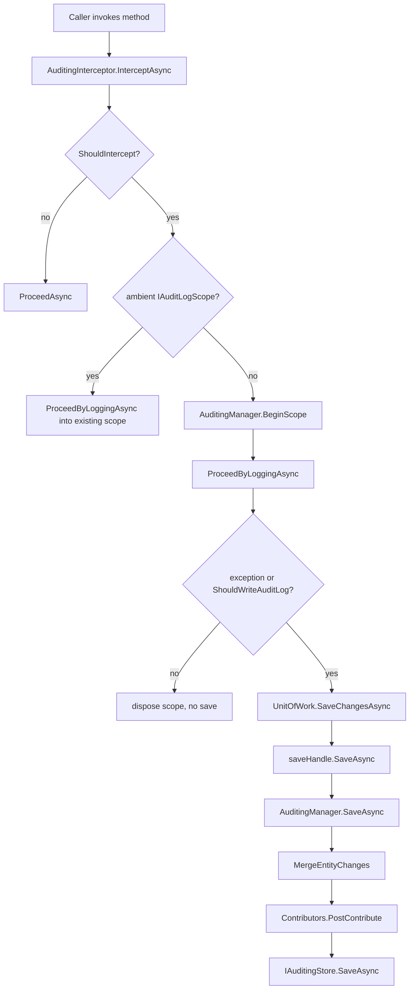

The **ABP Framework** auditing module captures who called which application method, with what parameters, how long it took, and which entities changed during the unit of work, then persists the result through an `IAuditingStore`. The implementation lives in two packages: the runtime is `Volo.Abp.Auditing` (under `framework/src/Volo.Abp.Auditing/`) while the attributes and marker interfaces sit in `Volo.Abp.Auditing.Contracts` so DTO assemblies can take a dependency without dragging the interceptor.

## Responsibility

The module is responsible for:

- Wrapping public application service methods with `AuditingInterceptor` so that every call appears as an `AuditLogActionInfo` row inside the surrounding `AuditLogInfo` scope.
- Maintaining an ambient `IAuditLogScope` whose lifetime spans one request (or one unit of work) and aggregates many `AuditLogActionInfo` and `EntityChangeInfo` items.
- Allowing per-entity history tracking through `IEntityHistorySelectorList` so that only the entities a host opts in to are diffed.
- Letting hosts disable auditing locally with `[DisableAuditing]` or globally with `AbpAuditingOptions.IsEnabled = false`.
- Stamping the log entry with multi-tenancy, correlation, current user, current client, and execution duration information collected from cross-cutting helpers.

## File inventory

| File                                                                 | Purpose                                                                                  |
| -------------------------------------------------------------------- | ---------------------------------------------------------------------------------------- |
| `Volo.Abp.Auditing/AbpAuditingModule.cs`                             | Module wires `OnRegistered → AuditingInterceptorRegistrar` and sets `ApplicationName`.   |
| `Volo.Abp.Auditing/AbpAuditingOptions.cs`                            | Options class: `IsEnabled`, `HideErrors`, `AlwaysLogOnException`, `Contributors`, etc.   |
| `Volo.Abp.Auditing/IAuditingManager.cs` + `AuditingManager.cs`       | Ambient scope manager; `BeginScope()` returns an `IAuditLogSaveHandle`.                  |
| `Volo.Abp.Auditing/IAuditingStore.cs` + `SimpleLogAuditingStore.cs`  | Persistence contract; default writes to `ILogger`.                                       |
| `Volo.Abp.Auditing/IAuditingHelper.cs` + `AuditingHelper.cs`         | Decides `ShouldSaveAudit`, builds `AuditLogInfo` and `AuditLogActionInfo`.               |
| `Volo.Abp.Auditing/AuditingInterceptor.cs`                           | Dynamic-proxy interceptor that opens a scope and records each invocation.                |
| `Volo.Abp.Auditing/AuditingInterceptorRegistrar.cs`                  | Decides which service types get the interceptor added.                                   |
| `Volo.Abp.Auditing/AuditLogInfo.cs` / `AuditLogActionInfo.cs`        | The serializable shapes of an audit log row.                                             |
| `Volo.Abp.Auditing/EntityChangeInfo.cs` / `EntityPropertyChangeInfo.cs` | Entity-history sub-records.                                                            |
| `Volo.Abp.Auditing/EntityHistorySelectorList.cs` + `IEntityHistorySelectorList.cs` | Opt-in list of entity types whose changes get tracked.                       |
| `Volo.Abp.Auditing/AuditLogContributor.cs` + `AuditLogContributionContext.cs` | Post-processing extension points run before the log is persisted.                |
| `Volo.Abp.Auditing/AuditingDisabledState.cs`                         | Ambient on/off flag toggled by `IAuditingHelper.DisableAuditing()`.                      |
| `Volo.Abp.Auditing/AuditPropertySetter.cs` + `IAuditPropertySetter.cs` | Stamps `Creator`/`LastModifier` columns on `ICreationAuditedObject` etc.               |
| `Volo.Abp.Auditing/IAuditSerializer.cs` + `JsonAuditSerializer.cs`   | Serializer used for `AuditLogActionInfo.Parameters`.                                     |
| `Volo.Abp.Auditing.Contracts/AuditedAttribute.cs`                    | Opt-in attribute.                                                                        |
| `Volo.Abp.Auditing.Contracts/DisableAuditingAttribute.cs`            | Opt-out attribute, also controls `UpdateModificationProps` and `PublishEntityEvent`.     |
| `Volo.Abp.Auditing.Contracts/IAuditingEnabled.cs`                    | Marker interface; implementing it has the same effect as `[Audited]` on the class.       |
| `Volo.Abp.Auditing.Contracts/I*AuditedObject.cs` + `IHas*Time.cs`    | Entity marker interfaces (`ICreationAuditedObject`, `IFullAuditedObject`, …).            |
| `Volo.Abp.Auditing.Contracts/EntityChangeType.cs`                    | `Created` / `Updated` / `Deleted` enum.                                                  |

## Key abstractions

### `IAuditingManager`

`framework/src/Volo.Abp.Auditing/Volo/Abp/Auditing/IAuditingManager.cs`

```csharp
public interface IAuditingManager
{
    IAuditLogScope? Current { get; }
    IAuditLogSaveHandle BeginScope();
}
```

The manager exposes the ambient `IAuditLogScope` for the current async context and lets callers open a fresh one. The implementation, `AuditingManager`, stores the scope under the ambient key `"Volo.Abp.Auditing.IAuditLogScope"` using `IAmbientScopeProvider<IAuditLogScope>`. Callers: `AuditingInterceptor.ProcessWithNewAuditingScopeAsync` opens the root scope; ASP.NET Core middleware (in the ASP.NET integration package) calls `BeginScope` once per request.

### `IAuditingStore`

`framework/src/Volo.Abp.Auditing/Volo/Abp/Auditing/IAuditingStore.cs`

```csharp
public interface IAuditingStore
{
    Task SaveAsync(AuditLogInfo auditInfo);
}
```

The default implementation `SimpleLogAuditingStore` simply emits the audit log as a JSON line through `ILogger`. Replace it with a database-backed store by `[Dependency(ReplaceServices = true)]` on your own implementation. Callers: `AuditingManager.SaveAsync(DisposableSaveHandle)` invokes the store after running `MergeEntityChanges` and contributors.

### `IAuditingHelper` and `AuditingHelper`

`framework/src/Volo.Abp.Auditing/Volo/Abp/Auditing/IAuditingHelper.cs`

The helper centralises every decision the interceptor needs:

```csharp
bool ShouldSaveAudit(MethodInfo? method, bool defaultValue = false, bool ignoreIntegrationServiceAttribute = false);
bool IsEntityHistoryEnabled(Type entityType, bool defaultValue = false);
AuditLogInfo CreateAuditLogInfo();
AuditLogActionInfo CreateAuditLogAction(AuditLogInfo log, Type? type, MethodInfo method, object?[] arguments);
IDisposable DisableAuditing();
bool IsAuditingEnabled();
```

`AuditingHelper.ShouldSaveAudit` walks the method/declaring-type attributes in this order: not-public ⇒ false, `[Audited]` ⇒ true, `[DisableAuditing]` ⇒ false, declaring type checked through `AuditingInterceptorRegistrar.ShouldAuditTypeByDefaultOrNull` (which honors `IAuditingEnabled` and `IntegrationServiceAttribute`). `CreateAuditLogInfo` pulls `CurrentUser`, `CurrentClient`, `CurrentTenant`, `Clock`, and `CorrelationIdProvider` to seed `AuditLogInfo`. Callers: `AuditingInterceptor.ShouldIntercept` and `AuditingInterceptor.ProceedByLoggingAsync`.

### `AuditedAttribute` and `DisableAuditingAttribute`

`framework/src/Volo.Abp.Auditing.Contracts/Volo/Abp/Auditing/AuditedAttribute.cs`

```csharp
[AttributeUsage(AttributeTargets.Class | AttributeTargets.Method | AttributeTargets.Property)]
public class AuditedAttribute : Attribute { }
```

`framework/src/Volo.Abp.Auditing.Contracts/Volo/Abp/Auditing/DisableAuditingAttribute.cs`

```csharp
[AttributeUsage(AttributeTargets.Class | AttributeTargets.Method | AttributeTargets.Property)]
public class DisableAuditingAttribute : Attribute
{
    public bool UpdateModificationProps { get; set; } = true;
    public bool PublishEntityEvent { get; set; } = true;
}
```

The two properties on `DisableAuditingAttribute` are read by the EF Core layer when deciding whether a property change should still bump `LastModificationTime` (`UpdateModificationProps`) and whether to raise an `EntityUpdatedEvent` (`PublishEntityEvent`). Callers: `AuditingInterceptorRegistrar.ShouldAuditTypeByDefaultOrNull`, `AuditingHelper.ShouldSaveAudit`.

### `AbpAuditingOptions`

`framework/src/Volo.Abp.Auditing/Volo/Abp/Auditing/AbpAuditingOptions.cs`

Important properties:

- `IsEnabled` (default `true`) — master kill switch consulted at the top of `AuditingInterceptor.ShouldIntercept`.
- `HideErrors` (default `true`) — when an `IAuditingStore.SaveAsync` throws, log instead of bubbling.
- `IsEnabledForAnonymousUsers` (default `true`) — `AuditingInterceptor.ShouldWriteAuditLogAsync` filters anonymous requests when set to `false`.
- `IsEnabledForGetRequests` (default `false`) — skips HTTP `GET`/`HEAD` and methods whose name starts with `Get`.
- `AlwaysLogOnException` (default `true`) — forces persistence whenever `AuditLogInfo.Exceptions` is non-empty.
- `AlwaysLogSelectors : List<Func<AuditLogInfo, Task<bool>>>` — custom predicates that elevate a row to "always persist".
- `Contributors : List<AuditLogContributor>` — post-processors run inside `AuditingManager.ExecutePostContributors`.
- `IgnoredTypes : List<Type>` — by default `Stream`, `Expression`, `CancellationToken`; `JsonAuditSerializer` skips these when serialising parameters.
- `EntityHistorySelectors : IEntityHistorySelectorList` — see below.
- `SaveEntityHistoryWhenNavigationChanges` (default `true`).
- `DisableLogActionInfo` (default `false`) — when `true`, the interceptor stops recording individual method-call actions.
- `IsEnabledForIntegrationServices` (default `false`).
- `ApplicationName` — set automatically from `IServiceCollection.GetApplicationName()` inside `AbpAuditingModule.ConfigureServices`.

### `AuditingInterceptor`

`framework/src/Volo.Abp.Auditing/Volo/Abp/Auditing/AuditingInterceptor.cs`

```csharp
public override async Task InterceptAsync(IAbpMethodInvocation invocation)
{
    using var serviceScope = _serviceScopeFactory.CreateScope();
    var auditingHelper = serviceScope.ServiceProvider.GetRequiredService<IAuditingHelper>();
    var auditingOptions = serviceScope.ServiceProvider.GetRequiredService<IOptions<AbpAuditingOptions>>().Value;

    if (!ShouldIntercept(invocation, auditingOptions, auditingHelper)) { await invocation.ProceedAsync(); return; }

    var auditingManager = serviceScope.ServiceProvider.GetRequiredService<IAuditingManager>();
    if (auditingManager.Current != null) await ProceedByLoggingAsync(invocation, options, helper, auditingManager.Current);
    else                                  await ProcessWithNewAuditingScopeAsync(...);
}
```

`ProceedByLoggingAsync` records an `AuditLogActionInfo` (unless `DisableLogActionInfo`), starts a `Stopwatch`, calls `invocation.ProceedAsync()`, catches exceptions into `AuditLogInfo.Exceptions`, and finally appends the action to `AuditLogInfo.Actions`. `ProcessWithNewAuditingScopeAsync` is reached only when there is no ambient scope; it opens one via `IAuditingManager.BeginScope()`, runs the same `ProceedByLoggingAsync`, then in the `finally` block decides whether to persist (via `ShouldWriteAuditLogAsync` consulting `AlwaysLogSelectors`, `AlwaysLogOnException`, `IsEnabledForAnonymousUsers`, and `IsEnabledForGetRequests`) and, if a unit of work is open, calls `IUnitOfWork.SaveChangesAsync()` before `IAuditLogSaveHandle.SaveAsync()`.

### `AuditLogActionInfo`

`framework/src/Volo.Abp.Auditing/Volo/Abp/Auditing/AuditLogActionInfo.cs`

```csharp
[Serializable]
public class AuditLogActionInfo : IHasExtraProperties
{
    public string ServiceName { get; set; } = default!;
    public string MethodName  { get; set; } = default!;
    public string Parameters  { get; set; } = default!;   // JSON, via IAuditSerializer
    public DateTime ExecutionTime { get; set; }
    public int      ExecutionDuration { get; set; }       // milliseconds
    public ExtraPropertyDictionary ExtraProperties { get; }
}
```

### `EntityChangeInfo`

`framework/src/Volo.Abp.Auditing/Volo/Abp/Auditing/EntityChangeInfo.cs`

```csharp
[Serializable]
public class EntityChangeInfo : IHasExtraProperties
{
    public DateTime ChangeTime { get; set; }
    public EntityChangeType ChangeType { get; set; }   // Created | Updated | Deleted
    public Guid? EntityTenantId { get; set; }
    public string? EntityId { get; set; }
    public string? EntityTypeFullName { get; set; }
    public List<EntityPropertyChangeInfo> PropertyChanges { get; set; } = default!;
    public ExtraPropertyDictionary ExtraProperties { get; }
    public virtual object EntityEntry { get; set; } = default!;   // breaks serialisation, see TODO
    public virtual void Merge(EntityChangeInfo other) { ... }
}
```

`AuditingManager.MergeEntityChanges` groups updates by `(EntityTypeFullName, EntityId)` and merges multiple change rows for the same entity into a single record, copying property changes and renaming colliding extra-property keys via `InternalUtils.AddCounter`.

### `EntityHistorySelectorList`

`framework/src/Volo.Abp.Auditing/Volo/Abp/Auditing/EntityHistorySelectorList.cs`

```csharp
internal class EntityHistorySelectorList : List<NamedTypeSelector>, IEntityHistorySelectorList
{
    public bool RemoveByName(string name) => RemoveAll(s => s.Name == name) > 0;
}
```

Each `NamedTypeSelector` is a `(string Name, Predicate<Type> Predicate)` pair. The EF Core integration calls `AbpAuditingOptions.EntityHistorySelectors.Any(s => s.Predicate(entityType))` to decide whether to record `EntityChangeInfo`. Hosts add selectors with `options.EntityHistorySelectors.AddAllEntities()` or a more selective predicate at module-configuration time.

## Control & data flow

Every method on an application service that satisfies `AuditingInterceptorRegistrar.ShouldIntercept(type)` is wrapped. At call time the flow is:



`AuditPropertySetter` runs from the EF Core integration in `SaveChangesAsync`, stamping `CreationTime`, `CreatorId`, `LastModificationTime`, `LastModifierId`, and the soft-delete fields on entities that implement `ICreationAuditedObject`, `IModificationAuditedObject`, or `IFullAuditedObject` (all defined in `Volo.Abp.Auditing.Contracts`).

## Connections

- **Security** — `AuditingHelper` injects `ICurrentUser`, `ICurrentTenant`, `ICurrentClient` from `Volo.Abp.Security` to stamp the log row.
- **Data / Unit of Work** — `AuditingInterceptor.ProcessWithNewAuditingScopeAsync` calls `IUnitOfWorkManager.Current?.SaveChangesAsync()` before persistence so that entity change events have ids assigned.
- **MultiTenancy** — `AuditLogInfo.TenantId` and `EntityChangeInfo.EntityTenantId` come from `ICurrentTenant.Id` and the entity's own tenant property; `AuditingManager` does *not* enforce tenant isolation itself.
- **JSON** — `JsonAuditSerializer` (default `IAuditSerializer`) handles parameter capture; it respects `AbpAuditingOptions.IgnoredTypes`.
- **Aspects** — `AuditingInterceptor` short-circuits when `AbpCrossCuttingConcerns.IsApplied(target, AbpCrossCuttingConcerns.Auditing)` is true.

## Gotchas & invariants

- Auditing only runs on **public** methods. `AuditingHelper.ShouldSaveAudit` returns `false` for non-public methods regardless of attribute usage.
- `[Audited]` on a class auto-enables auditing for every method, but the interceptor is registered only if `AuditingInterceptorRegistrar.ShouldIntercept(type)` returns true — a type without `[Audited]`, without `IAuditingEnabled`, and without any `[Audited]` method will not be wrapped at all.
- `IsEnabledForGetRequests = false` also filters methods whose **name** starts with `Get`, not just HTTP GET requests — be careful with non-CRUD operations named `GetReport` etc.
- `AuditingManager` keeps the scope in an `IAmbientScopeProvider`, which uses `AsyncLocal`. Crossing thread boundaries with non-async-aware APIs can lose the scope.
- The `AuditingDisabledState` ambient toggle is reentrant: `IAuditingHelper.DisableAuditing()` returns an `IDisposable` that restores the previous state on dispose; nesting is supported.
- `IsEnabledForIntegrationServices` defaults to `false`; methods on services decorated with `[IntegrationService]` are skipped unless this is flipped — see `IntegrationServiceAttribute.IsDefinedOrInherited` referenced in `AuditingInterceptorRegistrar.ShouldAuditTypeByDefaultOrNull`.
- `EntityChangeInfo.EntityEntry` is a runtime-only field (`object`) — the source code comment marks it as breaking serializability and warns against persisting it directly.
- When `HideErrors = true` and the `IAuditingStore.SaveAsync` throws, the failure is swallowed (logged at `Warning`); this protects request flow but can mask broken stores.
- Replacing `IAuditingStore` with a database-backed implementation should always honor the contract of *non-throwing on missing context*; the framework calls it inside a `using` scope with no transaction by default.
