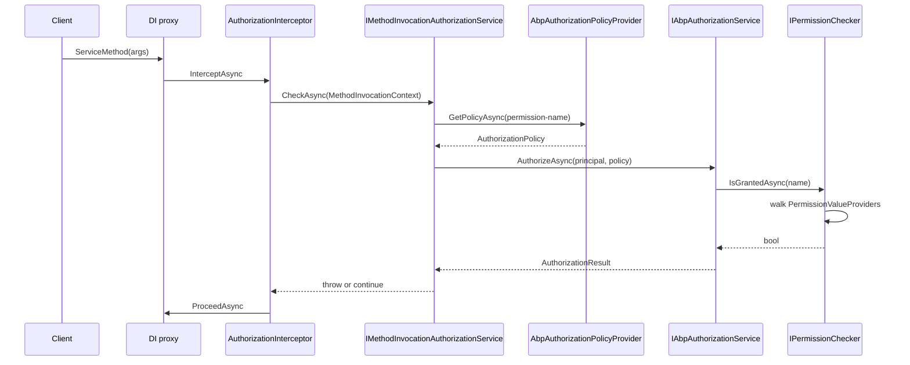
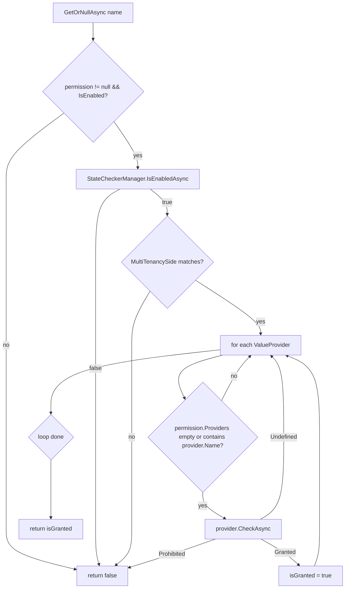

The **ABP Framework** authorization module extends the ASP.NET Core authorization stack with a permission system: hierarchical, multi-tenant aware permission definitions, plug-in value providers (user, role, client, resource), and an interceptor that enforces `[Authorize]` on application service methods invoked through DI. Code lives in `framework/src/Volo.Abp.Authorization/` (runtime) and `framework/src/Volo.Abp.Authorization.Abstractions/` (contracts and definition API).

## Responsibility

This module is responsible for:

- Replacing `DefaultAuthorizationService` with `AbpAuthorizationService` so policy evaluation uses `ICurrentPrincipalAccessor` instead of the request-scoped `HttpContext.User`.
- Providing a hierarchical permission model (`PermissionGroupDefinition` → `PermissionDefinition`) discovered via `IPermissionDefinitionProvider`.
- Resolving permission grants through a configurable chain of `IPermissionValueProvider`s (user, role, client, resource).
- Wrapping `[Authorize]` decorated service classes and methods with `AuthorizationInterceptor`, which calls `IMethodInvocationAuthorizationService` before each invocation.
- Throwing `AbpAuthorizationException` (defined in `Volo.Abp.Security`) when access is denied, allowing the global exception handler to convert it into HTTP 401/403.

## File inventory

| File                                                                                | Purpose                                                                                  |
| ----------------------------------------------------------------------------------- | ---------------------------------------------------------------------------------------- |
| `Volo.Abp.Authorization/Volo/Abp/Authorization/AbpAuthorizationModule.cs`           | Wires interceptor registrar, value providers, and ASP.NET Core integration.              |
| `Volo.Abp.Authorization/Volo/Abp/Authorization/AbpAuthorizationService.cs`          | `[Dependency(ReplaceServices = true)]` replacement for `DefaultAuthorizationService`.    |
| `Volo.Abp.Authorization/Volo/Abp/Authorization/AbpAuthorizationPolicyProvider.cs`   | Dynamically synthesises policies from permission names.                                  |
| `Volo.Abp.Authorization/Volo/Abp/Authorization/AuthorizationInterceptor.cs`         | Dynamic-proxy interceptor calling `IMethodInvocationAuthorizationService`.               |
| `Volo.Abp.Authorization/Volo/Abp/Authorization/AuthorizationInterceptorRegistrar.cs`| Decides which DI services need interception.                                             |
| `Volo.Abp.Authorization/Volo/Abp/Authorization/MethodInvocationAuthorizationService.cs` | Evaluates `[Authorize]` on a `MethodInfo`.                                            |
| `Volo.Abp.Authorization/Volo/Abp/Authorization/Permissions/PermissionChecker.cs`    | Default `IPermissionChecker` implementation.                                             |
| `Volo.Abp.Authorization/Volo/Abp/Authorization/Permissions/PermissionDefinitionManager.cs` | Caches both static and dynamic definitions.                                          |
| `Volo.Abp.Authorization/Volo/Abp/Authorization/Permissions/PermissionValueProviderManager.cs` | Ordered list of value providers.                                                   |
| `Volo.Abp.Authorization/Volo/Abp/Authorization/Permissions/UserPermissionValueProvider.cs` | Reads grants for the current user.                                                  |
| `Volo.Abp.Authorization/Volo/Abp/Authorization/Permissions/RolePermissionValueProvider.cs` | Reads grants per role claim.                                                         |
| `Volo.Abp.Authorization/Volo/Abp/Authorization/Permissions/ClientPermissionValueProvider.cs` | Reads grants for OpenID Connect client.                                            |
| `Volo.Abp.Authorization/Volo/Abp/Authorization/Permissions/StaticPermissionDefinitionStore.cs` | Aggregates all definitions discovered via providers.                              |
| `Volo.Abp.Authorization/Volo/Abp/Authorization/Permissions/PermissionDefinitionManager.cs` | Façade used by `PermissionChecker`.                                                  |
| `Volo.Abp.Authorization.Abstractions/Volo/Abp/Authorization/IAbpAuthorizationService.cs` | Adds `CurrentPrincipal` and `IServiceProviderAccessor`.                            |
| `Volo.Abp.Authorization.Abstractions/Volo/Abp/Authorization/AbpAuthorizationAbstractionsModule.cs` | Module registering `AlwaysAllow*` defaults.                                  |
| `Volo.Abp.Authorization.Abstractions/Volo/Abp/Authorization/Permissions/AbpPermissionOptions.cs` | Lists of `ValueProviders`, `ResourceValueProviders`, `DefinitionProviders`.   |
| `Volo.Abp.Authorization.Abstractions/Volo/Abp/Authorization/Permissions/IPermissionChecker.cs` | Contract for `IsGrantedAsync(name)` / batch.                                       |
| `Volo.Abp.Authorization.Abstractions/Volo/Abp/Authorization/Permissions/IPermissionDefinitionContext.cs` | Used by definition providers.                                            |
| `Volo.Abp.Authorization.Abstractions/Volo/Abp/Authorization/Permissions/PermissionDefinition.cs` | The definition record itself.                                                 |
| `Volo.Abp.Authorization.Abstractions/Volo/Abp/Authorization/Permissions/PermissionDefinitionContext.cs` | Concrete context with `AddGroup` / `AddResourcePermission`.            |
| `Volo.Abp.Authorization.Abstractions/Volo/Abp/Authorization/Permissions/IPermissionValueProvider.cs` | Contract for value providers.                                              |
| `Volo.Abp.Authorization.Abstractions/Volo/Abp/Authorization/PermissionRequirement.cs` | ASP.NET Core requirement for a single permission.                                   |
| `Volo.Abp.Authorization.Abstractions/Volo/Abp/Authorization/PermissionRequirementHandler.cs` | Handler that delegates to `IPermissionChecker`.                                |
| `Volo.Abp.Security/Volo/Abp/Authorization/AbpAuthorizationException.cs`             | Standard 403/401 carrier with `LogLevel` and `IHasErrorCode`.                            |

## Key abstractions

### `IAbpAuthorizationService`

`framework/src/Volo.Abp.Authorization.Abstractions/Volo/Abp/Authorization/IAbpAuthorizationService.cs`

```csharp
public interface IAbpAuthorizationService : IAuthorizationService, IServiceProviderAccessor
{
    ClaimsPrincipal CurrentPrincipal { get; }
}
```

The default `AbpAuthorizationService` overrides `DefaultAuthorizationService` and inserts `ICurrentPrincipalAccessor.Principal` as `CurrentPrincipal`. Callers: `MethodInvocationAuthorizationService.CheckAsync`, `AbpAuthorizationServiceExtensions`, anything that calls `IAuthorizationService.AuthorizeAsync(...)` from DI.

### `IPermissionChecker` and `PermissionChecker`

`framework/src/Volo.Abp.Authorization.Abstractions/Volo/Abp/Authorization/Permissions/IPermissionChecker.cs`

```csharp
public interface IPermissionChecker
{
    Task<bool> IsGrantedAsync(string name);
    Task<bool> IsGrantedAsync(ClaimsPrincipal? claimsPrincipal, string name);
    Task<MultiplePermissionGrantResult> IsGrantedAsync(string[] names);
    Task<MultiplePermissionGrantResult> IsGrantedAsync(ClaimsPrincipal? claimsPrincipal, string[] names);
}
```

`PermissionChecker.IsGrantedAsync(principal, name)` looks the definition up via `IPermissionDefinitionManager.GetOrNullAsync`, short-circuits when `permission.IsEnabled` is `false`, runs `ISimpleStateCheckerManager<PermissionDefinition>.IsEnabledAsync` for stateful gates, checks the `MultiTenancySide` flag, then iterates `PermissionValueProviderManager.ValueProviders`. The first `PermissionGrantResult.Prohibited` returns `false`; any `Granted` flips the result; the final answer is `true` only if at least one provider granted and none prohibited. The batch overload streams the work, materialising definitions once and short-circuiting when `MultiplePermissionGrantResult.AllProhibited` becomes true.

The abstraction layer also ships `AlwaysAllowPermissionChecker` (used in tests/host scenarios where authorization is disabled) and `NullPermissionStore`.

### `PermissionDefinition`

`framework/src/Volo.Abp.Authorization.Abstractions/Volo/Abp/Authorization/Permissions/PermissionDefinition.cs`

Key fields:

- `Name` — unique string, used as the policy name.
- `Parent` — optional; child permissions are checked only when the parent is granted (the EF/Identity layer enforces this).
- `MultiTenancySide` (`Host` / `Tenant` / `Both`) — `PermissionChecker` rejects mismatches before running providers.
- `Providers : List<string>` — when non-empty, only providers whose `Name` is in the list are consulted.
- `StateCheckers : List<ISimpleStateChecker<PermissionDefinition>>` — runtime gates evaluated through `ISimpleStateCheckerManager<PermissionDefinition>`.
- `Children : IReadOnlyList<PermissionDefinition>` — set via `AddChild(...)`.
- `IsEnabled` — disabled permissions are silently denied.
- `ResourceName` / `ManagementPermissionName` — set when calling `AddResourcePermission` on the context, marking the permission as resource-scoped.

### `PermissionDefinitionContext` and `IPermissionDefinitionProvider`

`framework/src/Volo.Abp.Authorization.Abstractions/Volo/Abp/Authorization/Permissions/PermissionDefinitionContext.cs`

```csharp
public virtual PermissionGroupDefinition AddGroup(string name, ILocalizableString? displayName = null);
public virtual PermissionDefinition? GetPermissionOrNull(string name);
public virtual PermissionDefinition AddResourcePermission(string name, string resourceName, string managementPermissionName, ...);
```

Custom code defines permissions by deriving from `PermissionDefinitionProvider` and overriding `Define(IPermissionDefinitionContext context)`. `AbpAuthorizationModule.AutoAddDefinitionProviders` discovers every `IPermissionDefinitionProvider` registered through ABP's conventional registrar and pushes the type into `AbpPermissionOptions.DefinitionProviders`. `PermissionDefinitionManager.GetAllAsync` then instantiates each provider once, hands it a shared `PermissionDefinitionContext`, and caches the result in `StaticPermissionDefinitionStore`.

### `IPermissionValueProvider`

`framework/src/Volo.Abp.Authorization.Abstractions/Volo/Abp/Authorization/Permissions/IPermissionValueProvider.cs`

```csharp
public interface IPermissionValueProvider
{
    string Name { get; }
    Task<PermissionGrantResult> CheckAsync(PermissionValueCheckContext context);
    Task<MultiplePermissionGrantResult> CheckAsync(PermissionValuesCheckContext context);
}
```

Built-in providers registered by `AbpAuthorizationModule`:

| Provider                          | `Name` | When it grants                                              |
| --------------------------------- | ------ | ----------------------------------------------------------- |
| `UserPermissionValueProvider`     | `"U"`  | `IPermissionStore.IsGrantedAsync(name, "U", userId)` is true |
| `RolePermissionValueProvider`     | `"R"`  | Any of the principal's role claims is granted               |
| `ClientPermissionValueProvider`   | `"C"`  | `client_id` claim is granted                                 |

Resource variants (`UserResourcePermissionValueProvider`, `RoleResourcePermissionValueProvider`, `ClientResourcePermissionValueProvider`) live next to them and feed `ResourcePermissionChecker`.

### `AbpPermissionOptions`

`framework/src/Volo.Abp.Authorization.Abstractions/Volo/Abp/Authorization/Permissions/AbpPermissionOptions.cs`

Exposes `ITypeList<IPermissionDefinitionProvider> DefinitionProviders` and `ITypeList<IPermissionValueProvider> ValueProviders` plus the corresponding `ResourceValueProviders`. Defaults are added in `AbpAuthorizationModule.ConfigureServices`.

### `AuthorizationInterceptor`

`framework/src/Volo.Abp.Authorization/Volo/Abp/Authorization/AuthorizationInterceptor.cs`

```csharp
public override async Task InterceptAsync(IAbpMethodInvocation invocation)
{
    await _methodInvocationAuthorizationService.CheckAsync(
        new MethodInvocationAuthorizationContext(invocation.Method)
    );
    await invocation.ProceedAsync();
}
```

`MethodInvocationAuthorizationService.CheckAsync` walks `[Authorize]` attributes on the method and its declaring type, builds an authorization policy through `AbpAuthorizationPolicyProvider`, and calls `IAbpAuthorizationService.AuthorizeAsync`. A failed evaluation throws `AbpAuthorizationException`.

### `AbpAuthorizationException`

`framework/src/Volo.Abp.Security/Volo/Abp/Authorization/AbpAuthorizationException.cs`

```csharp
public class AbpAuthorizationException : AbpException, IHasLogLevel, IHasErrorCode
{
    public LogLevel LogLevel { get; set; }   // default Warn
    public string Code { get; set; }         // optional error code
}
```

ASP.NET integration converts this into HTTP `401` when the user is anonymous, `403` otherwise.

## Control & data flow



For a single permission name, the flow inside `PermissionChecker.IsGrantedAsync(principal, name)` is:



## Connections

- **Security** — `ICurrentPrincipalAccessor` is the source of truth for the `ClaimsPrincipal`; `AbpAuthorizationException` and `AbpClaimTypes` live in `Volo.Abp.Security`.
- **MultiTenancy** — `PermissionDefinition.MultiTenancySide` and `ClaimsPrincipal.GetMultiTenancySide()` (from `Volo.Abp.MultiTenancy`) gate visibility per side.
- **SimpleStateChecking** — `PermissionDefinition` implements `IHasSimpleStateCheckers<PermissionDefinition>`, letting hosts attach `RequirePermissionsSimpleStateChecker`, `RequireAuthenticatedSimpleStateChecker`, etc.
- **Features** — `RequirePermissionsSimpleBatchStateChecker` is used by the Features module to gate features on a permission grant; `RequireFeaturesSimpleStateChecker` (in `Volo.Abp.Features`) gates permissions on a feature.
- **ASP.NET Core** — `AbpAuthorizationServiceCollectionExtensions.AddAuthorizationCore()` is called inside `AbpAuthorizationModule.ConfigureServices`; the `AuthorizeAttribute` from `Microsoft.AspNetCore.Authorization` is the trigger.

## Gotchas & invariants

- The interceptor only fires for services resolved through ABP's DI. A POCO `new`-ed in code is **not** subject to `[Authorize]` enforcement.
- `PermissionChecker` returns `false` (not `Undefined`) when a permission name is unknown — this is a deliberate "deny on typo" behavior.
- Order of value providers matters: `AbpPermissionOptions.ValueProviders` defaults to `User → Role → Client`, but `PermissionChecker` short-circuits on the first `Prohibited`. A custom provider added at the end can still deny.
- `permission.Providers` (per-definition) acts as an **allow-list**. An empty list means "any provider can grant"; a non-empty list excludes providers not named.
- `PermissionDefinition.AddChild` throws if called on a resource permission (`ResourceName != null`): resource permissions cannot have children.
- `PermissionChecker` reads `ICurrentTenant.GetMultiTenancySide()` only if the principal does not expose `tenantid` claim; this is important when checking permissions inside a `using (CurrentTenant.Change(...))` scope.
- `AlwaysAllowAuthorizationService` and `AlwaysAllowPermissionChecker` are used by the test base classes to bypass authorization — never register them in production hosts.
- The interceptor calls `MethodInvocationAuthorizationService.CheckAsync` **before** `invocation.ProceedAsync()`. A method that throws `AbpAuthorizationException` from inside its body is still subject to that flow but will not be retried with elevated privileges.
- `AbpAuthorizationException.LogLevel` defaults to `Warning`. Changing it to `Information` is recommended for routine forbidden requests to avoid log noise.
