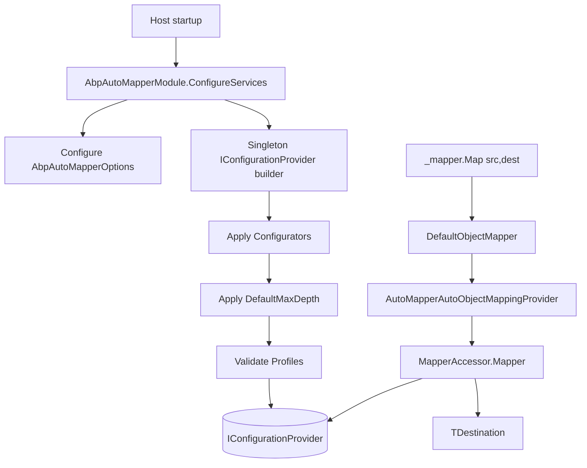
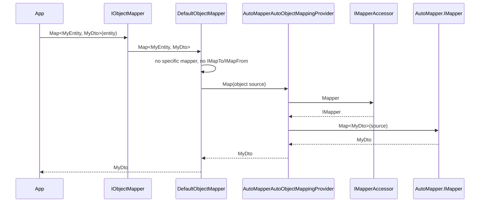

The **ABP Framework** AutoMapper integration plugs the AutoMapper NuGet package behind `IObjectMapper`. The module discovers `Profile` classes through `AbpAutoMapperOptions.AddMaps<TModule>()` or `AddProfile<TProfile>()`, builds an `IConfigurationProvider` singleton, and exposes an `IMapperAccessor` that backs `AutoMapperAutoObjectMappingProvider`. Source: `framework/src/Volo.Abp.AutoMapper/`. A second flavour, `Volo.Abp.LuckyPenny.AutoMapper`, ships parallel types adapted to the LuckyPenny.AutoMapper fork.

## Responsibility

This module is responsible for:

- Producing one process-wide `MapperConfiguration` from every `Profile` requested in `AbpAutoMapperOptions.Configurators`.
- Optionally validating profiles at startup via `MapperConfiguration.AssertConfigurationIsValid(profileName)`.
- Applying a default `MaxDepth` (64) to every map that did not set one explicitly.
- Exposing `IMapper` as transient and a thin `IMapperAccessor` so that scoped consumers can hold the same reference.
- Implementing `IAutoObjectMappingProvider` against that `IMapper`, so `IObjectMapper.Map` ultimately calls `Mapper.Map<TDestination>(source)`.
- Copying `ExtraProperties` between `IHasExtraProperties` types through `AbpAutoMapperExtensibleObjectExtensions` so that object-extending works through AutoMapper.

## File inventory

| File                                                            | Purpose                                                                            |
| --------------------------------------------------------------- | ---------------------------------------------------------------------------------- |
| `AbpAutoMapperModule.cs`                                        | `[DependsOn(AbpObjectMappingModule, AbpObjectExtendingModule, AbpAuditingModule)]`; sets up `IConfigurationProvider`. |
| `AbpAutoMapperOptions.cs`                                       | `Configurators`, `ValidatingProfiles`, `DefaultMaxDepth`, helper `AddMaps`/`AddProfile`. |
| `AbpAutoMapperConfigurationContext.cs` + `IAbpAutoMapperConfigurationContext.cs` | Wraps `MapperConfigurationExpression` + scoped `IServiceProvider` for profile-time DI. |
| `AbpAutoMapperConventionalRegistrar.cs`                         | Skips the AutoMapper `Profile` subclasses from default conventional registration.   |
| `AutoMapperAutoObjectMappingProvider.cs`                        | `IAutoObjectMappingProvider` implementation calling `MapperAccessor.Mapper.Map`.   |
| `AutoMapperExpressionExtensions.cs`                             | `ProjectTo`, `MapExtraProperties()` helpers on `IMappingExpression<,>`.            |
| `MapperAccessor.cs` + `IMapperAccessor.cs`                      | Holds the live `IMapper` instance.                                                  |
| `Microsoft/Extensions/DependencyInjection/AbpAutoMapperServiceCollectionExtensions.cs` | `AddAutoMapperObjectMapper()` extension.                                |
| `AutoMapper/AbpAutoMapperExtensibleObjectExtensions.cs`         | `MapExtraProperties` for `IHasExtraProperties` mapping.                            |
| `Volo/Abp/ObjectMapping/AbpAutoMapperObjectMapperExtensions.cs` | Extensions over `IObjectMapper` for `ProjectTo`.                                   |

The LuckyPenny fork mirrors every file under `framework/src/Volo.Abp.LuckyPenny.AutoMapper/` — same APIs, same options shape, but compiled against `LuckyPenny.AutoMapper`. Choose at most one of the two modules per host.

## Key abstractions

### `AbpAutoMapperOptions`

`framework/src/Volo.Abp.AutoMapper/Volo/Abp/AutoMapper/AbpAutoMapperOptions.cs`

```csharp
public class AbpAutoMapperOptions
{
    public List<Action<IAbpAutoMapperConfigurationContext>> Configurators { get; }
    public ITypeList<Profile> ValidatingProfiles { get; set; }
    public int? DefaultMaxDepth { get; set; } = 64;

    public void AddMaps<TModule>(bool validate = false);
    public void AddProfile<TProfile>(bool validate = false) where TProfile : Profile, new();
    public void ValidateProfile<TProfile>(bool validate = true) where TProfile : Profile;
    public void ValidateProfile(Type profileType, bool validate = true);
}
```

`AddMaps<TModule>` calls AutoMapper's `MapperConfiguration.AddMaps(assembly)` against the assembly of `TModule`. When `validate = true`, every concrete non-generic `Profile` subclass in the assembly is added to `ValidatingProfiles`. `AddProfile<TProfile>` registers a single profile. `DefaultMaxDepth` is applied to every type-map that did not configure its own `MaxDepth`; set it to `null` to disable.

### `IAbpAutoMapperConfigurationContext`

```csharp
public interface IAbpAutoMapperConfigurationContext
{
    IMapperConfigurationExpression MapperConfiguration { get; }
    IServiceProvider ServiceProvider { get; }
}
```

Passed to every `Action<IAbpAutoMapperConfigurationContext>` in `Configurators`. Inside a configurator you typically call `context.MapperConfiguration.AddProfile<MyProfile>()` or `context.MapperConfiguration.AddMaps(typeof(MyModule).Assembly)`. The exposed `ServiceProvider` is a request-scope-like provider available during profile construction, useful when profiles need DI.

### `AbpAutoMapperModule`

```csharp
[DependsOn(typeof(AbpObjectMappingModule), typeof(AbpObjectExtendingModule), typeof(AbpAuditingModule))]
public class AbpAutoMapperModule : AbpModule
{
    public override void PreConfigureServices(ServiceConfigurationContext context)
        => context.Services.AddConventionalRegistrar(new AbpAutoMapperConventionalRegistrar());

    public override void ConfigureServices(ServiceConfigurationContext context)
    {
        context.Services.AddAutoMapperObjectMapper();

        context.Services.AddSingleton<IConfigurationProvider>(sp =>
        {
            using var scope = sp.CreateScope();
            var options = scope.ServiceProvider.GetRequiredService<IOptions<AbpAutoMapperOptions>>().Value;
            var expr    = sp.GetRequiredService<IOptions<MapperConfigurationExpression>>().Value;
            var ctx     = new AbpAutoMapperConfigurationContext(expr, scope.ServiceProvider);

            foreach (var configurator in options.Configurators) configurator(ctx);

            if (options.DefaultMaxDepth.HasValue)
                expr.Internal().ForAllMaps((typeMap, _) =>
                {
                    if (typeMap.MaxDepth == 0) typeMap.MaxDepth = options.DefaultMaxDepth.Value;
                });

            var mapperConfiguration = new MapperConfiguration(expr);
            foreach (var profileType in options.ValidatingProfiles)
                mapperConfiguration.Internal().AssertConfigurationIsValid(((Profile)Activator.CreateInstance(profileType)!).ProfileName);

            return mapperConfiguration;
        });

        context.Services.AddTransient<IMapper>(sp => sp.GetRequiredService<IConfigurationProvider>().CreateMapper(sp.GetService));
        context.Services.AddTransient<MapperAccessor>(sp => new MapperAccessor { Mapper = sp.GetRequiredService<IMapper>() });
        context.Services.AddTransient<IMapperAccessor>(sp => sp.GetRequiredService<MapperAccessor>());
    }
}
```

Important details:

- `IConfigurationProvider` is registered as **singleton** — built exactly once for the process.
- `IMapper` is **transient** so that AutoMapper's resolution context (a `MappingExecutionStrategy` per call) is short-lived; `IMapper.Map` itself is thread-safe via the configuration.
- `MapperAccessor.Mapper` exposes the same `IMapper` instance to non-DI scenarios (e.g., expression compilation paths).

### `AutoMapperAutoObjectMappingProvider`

`framework/src/Volo.Abp.AutoMapper/Volo/Abp/AutoMapper/AutoMapperAutoObjectMappingProvider.cs`

```csharp
public class AutoMapperAutoObjectMappingProvider : IAutoObjectMappingProvider
{
    public IMapperAccessor MapperAccessor { get; }

    public AutoMapperAutoObjectMappingProvider(IMapperAccessor mapperAccessor) => MapperAccessor = mapperAccessor;

    public virtual TDestination Map<TSource, TDestination>(object source)
        => MapperAccessor.Mapper.Map<TDestination>(source);

    public virtual TDestination Map<TSource, TDestination>(TSource source, TDestination destination)
        => MapperAccessor.Mapper.Map(source, destination);
}
```

The non-generic variant takes `object source` because the caller (`DefaultObjectMapper.AutoMap`) erases the source type, and AutoMapper resolves the map by runtime type. The context-bound variant `AutoMapperAutoObjectMappingProvider<TContext>` re-uses the same `IMapperAccessor`.

### `MapperAccessor`

```csharp
internal class MapperAccessor : IMapperAccessor
{
    public IMapper Mapper { get; set; } = default!;
}
```

A field-holder so that callers can mutate the mapper from one place. Useful in tests where you want to substitute `Mapper` with a mock.

### Profile registration in `AbpModule`

The canonical pattern is to declare profiles inside `ConfigureServices`:

```csharp
public override void ConfigureServices(ServiceConfigurationContext context)
{
    Configure<AbpAutoMapperOptions>(options =>
    {
        options.AddMaps<MyApplicationContractsModule>(validate: true);
        options.AddProfile<MyExplicitProfile>();
    });
}
```

`AddMaps<TModule>(validate: true)` adds all profiles found in the assembly *and* requests validation at startup. Validation runs once during the singleton build of `IConfigurationProvider`, throwing `AutoMapperConfigurationException` on first resolution if a profile is malformed.

### `MapExtraProperties` on `IMappingExpression`

`framework/src/Volo.Abp.AutoMapper/AutoMapper/AbpAutoMapperExtensibleObjectExtensions.cs` exposes the extension method that profile authors call:

```csharp
CreateMap<MyEntity, MyDto>()
    .MapExtraProperties();
```

This wires `ExtensibleObjectMapper.MapExtraPropertiesTo` (from `Volo.Abp.ObjectExtending`) into the type map so that `IHasExtraProperties.ExtraProperties` is copied — see the Object Extending page.

## Control & data flow





## Connections

- **Object Mapping** — `AbpAutoMapperModule` `[DependsOn(AbpObjectMappingModule)]`; `AutoMapperAutoObjectMappingProvider` is registered as the backend.
- **Object Extending** — `AbpObjectExtendingModule` is depended on so `MapExtraProperties()` extension is reachable from profile code.
- **Auditing** — Listed as a dependency because AutoMapper profile validation can transitively need types that some auditing-aware DTOs require, and `Volo.Abp.AutoMapper.AutoMapperExpressionExtensions` references audited type-map utilities.
- **DependencyInjection** — `AbpAutoMapperConventionalRegistrar` opts AutoMapper `Profile` subclasses *out* of conventional registration; profiles are not registered as services.

## Gotchas & invariants

- `IConfigurationProvider` is a **singleton** built lazily on first resolution. A misconfigured profile surfaces as an `AutoMapperConfigurationException` from the first request after startup, not earlier.
- `DefaultMaxDepth = 64` is applied to type maps with `MaxDepth == 0` (the AutoMapper default). Setting `DefaultMaxDepth = null` disables the override and lets AutoMapper recurse indefinitely.
- `Profile` classes are explicitly excluded from conventional DI registration by `AbpAutoMapperConventionalRegistrar`; they should not be requested from DI.
- `IMapper` is registered as **transient** but the underlying configuration is shared. There is no per-scope state; reusing one mapper across requests is safe.
- `MapperConfiguration.Internal().AssertConfigurationIsValid(profileName)` is invoked at provider construction; profiles added via `ValidatingProfiles` cause startup failure if invalid.
- The internal `MapperAccessor` class is `internal`. Tests should mock `IMapperAccessor` rather than `MapperAccessor`.
- `AddMaps<TModule>` uses `typeof(TModule).Assembly`, so the assembly must contain the profiles. Cross-assembly profile pickup requires multiple `AddMaps` calls.
- `MapperConfigurationExpression` is configured via `IOptions<MapperConfigurationExpression>` from AutoMapper.Extensions.Microsoft.DependencyInjection. Customising AutoMapper-level options (e.g., conventions) goes through that options class, not `AbpAutoMapperOptions`.
- The `LuckyPenny.AutoMapper` package replaces the entire integration. Mixing both `Volo.Abp.AutoMapper` and `Volo.Abp.LuckyPenny.AutoMapper` in one host registers two `IAutoObjectMappingProvider` implementations, and the last one wins — pick one at module composition time.
- `MapExtraProperties()` must be called on the `IMappingExpression` for **each direction** you need (it is not automatic on reverse maps). For two-way mapping, call it on the reverse map too.
- The configurator list (`AbpAutoMapperOptions.Configurators`) runs in registration order. Profiles added later may override earlier ones if they declare the same source/destination pair.
