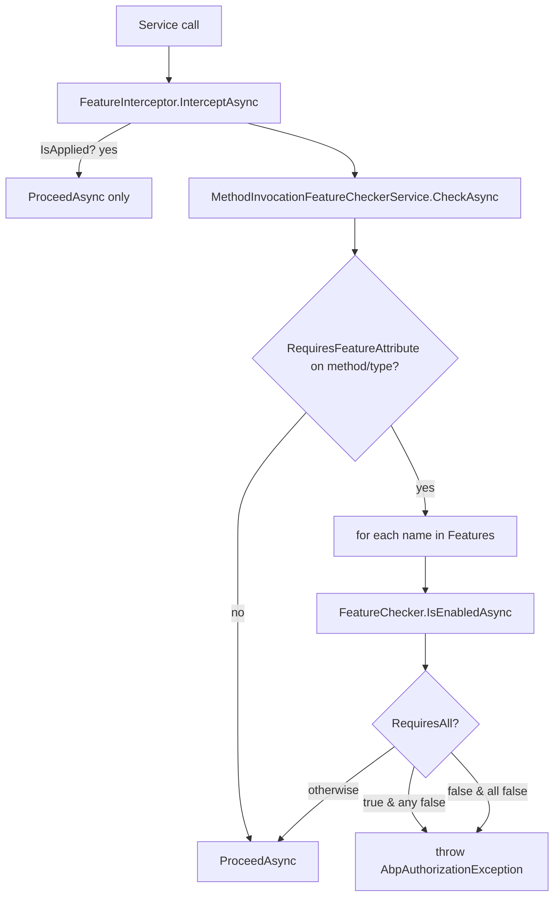
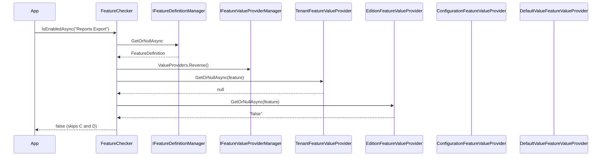

The **ABP Framework** features module models per-tenant or per-edition feature toggles distinct from compile-time `GlobalFeature`s. A feature has a definition (name, default value, value type, allowed providers) and a runtime value resolved from a stack of providers: defaults → configuration → edition → tenant. This page documents the runtime that lives in `framework/src/Volo.Abp.Features/`.

## Responsibility

The module is responsible for:

- Registering and caching `FeatureDefinition`s discovered through `IFeatureDefinitionProvider` implementations.
- Resolving the value of a feature for the current `ICurrentTenant` and `ICurrentPrincipalAccessor.Principal` through `IFeatureValueProvider` chain.
- Enforcing `[RequiresFeature]` on service classes/methods via `FeatureInterceptor`.
- Wiring features into the simple-state-checking pipeline so other concerns (Authorization, ObjectExtending) can hide functionality when a feature is off.

## File inventory

| File                                                                | Purpose                                                                          |
| ------------------------------------------------------------------- | -------------------------------------------------------------------------------- |
| `AbpFeaturesModule.cs`                                              | Registers value providers, virtual JSON localization, interceptor registrar.     |
| `AbpFeatureOptions.cs`                                              | `DefinitionProviders`, `ValueProviders`, `DeletedFeatures`, `DeletedFeatureGroups`. |
| `IFeatureChecker.cs` + `FeatureChecker.cs` + `FeatureCheckerBase.cs`| `IsEnabledAsync(name)`, `GetOrNullAsync(name)`.                                  |
| `FeatureDefinition.cs`                                              | Hierarchical feature description with `DefaultValue`, `ValueType`, `AllowedProviders`. |
| `FeatureDefinitionContext.cs` + `IFeatureDefinitionContext.cs`      | Used in `FeatureDefinitionProvider.Define(...)`.                                 |
| `FeatureDefinitionManager.cs` + `IFeatureDefinitionManager.cs`      | Singleton façade caching `FeatureDefinition` instances.                          |
| `FeatureDefinitionProvider.cs` + `IFeatureDefinitionProvider.cs`    | Base type for module-supplied definitions.                                       |
| `IFeatureValueProvider.cs` + `FeatureValueProvider.cs`              | Per-source value resolver contract.                                              |
| `FeatureValueProviderManager.cs` + `IFeatureValueProviderManager.cs`| Resolves provider list (validated for duplicate names) once at first use.        |
| `DefaultValueFeatureValueProvider.cs`                               | Returns `feature.DefaultValue`. Name `"D"`.                                       |
| `ConfigurationFeatureValueProvider.cs`                              | Reads `Features:<Name>` from `IConfiguration`. Name `"C"`.                        |
| `EditionFeatureValueProvider.cs`                                    | Reads tenant's edition through `ITenantStore`. Name `"E"`.                        |
| `TenantFeatureValueProvider.cs`                                     | Reads value for `ICurrentTenant.Id`. Name `"T"`.                                  |
| `FeatureInterceptor.cs`                                             | Calls `IMethodInvocationFeatureCheckerService.CheckAsync`.                       |
| `FeatureInterceptorRegistrar.cs`                                    | Auto-attaches interceptor when type/method has `[RequiresFeature]`.              |
| `RequiresFeatureAttribute.cs`                                       | Opt-in attribute with `RequiresAll`.                                              |
| `DisableFeatureCheckAttribute.cs`                                   | Suppresses the interceptor for one method/class.                                 |
| `StaticFeatureDefinitionStore.cs` + `IStaticFeatureDefinitionStore.cs` | Builds the dictionary from all providers.                                     |
| `IDynamicFeatureDefinitionStore.cs` + `NullDynamicFeatureDefinitionStore.cs` | Hook for runtime-defined features (filled by SaaS module).                |
| `FeatureSimpleStateCheckerExtensions.cs`, `RequireFeaturesSimpleStateChecker.cs`, `RequireFeaturesSimpleBatchStateChecker.cs` | Bridge to `Volo.Abp.SimpleStateChecking`.   |
| `FeaturesSimpleStateCheckerSerializerContributor.cs`                | Serialises feature state checkers across services.                               |

## Key abstractions

### `IFeatureChecker`

`framework/src/Volo.Abp.Features/Volo/Abp/Features/IFeatureChecker.cs`

```csharp
public interface IFeatureChecker
{
    Task<string?> GetOrNullAsync(string name);
    Task<bool>    IsEnabledAsync(string name);
    Task<Dictionary<string, bool>> IsEnabledAsync(string[] names);
}
```

`FeatureChecker.GetOrNullAsync(name)` resolves the `FeatureDefinition`, takes the providers in reverse order (most-specific first), filters by `feature.AllowedProviders` if set, and asks each `IFeatureValueProvider.GetOrNullAsync(feature)`. The first non-null result wins. `IsEnabledAsync` parses the value with `bool.Parse`. Callers: `MethodInvocationFeatureCheckerService.CheckAsync`, application code reading `await _featureChecker.IsEnabledAsync("MyFeature")`.

### `FeatureDefinition`

`framework/src/Volo.Abp.Features/Volo/Abp/Features/FeatureDefinition.cs`

```csharp
public FeatureDefinition(
    string name,
    string? defaultValue = null,
    ILocalizableString? displayName = null,
    ILocalizableString? description = null,
    IStringValueType? valueType = null,
    bool isVisibleToClients = true,
    bool isAvailableToHost = true);

public FeatureDefinition? Parent { get; }
public IReadOnlyList<FeatureDefinition> Children { get; }
public List<string> AllowedProviders { get; }
public IStringValueType? ValueType { get; set; }   // ToggleStringValueType by default
public Dictionary<string, object?> Properties { get; }
public FeatureDefinition WithProperty(string key, object value);
public FeatureDefinition WithProviders(params string[] providers);
public FeatureDefinition CreateChild(string name, ... );
```

`ValueType` defaults to `ToggleStringValueType` (boolean); other types include `NumericValueType` and `SelectionStringValueType` from `Volo.Abp.Validation.StringValues`. The list of `AllowedProviders` works as an allow-list of provider names (`"D" | "C" | "E" | "T"`).

### `IFeatureDefinitionContext` and `FeatureDefinitionContext`

Definition providers extend `FeatureDefinitionProvider` and override:

```csharp
public override void Define(IFeatureDefinitionContext context)
{
    var group = context.AddGroup("MyApp");
    var parent = group.AddFeature("MyApp.Reports", defaultValue: "false");
    parent.CreateChild("MyApp.Reports.Export", defaultValue: "false");
}
```

`FeatureDefinitionContext` keeps a dictionary of `FeatureGroupDefinition` and is built once per call to `IFeatureDefinitionManager.GetAllAsync` inside `StaticFeatureDefinitionStore.CreateFeatureDefinitionContext`.

### `IFeatureDefinitionProvider`

`framework/src/Volo.Abp.Features/Volo/Abp/Features/IFeatureDefinitionProvider.cs`

Implementations are auto-discovered by `AbpFeaturesModule.AutoAddDefinitionProviders` (calls `services.OnRegistered(...)`) and pushed into `AbpFeatureOptions.DefinitionProviders`. `StaticFeatureDefinitionStore` instantiates each in sequence; the order is the DI registration order.

### `IFeatureValueProvider` chain

`framework/src/Volo.Abp.Features/Volo/Abp/Features/FeatureValueProviderManager.cs`

```csharp
public IReadOnlyList<IFeatureValueProvider> ValueProviders => _lazyProviders.Value;
```

`AbpFeaturesModule.ConfigureServices` registers the providers in this order:

1. `DefaultValueFeatureValueProvider` — name `"D"`.
2. `ConfigurationFeatureValueProvider` — name `"C"`, reads `Features:<Name>` from `IConfiguration`.
3. `EditionFeatureValueProvider` — name `"E"`, reads through `IFeatureStore.GetOrNullAsync(name, "E", editionId)`.
4. `TenantFeatureValueProvider` — name `"T"`, reads through `IFeatureStore.GetOrNullAsync(name, "T", tenantId)`.

`FeatureChecker.GetOrNullAsync` calls `Reverse()` on the list, so the resolution order is *Tenant → Edition → Configuration → Default* — the most specific value wins. The manager validates that no two providers share a `Name`, throwing a startup `AbpException` if they do.

### `RequiresFeatureAttribute`

`framework/src/Volo.Abp.Features/Volo/Abp/Features/RequiresFeatureAttribute.cs`

```csharp
[AttributeUsage(AttributeTargets.Class | AttributeTargets.Method)]
public class RequiresFeatureAttribute : Attribute
{
    public string[] Features { get; }
    public bool RequiresAll { get; set; }  // false ⇒ ANY (default), true ⇒ ALL
    public RequiresFeatureAttribute(params string[] features) { Features = features ?? Array.Empty<string>(); }
}
```

The interceptor reads this attribute on the invoked method (and falls back to the declaring type). `RequiresAll == false` (default) means "any one enabled is enough"; setting it to `true` requires every feature in the list.

### `AbpFeatureOptions`

`framework/src/Volo.Abp.Features/Volo/Abp/Features/AbpFeatureOptions.cs`

```csharp
public ITypeList<IFeatureDefinitionProvider> DefinitionProviders { get; }
public ITypeList<IFeatureValueProvider>       ValueProviders     { get; }
public HashSet<string> DeletedFeatures      { get; }
public HashSet<string> DeletedFeatureGroups { get; }
```

`DeletedFeatures` lets a host remove a definition that an upstream module added — useful when an extension package adds noise the host wants to hide.

## Control & data flow



`FeatureChecker.GetOrNullAsync(name)`:



## Connections

- **MultiTenancy** — `TenantFeatureValueProvider` and `EditionFeatureValueProvider` rely on `ICurrentTenant.Id`, `ITenantStore`, and `ClaimsPrincipal.FindEditionId()`.
- **Authorization** — `AbpFeaturesModule` depends on `AbpAuthorizationAbstractionsModule`; `PermissionDefinition.StateCheckers` can contain `RequireFeaturesSimpleStateChecker` so a permission becomes unavailable when a feature is disabled.
- **Validation** — `FeatureDefinition.ValueType` is `IStringValueType` from `Volo.Abp.Validation`; values can be validated before being stored.
- **SimpleStateChecking** — `RequireFeaturesSimpleBatchStateChecker` allows feature gating to be batched alongside permission and global-feature checks.
- **Localization** — `AbpFeatureResource` is registered for built-in messages.

## Gotchas & invariants

- The interceptor is attached *only* when `FeatureInterceptorRegistrar.ShouldIntercept(type)` returns true, i.e. when the type or any method has `[RequiresFeature]`. Adding the attribute to a method on a type that has no other features still works because the registrar enumerates all public/non-public methods.
- `[RequiresFeature("A", "B")]` defaults to `RequiresAll = false`. Migrating from an older codebase that assumed AND-semantics requires setting `RequiresAll = true` explicitly.
- `FeatureChecker.GetOrNullAsync` walks providers in **reverse** order; do not reorder `AbpFeatureOptions.ValueProviders` without understanding the resolution semantics.
- `FeatureValueProviderManager.GetProviders` throws `AbpException` at first resolution if two providers share `Name` — common when adding a custom provider with `Name = "T"`.
- `FeatureDefinitionManager.GetOrNullAsync` does not consult the dynamic store unless `IDynamicFeatureDefinitionStore` is replaced (default is `NullDynamicFeatureDefinitionStore`).
- `EditionFeatureValueProvider.FindEditionIdAsync` falls back to `ITenantStore.FindAsync(tenantId).EditionId` if the principal lacks an `editionid` claim — this means an unauthenticated request inside a tenant can still resolve edition values.
- `RequiresFeatureAttribute` works on **class** or **method**, not properties. Apply at class level for blanket coverage.
- The `FeatureInterceptor` short-circuits when `AbpCrossCuttingConcerns.IsApplied(target, AbpCrossCuttingConcerns.FeatureChecking)` is true — useful for transient elevation.
- `feature.AllowedProviders` is a **per-feature allow-list**, not a deny-list — an empty list means "any provider may resolve".
- Features removed via `AbpFeatureOptions.DeletedFeatures` are filtered after every provider runs `Define`; they appear in source code but are absent at runtime.
