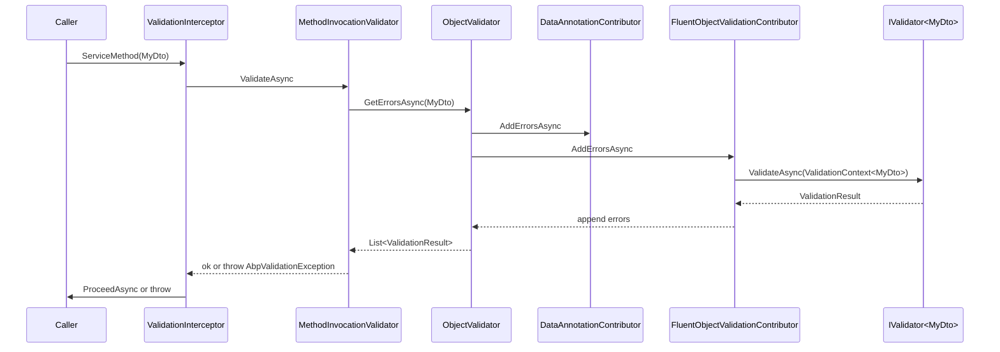

The **ABP Framework** FluentValidation integration adds an `IObjectValidationContributor` that runs every registered `IValidator<T>` against the object the framework is currently validating. The package is `Volo.Abp.FluentValidation`, sitting on top of `Volo.Abp.Validation`, and ships only three runtime classes — a contributor, a module, and a conventional registrar. Source: `framework/src/Volo.Abp.FluentValidation/`.

## Responsibility

The module is responsible for:

- Detecting concrete `IValidator<T>` implementations through `AbpFluentValidationConventionalRegistrar` and exposing them as both their own type and the open generic `IValidator<>` closed over `T`.
- Plugging `FluentObjectValidationContributor` into `AbpValidationOptions.ObjectValidationContributors` so each call into `IObjectValidator.GetErrorsAsync` invokes the matching fluent validator.
- Converting FluentValidation's `ValidationResult` into a `System.ComponentModel.DataAnnotations.ValidationResult` so it aggregates with the framework's other errors.

## File inventory

| File                                                                          | Purpose                                                                  |
| ----------------------------------------------------------------------------- | ------------------------------------------------------------------------ |
| `Volo.Abp.FluentValidation/Volo/Abp/FluentValidation/AbpFluentValidationModule.cs` | `[DependsOn(typeof(AbpValidationModule))]`; registers the registrar. |
| `Volo.Abp.FluentValidation/Volo/Abp/FluentValidation/AbpFluentValidationConventionalRegistrar.cs` | Exposes any type implementing `IValidator<T>` as `IValidator<T>` and itself. |
| `Volo.Abp.FluentValidation/Volo/Abp/FluentValidation/FluentObjectValidationContributor.cs` | `IObjectValidationContributor` calling `IValidator.ValidateAsync(IValidationContext)`. |

## Key abstractions

### `AbpFluentValidationModule`

```csharp
[DependsOn(typeof(AbpValidationModule))]
public class AbpFluentValidationModule : AbpModule
{
    public override void PreConfigureServices(ServiceConfigurationContext context)
    {
        context.Services.AddConventionalRegistrar(new AbpFluentValidationConventionalRegistrar());
    }
}
```

The module is intentionally minimal: it depends on `AbpValidationModule` (which already auto-discovers `IObjectValidationContributor` types via `services.OnRegistered`), adds the conventional registrar, and lets `FluentObjectValidationContributor` (a `[TransientDependency]`) be picked up automatically into `AbpValidationOptions.ObjectValidationContributors`.

### `AbpFluentValidationConventionalRegistrar`

```csharp
public class AbpFluentValidationConventionalRegistrar : DefaultConventionalRegistrar
{
    protected override bool IsConventionalRegistrationDisabled(Type type)
        => !type.GetInterfaces().Any(x => x.IsGenericType && x.GetGenericTypeDefinition() == typeof(IValidator<>))
           || base.IsConventionalRegistrationDisabled(type);

    protected override ServiceLifetime? GetDefaultLifeTimeOrNull(Type type) => ServiceLifetime.Transient;

    protected override List<Type> GetExposedServiceTypes(Type type)
        => new List<Type>
        {
            type,
            typeof(IValidator<>).MakeGenericType(GetFirstGenericArgumentOrNull(type, 1)!)
        };
}
```

The registrar:

- Skips types that do not implement `IValidator<T>`.
- Registers each validator as `Transient`.
- Exposes the validator under two service types: its own concrete type and the closed `IValidator<TModel>` type — so DI consumers can ask for either `MyValidator` or `IValidator<MyDto>`.
- `GetFirstGenericArgumentOrNull` walks the inheritance chain (up to depth 8) to find the first generic argument of `IValidator<>`. This handles base classes such as `AbstractValidator<MyDto>` correctly.

### `FluentObjectValidationContributor`

```csharp
public class FluentObjectValidationContributor : IObjectValidationContributor, ITransientDependency
{
    private readonly IServiceProvider _serviceProvider;
    public FluentObjectValidationContributor(IServiceProvider serviceProvider) => _serviceProvider = serviceProvider;

    public virtual async Task AddErrorsAsync(ObjectValidationContext context)
    {
        var serviceType = typeof(IValidator<>).MakeGenericType(context.ValidatingObject.GetType());
        var validator   = _serviceProvider.GetService(serviceType) as IValidator;
        if (validator == null) return;

        var result = await validator.ValidateAsync((IValidationContext)Activator.CreateInstance(
            typeof(ValidationContext<>).MakeGenericType(context.ValidatingObject.GetType()),
            context.ValidatingObject)!);

        if (!result.IsValid)
        {
            context.Errors.AddRange(result.Errors.Select(error =>
                new ValidationResult(error.ErrorMessage, new[] { error.PropertyName })));
        }
    }
}
```

Behaviour highlights:

- The contributor inspects `context.ValidatingObject.GetType()` (runtime type) rather than the declared parameter type. A `BaseDto` parameter carrying a `DerivedDto` value asks for `IValidator<DerivedDto>`.
- When no validator is registered, the contributor silently exits — fluent validation is *opt-in per type*. The DataAnnotations contributor still runs.
- The FluentValidation `ValidationContext<T>` is constructed via reflection because the contributor cannot know `T` at compile time.
- `ValidationFailure.PropertyName` becomes the single `MemberName` on the resulting `ValidationResult`, so consumers that read `ValidationResult.MemberNames` see exactly one entry per failure.

### `AbpFluentValidationOptions`

The package does **not** ship a dedicated `AbpFluentValidationOptions` class — there is nothing to configure beyond the underlying `AbpValidationOptions.ObjectValidationContributors` list. Hosts that need to disable the contributor can remove `typeof(FluentObjectValidationContributor)` from that list in `Configure<AbpValidationOptions>(...)`. The page mentions the name for symmetry with other concerns, but as of this source the options class does not exist.

## Control & data flow



Both contributors are invoked on every validation pass. Errors accumulate in the same `ObjectValidationContext.Errors`, so a single failed call can report data-annotation and fluent-rule violations side by side.

## Connections

- **Validation** — `AbpFluentValidationModule` depends on `AbpValidationModule`; the contributor lands in `AbpValidationOptions.ObjectValidationContributors` via the auto-detection hook in `AbpValidationModule.AutoAddObjectValidationContributors`.
- **DependencyInjection** — `AbpFluentValidationConventionalRegistrar` plugs into ABP's `DefaultConventionalRegistrar` pipeline; this is the same mechanism every `Abp*Module` uses to expose concrete types.
- **FluentValidation library** — Validators inherit from `AbstractValidator<T>` (FluentValidation NuGet). The contributor uses only the public `IValidator` / `IValidator<T>` surface.

## Gotchas & invariants

- The contributor uses the **runtime** type of the value to find the validator. A `BaseDto`-typed parameter holding a `DerivedDto` will only invoke `IValidator<DerivedDto>`, not `IValidator<BaseDto>`. If you want both, register a `IValidator<BaseDto>` explicitly and call it from the derived validator.
- Validators must be implementations of `IValidator<T>` — typically by extending `AbstractValidator<T>`. Plain `IValidator` (non-generic) implementations are skipped.
- The registrar exposes the type as **`Transient`** regardless of the lifetime hint in the source class. To register as `Scoped`, you must replace the registrar.
- `FluentObjectValidationContributor` does not log when no validator is found. Diagnosing "my validator didn't run" usually means the convention registrar didn't pick the type up — verify the validator is in an assembly auto-discovered through `services.AddType(typeof(MyModule).Assembly)`.
- The contributor builds `ValidationContext<T>` via reflection, allocating per call. Hot paths can override the contributor to cache constructors.
- Failures are converted into `System.ComponentModel.DataAnnotations.ValidationResult`; FluentValidation severity (`Severity.Warning`, `Severity.Info`) is **lost**. All failures appear as errors.
- When both DataAnnotations and FluentValidation report the same property, the consumer sees two `ValidationResult` entries for the same `MemberName`. Deduplicate downstream if necessary.
- Because the contributor short-circuits on a missing validator, the DataAnnotations contributor remains the safety net. Disabling DataAnnotations and forgetting a fluent validator means *no* validation runs.
- `IValidator<T>.ValidateAsync` is asynchronous and runs inside the per-call DI scope created by `ObjectValidator.GetErrorsAsync`, so scoped dependencies of the validator behave naturally.
- Registering multiple `IValidator<T>` implementations for the same `T` is permitted by DI, but `IServiceProvider.GetService(typeof(IValidator<T>))` returns only the last one registered — additional validators are silently ignored.
