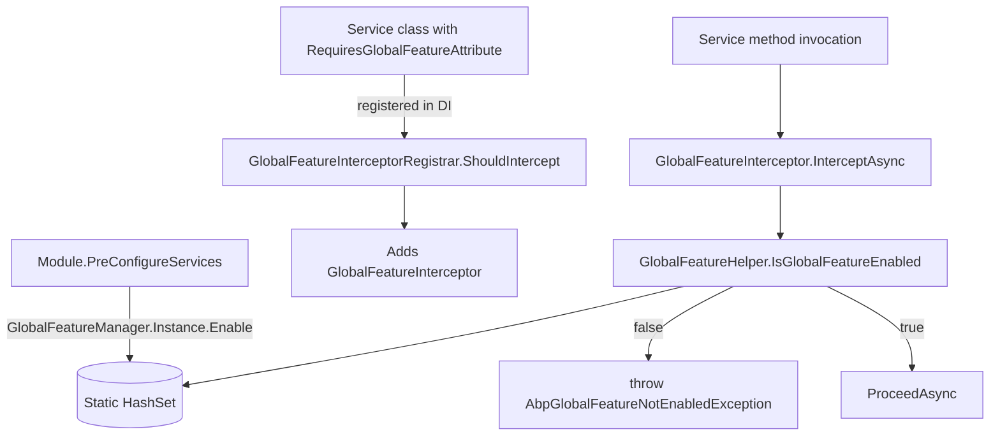
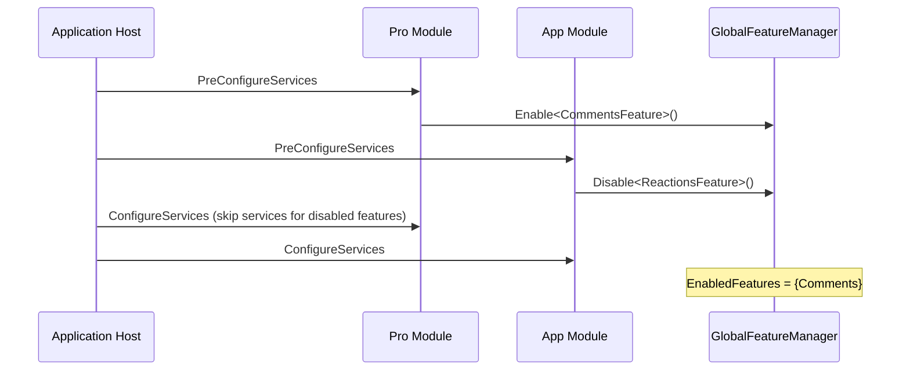

The **ABP Framework** global-features module is the *compile-time-ish* counterpart to runtime feature toggles: a host process decides at startup which subsystems of a module are turned on, and any service decorated with `[RequiresGlobalFeature]` for a disabled feature throws on every invocation. It targets pro-modules (Identity Pro, CMS Kit Pro, etc.) where whole feature sets can be removed from the running application. The code lives in `framework/src/Volo.Abp.GlobalFeatures/`.

## Responsibility

The module is responsible for:

- Hosting the process-wide `GlobalFeatureManager.Instance` singleton that stores enabled-feature names in a `HashSet<string>`.
- Letting modules expose strongly-typed `GlobalFeature` subclasses grouped under `GlobalModuleFeatures` accessed by `GlobalFeatureManager.Modules`.
- Auto-wrapping services that carry `[RequiresGlobalFeature]` with `GlobalFeatureInterceptor` so a disabled feature surfaces as `AbpGlobalFeatureNotEnabledException`.
- Cooperating with the runtime feature pipeline through `RequireGlobalFeaturesSimpleStateChecker`.

## File inventory

| File                                          | Purpose                                                                  |
| --------------------------------------------- | ------------------------------------------------------------------------ |
| `AbpGlobalFeaturesModule.cs`                  | Module setup: localization, virtual JSON, interceptor registrar.         |
| `GlobalFeatureManager.cs`                     | Static `Instance`; `Enable/Disable/IsEnabled` and `Modules` dictionary.   |
| `GlobalFeature.cs`                            | Abstract base for module features; ties to `GlobalModuleFeatures`.        |
| `GlobalModuleFeatures.cs`                     | Container holding the feature instances of one module.                   |
| `GlobalModuleFeaturesDictionary.cs`           | `Modules` collection keyed by module type/name.                          |
| `GlobalFeatureDictionary.cs`                  | Helper dictionary type.                                                  |
| `GlobalFeatureHelper.cs`                      | `IsGlobalFeatureEnabled(type, out attribute)` consulted by the interceptor. |
| `GlobalFeatureNameAttribute.cs`               | Decorates a `GlobalFeature` subclass with its canonical string name.     |
| `RequiresGlobalFeatureAttribute.cs`           | Marker for service classes; carries `Type` or `Name`.                     |
| `GlobalFeatureInterceptor.cs`                 | Throws `AbpGlobalFeatureNotEnabledException` when the feature is off.    |
| `GlobalFeatureInterceptorRegistrar.cs`        | Adds the interceptor for types decorated with `[RequiresGlobalFeature]`. |
| `IGlobalFeatureCheckingEnabled.cs`            | Marker interface alternative to the attribute.                           |
| `AbpGlobalFeatureNotEnabledException.cs`      | Thrown by the interceptor; carries `code`.                                |
| `AbpGlobalFeatureErrorCodes.cs`               | Error code constants.                                                    |
| `RequireGlobalFeaturesSimpleStateChecker.cs`  | Bridges to `Volo.Abp.SimpleStateChecking`.                                |
| `GlobalFeatureSimpleStateCheckerExtensions.cs`| Extension methods to attach the checker.                                  |
| `GlobalFeaturesSimpleStateCheckerSerializerContributor.cs` | Serialises feature state across processes.                    |

## Key abstractions

### `GlobalFeatureManager`

`framework/src/Volo.Abp.GlobalFeatures/Volo/Abp/GlobalFeatures/GlobalFeatureManager.cs`

```csharp
public static GlobalFeatureManager Instance { get; protected set; } = new GlobalFeatureManager();

public Dictionary<object, object> Configuration { get; }      // free-form bag for module options
public GlobalModuleFeaturesDictionary Modules { get; }
protected HashSet<string> EnabledFeatures { get; }

public bool IsEnabled<TFeature>();
public bool IsEnabled(Type featureType);
public bool IsEnabled(string featureName);
public void Enable<TFeature>();
public void Enable(Type featureType);
public void Enable(string featureName);
public void Disable<TFeature>();
public IEnumerable<string> GetEnabledFeatureNames();
```

`Instance` is the process-wide store. It is **not** scoped per tenant — global features are a host decision, not a runtime one. Callers: `GlobalFeatureHelper.IsGlobalFeatureEnabled`, application code calling `GlobalFeatureManager.Instance.Enable<MyFeature>()` from module `PreConfigureServices`.

### `GlobalFeature` (abstract base)

`framework/src/Volo.Abp.GlobalFeatures/Volo/Abp/GlobalFeatures/GlobalFeature.cs`

```csharp
public abstract class GlobalFeature
{
    public GlobalModuleFeatures Module { get; }
    public GlobalFeatureManager FeatureManager { get; }
    public string FeatureName { get; }   // read from [GlobalFeatureName]
    public bool   IsEnabled { get; set; }
    public virtual void Enable();
    public virtual void Disable();
    public void SetEnabled(bool isEnabled);
}
```

Subclasses must be decorated with `[GlobalFeatureName("Foo.Bar")]`; the constructor reads the attribute via `GlobalFeatureNameAttribute.GetName(GetType())` and stores it in `FeatureName`. Modules typically expose them through a `GlobalModuleFeatures`-derived class:

```csharp
[GlobalFeatureName("CmsKit.Comments")]
public class CommentsFeature : GlobalFeature { public CommentsFeature(GlobalModuleFeatures module) : base(module) { } }
```

### `GlobalFeatureNameAttribute`

`framework/src/Volo.Abp.GlobalFeatures/Volo/Abp/GlobalFeatures/GlobalFeatureNameAttribute.cs`

```csharp
[AttributeUsage(AttributeTargets.Class)]
public class GlobalFeatureNameAttribute : Attribute
{
    public string Name { get; }
    public GlobalFeatureNameAttribute(string name) { Name = Check.NotNullOrWhiteSpace(name, nameof(name)); }
    public static string GetName(Type type) { ... throws AbpException if missing ... }
}
```

`GetName` throws `AbpException` if a `GlobalFeature` subclass lacks the attribute. This is the only naming convention — feature lookups by `Type` always go through `GetName`.

### `RequiresGlobalFeatureAttribute`

`framework/src/Volo.Abp.GlobalFeatures/Volo/Abp/GlobalFeatures/RequiresGlobalFeatureAttribute.cs`

```csharp
[AttributeUsage(AttributeTargets.Class)]
public class RequiresGlobalFeatureAttribute : Attribute
{
    public Type?   Type { get; }
    public string? Name { get; }
    public RequiresGlobalFeatureAttribute(Type type)   { Type = Check.NotNull(type, nameof(type)); }
    public RequiresGlobalFeatureAttribute(string name) { Name = Check.NotNullOrWhiteSpace(name, nameof(name)); }
    public virtual string GetFeatureName() => Name ?? GlobalFeatureNameAttribute.GetName(Type!);
}
```

Two constructors let callers reference a feature either by its `GlobalFeature` subclass or by its string name. `GetFeatureName()` normalises both into the string the manager understands.

### `GlobalFeatureHelper`

`framework/src/Volo.Abp.GlobalFeatures/Volo/Abp/GlobalFeatures/GlobalFeatureHelper.cs`

```csharp
public static bool IsGlobalFeatureEnabled(Type type, out RequiresGlobalFeatureAttribute? attribute)
{
    attribute = ReflectionHelper.GetSingleAttributeOrDefault<RequiresGlobalFeatureAttribute>(type);
    return attribute == null || GlobalFeatureManager.Instance.IsEnabled(attribute.GetFeatureName());
}
```

The single decision point: if there is no attribute, the feature is enabled by default; otherwise, the manager is consulted. Callers: `GlobalFeatureInterceptor`, `GlobalFeatureInterceptorRegistrar`.

### `GlobalFeatureInterceptor`

`framework/src/Volo.Abp.GlobalFeatures/Volo/Abp/GlobalFeatures/GlobalFeatureInterceptor.cs`

```csharp
public override async Task InterceptAsync(IAbpMethodInvocation invocation)
{
    if (AbpCrossCuttingConcerns.IsApplied(invocation.TargetObject, AbpCrossCuttingConcerns.GlobalFeatureChecking))
    { await invocation.ProceedAsync(); return; }

    if (invocation.TargetObject != null &&
        !GlobalFeatureHelper.IsGlobalFeatureEnabled(invocation.TargetObject.GetType(), out var attribute))
    {
        throw new AbpGlobalFeatureNotEnabledException(code: AbpGlobalFeatureErrorCodes.GlobalFeatureIsNotEnabled)
            .WithData("ServiceName", invocation.TargetObject.GetType().FullName!)
            .WithData("GlobalFeatureName", attribute!.Name!);
    }

    await invocation.ProceedAsync();
}
```

The interceptor inspects the **runtime type** of the target (so proxies see the underlying service type). It throws on disabled features rather than returning a no-op, which lets the global exception handler localise the message via `AbpGlobalFeatureResource`.

### `IGlobalFeatureCheckingEnabled`

A marker interface allowing classes to declare "please intercept me" without adding the attribute — useful when the feature membership is dynamic.

## Control & data flow



Startup ordering is critical:



Pro-modules consult `GlobalFeatureManager.Instance.IsEnabled<X>()` inside `ConfigureServices` to decide whether to register specific options/services, so toggling must happen in `PreConfigureServices`.

## Connections

- **Authorization** — `AbpGlobalFeaturesModule` depends on `AbpAuthorizationAbstractionsModule` so that `AbpGlobalFeatureNotEnabledException` can travel through the same exception filter pipeline.
- **SimpleStateChecking** — `RequireGlobalFeaturesSimpleStateChecker` lets a `PermissionDefinition` or `FeatureDefinition` mark itself unavailable when a global feature is off; `GlobalFeaturesSimpleStateCheckerSerializerContributor` makes the rule travel across services.
- **Object Extending** — `ExtensionPropertyGlobalFeaturePolicyConfiguration` (in `Volo.Abp.ObjectExtending`) hides extra properties whose policy depends on a global feature.

## Gotchas & invariants

- `GlobalFeatureManager.Instance` is a **process-wide singleton**. Toggling it from inside per-request code is dangerous — it affects every tenant, every user.
- Always toggle in `PreConfigureServices`. Toggling in `ConfigureServices` is too late for modules that already registered services for the feature.
- `RequiresGlobalFeatureAttribute` only targets classes (`AttributeTargets.Class`). Putting it on a method is a compile error.
- The interceptor reads the **target object's runtime type** (`invocation.TargetObject.GetType()`), not the declared service type. If you wrap a service with a decorator that does not carry the attribute, the check is bypassed.
- `GlobalFeatureNameAttribute.GetName` throws `AbpException` if missing; tests that mock `GlobalFeature` must add the attribute.
- The `GlobalFeatureManager.Configuration` dictionary is a free-form bag — convention is to key by `typeof(MyFeature)` and store an options POCO. Concurrent modification is the host's responsibility.
- `GlobalFeatureHelper.IsGlobalFeatureEnabled` uses `ReflectionHelper.GetSingleAttributeOrDefault`, which walks the inheritance chain but takes the *first* match — multiple attributes are not aggregated.
- Disabling a global feature does **not** unregister the affected services from DI; only invocations throw. Service resolution still succeeds.
