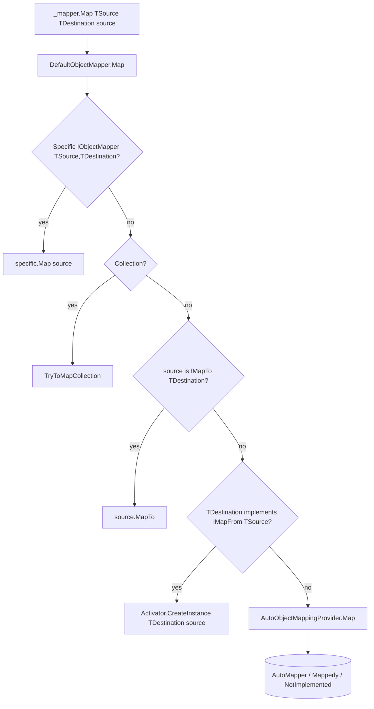
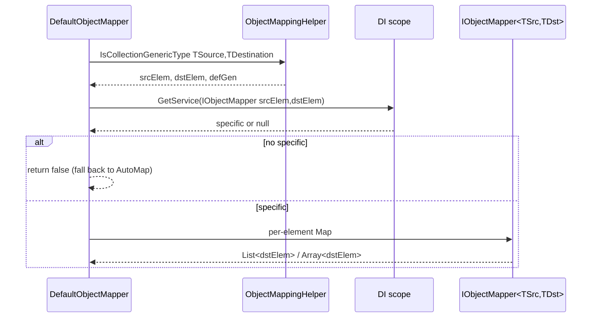

The **ABP Framework** object-mapping module is the framework-neutral DTO/entity translation API. It defines `IObjectMapper` and `IAutoObjectMappingProvider` so application code can write `_mapper.Map<User, UserDto>(user)` without depending on AutoMapper, Mapperly, or any specific library. Source: `framework/src/Volo.Abp.ObjectMapping/`.

## Responsibility

This module is responsible for:

- Defining the `IObjectMapper` contract that application code consumes.
- Providing a `DefaultObjectMapper` that prefers an explicit `IObjectMapper<TSource, TDestination>` if registered, then falls back to `IMapTo`/`IMapFrom` hand-written mappings, then to the active `IAutoObjectMappingProvider`.
- Exposing helpers for mapping collections (`List<T>`, arrays) generically.
- Letting hosts pick a backend (AutoMapper, Mapperly, LuckyPenny.AutoMapper) by installing the matching module — the user code is unchanged.

## File inventory

| File                                                       | Purpose                                                                  |
| ---------------------------------------------------------- | ------------------------------------------------------------------------ |
| `AbpObjectMappingModule.cs`                                | Exposes implementations of `IObjectMapper<,>` and registers `DefaultObjectMapper<>`. |
| `IObjectMapper.cs`                                         | Façade interface plus `IObjectMapper<TSource, TDestination>` specialisation. |
| `DefaultObjectMapper.cs`                                   | The orchestrator: specific mapper → collection mapper → `IMapTo` → `IMapFrom` → auto provider. |
| `IAutoObjectMappingProvider.cs`                            | Pluggable backend; specific contexts have `IAutoObjectMappingProvider<TContext>`. |
| `NotImplementedAutoObjectMappingProvider.cs`               | Default backend when no library is installed; throws.                     |
| `IMapFrom.cs`                                              | Marker interface allowing a destination to build itself from a source.    |
| `IMapTo.cs`                                                | Marker interface allowing a source to map to a destination.               |
| `ObjectMapperExtensions.cs`                                | Convenience overloads (`Map<TDestination>(source)`).                       |
| `ObjectMappingHelper.cs`                                   | Collection-type detection used by both default mapper and provider hosts. |

## Key abstractions

### `IObjectMapper`

`framework/src/Volo.Abp.ObjectMapping/Volo/Abp/ObjectMapping/IObjectMapper.cs`

```csharp
public interface IObjectMapper
{
    IAutoObjectMappingProvider AutoObjectMappingProvider { get; }
    TDestination Map<TSource, TDestination>(TSource source);
    TDestination Map<TSource, TDestination>(TSource source, TDestination destination);
}

public interface IObjectMapper<TContext> : IObjectMapper { }

public interface IObjectMapper<in TSource, TDestination>
{
    TDestination Map(TSource source);
    TDestination Map(TSource source, TDestination destination);
}
```

Three nested contracts:

- **`IObjectMapper`** — the global façade, used as `IObjectMapper _mapper` in application services.
- **`IObjectMapper<TContext>`** — a context-scoped façade, letting a module register its own backend without polluting the global mapper.
- **`IObjectMapper<TSource, TDestination>`** — a hand-written mapper for a specific pair of types. Registering one of these is how you override a single mapping.

### `DefaultObjectMapper`

`framework/src/Volo.Abp.ObjectMapping/Volo/Abp/ObjectMapping/DefaultObjectMapper.cs`

```csharp
public virtual TDestination Map<TSource, TDestination>(TSource source)
{
    if (source == null) return default!;

    using (var scope = ServiceProvider.CreateScope())
    {
        var specificMapper = scope.ServiceProvider.GetService<IObjectMapper<TSource, TDestination>>();
        if (specificMapper != null) return specificMapper.Map(source);

        if (TryToMapCollection<TSource, TDestination>(scope, source, default, out var collectionResult))
            return collectionResult;
    }

    if (source is IMapTo<TDestination> mapperSource)
        return mapperSource.MapTo();

    if (typeof(IMapFrom<TSource>).IsAssignableFrom(typeof(TDestination)))
        return (TDestination)Activator.CreateInstance(typeof(TDestination), source)!;

    return AutoMap<TSource, TDestination>(source);
}
```

Resolution order, in priority:

1. **`IObjectMapper<TSource, TDestination>` from DI** — bespoke mapper wins.
2. **Collection mapping** (`TryToMapCollection`) — uses `ObjectMappingHelper.IsCollectionGenericType` to detect `IEnumerable<T>` shapes and reuses the specific mapper per element.
3. **`source is IMapTo<TDestination>`** — the source type implements its own map.
4. **`TDestination : IMapFrom<TSource>`** — the destination has a `(TSource)` constructor.
5. **`AutoMap`** — delegate to `IAutoObjectMappingProvider`.

For the destination-supplied variant (`Map<TSource, TDestination>(source, destination)`), the same order applies, with `IMapTo<TDestination>.MapTo(destination)` and `IMapFrom<TSource>.MapFrom(source)` filling existing instances.

### `IAutoObjectMappingProvider`

`framework/src/Volo.Abp.ObjectMapping/Volo/Abp/ObjectMapping/IAutoObjectMappingProvider.cs`

```csharp
public interface IAutoObjectMappingProvider
{
    TDestination Map<TSource, TDestination>(object source);
    TDestination Map<TSource, TDestination>(TSource source, TDestination destination);
}

public interface IAutoObjectMappingProvider<TContext> : IAutoObjectMappingProvider { }
```

Implementations live in the AutoMapper and Mapperly modules:

| Implementation                                                                     | Package               |
| ---------------------------------------------------------------------------------- | --------------------- |
| `Volo.Abp.AutoMapper.AutoMapperAutoObjectMappingProvider`                          | `Volo.Abp.AutoMapper` |
| `Volo.Abp.LuckyPenny.AutoMapper.AutoMapperAutoObjectMappingProvider`               | `Volo.Abp.LuckyPenny.AutoMapper` |
| `Volo.Abp.Mapperly.MapperlyAutoObjectMappingProvider`                              | `Volo.Abp.Mapperly`   |
| `NotImplementedAutoObjectMappingProvider`                                          | `Volo.Abp.ObjectMapping` (default) |

If no backend is installed, `NotImplementedAutoObjectMappingProvider` throws an `AbpException` instructing the developer to install one.

### `IMapFrom<TSource>` and `IMapTo<TDestination>`

```csharp
public interface IMapFrom<TSource>
{
    void MapFrom(TSource source);
}

public interface IMapTo<TDestination>
{
    TDestination MapTo();
    void MapTo(TDestination destination);
}
```

These marker interfaces let DTOs own their conversion. `DefaultObjectMapper.Map<TSource, TDestination>` checks `IMapTo<TDestination>` before falling back to AutoMapper, so a DTO with hand-written mapping logic does not require any profile.

### `AbpObjectMappingModule`

```csharp
public class AbpObjectMappingModule : AbpModule
{
    public override void PreConfigureServices(ServiceConfigurationContext context)
    {
        context.Services.OnExposing(exposingContext =>
        {
            exposingContext.ExposedTypes.AddRange(
                ReflectionHelper.GetImplementedGenericTypes(
                    exposingContext.ImplementationType,
                    typeof(IObjectMapper<,>)
                ).ConvertAll(t => new ServiceIdentifier(t)));
        });
    }

    public override void ConfigureServices(ServiceConfigurationContext context)
    {
        context.Services.AddTransient(typeof(IObjectMapper<>), typeof(DefaultObjectMapper<>));
    }
}
```

The `OnExposing` hook means any class implementing `IObjectMapper<TSource, TDestination>` is auto-exposed under that specific generic interface — you do not need to write `[ExposeServices(typeof(IObjectMapper<MyDto, MyEntity>))]`. The open-generic `IObjectMapper<TContext>` is bound to `DefaultObjectMapper<TContext>` so each module can have its own scoped façade.

### `AbpAutoMapperOptions` (referenced)

The configuration of profiles, max-depth, and validating profiles happens in `Volo.Abp.AutoMapper`'s `AbpAutoMapperOptions`. See the AutoMapper page for the full surface; this module is intentionally backend-agnostic.

## Control & data flow



`TryToMapCollection` itself runs a small choreography:



## Connections

- **AutoMapper** — `Volo.Abp.AutoMapper` registers `AutoMapperAutoObjectMappingProvider` as `IAutoObjectMappingProvider` and uses `MapperAccessor.Mapper` to dispatch. See the AutoMapper page.
- **Mapperly** — `Volo.Abp.Mapperly` registers `MapperlyAutoObjectMappingProvider`, which discovers `IAbpMapperlyMapper<TSource, TDestination>` instances.
- **Object Extending** — `IObjectMapper` is the natural place to copy `ExtraProperties` via `ExtensibleObjectMapper.MapExtraPropertiesTo`. Both backend modules import `AbpObjectExtendingModule` so the helper is reachable.
- **DependencyInjection** — `OnExposing` lets ABP discover `IObjectMapper<,>` implementations without explicit attributes.

## Gotchas & invariants

- Resolution order is **strict**: a hand-written `IObjectMapper<TSource, TDestination>` always wins over AutoMapper or Mapperly. Forgetting that a custom mapper is registered is a common source of "AutoMapper profile not running" bugs.
- `IMapFrom<TSource>` requires the destination to have a `(TSource)` constructor — the default mapper uses `Activator.CreateInstance(typeof(TDestination), source)`. Source comment notes this is a temporary shortcut pending TODO improvements.
- `DefaultObjectMapper.MapCache` is a `ConcurrentDictionary` keyed by `$"{mapperType.FullName}_{shape}"` and cached **per process**; reloading assemblies (in tests) does not invalidate it.
- `TryToMapCollection` clones the source list and clears the destination collection *only if it is not an array*. Arrays return a new instance.
- `DefaultObjectMapper.Map<TSource, TDestination>(null!)` returns `default(TDestination)`. There is no `ArgumentNullException`.
- The framework intentionally creates a fresh DI scope per call to resolve a specific mapper. A scoped mapper with state across calls is therefore *not* re-used.
- If `NotImplementedAutoObjectMappingProvider` is active and your DTO does not implement `IMapTo`/`IMapFrom`, calls fall through to it and throw — verify your host references either `Volo.Abp.AutoMapper` or `Volo.Abp.Mapperly`.
- `IObjectMapper<TContext>` lets the EF Core integration and other modules host private mappers without altering global mapping — register your context-bound mappers under that generic, not the global one.
- The `MapExtraProperties` behavior (copying `IHasExtraProperties.ExtraProperties`) is implemented inside each backend's provider, *not* in `DefaultObjectMapper`. Backends without that behaviour will lose extra properties on auto-map.
- Mapping cycles between DTOs are detected only when the backend supports it (AutoMapper's `MaxDepth`); `DefaultObjectMapper` itself has no cycle guard.
