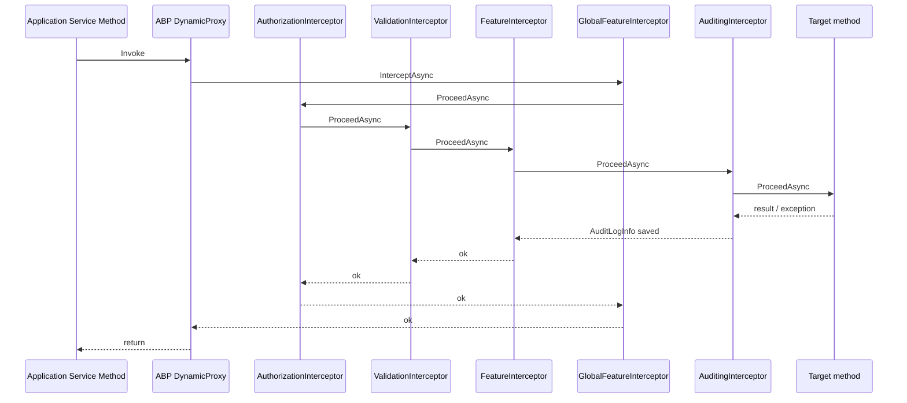
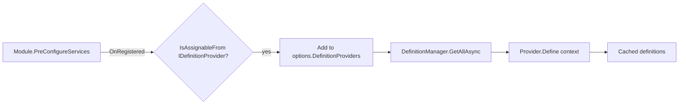
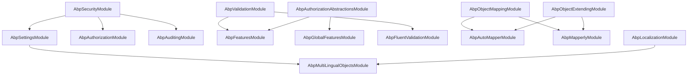

The **ABP Framework** treats every recurring infrastructure responsibility — auditing, authorization, features, settings, validation, mapping, security claims, object extending, specifications, multi-lingual content, and GDPR — as an independent module that plugs into the same `AbpModule` pipeline. Each concern ships as its own NuGet package under `framework/src/Volo.Abp.<Concern>/`, exposes an `AbpModule` subclass that participates in `ConfigureServices`/`PreConfigureServices`, and registers either a dynamic-proxy interceptor or a service contract that the rest of the framework consumes through DI. This page is the map of that family, with links into the per-concern pages that drill into each implementation.

## Responsibility

The "concerns" packages exist so that **application code** (your `IApplicationService`, `IDomainService`, `AppService`, controllers, etc.) does not have to repeat boilerplate: the framework adds auditing, permission checks, validation, feature gating, setting reads, and DTO mapping around your method bodies. Each concern owns a *small contract surface* (an interface and one or two options classes) plus an *interceptor* registered via `IOnServiceRegistredContext` so that types decorated with the right attribute or marker interface are auto-wrapped.

## Package inventory

The table below lists every package this section documents, the abstraction it owns, and the entry-point module class that gets pulled into your app graph when you take a `[DependsOn]` on it.

| Concern              | Package                                          | Entry module                       | Key contract                                       |
| -------------------- | ------------------------------------------------ | ---------------------------------- | -------------------------------------------------- |
| Auditing             | `Volo.Abp.Auditing` / `Volo.Abp.Auditing.Contracts` | `AbpAuditingModule`                | `IAuditingManager`, `IAuditingStore`               |
| Authorization        | `Volo.Abp.Authorization` / `.Abstractions`       | `AbpAuthorizationModule`           | `IAbpAuthorizationService`, `IPermissionChecker`   |
| Features             | `Volo.Abp.Features`                              | `AbpFeaturesModule`                | `IFeatureChecker`, `IFeatureDefinitionProvider`    |
| Global Features      | `Volo.Abp.GlobalFeatures`                        | `AbpGlobalFeaturesModule`          | `GlobalFeatureManager`                             |
| Settings             | `Volo.Abp.Settings`                              | `AbpSettingsModule`                | `ISettingProvider`, `ISettingDefinitionProvider`   |
| Security             | `Volo.Abp.Security`                              | `AbpSecurityModule`                | `ICurrentUser`, `ICurrentPrincipalAccessor`        |
| Validation           | `Volo.Abp.Validation` / `.Abstractions`          | `AbpValidationModule`              | `IObjectValidator`, `IMethodInvocationValidator`   |
| FluentValidation     | `Volo.Abp.FluentValidation`                      | `AbpFluentValidationModule`        | `IObjectValidationContributor`                     |
| Object Mapping       | `Volo.Abp.ObjectMapping`                         | `AbpObjectMappingModule`           | `IObjectMapper`, `IAutoObjectMappingProvider`      |
| AutoMapper           | `Volo.Abp.AutoMapper`                            | `AbpAutoMapperModule`              | `AbpAutoMapperOptions`, `IMapperAccessor`          |
| Mapperly             | `Volo.Abp.Mapperly`                              | `AbpMapperlyModule`                | `IAbpMapperlyMapper<,>`, `MapperBase<,>`           |
| Object Extending     | `Volo.Abp.ObjectExtending`                       | `AbpObjectExtendingModule`         | `ObjectExtensionManager`, `IHasExtraProperties`    |
| Specifications       | `Volo.Abp.Specifications`                        | `AbpSpecificationsModule`          | `ISpecification<T>`, `Specification<T>`            |
| Multi-Lingual        | `Volo.Abp.MultiLingualObjects`                   | `AbpMultiLingualObjectsModule`     | `IMultiLingualObjectManager`                       |
| GDPR                 | `Volo.Abp.Gdpr.Abstractions`                     | `AbpGdprAbstractionsModule`        | ETOs in `Volo.Abp.Gdpr`                            |

The two "Abstractions" packages (`Volo.Abp.Auditing.Contracts`, `Volo.Abp.Authorization.Abstractions`, `Volo.Abp.Validation.Abstractions`, `Volo.Abp.Gdpr.Abstractions`) exist so that contract DTOs, attributes, and exception types can be referenced from a domain or DTO project without dragging the runtime dependency graph. For example, `AuditedAttribute` lives in `Volo.Abp.Auditing.Contracts/Volo/Abp/Auditing/AuditedAttribute.cs` while the interceptor that reacts to it lives in `Volo.Abp.Auditing/Volo/Abp/Auditing/AuditingInterceptor.cs`.

## How AbpModule discovers the concerns

Every concern uses the same two-step idiom:

1. In `PreConfigureServices` (or `ConfigureServices`) of its `AbpModule` class, the package registers a callback through `IServiceCollection.OnRegistered(...)`. The callback inspects each newly-registered service type and calls `context.Interceptors.TryAdd<TInterceptor>()` when the type or one of its methods declares the matching attribute or marker interface.
2. The same module wires up the contract services (`AddTransient`, `AddSingleton`) and applies `Configure<TOptions>(...)` for the options type so that downstream modules can extend the lists of providers, contributors, or definition providers.

The diagram below shows the boot sequence for one application service. The interceptors run in a deterministic order set by the framework's `DynamicProxy` layer; the orchestration order itself is not configurable per call, but each interceptor is short-circuited when its `AbpCrossCuttingConcerns.IsApplied` check returns true.



The exact list of interceptors attached to a given service depends on the registrars that decided to opt in. The relevant registrar files are:

- `framework/src/Volo.Abp.Auditing/Volo/Abp/Auditing/AuditingInterceptorRegistrar.cs`
- `framework/src/Volo.Abp.Authorization/Volo/Abp/Authorization/AuthorizationInterceptorRegistrar.cs`
- `framework/src/Volo.Abp.Features/Volo/Abp/Features/FeatureInterceptorRegistrar.cs`
- `framework/src/Volo.Abp.GlobalFeatures/Volo/Abp/GlobalFeatures/GlobalFeatureInterceptorRegistrar.cs`
- `framework/src/Volo.Abp.Validation/Volo/Abp/Validation/ValidationInterceptorRegistrar.cs`

Each registrar declares a small private `ShouldIntercept(Type type)` helper. For example, `AuditingInterceptorRegistrar.ShouldIntercept` returns true when the implementation type is decorated with `[Audited]`, implements `IAuditingEnabled`, or contains any public method bearing `[Audited]`; `AuthorizationInterceptorRegistrar.ShouldIntercept` returns true when the type or any method carries `[Authorize]`; and `FeatureInterceptorRegistrar.ShouldIntercept` checks for `[RequiresFeature]`.

## Common architectural conventions

Several patterns repeat across the concerns. Knowing them up front makes it much easier to read any single concern page.

### Definition providers

Authorization, Features, and Settings all use a *definition provider* pattern: an abstract base class (`PermissionDefinitionProvider`, `FeatureDefinitionProvider`, `SettingDefinitionProvider`) overrides a `Define(...Context)` method that mutates a context object. Every implementation type is auto-discovered by the corresponding module via `services.OnRegistered(...)` and pushed into the matching option list (`AbpPermissionOptions.DefinitionProviders`, `AbpFeatureOptions.DefinitionProviders`, `AbpSettingOptions.DefinitionProviders`).



### Value provider chains

Both Settings (`ISettingValueProvider`) and Features (`IFeatureValueProvider`) compose multiple value providers in priority order. The classes `SettingValueProviderManager` and `FeatureValueProviderManager` resolve providers from DI in the order listed in `AbpSettingOptions.ValueProviders` / `AbpFeatureOptions.ValueProviders`. The default order is *Default → Configuration → Global/Edition → User/Tenant*; the value seeker walks the list in reverse so the most-specific scope wins.

### Interceptors via dynamic proxy

Every interceptor extends `AbpInterceptor` (from `Volo.Abp.DynamicProxy`) and is a `[TransientDependency]`. They all short-circuit when the host service is decorated with `AbpCrossCuttingConcerns.IsApplied(..., AbpCrossCuttingConcerns.<Name>)`, which lets the framework opt a specific call out of a single concern without disabling the entire concern globally.

### Options classes and `[DependsOn]`

Every concern's module file follows the same skeleton:

```csharp
[DependsOn(typeof(AbpSecurityModule), typeof(AbpLocalizationModule))]
public class AbpXyzModule : AbpModule
{
    public override void PreConfigureServices(ServiceConfigurationContext context) { /* OnRegistered hooks */ }
    public override void ConfigureServices(ServiceConfigurationContext context)    { /* Configure<TOptions>(...) */ }
}
```

The pattern is visible in `AbpAuditingModule.cs`, `AbpAuthorizationModule.cs`, `AbpFeaturesModule.cs`, `AbpSettingsModule.cs`, `AbpValidationModule.cs`, and the rest.

## How the concerns talk to each other

The concerns are individually decoupled but they cooperate at runtime:

- The **Auditing** module imports `AbpSecurityModule` so that `AuditingHelper` can read `ICurrentUser`/`ICurrentClient` to stamp `AuditLogInfo.UserId` and `AuditLogInfo.ClientId`.
- The **Authorization** module imports `AbpSecurityModule` so that `PermissionChecker` can read `ICurrentPrincipalAccessor.Principal`.
- The **Features** module imports `AbpAuthorizationAbstractionsModule` and `AbpValidationModule` so that `FeatureDefinition.ValueType` can reuse `IStringValueType` validators and feature checks can be hosted by `ISimpleStateChecker<PermissionDefinition>`.
- The **Settings** module imports `AbpSecurityModule` because `SettingEncryptionService` delegates to `IStringEncryptionService`, and `UserSettingValueProvider` reads `ICurrentUser`.
- The **AutoMapper** and **Mapperly** modules import `AbpObjectExtendingModule` so that mapping pipelines can copy `ExtraProperties` via `ExtensibleObjectMapper.MapExtraPropertiesTo`.



## Where to dive deeper

Use the sidebar to navigate to the page for a specific concern; each one drills into:

- The exact set of files that ship in the package.
- The key abstractions (interfaces, base classes, attributes) with file paths and signatures.
- The control flow from "method call" to "side effect" (audit row written, permission denied, feature flag evaluated, DTO mapped).
- Connections to other modules and the gotchas you should know before customizing.

## Gotchas at the family level

- Interceptors fire **only when the service is resolved through DI** and registered through ABP's conventional registrar; manually `new`ing up a service bypasses every concern in this section.
- Each interceptor checks `AbpCrossCuttingConcerns.IsApplied(target, name)` from `Volo.Abp.Aspects`. If you wrap an object with `target.AsDynamicProxy()` and explicitly apply a concern, the interceptor will skip it on the next invocation to prevent recursion.
- The static `GlobalFeatureManager.Instance` and `ObjectExtensionManager.Instance` are *process-wide singletons* mutated at startup. They are not per-tenant and should not be modified after the application has begun serving requests.
- All definition providers (`IPermissionDefinitionProvider`, `IFeatureDefinitionProvider`, `ISettingDefinitionProvider`) are evaluated lazily through their `*DefinitionManager` and cached; adding a new definition after first read requires invalidating the relevant `Static*DefinitionStore`.
