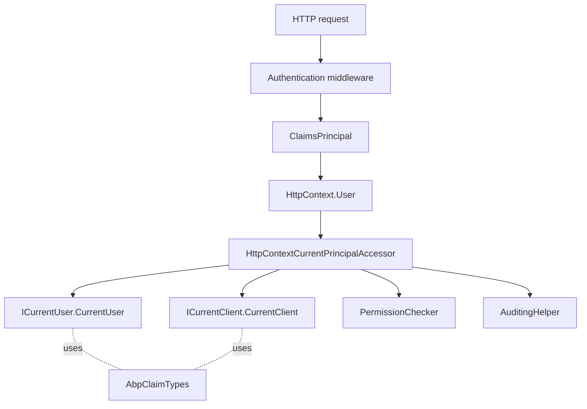

The **ABP Framework** security module is the bridge between ASP.NET Core's `ClaimsPrincipal` and the rest of the framework. It exposes the current principal through `ICurrentPrincipalAccessor`, layers `ICurrentUser` and `ICurrentClient` on top, ships the `AbpClaimTypes` constant table, and bundles a small symmetric-encryption helper plus a security-log sink. Code lives in `framework/src/Volo.Abp.Security/`.

## Responsibility

This module is responsible for:

- Providing `ICurrentPrincipalAccessor` to read the active `ClaimsPrincipal` (HTTP context or thread).
- Offering strongly-typed accessors `ICurrentUser` and `ICurrentClient` that decode well-known claims.
- Standardising claim names in `AbpClaimTypes`, with override-able defaults.
- Building the `ClaimsPrincipal` via `IAbpClaimsPrincipalFactory` and a list of `IAbpClaimsPrincipalContributor`s.
- Encrypting/decrypting strings with `IStringEncryptionService` and `AbpStringEncryptionOptions`.
- Hosting `AbpAuthorizationException` and `AbpRoleConsts` consumed by the Authorization module.
- Logging security-relevant events through `ISecurityLogManager` / `ISecurityLogStore`.

## File inventory

| File                                                            | Purpose                                                              |
| --------------------------------------------------------------- | -------------------------------------------------------------------- |
| `AbpSecurityModule.cs`                                          | Auto-adds claims contributors, configures `AbpStringEncryptionOptions` from `IConfiguration`. |
| `Claims/AbpClaimTypes.cs`                                       | Static, mutable claim-name table.                                    |
| `Claims/ICurrentPrincipalAccessor.cs` + `CurrentPrincipalAccessorBase.cs` | Async-local backed principal accessor.                      |
| `Claims/ThreadCurrentPrincipalAccessor.cs`                      | Default implementation reading `Thread.CurrentPrincipal`.            |
| `Claims/CurrentPrincipalAccessorExtensions.cs`                  | `Change(claims)` helper to set extra claims temporarily.             |
| `Claims/IAbpClaimsPrincipalFactory.cs` + `AbpClaimsPrincipalFactory.cs` | Pipeline that creates the principal at login.                |
| `Claims/AbpClaimsPrincipalFactoryOptions.cs`                    | Lists of `Contributors` and `DynamicContributors`.                    |
| `Claims/IAbpClaimsPrincipalContributor.cs`                      | Synchronous contribution to the new principal.                       |
| `Claims/IAbpDynamicClaimsPrincipalContributor.cs`               | Dynamic refresh-time contribution.                                   |
| `Claims/AbpDynamicClaim.cs` + `AbpDynamicClaimCacheItem.cs`     | Represents claims fetched after login.                               |
| `Claims/AbpDynamicClaimsPrincipalContributorBase.cs`            | Base class for dynamic contributors.                                 |
| `Claims/RemoteDynamicClaimsPrincipalContributorBase.cs` + `RemoteDynamicClaimsPrincipalContributorCacheBase.cs` | Cross-service flavours.    |
| `System/Security/Principal/AbpClaimsIdentityExtensions.cs`      | `FindUserId`, `FindTenantId`, `FindEditionId` etc.                    |
| `Users/ICurrentUser.cs` + `CurrentUser.cs`                      | Strongly-typed accessor reading the principal via `_principalAccessor`. |
| `Users/CurrentUserExtensions.cs`                                | `FindClaimValue`, `IsInRole`, etc.                                    |
| `Clients/ICurrentClient.cs` + `CurrentClient.cs`                | Reads `client_id` claim.                                              |
| `Roles/AbpRoleConsts.cs`                                        | Default role name constants.                                          |
| `Security/Encryption/IStringEncryptionService.cs` + `StringEncryptionService.cs` | AES-CBC with PBKDF2.                                |
| `Security/Encryption/AbpStringEncryptionOptions.cs`             | `Keysize`, `DefaultPassPhrase`, `InitVectorBytes`, `DefaultSalt`.      |
| `Authorization/AbpAuthorizationException.cs`                    | 401/403 carrier with log level and error code.                        |
| `SecurityLog/ISecurityLogManager.cs` + `DefaultSecurityLogManager.cs` | Front door for security events.                                |
| `SecurityLog/ISecurityLogStore.cs` + `SimpleSecurityLogStore.cs` | Persistence; default logs through `ILogger`.                          |
| `SecurityLog/AbpSecurityLogOptions.cs`                          | `ApplicationName`, `Enabled`.                                         |
| `SecurityLog/SecurityLogInfo.cs`                                | Log entry shape.                                                      |

## Key abstractions

### `ICurrentPrincipalAccessor`

`framework/src/Volo.Abp.Security/Volo/Abp/Security/Claims/ICurrentPrincipalAccessor.cs`

```csharp
public interface ICurrentPrincipalAccessor
{
    ClaimsPrincipal Principal { get; }
    IDisposable Change(ClaimsPrincipal principal);
}
```

`CurrentPrincipalAccessorBase` stores the principal in `AsyncLocal<ClaimsPrincipal>` and falls back to `GetClaimsPrincipal()` (which `ThreadCurrentPrincipalAccessor` implements as `Thread.CurrentPrincipal`). `Change(...)` returns a `DisposeAction<>` that restores the previous principal on dispose, allowing `using (CurrentPrincipalAccessor.Change(other)) { ... }`. ASP.NET integration replaces `ThreadCurrentPrincipalAccessor` with `HttpContextCurrentPrincipalAccessor`. Callers: `PermissionChecker`, `AuditingHelper`, `CurrentUser`, anything that needs to read claims indirectly.

### `AbpClaimTypes`

`framework/src/Volo.Abp.Security/Volo/Abp/Security/Claims/AbpClaimTypes.cs`

A static table of *mutable* string constants:

| Property              | Default                       |
| --------------------- | ----------------------------- |
| `UserName`            | `ClaimTypes.Name`             |
| `Name`                | `ClaimTypes.GivenName`        |
| `SurName`             | `ClaimTypes.Surname`          |
| `UserId`              | `ClaimTypes.NameIdentifier`   |
| `Role`                | `ClaimTypes.Role`             |
| `Email`               | `ClaimTypes.Email`            |
| `EmailVerified`       | `"email_verified"`            |
| `PhoneNumber`         | `"phone_number"`              |
| `PhoneNumberVerified` | `"phone_number_verified"`     |
| `TenantId`            | `"tenantid"`                  |
| `EditionId`           | `"editionid"`                 |
| `ClientId`            | `"client_id"`                 |
| `ImpersonatorUserId`  | `"impersonator_userid"`       |
| `ImpersonatorTenantId`| `"impersonator_tenantid"`     |
| `Picture`             | `"picture"`                   |
| `RememberMe`          | `"remember_me"`               |
| `SessionId`           | `"session_id"`                |

Because the fields are *settable*, identity hosts can remap claim names at startup (the source carries a TODO about migrating these to an options class). `CurrentUser` reads each property via `this.FindClaimValue(AbpClaimTypes.X)` so the mapping is honored throughout the framework.

### `ICurrentUser` and `CurrentUser`

`framework/src/Volo.Abp.Security/Volo/Abp/Users/ICurrentUser.cs`

```csharp
public interface ICurrentUser
{
    bool IsAuthenticated { get; }
    Guid? Id { get; }
    string? UserName { get; }
    string? Name { get; }
    string? SurName { get; }
    string? PhoneNumber { get; }
    bool PhoneNumberVerified { get; }
    string? Email { get; }
    bool EmailVerified { get; }
    Guid? TenantId { get; }
    string[] Roles { get; }
    Claim? FindClaim(string claimType);
    Claim[] FindClaims(string claimType);
    Claim[] GetAllClaims();
    bool IsInRole(string roleName);
}
```

`CurrentUser` is `ITransientDependency`. Every property reads from `_principalAccessor.Principal`, so changing the principal via `ICurrentPrincipalAccessor.Change` immediately changes what `ICurrentUser` reports. `IsAuthenticated` is `Id.HasValue` — a principal with a `UserName` but no `NameIdentifier` is *not* considered authenticated by ABP.

### `IAbpClaimsPrincipalFactory` and `AbpClaimsPrincipalFactory`

The factory creates the principal at login by iterating `AbpClaimsPrincipalFactoryOptions.Contributors` (`IAbpClaimsPrincipalContributor`) and again at refresh-time via `DynamicContributors`. `AbpSecurityModule.AutoAddClaimsPrincipalContributors` discovers any service implementing those interfaces and pushes them into the options. Each contributor receives an `AbpClaimsPrincipalContributorContext` exposing the in-progress `ClaimsPrincipal` and DI scope.

### `AbpStringEncryptionOptions` and `StringEncryptionService`

`framework/src/Volo.Abp.Security/Volo/Abp/Security/Encryption/AbpStringEncryptionOptions.cs`

```csharp
public int    Keysize         { get; set; } = 256;
public string DefaultPassPhrase { get; set; } = "gsKnGZ041HLL4IM8";
public byte[] InitVectorBytes  { get; set; } = Encoding.ASCII.GetBytes("jkE49230Tf093b42");
public byte[] DefaultSalt      { get; set; } = Encoding.ASCII.GetBytes("hgt!16kl");
```

`AbpSecurityModule.ConfigureServices` reads four optional values from `IConfiguration` (`StringEncryption:KeySize`, `:DefaultPassPhrase`, `:InitVectorBytes`, `:DefaultSalt`) and applies them onto the options. The framework's documentation flags the default passphrase as **insecure** — production hosts should override it.

`StringEncryptionService` (default `IStringEncryptionService`) uses `Aes.Create()` with `CipherMode.CBC` and `Rfc2898DeriveBytes` (PBKDF2) to derive a key:

```csharp
public string? Encrypt(string? plainText, string? passPhrase = null, byte[]? salt = null);
public string? Decrypt(string? cipherText, string? passPhrase = null, byte[]? salt = null);
```

Used by `SettingEncryptionService` (`Volo.Abp.Settings`) to encrypt setting values flagged `IsEncrypted = true`.

### `RandomHelper` and friends

While `RandomHelper` itself lives in the core `Volo.Abp.Core` package, this module assumes its presence — security-flavoured callers use `RandomHelper.GetRandomString` to generate salt/IV overrides in tests.

### `AbpAuthorizationException`

`framework/src/Volo.Abp.Security/Volo/Abp/Authorization/AbpAuthorizationException.cs`

```csharp
public class AbpAuthorizationException : AbpException, IHasLogLevel, IHasErrorCode
{
    public LogLevel LogLevel { get; set; }
    public string Code { get; set; }
}
```

Although the Authorization module raises it, the *type* lives in `Volo.Abp.Security` so that low-level packages without an authorization dependency can still throw it.

### `ISecurityLogManager`

The security log subsystem (under `Volo/Abp/SecurityLog/`) lets login modules write semi-structured events (`SecurityLogInfo` carries `UserId`, `Identity`, `Action`, `ApplicationName`, `IpAddresses`, `ClientId`, `BrowserInfo`). `AbpSecurityLogOptions.ApplicationName` is auto-filled from `IServiceCollection.GetApplicationName()` in `AbpSecurityModule.ConfigureServices`.

## Control & data flow



Principal construction at login:

```mermaid
sequenceDiagram
    participant Login as Login flow
    participant Fac as AbpClaimsPrincipalFactory
    participant Opt as AbpClaimsPrincipalFactoryOptions
    participant Contrib1 as IAbpClaimsPrincipalContributor #1
    participant Contrib2 as IAbpDynamicClaimsPrincipalContributor

    Login->>Fac: CreateAsync(identity)
    Fac->>Opt: Contributors
    Fac->>Contrib1: ContributeAsync(context)
    Fac->>Contrib2: ContributeAsync(context)
    Fac-->>Login: ClaimsPrincipal
```

## Connections

- **Authorization** — `IAbpAuthorizationService.CurrentPrincipal` returns `ICurrentPrincipalAccessor.Principal`; `PermissionChecker` uses the same accessor. `AbpAuthorizationException` lives here.
- **Auditing** — `AuditingHelper` reads `CurrentUser`, `CurrentTenant`, `CurrentClient`.
- **Settings** — `UserSettingValueProvider` reads `CurrentUser.Id`; `SettingEncryptionService` delegates to `IStringEncryptionService`.
- **MultiTenancy** — `AbpClaimsIdentityExtensions.FindTenantId` / `FindEditionId` decode tenant info from claims; ASP.NET integration's `MultiTenantMiddleware` honors `AbpClaimTypes.TenantId`.
- **Localization** — `AbpRoleConsts` is used by Identity modules for known role names; `SimpleSecurityLogStore` logs via `ILogger` without localisation.

## Gotchas & invariants

- `AbpClaimTypes` properties are **mutable statics**. Reassigning them once the application is running is technically possible but has undefined behavior across already-decoded principals.
- `ICurrentUser.IsAuthenticated` is `Id.HasValue` — a session that carries `UserName` but no `NameIdentifier` is treated as anonymous. This is deliberate: ABP requires a stable user id.
- `ICurrentPrincipalAccessor.Change(principal)` uses `AsyncLocal`. Crossing `Task.Run` boundaries with `ConfigureAwait(false)` is fine; manually-spawned threads via `Thread.Start` are not.
- `CurrentPrincipalAccessorBase` falls back to `Thread.CurrentPrincipal` via `GetClaimsPrincipal()` — in a worker without HTTP context, ASP.NET-style identity is unavailable, and the host must set `Thread.CurrentPrincipal` or call `Change`.
- The default `AbpStringEncryptionOptions.DefaultPassPhrase` is the literal string `"gsKnGZ041HLL4IM8"`. **Production hosts must override it** via `appsettings.json` or `Configure<AbpStringEncryptionOptions>(...)` — otherwise the AES key is publicly known.
- `StringEncryptionService` uses `Encoding.UTF8` for input and Base64 for output. Decrypting Base64-padded strings produced by another stack requires the same key size, IV, and salt.
- `AbpClaimsPrincipalFactory.CreateAsync` instantiates a *new* scope per contributor invocation; injecting scoped services into contributors is supported.
- `AbpSecurityLogOptions.ApplicationName` is set automatically only when `IServiceCollection.GetApplicationName()` is non-empty — hosts that don't call `AddApplication<T>` need to set it manually.
- `CurrentUser.Roles` distincts on value; duplicate role claims with different `Issuer` are collapsed.
- `AbpAuthorizationException.LogLevel` defaults to `Warning`; setting it to `Information` is recommended for routine forbidden requests to keep production logs readable.
