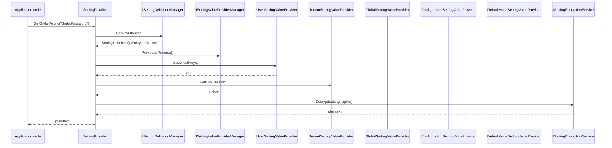

The **ABP Framework** settings module is the configuration plane for named scalar values that vary per user, per tenant, or per host. Unlike `IConfiguration` (which is immutable per process), settings can be edited at runtime and read through a chain of `ISettingValueProvider`s. The runtime lives in `framework/src/Volo.Abp.Settings/`.

## Responsibility

The module is responsible for:

- Defining settings via `ISettingDefinitionProvider` implementations auto-discovered into `AbpSettingOptions.DefinitionProviders`.
- Resolving the effective value of a setting via the ordered chain Default → Configuration → Global → User.
- Encrypting/decrypting setting values that carry `IsEncrypted = true` through `ISettingEncryptionService`.
- Storing values through a pluggable `ISettingStore` (default `NullSettingStore`).

## File inventory

| File                                                     | Purpose                                                                       |
| -------------------------------------------------------- | ----------------------------------------------------------------------------- |
| `AbpSettingsModule.cs`                                   | Registers default value providers and auto-detects definition providers.      |
| `AbpSettingOptions.cs`                                   | Holds `DefinitionProviders`, `ValueProviders`, `DeletedSettings`.             |
| `ISettingProvider.cs` + `SettingProvider.cs`             | `GetOrNullAsync`, `GetAllAsync`.                                              |
| `ISettingDefinitionContext.cs` + `SettingDefinitionContext.cs` | Used by `Define(...)` in providers.                                    |
| `ISettingDefinitionProvider.cs` + `SettingDefinitionProvider.cs` | Base type developers extend.                                          |
| `ISettingDefinitionManager.cs` + `SettingDefinitionManager.cs` | Cached façade over static + dynamic stores.                             |
| `IStaticSettingDefinitionStore.cs` + `StaticSettingDefinitionStore.cs` | Builds the dictionary from registered providers.                |
| `IDynamicSettingDefinitionStore.cs` + `NullDynamicSettingDefinitionStore.cs` | Hook for runtime-defined settings.                          |
| `SettingDefinition.cs`                                   | The definition record (`Name`, `DefaultValue`, `IsEncrypted`, …).             |
| `ISettingValueProvider.cs` + `SettingValueProvider.cs`   | Per-source resolution contract.                                               |
| `ISettingValueProviderManager.cs` + `SettingValueProviderManager.cs` | Lazily resolves providers from DI.                                |
| `DefaultValueSettingValueProvider.cs`                    | Returns `setting.DefaultValue`. Name `"D"`.                                    |
| `ConfigurationSettingValueProvider.cs`                   | Reads `Settings:<Name>` from `IConfiguration`. Name `"C"`.                     |
| `GlobalSettingValueProvider.cs`                          | Reads via `ISettingStore.GetOrNullAsync(name, "G", null)`. Name `"G"`.         |
| `UserSettingValueProvider.cs`                            | Reads via `ISettingStore.GetOrNullAsync(name, "U", currentUserId)`. Name `"U"`.|
| `ISettingStore.cs` + `NullSettingStore.cs`               | Persistence contract; default returns nothing.                                 |
| `ISettingEncryptionService.cs` + `SettingEncryptionService.cs` | Wraps `IStringEncryptionService` with `IsEncrypted` check.              |
| `SettingValue.cs`                                        | Carrier `(Name, Value)` for batch reads.                                       |
| `StaticSettingDefinitionChangedEvent.cs`                 | Distributed event raised when static definitions change.                       |

`TenantSettingValueProvider` (name `"T"`) lives in `framework/src/Volo.Abp.MultiTenancy/Volo/Abp/MultiTenancy/TenantSettingValueProvider.cs` and is added by `AbpMultiTenancyModule`.

## Key abstractions

### `ISettingProvider`

`framework/src/Volo.Abp.Settings/Volo/Abp/Settings/ISettingProvider.cs`

```csharp
public interface ISettingProvider
{
    Task<string?> GetOrNullAsync(string name);
    Task<List<SettingValue>> GetAllAsync(string[] names);
    Task<List<SettingValue>> GetAllAsync();
}
```

`SettingProvider.GetOrNullAsync` looks up the `SettingDefinition`, reverses the registered providers (so the most specific scope is queried first), filters by `setting.Providers` allow-list, and returns the first non-null value. If `setting.IsEncrypted`, the value is decrypted with `ISettingEncryptionService.Decrypt(setting, value)`. Callers: any code reading a setting (`await _settingProvider.GetOrNullAsync("Email.Smtp.Host")`), `MultiLingualObjectManager` for the default language, `SettingProviderExtensions.GetAsync<T>`.

### `SettingDefinition`

`framework/src/Volo.Abp.Settings/Volo/Abp/Settings/SettingDefinition.cs`

```csharp
public SettingDefinition(
    string name,
    string? defaultValue = null,
    ILocalizableString? displayName = null,
    ILocalizableString? description = null,
    bool isVisibleToClients = false,
    bool isInherited = true,
    bool isEncrypted = false);

public string? DefaultValue { get; set; }
public bool   IsVisibleToClients { get; set; }
public bool   IsInherited       { get; set; }
public bool   IsEncrypted       { get; set; }
public List<string> Providers   { get; }   // allow-list of provider names
public Dictionary<string, object> Properties { get; }
public SettingDefinition WithProperty(string key, object value);
public SettingDefinition WithProviders(params string[] providers);
```

`IsInherited` is a hint for UI; the framework comment notes "TODO: How to implement setting.IsInherited?" in `SettingProvider` — providers themselves implement inheritance semantics.

### `ISettingDefinitionContext` and `SettingDefinitionContext`

```csharp
public class SettingDefinitionContext : ISettingDefinitionContext
{
    public virtual SettingDefinition? GetOrNull(string name);
    public virtual IReadOnlyList<SettingDefinition> GetAll();
    public virtual void Add(params SettingDefinition[] definitions);
}
```

Providers add definitions in their `Define` override:

```csharp
public override void Define(ISettingDefinitionContext context)
{
    context.Add(
        new SettingDefinition("Email.Smtp.Host"),
        new SettingDefinition("Email.Smtp.Password", isEncrypted: true)
    );
}
```

### `ISettingDefinitionManager` and `SettingDefinitionManager`

The manager merges `IStaticSettingDefinitionStore` (built from all providers) with `IDynamicSettingDefinitionStore` and applies `AbpSettingOptions.DeletedSettings`. `GetAllAsync()` and `GetOrNullAsync(name)` are async because dynamic stores may hit a database.

### `ISettingValueProvider` chain

`framework/src/Volo.Abp.Settings/Volo/Abp/Settings/ISettingValueProvider.cs`

```csharp
public interface ISettingValueProvider
{
    string Name { get; }
    Task<string?> GetOrNullAsync(SettingDefinition setting);
    Task<List<SettingValue>> GetAllAsync(SettingDefinition[] settings);
}
```

`AbpSettingsModule.ConfigureServices` registers the default chain:

1. `DefaultValueSettingValueProvider` — `"D"` — returns `setting.DefaultValue`.
2. `ConfigurationSettingValueProvider` — `"C"` — reads `Settings:<Name>` from `IConfiguration`.
3. `GlobalSettingValueProvider` — `"G"` — `ISettingStore.GetOrNullAsync(name, "G", null)`.
4. `UserSettingValueProvider` — `"U"` — `ISettingStore.GetOrNullAsync(name, "U", currentUserId.ToString())` (returns null when anonymous).

`AbpMultiTenancyModule` inserts `TenantSettingValueProvider` (name `"T"`) between Global and User.

`SettingProvider.GetOrNullAsync` calls `Enumerable.Reverse(SettingValueProviderManager.Providers)` so resolution order becomes *User → Tenant → Global → Configuration → Default*.

### `ISettingEncryptionService` and `SettingEncryptionService`

```csharp
public interface ISettingEncryptionService
{
    string? Encrypt(SettingDefinition setting, string? plainValue);
    string? Decrypt(SettingDefinition setting, string? encryptedValue);
}
```

`SettingEncryptionService` delegates to `IStringEncryptionService` (from `Volo.Abp.Security`) when `setting.IsEncrypted` is true. The encryption key/salt come from `AbpStringEncryptionOptions`.

### `AbpSettingOptions`

```csharp
public class AbpSettingOptions
{
    public ITypeList<ISettingDefinitionProvider> DefinitionProviders { get; }
    public ITypeList<ISettingValueProvider>      ValueProviders      { get; }
    public HashSet<string> DeletedSettings { get; }
}
```

`DeletedSettings` lets a host drop a setting added by an upstream module.

## Control & data flow



Resolution is short-circuited on the first non-null hit. For `GetAllAsync(string[] names)`, the implementation iterates providers in reverse and only requests values for definitions that have not yet resolved, so each provider sees a shrinking set.

## Connections

- **Security** — `SettingEncryptionService` delegates to `IStringEncryptionService` and reads `AbpStringEncryptionOptions`; `UserSettingValueProvider` reads `ICurrentUser`.
- **MultiTenancy** — `TenantSettingValueProvider` (in `Volo.Abp.MultiTenancy`) joins the chain; `AbpSettingsModule` does *not* require multi-tenancy, but multi-tenant hosts pull it in transitively.
- **Localization** — `MultiLingualObjectManager` calls `_settingProvider.GetOrNullAsync(LocalizationSettingNames.DefaultLanguage)` to find the fallback language.
- **Data** — Persistent setting stores live in the data modules (`Volo.Abp.SettingManagement.*`), which implement `ISettingStore` against a database.
- **Configuration** — Settings can be overridden from `appsettings.json` under a `Settings:` section via `ConfigurationSettingValueProvider`.

## Gotchas & invariants

- `SettingProvider.GetOrNullAsync` returns `null` for unknown setting names — there is no exception. Detect typos with `ISettingDefinitionManager.GetOrNullAsync`.
- The provider list is walked in **reverse** of `AbpSettingOptions.ValueProviders`. Adding a custom provider to the *end* of the list makes it the *most-specific* scope (queried first).
- `DefaultValueSettingValueProvider` is the safety net: when every other provider returns null, the default value is used. Removing it from the list means missing values surface as `null`.
- `UserSettingValueProvider.GetOrNullAsync` returns `null` when `CurrentUser.Id == null` even if the setting has a user-scoped value in the store for some other user — the provider does not accept an explicit user id.
- `setting.IsEncrypted = true` does *not* protect the configuration provider — values supplied through `Settings:<Name>` in `appsettings.json` are read as plaintext. Encryption only applies to values read from `ISettingStore`.
- `setting.Providers` allow-list works as a filter: only providers whose `Name` matches are consulted. An empty list means "all".
- `NullSettingStore` is the default implementation; without registering a real `ISettingStore` (e.g., the SettingManagement EF Core integration), all global/tenant/user reads return null.
- `ISettingDefinitionManager` caches definitions after first call; raising `StaticSettingDefinitionChangedEvent` is the mechanism to invalidate that cache across nodes.
- `AbpSettingOptions.DeletedSettings` runs after all `Define` calls — adding a name there removes the definition entirely.
- `SettingDefinition.IsInherited` is a UI-level hint; the framework comment in `SettingProvider` flags it as TODO. Providers themselves choose whether to bubble up to a parent scope.
