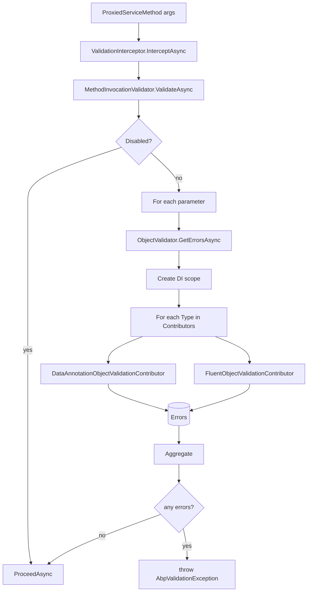
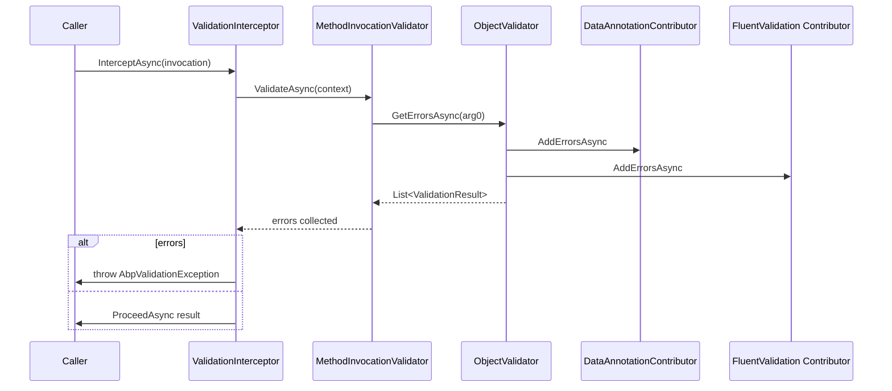

The **ABP Framework** validation module wraps every public application-service method with a pre-call validator that checks each non-null parameter against `System.ComponentModel.DataAnnotations` attributes and any custom `IObjectValidationContributor`. Failures are aggregated and thrown as `AbpValidationException` so the ASP.NET integration can map them to HTTP 400. Code lives in `framework/src/Volo.Abp.Validation/` and `framework/src/Volo.Abp.Validation.Abstractions/`.

## Responsibility

This module is responsible for:

- Exposing `IObjectValidator` to validate any object (typically a DTO) against the registered contributors.
- Running `IMethodInvocationValidator` against every parameter of a public method invocation through `ValidationInterceptor`.
- Aggregating validation errors as `List<ValidationResult>` and surfacing them via `AbpValidationException`.
- Auto-discovering custom `IObjectValidationContributor` types and adding them to `AbpValidationOptions.ObjectValidationContributors`.
- Offering opt-out (`[DisableValidation]`) and opt-in (`[EnableValidation]`) attributes.

## File inventory

| File                                                              | Purpose                                                                       |
| ----------------------------------------------------------------- | ----------------------------------------------------------------------------- |
| `AbpValidationModule.cs`                                          | Wires interceptor registrar, localization, auto-detects contributors.         |
| `AbpValidationOptions.cs`                                         | `ObjectValidationContributors`, `IgnoredTypes`.                               |
| `IObjectValidator.cs` + `ObjectValidator.cs`                      | `ValidateAsync`, `GetErrorsAsync`.                                            |
| `IObjectValidationContributor.cs` + `ObjectValidationContext.cs`  | Contributor contract and shared context.                                      |
| `DataAnnotationObjectValidationContributor.cs`                    | The default contributor; walks `TypeDescriptor.GetProperties` recursively.    |
| `IMethodInvocationValidator.cs` + `MethodInvocationValidator.cs`  | Walks parameters and asks the object validator.                               |
| `MethodInvocationValidationContext.cs`                            | Carries `Method`, `Parameters`, `ParameterValues`, `Errors`, `TargetObject`.   |
| `ValidationInterceptor.cs` + `ValidationInterceptorRegistrar.cs`  | Dynamic-proxy plumbing.                                                       |
| `AbpValidationResult.cs` + `IAbpValidationResult.cs`              | The error accumulator passed through the pipeline.                            |
| `IAttributeValidationResultProvider.cs` + `DefaultAttributeValidationResultProvider.cs` | Runs a single `ValidationAttribute` and returns `ValidationResult?`. |
| `DisableValidationAttribute.cs`, `EnableValidationAttribute.cs`   | Opt-in / opt-out markers.                                                     |
| `HasValidationErrorsExtensions.cs`                                | Helpers for `IHasValidationErrors`.                                           |
| `Localization/AbpValidationResource.cs`                           | Resource for localisable error messages.                                       |
| `StringValues/*`                                                  | `IStringValueType` family used by Features and Settings to validate strings.  |
| `Volo.Abp.Validation.Abstractions/AbpValidationException.cs`      | The exception type thrown on errors.                                          |
| `Volo.Abp.Validation.Abstractions/IHasValidationErrors.cs`        | Implemented by exceptions that carry `IList<ValidationResult>`.                |
| `Volo.Abp.Validation.Abstractions/ValidationHelper.cs`            | Static helpers (regex, range, etc).                                            |
| `Volo.Abp.Validation.Abstractions/IValidationEnabled.cs`          | Marker interface for opt-in validation.                                        |

## Key abstractions

### `IObjectValidator`

`framework/src/Volo.Abp.Validation/Volo/Abp/Validation/IObjectValidator.cs`

```csharp
public interface IObjectValidator
{
    Task ValidateAsync(object? validatingObject, string? name = null, bool allowNull = false);
    Task<List<ValidationResult>> GetErrorsAsync(object? validatingObject, string? name = null, bool allowNull = false);
}
```

`ObjectValidator` is `[TransientDependency]`. `ValidateAsync` calls `GetErrorsAsync`; if any errors are returned, it throws `AbpValidationException("Object state is not valid! See ValidationErrors for details.", errors)`. `GetErrorsAsync` creates an `ObjectValidationContext` and iterates every `Type` from `AbpValidationOptions.ObjectValidationContributors`, resolving each from a freshly-created DI scope and calling `IObjectValidationContributor.AddErrorsAsync(context)`. Callers: `MethodInvocationValidator.AddMethodParameterValidationErrorsAsync`, application code calling `await _objectValidator.ValidateAsync(myDto)`.

### `IObjectValidationContributor`

```csharp
public interface IObjectValidationContributor
{
    Task AddErrorsAsync(ObjectValidationContext context);
}
```

`ObjectValidationContext` exposes `ValidatingObject` and a `List<ValidationResult> Errors` that contributors append to. The framework discovers all implementations through `AbpValidationModule.AutoAddObjectValidationContributors` and stores their `Type` (not instance) in `AbpValidationOptions.ObjectValidationContributors`.

### `DataAnnotationObjectValidationContributor`

`framework/src/Volo.Abp.Validation/Volo/Abp/Validation/DataAnnotationObjectValidationContributor.cs`

```csharp
public const int MaxRecursiveParameterValidationDepth = 8;
```

`ValidateObjectRecursively` walks property descriptors via `TypeDescriptor.GetProperties(validatingObject)` and recurses into non-primitive non-enumerable members up to depth 8. For each property it materialises every `ValidationAttribute` and delegates to `IAttributeValidationResultProvider.GetOrDefault(attribute, value, validationContext)`. It also calls `IValidatableObject.Validate` for objects implementing the interface and respects `AbpValidationOptions.IgnoredTypes` and `[DisableValidation]` on individual properties.

The recursion handles `IEnumerable` by iterating items (except `IQueryable`) and breaks out for primitive item types via `TypeHelper.IsPrimitiveExtended`.

### `IMethodInvocationValidator` and `MethodInvocationValidator`

`framework/src/Volo.Abp.Validation/Volo/Abp/Validation/MethodInvocationValidator.cs`

```csharp
public virtual async Task ValidateAsync(MethodInvocationValidationContext context)
{
    if (context.Parameters.IsNullOrEmpty()) return;
    if (!context.Method.IsPublic)            return;
    if (IsValidationDisabled(context))       return;
    if (context.Parameters.Length != context.ParameterValues.Length)
        throw new Exception("Method parameter count does not match with argument count!");

    if (context.Errors.Any() && HasSingleNullArgument(context)) ThrowValidationError(context);
    await AddMethodParameterValidationErrorsAsync(context);
    if (context.Errors.Any()) ThrowValidationError(context);
}
```

`IsValidationDisabled` honours `[EnableValidation]` (overrides any disable), `[DisableValidation]` on the method *or its declaring type*, evaluated via `ReflectionHelper.GetSingleAttributeOfMemberOrDeclaringTypeOrDefault`. `AddMethodParameterValidationErrorsAsync` loops parameters: for each it picks `allowNulls = parameterInfo.IsOptional || IsOut || IsNullable || IsPrimitiveExtended(parameterType)` and delegates to `_objectValidator.GetErrorsAsync(parameterValue, parameterInfo.Name, allowNulls)`. Errors are accumulated and thrown as `AbpValidationException("Method arguments are not valid! See ValidationErrors for details.", errors)`.

### `ValidationInterceptor`

```csharp
public override async Task InterceptAsync(IAbpMethodInvocation invocation)
{
    await ValidateAsync(invocation);
    await invocation.ProceedAsync();
}

protected virtual async Task ValidateAsync(IAbpMethodInvocation invocation)
{
    await _methodInvocationValidator.ValidateAsync(
        new MethodInvocationValidationContext(invocation.TargetObject, invocation.Method, invocation.Arguments));
}
```

`ValidationInterceptorRegistrar.ShouldIntercept` (mirroring the other registrars) returns true for types implementing `IValidationEnabled` or carrying `[Validation]`/`[Audit]`-style attributes — see the registrar file for the exact predicate.

### `AbpValidationException`

`framework/src/Volo.Abp.Validation.Abstractions/Volo/Abp/Validation/AbpValidationException.cs`

```csharp
public class AbpValidationException : AbpException, IHasLogLevel, IHasValidationErrors
{
    public IList<ValidationResult> ValidationErrors { get; }
    public LogLevel LogLevel { get; set; } = LogLevel.Warning;
}
```

The ASP.NET Core integration maps `AbpValidationException` to HTTP 400 with a structured payload that lists `ValidationErrors`.

### `IAttributeValidationResultProvider`

```csharp
public interface IAttributeValidationResultProvider
{
    ValidationResult? GetOrDefault(ValidationAttribute attribute, object? value, ValidationContext context);
}
```

`DefaultAttributeValidationResultProvider` simply calls `attribute.GetValidationResult(value, context)` — a tiny indirection that lets hosts override how `[Required]`, `[StringLength]`, etc. are evaluated (e.g., to apply localisation or custom logic).

### `AbpValidationOptions`

```csharp
public class AbpValidationOptions
{
    public List<Type> IgnoredTypes { get; }                       // skipped by recursive walker
    public ITypeList<IObjectValidationContributor> ObjectValidationContributors { get; }
}
```

The framework adds `DataAnnotationObjectValidationContributor` by default; `AbpFluentValidationModule` adds `FluentObjectValidationContributor`. Hosts can `Configure<AbpValidationOptions>(o => o.IgnoredTypes.Add(typeof(MySpecialType)))`.

## Control & data flow





## Connections

- **FluentValidation** — `Volo.Abp.FluentValidation.AbpFluentValidationModule` adds `FluentObjectValidationContributor`. See the FluentValidation page.
- **ObjectExtending** — `ExtensibleObjectValidator.GetValidationErrors` is invoked by `ExtensibleObject.Validate` (implemented as `IValidatableObject`), letting extra properties carry their own `ValidationAttribute` set.
- **Authorization** — Validation runs after authorization in the interceptor pipeline; an unauthorized caller never reaches the validator.
- **Features** — `FeatureDefinition.ValueType` is `IStringValueType` (e.g., `ToggleStringValueType`) implementations that live under `Volo.Abp.Validation/StringValues/`.
- **AspNetCore** — `AbpValidationException` is converted to RFC-7807 problem details by the framework's exception filter.

## Gotchas & invariants

- The interceptor only runs on **public** methods (`MethodInvocationValidator` short-circuits on non-public). Protected helper methods are never validated automatically.
- `MaxRecursiveParameterValidationDepth = 8` is a constant in `DataAnnotationObjectValidationContributor`; deeply-nested DTOs beyond eight levels skip validation. Override the contributor type to change this.
- Validating a property descriptor with `[DisableValidation]` is skipped entirely — the attribute also stops *recursion* into the property's children.
- `EnableValidationAttribute` on a method beats `DisableValidationAttribute` on the declaring type. The order in `IsValidationDisabled` is: enable → method-disable → type-disable.
- `ObjectValidator.GetErrorsAsync` uses `IServiceScopeFactory.CreateScope()` for each call — contributors that depend on scoped services are safe, but performance-sensitive code should batch.
- `AbpValidationOptions.IgnoredTypes` matches with `t.IsInstanceOfType(validatingObject)`, so polymorphism is honored. Use it to skip large EF entity graphs accidentally passed to a DTO field.
- `AbpValidationException` is mapped to HTTP 400 by the ASP.NET integration; its `LogLevel = Warning` results in client-visible logs at warning level by default.
- `IValidatableObject.Validate` is called *after* attribute-based property errors are collected, so its `ValidationContext` can already inspect the DTO state.
- Async validators are not supported on `ValidationAttribute` (the contract is synchronous). Use a fluent validator for asynchronous checks.
- The interceptor uses `invocation.Arguments` — these are the *boxed* runtime arguments. Validating `Stream`, `CancellationToken`, or `Expression<>` parameters is suppressed by default through `AbpAuditingOptions.IgnoredTypes`-style filtering of `IgnoredTypes`.
