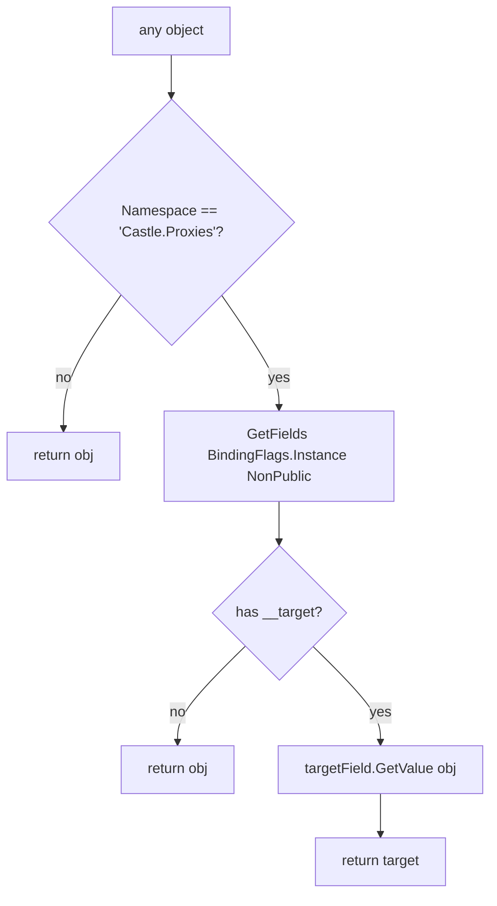

ABP routes auditing, unit-of-work, authorization, validation, and feature checking through a single `IAbpInterceptor` abstraction whose Castle DynamicProxy bridge sits in `Volo.Abp.Castle.Core`. This page covers `framework/src/Volo.Abp.Core/Volo/Abp/Aspects/`, `framework/src/Volo.Abp.Core/Volo/Abp/DynamicProxy/`, and the adapters in `framework/src/Volo.Abp.Castle.Core/Volo/Abp/Castle/DynamicProxy/`.

## Responsibility

- **Cross-cutting-concern accounting** — `AbpCrossCuttingConcerns` tracks which concerns are already applied to an object so they are not re-applied (e.g. avoid auditing an action twice when the call is re-entered).
- **A backend-agnostic interceptor abstraction** — `IAbpInterceptor`/`IAbpMethodInvocation` so the same interceptor implementations (`UnitOfWorkInterceptor`, `AuditingInterceptor`, …) work whether the runtime backend is Castle DynamicProxy, NSubstitute, or a future replacement.
- **Castle integration** — `AbpAsyncDeterminationInterceptor<TInterceptor>` registers as a transient open generic and wraps every ABP interceptor in Castle's `AsyncInterceptorBase`-derived adapter.
- **Proxy detection and unwrap** — `ProxyHelper` lets framework code peek through Castle proxies to compare types or to access the underlying instance.
- **Opt-out list** — `DynamicProxyIgnoreTypes` allows specific types (controllers, hub classes) to skip dynamic-proxy generation for performance.

## File inventory

### `framework/src/Volo.Abp.Core/Volo/Abp/Aspects/`

| File | Purpose |
| --- | --- |
| `AbpCrossCuttingConcerns.cs` | Static helper with the four well-known concern keys and `AddApplied`, `RemoveApplied`, `IsApplied`, `Applying`, `GetApplieds`. |
| `IAvoidDuplicateCrossCuttingConcerns.cs` | Interface implemented by application services to expose a mutable `AppliedCrossCuttingConcerns` list. |

### `framework/src/Volo.Abp.Core/Volo/Abp/DynamicProxy/`

| File | Purpose |
| --- | --- |
| `IAbpInterceptor.cs` | `Task InterceptAsync(IAbpMethodInvocation invocation)`. |
| `AbpInterceptor.cs` | Abstract base with the single abstract `InterceptAsync`. |
| `IAbpMethodInvocation.cs` | The method-call abstraction: `Arguments`, `ArgumentsDictionary`, `GenericArguments`, `TargetObject`, `Method`, `ReturnValue`, `ProceedAsync`. |
| `ProxyHelper.cs` | `IsProxy(object)`, `UnProxy(object)`, `GetUnProxiedType(object)`. Hard-codes the `"Castle.Proxies"` namespace. |
| `DynamicProxyIgnoreTypes.cs` | Thread-safe `HashSet<Type>` of types that should never be dynamic-proxied. |

### `framework/src/Volo.Abp.Castle.Core/Volo/Abp/Castle/DynamicProxy/`

| File | Purpose |
| --- | --- |
| `AbpAsyncDeterminationInterceptor.cs` | Generic Castle interceptor `AbpAsyncDeterminationInterceptor<TInterceptor>` that derives from Castle's `AsyncDeterminationInterceptor`. |
| `CastleAsyncAbpInterceptorAdapter.cs` | Bridges Castle's `AsyncInterceptorBase` to `IAbpInterceptor` for both `Task` and `Task<T>` overloads. |
| `CastleAbpMethodInvocationAdapterBase.cs` | Shared `IAbpMethodInvocation` plumbing over Castle's `IInvocation`. Lazily builds `ArgumentsDictionary` from `Method.GetParameters()`. |
| `CastleAbpMethodInvocationAdapter.cs` | `Task`-returning specialisation; `ProceedAsync` awaits Castle's `Proceed(IInvocation, IInvocationProceedInfo)`. |
| `CastleAbpMethodInvocationAdapterWithReturnValue.cs` | `Task<T>`-returning specialisation; sets `ReturnValue = (await Proceed(...))!`. |

The `Volo.Abp.Castle.Core` csproj declares `PackageReference` for `Castle.Core` and `Castle.Core.AsyncInterceptor` and a `ProjectReference` to `Volo.Abp.Core` — see `framework/src/Volo.Abp.Castle.Core/Volo.Abp.Castle.Core.csproj`.

### Castle module

`AbpCastleCoreModule.cs`:

```csharp
public class AbpCastleCoreModule : AbpModule
{
    public override void ConfigureServices(ServiceConfigurationContext context)
    {
        context.Services.AddTransient(typeof(AbpAsyncDeterminationInterceptor<>));
    }
}
```

That single registration is what lets Autofac (the default container — see `framework/src/Volo.Abp.Autofac/`) construct a wrapping interceptor for any `IAbpInterceptor` implementation discovered through `IOnServiceRegistredContext.Interceptors`.

## Key abstractions

| Class / interface | File | What it does | Who calls it |
| --- | --- | --- | --- |
| `IAbpInterceptor` | `IAbpInterceptor.cs` | Single `InterceptAsync(IAbpMethodInvocation)` method. Backend-agnostic. | `CastleAsyncAbpInterceptorAdapter`, future runtime adapters |
| `AbpInterceptor` | `AbpInterceptor.cs` | Abstract base — inherit from this. | `UnitOfWorkInterceptor`, `AuditingInterceptor`, etc. (in other modules) |
| `IAbpMethodInvocation` | `IAbpMethodInvocation.cs` | Carries everything an interceptor needs: `object?[] Arguments`, `IReadOnlyDictionary<string, object?> ArgumentsDictionary`, `Type[]? GenericArguments`, `object? TargetObject`, `MethodInfo Method`, `object ReturnValue`, `Task ProceedAsync()`. | All `IAbpInterceptor`s |
| `CastleAbpMethodInvocationAdapterBase` | `CastleAbpMethodInvocationAdapterBase.cs` | Implements `IAbpMethodInvocation` over Castle's `IInvocation`. `TargetObject` returns `Invocation.InvocationTarget ?? Invocation.MethodInvocationTarget`. `Method` returns `Invocation.MethodInvocationTarget ?? Invocation.Method`. | Castle bridge |
| `CastleAbpMethodInvocationAdapter` | `CastleAbpMethodInvocationAdapter.cs` | Specialisation for `Task` returns. | `CastleAsyncAbpInterceptorAdapter.InterceptAsync(Task)` |
| `CastleAbpMethodInvocationAdapterWithReturnValue<TResult>` | `…WithReturnValue.cs` | Specialisation for `Task<TResult>` returns. | `CastleAsyncAbpInterceptorAdapter.InterceptAsync<TResult>(...)` |
| `CastleAsyncAbpInterceptorAdapter<TInterceptor>` | `CastleAsyncAbpInterceptorAdapter.cs` | Derives `Castle.DynamicProxy.AsyncInterceptorBase`. Implements both `InterceptAsync(IInvocation, IInvocationProceedInfo, Func<…Task>)` and the generic `InterceptAsync<TResult>` overloads, each constructing the appropriate adapter and calling `_abpInterceptor.InterceptAsync(adapter)`. | `AbpAsyncDeterminationInterceptor<TInterceptor>` constructor |
| `AbpAsyncDeterminationInterceptor<TInterceptor>` | `AbpAsyncDeterminationInterceptor.cs` | Inherits `AsyncDeterminationInterceptor` (from `Castle.Core.AsyncInterceptor`) and forwards to a `CastleAsyncAbpInterceptorAdapter<TInterceptor>(abpInterceptor)`. | The `ServiceRegistrationActionList` pipeline in `Volo.Abp.Autofac` |
| `AbpCrossCuttingConcerns` | `Volo/Abp/Aspects/AbpCrossCuttingConcerns.cs` | Constants `Auditing`, `UnitOfWork`, `FeatureChecking`, `GlobalFeatureChecking`. Methods `AddApplied`, `RemoveApplied`, `IsApplied`, `Applying` (returns `IDisposable`), `GetApplieds`. | Application services, interceptors |
| `IAvoidDuplicateCrossCuttingConcerns` | `IAvoidDuplicateCrossCuttingConcerns.cs` | `List<string> AppliedCrossCuttingConcerns { get; }`. Implemented by application service base classes so `AbpCrossCuttingConcerns.IsApplied` can answer. | Application services |
| `ProxyHelper` | `ProxyHelper.cs` | Detects Castle proxies by namespace `"Castle.Proxies"`. `UnProxy` reads the private `__target` field via reflection; returns the original instance or the input. `GetUnProxiedType` returns `BaseType` if `__target` is missing. | Anywhere code needs to compare a service's "real" type |
| `DynamicProxyIgnoreTypes` | `DynamicProxyIgnoreTypes.cs` | Static `Add<T>`, `Add(Type[])`, `Contains(Type, includeDerivedTypes)`. The class doc explains: *"Castle's dynamic proxy class feature will have performance issues for some components, such as the controller of Asp net core MVC."* | `Volo.Abp.AspNetCore` registers MVC controllers here |

## Cross-cutting-concern keys

| Constant | Value | Where used |
| --- | --- | --- |
| `AbpCrossCuttingConcerns.Auditing` | `"AbpAuditing"` | Auditing interceptor |
| `AbpCrossCuttingConcerns.UnitOfWork` | `"AbpUnitOfWork"` | Unit-of-work interceptor |
| `AbpCrossCuttingConcerns.FeatureChecking` | `"AbpFeatureChecking"` | Features module interceptor |
| `AbpCrossCuttingConcerns.GlobalFeatureChecking` | `"AbpGlobalFeatureChecking"` | Global features module interceptor |

`AbpCrossCuttingConcerns.Applying(obj, params string[] concerns)` returns an `IDisposable` (a `DisposeAction<>` with state) that calls `RemoveApplied` on dispose — the typical interceptor pattern is:

```csharp
using (AbpCrossCuttingConcerns.Applying(target, AbpCrossCuttingConcerns.UnitOfWork))
{
    await invocation.ProceedAsync();
}
```

The class is `public static` and contains a TODO comment hinting that the constants should move to their own assemblies — but the helper API is stable.

## Castle bridge flow

```mermaid
sequenceDiagram
    participant Caller as Caller
    participant Proxy as Castle proxy
    participant Det as AbpAsyncDeterminationInterceptor&lt;TInterceptor&gt;
    participant Adapter as CastleAsyncAbpInterceptorAdapter&lt;TInterceptor&gt;
    participant Inv as CastleAbpMethodInvocationAdapter
    participant Abp as TInterceptor (IAbpInterceptor)
    participant Target as Real method body

    Caller->>Proxy: SomeMethodAsync(args)
    Proxy->>Det: Intercept(invocation)
    Det->>Adapter: InterceptAsync(invocation, proceedInfo, proceed)
    Adapter->>Inv: new CastleAbpMethodInvocationAdapter(invocation, proceedInfo, proceed)
    Adapter->>Abp: InterceptAsync(invocation)
    Abp->>Inv: invocation.ProceedAsync()
    Inv->>Target: await Proceed(Invocation, ProceedInfo)
    Target-->>Inv: return value
    Inv-->>Abp: completes
    Abp-->>Adapter: completes
    Adapter-->>Proxy: completes
    Proxy-->>Caller: returns
```

For `Task<TResult>`-returning methods the flow is identical except the adapter is `CastleAbpMethodInvocationAdapterWithReturnValue<TResult>` and the final return value is read from `adapter.ReturnValue` and cast back to `TResult` (see `CastleAsyncAbpInterceptorAdapter.InterceptAsync<TResult>`).

## ProxyHelper detection



`GetUnProxiedType` adds one wrinkle: if `UnProxy` returns the same object (because `__target` was missing) it falls back to `obj.GetType().BaseType!`. That covers the case of Castle class proxies that have not yet captured the target reference.

## DynamicProxyIgnoreTypes

The opt-out list is thread-safe — every mutation locks the static `IgnoredTypes` hashset. `Contains(type, includeDerivedTypes = true)` defaults to checking `IsAssignableFrom` for each entry, so adding a base type once excludes every subclass. ASP.NET Core MVC controllers and SignalR hubs are typically added here to skip class-proxy generation entirely; the framework relies on MVC filters and SignalR hub pipelines instead.

The class doc-comment is illuminating:

> Castle's dynamic proxy class feature will have performance issues for some components, such as the controller of Asp net core MVC.  For related discussions, see: https://github.com/castleproject/Core/issues/486 https://github.com/abpframework/abp/issues/3180  The Abp framework may enable interceptors for certain components (UOW, Auditing, Authorization, etc.), which requires dynamic proxy classes, but will cause application performance to decline.  We need to use other methods for the controller to implement interception, such as middleware or MVC / Page filters.

## IAbpMethodInvocation in detail

| Member | Returns | Castle backing |
| --- | --- | --- |
| `Arguments` | `object?[]` | `Invocation.Arguments` |
| `ArgumentsDictionary` | `IReadOnlyDictionary<string, object?>` | Lazily built from `Method.GetParameters()` zipped with `Arguments`. Built once per invocation. |
| `GenericArguments` | `Type[]?` | `Invocation.GenericArguments` |
| `TargetObject` | `object?` | `Invocation.InvocationTarget ?? Invocation.MethodInvocationTarget` |
| `Method` | `MethodInfo` | `Invocation.MethodInvocationTarget ?? Invocation.Method` |
| `ReturnValue` | `object` (settable) | Backing field, set by `CastleAbpMethodInvocationAdapterWithReturnValue.ProceedAsync` |
| `ProceedAsync()` | `Task` | `await Proceed(Invocation, ProceedInfo)` |

<Note>
`Method` falls back to `Invocation.Method` only if `MethodInvocationTarget` is null — that happens when Castle is proxying an interface and the target is a concrete implementation. For class proxies the two are the same.
</Note>

## Connections

**Depends on:**

- `Volo/Abp/Collections/` — `ITypeList<IAbpInterceptor>` is used in `OnServiceRegistredContext.Interceptors` (see [Dependency Injection](/core/dependency-injection)).
- `Castle.Core` and `Castle.Core.AsyncInterceptor` (NuGet) — for the Castle bridge.
- `System.Reflection` — `ProxyHelper.UnProxy` uses non-public field access.

**Depended on by:**

- `Volo.Abp.Auditing`, `Volo.Abp.Uow`, `Volo.Abp.Authorization`, `Volo.Abp.Features`, `Volo.Abp.Validation` — all ship concrete `AbpInterceptor` subclasses.
- `Volo.Abp.Autofac` — registers `AbpAsyncDeterminationInterceptor<TInterceptor>` via `OnServiceRegistredContext.Interceptors` and applies it to selected classes.
- `Volo.Abp.AspNetCore` — populates `DynamicProxyIgnoreTypes` with controller/hub classes.

## Gotchas & invariants

<Warning>
`ProxyHelper.IsProxy` and `UnProxy` use **string comparison on the namespace** (`obj.GetType().Namespace == "Castle.Proxies"`). If your project ever switches to a different proxy generator, or if Castle changes its namespace, these helpers will silently return false. The comparison is intentional — Castle does not expose a public "am I a proxy" marker — but be aware when porting to a different backend.
</Warning>

- **`AbpCrossCuttingConcerns.IsApplied(object, concern)`** throws `ArgumentNullException` if either argument is null. The `obj` null-check is the first thing the method does.
- **`AddApplied` and `RemoveApplied` silently no-op** if the object does not implement `IAvoidDuplicateCrossCuttingConcerns`. That is by design — non-service objects don't need to track concerns.
- **`Applying` returns a `DisposeAction<>`** (from `Volo/Abp/DisposeAction.cs`) with a generic state tuple to avoid closure allocations. The pattern is `using (AbpCrossCuttingConcerns.Applying(obj, "AbpAuditing"))` — falling out of scope removes the concern.
- **`IAbpMethodInvocation.ReturnValue` is a plain `object`.** Setting it from a non-`Task` interceptor for an async method invocation has no effect — the Castle bridge specifically casts it back to `TResult` in `CastleAsyncAbpInterceptorAdapter.InterceptAsync<TResult>`. Set `ReturnValue` *before* `ProceedAsync()` and you will be overwritten.
- **`AbpAsyncDeterminationInterceptor<TInterceptor>` is registered as `Transient`.** Every proxied call constructs a new wrapping interceptor. The underlying `TInterceptor` resolution honours the user-defined lifetime — typically transient or scoped.
- **`DynamicProxyIgnoreTypes` is process-global.** Adding a type here affects every container in the AppDomain. Useful for libraries; surprising for unit tests that reset DI but not this static.
- **Proxy detection is namespace-only.** A class deliberately placed in `Castle.Proxies` will be mistaken for a proxy. Don't do that.

## Worked example: a no-op interceptor

```csharp
public class TimingInterceptor : AbpInterceptor, ITransientDependency
{
    private readonly ILogger<TimingInterceptor> _log;
    public TimingInterceptor(ILogger<TimingInterceptor> log) => _log = log;

    public override async Task InterceptAsync(IAbpMethodInvocation invocation)
    {
        var sw = Stopwatch.StartNew();
        try
        {
            await invocation.ProceedAsync();
        }
        finally
        {
            sw.Stop();
            _log.LogInformation("{Method} took {Ms}ms", invocation.Method.Name, sw.ElapsedMilliseconds);
        }
    }
}
```

Register it for a class by adding to `OnServiceRegistredContext.Interceptors` from a `services.OnRegistered(...)` callback (see [Dependency Injection](/core/dependency-injection)):

```csharp
context.Services.OnRegistered(ctx =>
{
    if (typeof(MyService).IsAssignableFrom(ctx.ImplementationType))
    {
        ctx.Interceptors.TryAdd<TimingInterceptor>();
    }
});
```

The Castle backend wraps each registered interceptor in an `AbpAsyncDeterminationInterceptor<TimingInterceptor>` automatically.

## Related pages

<CardGroup cols={2}>
  <Card title="Dependency Injection" icon="plug" href="/core/dependency-injection">
    `OnServiceRegistredContext.Interceptors` is the registration sink.
  </Card>
  <Card title="Exception Handling" icon="triangle-exclamation" href="/core/exception-handling">
    Interceptors typically use `IExceptionNotifier` to report failures.
  </Card>
  <Card title="Threading" icon="bolt" href="/core/threading">
    `AsyncHelper` and `IAmbientScopeProvider` underpin interceptor state propagation.
  </Card>
  <Card title="Reflection & Internal" icon="microscope" href="/core/reflection-and-internal">
    `ReflectionHelper` is used by interceptors to inspect methods/attributes.
  </Card>
</CardGroup>
