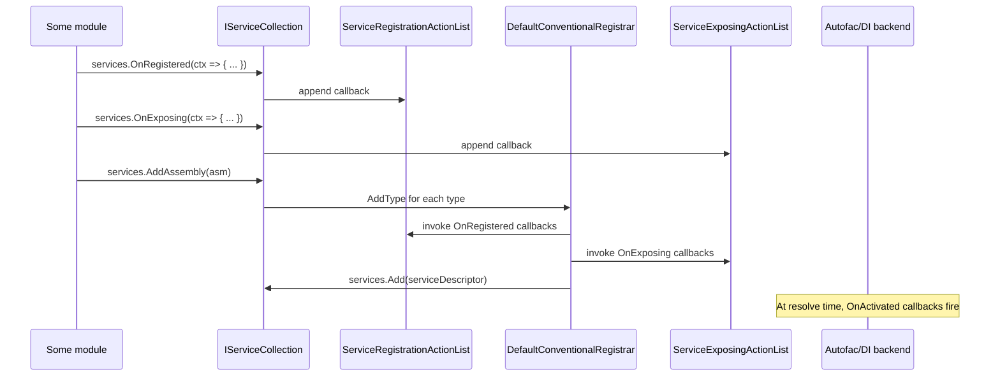
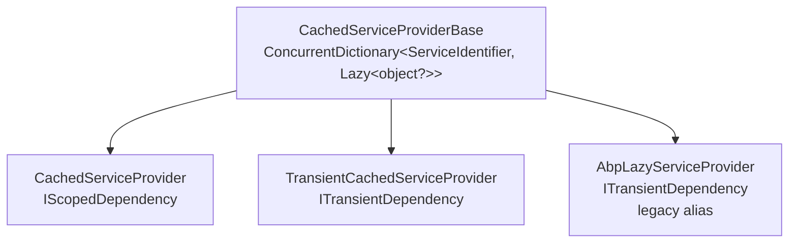
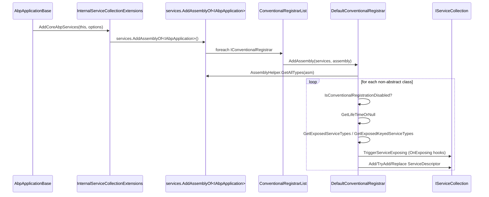

The ABP Framework extends `Microsoft.Extensions.DependencyInjection` with conventional registration, attribute-driven service exposure, registration/exposing/activating action lists, lazy and cached service providers, keyed-service support, and an `IObjectAccessor` pattern for sharing pre-container-built singletons. This page documents the contents of `framework/src/Volo.Abp.Core/Volo/Abp/DependencyInjection/` together with the `IServiceCollection` extensions in `framework/src/Volo.Abp.Core/Microsoft/Extensions/DependencyInjection/` that drive them.

## Responsibility

- **Convention-based registration** of classes implementing `ISingletonDependency` / `IScopedDependency` / `ITransientDependency`, executed for every assembly added via `services.AddAssembly(...)`.
- **Service type discovery** via `[ExposeServices]` (named) and `[ExposeKeyedService<T>(key)]` (keyed), plus convention-based interface scanning.
- **Lifetime overrides** via `[Dependency(...)]` with `Lifetime`, `TryRegister`, `ReplaceServices` properties.
- **Opt-out** via `[DisableConventionalRegistration]` and `[DisablePropertyInjection]`.
- **Registration pipeline hooks**: `OnRegistered`, `OnExposing`, `OnActivated` callbacks on `IServiceCollection`.
- **Helper service providers**: `AbpLazyServiceProvider`, `CachedServiceProvider`, `TransientCachedServiceProvider`, `RootServiceProvider`, `IObjectAccessor<T>`.
- **Interceptor selection** via `IClassInterceptorsSelectorList`.
- **Property injection** integration point via `IInjectPropertiesService` (no-op by default; Autofac provides the real implementation).

## File inventory

| File | Purpose |
| --- | --- |
| `ISingletonDependency.cs` | Marker interface. |
| `IScopedDependency.cs` | Marker interface. |
| `ITransientDependency.cs` | Marker interface. |
| `ExposeServicesAttribute.cs` | `[AttributeUsage(Class, AllowMultiple = true)]`. Lists explicit service types; flags `IncludeDefaults`, `IncludeSelf`. |
| `ExposeKeyedServiceAttribute.cs` | Generic `[ExposeKeyedService<TService>(key)]`; stores a `ServiceIdentifier`. |
| `DependencyAttribute.cs` | Optional lifetime override + `TryRegister` / `ReplaceServices`. |
| `DisableConventionalRegistrationAttribute.cs` | Marker — skip the class. |
| `DisablePropertyInjectionAttribute.cs` | Marker on a class or property. |
| `IConventionalRegistrar.cs` | The contract: `AddAssembly`, `AddTypes`, `AddType`. |
| `ConventionalRegistrarBase.cs` | Abstract base that loops over `AssemblyHelper.GetAllTypes`. |
| `DefaultConventionalRegistrar.cs` | The built-in implementation. |
| `ConventionalRegistrarList.cs` | Internal `List<IConventionalRegistrar>`. |
| `ExposedServiceExplorer.cs` | Static helper for `GetExposedServices` / `GetExposedKeyedServices`. |
| `IExposedServiceTypesProvider.cs` / `IExposedKeyedServiceTypesProvider.cs` | Contracts implemented by the attributes. |
| `ServiceIdentifier.cs` | `(serviceType, serviceKey)` value pair; matches the BCL shape. |
| `IObjectAccessor.cs` / `ObjectAccessor.cs` | Late-bound container for "the value will be set later". |
| `IAbpLazyServiceProvider.cs` / `AbpLazyServiceProvider.cs` | Legacy lazy/cached provider — superseded by `ITransientCachedServiceProvider`. |
| `ICachedServiceProvider.cs` / `CachedServiceProvider.cs` | Scoped cached provider. |
| `ITransientCachedServiceProvider.cs` / `TransientCachedServiceProvider.cs` | Transient cached provider. |
| `ICachedServiceProviderBase.cs` / `CachedServiceProviderBase.cs` | Shared `ConcurrentDictionary<ServiceIdentifier, Lazy<object?>>` storage. |
| `IRootServiceProviderAccessor.cs` / `RootServiceProvider.cs` | Wraps the root `IServiceProvider` behind `IRootServiceProvider`. |
| `IServiceProviderAccessor.cs` / `IClientScopeServiceProviderAccessor.cs` | Read-only accessors used by infrastructure. |
| `IInjectPropertiesService.cs` / `NullInjectPropertiesService.cs` | Property injection abstraction. |
| `IClassInterceptorsSelectorList.cs` / `ClassInterceptorsSelectorList.cs` | List of `NamedTypeSelector` for picking which classes get proxied. |
| `OnServiceRegistredContext.cs` / `IOnServiceRegistredContext.cs` | Carries `ServiceType`, `ImplementationType`, `ServiceKey`, `Interceptors` (`ITypeList<IAbpInterceptor>`). |
| `OnServiceExposingContext.cs` / `IOnServiceExposingContext.cs` | Lets `OnExposing` mutate the exposed type list. |
| `OnServiceActivatedContext.cs` / `IOnServiceActivatedContext.cs` | Lets `OnActivated` see the resolved instance + service provider. |
| `ServiceRegistrationActionList.cs` / `ServiceExposingActionList.cs` / `ServiceActivatedActionList.cs` | Singletons that store the lists of registered callbacks. |

Plus the cross-namespace extension files in `framework/src/Volo.Abp.Core/Microsoft/Extensions/DependencyInjection/`:

| Extension class | Adds |
| --- | --- |
| `ServiceCollectionRegistrationActionExtensions.cs` | `OnRegistered`, `OnExposing`, `OnActivated`. |
| `ServiceCollectionConventionalRegistrationExtensions.cs` | `AddAssembly`, `AddTypes`, `AddType`. |
| `ServiceCollectionPreConfigureExtensions.cs` | `PreConfigure<TOptions>`, `ExecutePreConfiguredActions<TOptions>`. |
| `ServiceCollectionObjectAccessorExtensions.cs` | `AddObjectAccessor`, `TryAddObjectAccessor`. |
| `ServiceCollectionLifetimeEventExtensions.cs` | The internal plumbing for the above. |
| `ServiceCollectionApplicationExtensions.cs` | `GetSingletonInstance<T>` etc. |
| `ServiceCollectionCommonExtensions.cs` | `IsAdded<T>`. |
| `ServiceDescriptorExtensions.cs` | Conversions between `ServiceDescriptor` and `ServiceIdentifier`. |

## Key abstractions

| Class / interface | File | What it does | Who calls it |
| --- | --- | --- | --- |
| `ISingletonDependency` | `ISingletonDependency.cs` | Marker → singleton lifetime. | `DefaultConventionalRegistrar.GetLifeTimeOrNull` |
| `IScopedDependency` | `IScopedDependency.cs` | Marker → scoped lifetime. | `DefaultConventionalRegistrar.GetLifeTimeOrNull` |
| `ITransientDependency` | `ITransientDependency.cs` | Marker → transient lifetime. | `DefaultConventionalRegistrar.GetLifeTimeOrNull` |
| `ExposeServicesAttribute` | `ExposeServicesAttribute.cs` | Lists `ServiceTypes`; `IncludeDefaults` adds conventional interfaces (strip leading `I`, match implementation name); `IncludeSelf` adds the implementation type itself. | `ExposedServiceExplorer.GetExposedServices` |
| `ExposeKeyedServiceAttribute<TService>` | `ExposeKeyedServiceAttribute.cs` | Generic attribute storing `new ServiceIdentifier(serviceKey, typeof(TService))`. Throws `AbpException` if `serviceKey == null` (use `[ExposeServices]` instead). | `ExposedServiceExplorer.GetExposedKeyedServices` |
| `DependencyAttribute` | `DependencyAttribute.cs` | Optional `ServiceLifetime?`, `TryRegister`, `ReplaceServices`. `DefaultConventionalRegistrar` uses these to call `services.TryAdd`, `services.Replace`, or plain `services.Add`. | `DefaultConventionalRegistrar.AddType` |
| `DisableConventionalRegistrationAttribute` | `DisableConventionalRegistrationAttribute.cs` | Marker. `ConventionalRegistrarBase.IsConventionalRegistrationDisabled` checks `IsDefined(typeof(...), inherit: true)`. | Convention registrars |
| `DisablePropertyInjectionAttribute` | `DisablePropertyInjectionAttribute.cs` | Marker on class or property. Honored by `AbpPropertySelector` in the Autofac integration (`framework/src/Volo.Abp.Autofac/Volo/Abp/Autofac/AbpPropertySelector.cs`). | Property injection backend |
| `IConventionalRegistrar` / `ConventionalRegistrarBase` | `IConventionalRegistrar.cs`, `ConventionalRegistrarBase.cs` | `AddAssembly` enumerates concrete non-generic classes via `AssemblyHelper.GetAllTypes` and forwards to `AddType`. | `services.AddAssembly(...)` via `ServiceCollectionConventionalRegistrationExtensions` |
| `DefaultConventionalRegistrar` | `DefaultConventionalRegistrar.cs` | Inspects each type: skip if `[DisableConventionalRegistration]`, read `DependencyAttribute`, infer lifetime from marker interfaces, gather exposed types (`GetExposedKeyedServiceTypes(type).Concat(GetExposedServiceTypes(type)...)`), trigger `TriggerServiceExposing`, then add a `ServiceDescriptor` per service. Honors `TryRegister`/`ReplaceServices`. | `ConventionalRegistrarList` |
| `ExposedServiceExplorer` | `ExposedServiceExplorer.cs` | `GetExposedServices(Type)` reads `IExposedServiceTypesProvider`s; falls back to a default `[ExposeServices(IncludeDefaults=true, IncludeSelf=true)]` if none. `GetExposedKeyedServices` reads `IExposedKeyedServiceTypesProvider`. | `DefaultConventionalRegistrar` |
| `IObjectAccessor<T>` / `ObjectAccessor<T>` | `IObjectAccessor.cs`, `ObjectAccessor.cs` | Holds `Value` for a service that does not exist yet at registration time (the canonical example is `IServiceProvider` itself — see `AbpApplicationBase` calling `services.TryAddObjectAccessor<IServiceProvider>()`). | `AbpApplicationBase`, `PreConfigureActionList` plumbing |
| `IAbpLazyServiceProvider` / `AbpLazyServiceProvider` | `IAbpLazyServiceProvider.cs`, `AbpLazyServiceProvider.cs` | Transient cached provider. Marked `[Obsolete("Use ITransientCachedServiceProvider instead")]` in spirit — the class doc-comment recommends `TransientCachedServiceProvider` for new code. | Property-injected on `ApplicationService` etc. (legacy) |
| `ICachedServiceProvider` / `CachedServiceProvider` | `CachedServiceProvider.cs` | Scoped (`IScopedDependency`) cached provider. | Domain/application services |
| `ITransientCachedServiceProvider` / `TransientCachedServiceProvider` | `TransientCachedServiceProvider.cs` | Transient (`ITransientDependency`) cached provider. | Newer code |
| `CachedServiceProviderBase` | `CachedServiceProviderBase.cs` | Holds a `ConcurrentDictionary<ServiceIdentifier, Lazy<object?>>`. Pre-seeds the cache with `IServiceProvider → this.ServiceProvider`. | Base for the three cached providers |
| `IRootServiceProvider` / `RootServiceProvider` | `IRootServiceProviderAccessor.cs`, `RootServiceProvider.cs` | Resolves from the *root* container via `IObjectAccessor<IServiceProvider>.Value`. Implements `IKeyedServiceProvider`. | Long-lived singletons that need to resolve services |
| `IInjectPropertiesService` / `NullInjectPropertiesService` | `IInjectPropertiesService.cs`, `NullInjectPropertiesService.cs` | `InjectProperties` and `InjectUnsetProperties` hooks. Null version is `[Dependency(TryRegister = true)]` and just returns the instance — Autofac replaces it. | Optional callers |
| `IClassInterceptorsSelectorList` / `ClassInterceptorsSelectorList` | `IClassInterceptorsSelectorList.cs`, `ClassInterceptorsSelectorList.cs` | `List<NamedTypeSelector>` used to decide *which* registered classes should be proxied. | `AbpAutofacModule` / interception pipeline |
| `ServiceIdentifier` | `ServiceIdentifier.cs` | `(serviceType, serviceKey)` value type with custom `Equals`/`GetHashCode`. Pinned to the shape of `Microsoft.Extensions.DependencyInjection.ServiceLookup.ServiceIdentifier`. | Cached providers, registrar |
| `OnServiceRegistredContext` | `OnServiceRegistredContext.cs` | Mutable bag exposing `Interceptors` (`ITypeList<IAbpInterceptor>`). | `OnRegistered` callbacks |
| `OnServiceExposingContext` | `OnServiceExposingContext.cs` | Mutable `ExposedTypes` list of `ServiceIdentifier`. | `OnExposing` callbacks |
| `OnServiceActivatedContext` | `OnServiceActivatedContext.cs` | Read-only `Instance` + scoped `IServiceProvider`. | `OnActivated` callbacks |
| `ServiceRegistrationActionList` / `ServiceExposingActionList` / `ServiceActivatedActionList` | `Service*ActionList.cs` | Singletons that hold the list of callbacks; consulted by Autofac registration. | Convention registrars + DI backend |

## Attribute inventory

| Attribute | Targets | Multiple | Behavior |
| --- | --- | --- | --- |
| `[ExposeServices]` | Class | yes | Adds explicit service types. `IncludeDefaults=true` adds interfaces whose name matches the implementation (strip leading `I`); `IncludeSelf=true` also exposes the implementation type. |
| `[ExposeKeyedService<TService>(key)]` | Class | yes | Adds a *keyed* service registration `(key, TService)`. `key == null` throws `AbpException` at construction. |
| `[Dependency]` | Class | no | `Lifetime?` overrides marker-based inference. `TryRegister=true` → `services.TryAdd`. `ReplaceServices=true` → `services.Replace`. |
| `[DisableConventionalRegistration]` | Class | no | Skip the class entirely. |
| `[DisablePropertyInjection]` | Class or Property | no | Tell the property-injection backend to skip. Used by `AbpPropertySelector` in `Volo.Abp.Autofac`. |

## Lifetime inference

`DefaultConventionalRegistrar.GetLifeTimeOrNull(type, dependencyAttribute)` (inherited from `ConventionalRegistrarBase`) returns the explicit `DependencyAttribute.Lifetime` if present, else inspects the marker interfaces:

```mermaid
flowchart TB
    type[Type] --> ck1{has [DisableConventionalRegistration]?}
    ck1 -->|yes| skip[skip]
    ck1 -->|no| dep[read DependencyAttribute]
    dep --> lt{Lifetime explicit?}
    lt -->|yes| use[use that lifetime]
    lt -->|no| markers{implements ISingletonDependency?}
    markers -->|yes| sing[Singleton]
    markers -->|no| sc{implements IScopedDependency?}
    sc -->|yes| scoped[Scoped]
    sc -->|no| tr{implements ITransientDependency?}
    tr -->|yes| trans[Transient]
    tr -->|no| none[no lifetime → not registered]
```

When no lifetime can be inferred, the type is silently skipped. That is why `[ExposeServices]` without one of the three marker interfaces and without `[Dependency(ServiceLifetime.X)]` registers nothing.

## Service exposure

`ExposedServiceExplorer.GetExposedServices` flow:

```mermaid
flowchart LR
    t[Type] --> a[GetCustomAttributes].of(IExposedServiceTypesProvider)
    a --> empty{any?}
    empty -->|no| keyedQ{any IExposedKeyedServiceTypesProvider?}
    keyedQ -->|yes| none[return empty list]
    keyedQ -->|no| def[Default attr<br/>IncludeDefaults=true, IncludeSelf=true]
    empty -->|yes| loop[for each → GetExposedServiceTypes type]
    def --> loop
    loop --> distinct[Distinct]
    distinct --> result[List Type]
```

`[ExposeServices(IncludeDefaults = true, IncludeSelf = true)]` is the implicit default when neither `IExposedServiceTypesProvider` nor `IExposedKeyedServiceTypesProvider` is present. If the class declares **only** a keyed exposure, the non-keyed exposed-services list is intentionally empty — without that special case the class would be registered both keyed and non-keyed.

`ExposeServicesAttribute.GetDefaultServices` walks the implementation's `Interfaces` and matches an interface to the implementation type when the implementation's name **ends with** the interface's name minus the leading `I` (case-sensitive). That is the conventional "`IFooService` → `FooService`" rule.

## OnRegistered / OnExposing / OnActivated hooks



These hooks are how `AbpSerializationModule.PreConfigureServices` (`framework/src/Volo.Abp.Serialization/Volo/Abp/Serialization/AbpSerializationModule.cs`) auto-exposes `IObjectSerializer<T>` for every class that implements it:

```csharp
context.Services.OnExposing(onServiceExposingContext =>
{
    onServiceExposingContext.ExposedTypes.AddRange(
        ReflectionHelper.GetImplementedGenericTypes(
            onServiceExposingContext.ImplementationType,
            typeof(IObjectSerializer<>)
        ).ConvertAll(t => new ServiceIdentifier(t))
    );
});
```

## Cached service providers



All three pre-seed the cache with `(IServiceProvider, null) → ServiceProvider` (look at the `CachedServiceProviderBase` constructor), so any nested lookup of `IServiceProvider` returns the same wrapper. They also support keyed lookup through `GetKeyedService(Type, object?)` / `GetRequiredKeyedService(Type, object?)` — required to participate fully with `IKeyedServiceProvider` (.NET 8+).

<Tip>
Use `ITransientCachedServiceProvider` for new code. `AbpLazyServiceProvider` is kept only for backwards compatibility — its doc-comment explicitly tells you to prefer the newer name.
</Tip>

## Root service provider

`RootServiceProvider` (`Volo/Abp/DependencyInjection/RootServiceProvider.cs`) is a `ISingletonDependency` that takes `IObjectAccessor<IServiceProvider>` and exposes `IRootServiceProvider`. Because the value of the accessor is filled in `AbpApplicationBase.SetServiceProvider` (`Volo/Abp/AbpApplicationBase.cs`) *after* the container is built, `RootServiceProvider` always sees the application's root container — not a particular request scope. Use it when a singleton (e.g. a hosted service) needs to resolve services from a fresh scope; never resolve scoped services directly from it.

## Control & data flow during startup



## Connections

**Depends on:**

- `Volo/Abp/Reflection/` — `AssemblyHelper.GetAllTypes`, `ReflectionHelper.GetImplementedGenericTypes`.
- `Volo/Abp/Collections/` — `ITypeList<T>` for interceptor lists.
- `Volo/Abp/Aspects/` and `Volo/Abp/DynamicProxy/` — `IAbpInterceptor` referenced by `OnServiceRegistredContext.Interceptors`.

**Depended on by:**

- `Volo/Abp/Modularity/` — `ModuleManager` is `ISingletonDependency`.
- Every framework module that uses `Configure<T>`/`PreConfigure<T>` or `[ExposeServices]`.
- `Volo.Abp.Autofac` — replaces the default DI backend with Autofac, plugs in `AutoFacInjectPropertiesService` (`framework/src/Volo.Abp.Autofac/Volo/Abp/Autofac/AutoFacInjectPropertiesService.cs`) and `AbpPropertySelector` (`AbpPropertySelector.cs`). It also wires the `OnRegistered`/`OnActivated` lists into Autofac registrations.

## Gotchas & invariants

<Warning>
A class with `[ExposeServices(IncludeDefaults = true)]` **without** one of the three lifetime markers and **without** `[Dependency(ServiceLifetime.X)]` will *not* be registered. `DefaultConventionalRegistrar.GetLifeTimeOrNull` returns `null` and the registrar quietly skips the type. There is no warning. Mistaking this for a "bug" wastes a lot of debugging time.
</Warning>

- **`[ExposeKeyedService<T>(key)]` excludes default exposure.** The behavior is implemented in `ExposedServiceExplorer.GetExposedServices` — if the class has any `IExposedKeyedServiceTypesProvider` *but no* `IExposedServiceTypesProvider`, the non-keyed exposed-types list is returned empty. Add a `[ExposeServices(typeof(...))]` alongside if you want both.
- **`IncludeDefaults` matches interface names suffix-style.** `ExposeServicesAttribute.GetDefaultServices` requires the implementation name to end with the interface name minus the leading `I`. `MyFooService : IFooService` matches; `BarService : IFooService` does not.
- **`CachedServiceProvider` is scoped — do not capture it in a singleton.** Its cache lives for the lifetime of the owning scope; capturing it from a singleton creates a stale dictionary bound to the first scope ever to resolve it.
- **`IObjectAccessor<T>` is a singleton wrapper, not a service.** Registering an `ObjectAccessor<MyThing>` with a null value and later setting `Value = something` is the only safe way to inject "something not yet built". This is exactly how `IServiceProvider` is exposed to early callers — see `AbpApplicationBase.cs` calling `services.TryAddObjectAccessor<IServiceProvider>()`.
- **`RootServiceProvider` cannot resolve scoped services.** It is backed by the root container; doing so would either throw or return a captured-scoped instance. Always call `serviceProvider.CreateScope()` first.
- **Property injection requires Autofac.** `NullInjectPropertiesService` is registered with `[Dependency(TryRegister = true)]`, which means the Autofac module can replace it without conflict. With the default MS DI backend, property injection is a no-op.
- **`AddAssembly` is idempotent per registrar but not per type.** `ConventionalRegistrarList` calls each registrar's `AddAssembly`; the registrars themselves do not deduplicate types across multiple `AddAssembly` calls. The DI container handles eventual duplicates via `services.Add` semantics — be aware that re-adding the same assembly *will* multiply transient registrations.
- **`SkipAutoServiceRegistration` is a module-level toggle.** Setting `SkipAutoServiceRegistration = true` in a module's constructor prevents the framework from calling `services.AddAssembly(...)` on the module's assembly. Use this for assemblies that intentionally have no DI-managed types (e.g. contract-only packages).
- **`DependencyAttribute.ReplaceServices = true` is destructive.** It calls `services.Replace(descriptor)`, removing every prior registration for the service type. If multiple modules try this with different implementations, last-loaded wins. Order depends on the module dependency sort — see [Modularity](/core/modularity).

## Worked example: writing a custom registrar

You almost never need a custom `IConventionalRegistrar` — `DefaultConventionalRegistrar` covers all standard cases — but the pattern looks like:

```csharp
public class MyRegistrar : ConventionalRegistrarBase
{
    public override void AddType(IServiceCollection services, Type type)
    {
        if (!typeof(IMyMarker).IsAssignableFrom(type)) return;
        services.AddTransient(type);
    }
}
```

Register the registrar by populating the `ConventionalRegistrarList` exposed via `services.GetSingletonInstance<ConventionalRegistrarList>()` from your module's `PreConfigureServices`. The `IServiceCollection.AddAssembly` extension iterates that list.

## Related pages

<CardGroup cols={2}>
  <Card title="Modularity" icon="layer-group" href="/core/modularity">
    `ServiceConfigurationContext` and `AbpModule` shortcuts.
  </Card>
  <Card title="Aspects & Dynamic Proxy" icon="diagram-project" href="/core/aspects-and-dynamic-proxy">
    How `OnServiceRegistredContext.Interceptors` ends up applied.
  </Card>
  <Card title="Options & Configuration" icon="gear" href="/core/options-and-configuration">
    `PreConfigureActionList` and `AbpOptionsFactory`.
  </Card>
  <Card title="Reflection & Internal" icon="microscope" href="/core/reflection-and-internal">
    `AssemblyHelper`, `TypeHelper`, `ReflectionHelper` used here.
  </Card>
</CardGroup>
