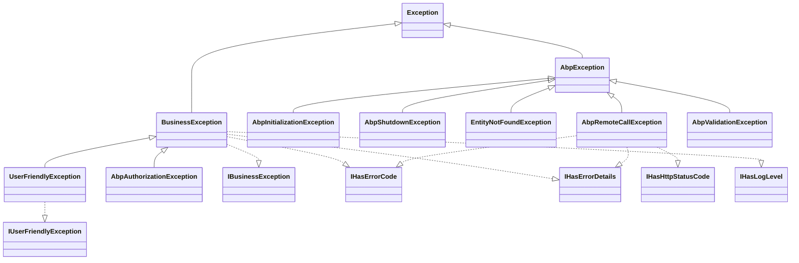
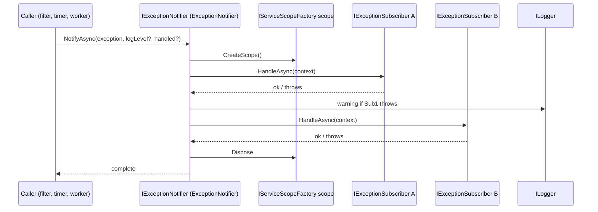
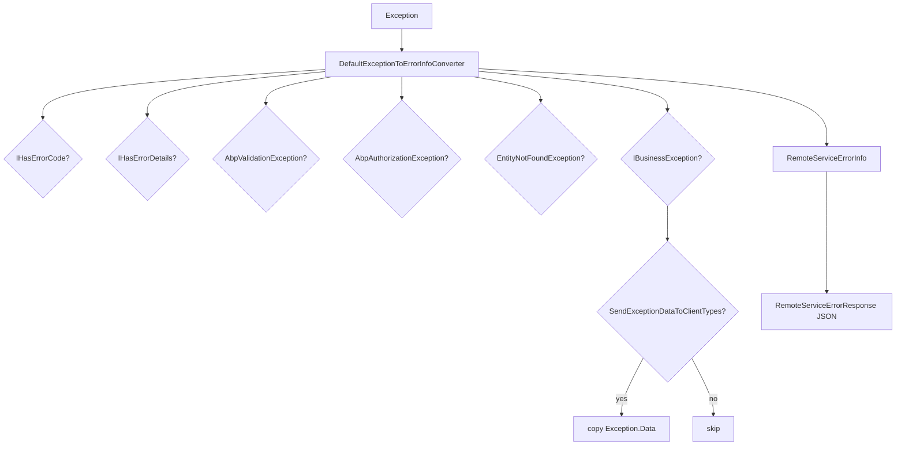

The ABP Framework provides a unified pipeline for raising, classifying, logging, and reporting exceptions. This page walks the contents of `framework/src/Volo.Abp.Core/Volo/Abp/ExceptionHandling/`, the root-level exception base types in `framework/src/Volo.Abp.Core/Volo/Abp/`, the logging extensions that read them, and the satellite `Volo.Abp.ExceptionHandling` package that adds remote-service error conversion.

## Responsibility

- **Provide a class hierarchy** of framework exceptions: `AbpException` for infrastructural failures, `BusinessException` / `IBusinessException` for domain errors, `UserFriendlyException` for user-presentable messages, plus initialization/shutdown variants.
- **Carry structured metadata** on exceptions via the `IHasErrorCode`, `IHasErrorDetails`, `IHasHttpStatusCode`, `IHasLogLevel`, `ILocalizeErrorMessage`, and `IExceptionWithSelfLogging` interfaces.
- **Notify subscribers asynchronously** through `IExceptionNotifier` → `IExceptionSubscriber` pipeline.
- **Translate exceptions** to remote-service responses via `IExceptionToErrorInfoConverter` / `RemoteServiceErrorInfo` (lives in `Volo.Abp.ExceptionHandling`).
- **Standardise log output** via the `AbpLoggerExtensions.LogException` extension.

## File inventory

### `framework/src/Volo.Abp.Core/Volo/Abp/` (root)

| File | What it defines |
| --- | --- |
| `AbpException.cs` | Base exception type. Three constructors: parameterless, `(string?)`, `(string?, Exception?)`. Comment: *"Base exception type for those are thrown by Abp system for Abp specific exceptions."* |
| `AbpInitializationException.cs` | Thrown by `ModuleManager.InitializeModulesAsync` when a contributor phase fails. |
| `AbpShutdownException.cs` | Thrown by `ModuleManager.ShutdownModulesAsync` when shutdown fails. |
| `BusinessException.cs` | `public class BusinessException : Exception, IBusinessException, IHasErrorCode, IHasErrorDetails, IHasLogLevel`. Constructor signature `(string? code, string? message, string? details, Exception? innerException, LogLevel logLevel = LogLevel.Warning)`. `WithData(name, value)` fluent helper. |
| `UserFriendlyException.cs` | `public class UserFriendlyException : BusinessException, IUserFriendlyException`. Mirrors `BusinessException` but requires a `message`. Used for messages that may safely be shown to end users. |
| `IBusinessException.cs` | Marker interface. Default `SendExceptionDataToClientTypes` in `AbpExceptionHandlingOptions` includes it. |
| `IUserFriendlyException.cs` | `: IBusinessException` marker. |

### `framework/src/Volo.Abp.Core/Volo/Abp/ExceptionHandling/`

| File | Purpose |
| --- | --- |
| `IExceptionNotifier.cs` | One method: `Task NotifyAsync(ExceptionNotificationContext context)`. |
| `IExceptionSubscriber.cs` | One method: `Task HandleAsync(ExceptionNotificationContext context)`. |
| `ExceptionNotifier.cs` | Default `IExceptionNotifier`, `ITransientDependency`. Creates a scope via `IServiceScopeFactory`, resolves all `IExceptionSubscriber`s, awaits each `HandleAsync` and **catches their exceptions** so one bad subscriber cannot break the chain. Logs subscriber errors at `Warning`. |
| `ExceptionSubscriber.cs` | Abstract base, `[ExposeServices(typeof(IExceptionSubscriber))]`, `ITransientDependency`. Inherit from it to write a subscriber. |
| `ExceptionNotificationContext.cs` | Read-only DTO: `Exception Exception`, `LogLevel LogLevel`, `bool Handled`. Constructor accepts `LogLevel?` and defaults to `exception.GetLogLevel()`. `Handled` defaults to `true`. |
| `ExceptionNotifierExtensions.cs` | Static `NotifyAsync(this IExceptionNotifier, Exception, LogLevel?, bool handled = true)` shortcut that creates the context for you. |
| `IHasErrorCode.cs` | `string? Code { get; }`. |
| `IHasErrorDetails.cs` | `string? Details { get; }`. |
| `IHasHttpStatusCode.cs` | `int HttpStatusCode { get; }`. |
| `ILocalizeErrorMessage.cs` | `string LocalizeMessage(LocalizationContext context)`. |
| `NullExceptionNotifier.cs` | `IExceptionNotifier` no-op. `Instance` singleton. Used by `AbpAsyncTimer` (`framework/src/Volo.Abp.Threading/Volo/Abp/Threading/AbpAsyncTimer.cs`) when no DI is available. |

### `framework/src/Volo.Abp.Core/Volo/Abp/Logging/`

| File | Purpose |
| --- | --- |
| `IHasLogLevel.cs` | `Microsoft.Extensions.Logging.LogLevel LogLevel { get; set; }`. |
| `HasLogLevelExtensions.cs` | `WithLogLevel<TException>(LogLevel)` fluent helper. |
| `IExceptionWithSelfLogging.cs` | `void Log(ILogger logger)` — implemented by exceptions that know how to render themselves. |
| `Microsoft/Extensions/Logging/AbpLoggerExtensions.cs` | `LogWithLevel`, `LogException`, plus the private helpers that read `IHasErrorCode`/`IHasErrorDetails`/`IExceptionWithSelfLogging` and dump `Exception.Data`. |

### `framework/src/Volo.Abp.ExceptionHandling/Volo/Abp/`

| File | Purpose |
| --- | --- |
| `ExceptionHandling/AbpExceptionHandlingModule.cs` | The module that wires localization resources and embedded files. `[DependsOn(typeof(AbpLocalizationModule), typeof(AbpDataModule))]`. |
| `ExceptionHandling/AbpExceptionHandlingConsts.cs` | Three string constants: `Unauthorized`, `InvalidToken`, `SessionExpired`. |
| `ExceptionHandling/Localization/AbpExceptionHandlingResource.cs` | Localization resource marker. |
| `AspNetCore/ExceptionHandling/IExceptionToErrorInfoConverter.cs` | Two `Convert` overloads — one obsolete with `bool includeSensitiveDetails`, the new one taking `Action<AbpExceptionHandlingOptions>`. |
| `AspNetCore/ExceptionHandling/DefaultExceptionToErrorInfoConverter.cs` | The default implementation. `ITransientDependency`. Inspects `IHasErrorCode`/`IHasErrorDetails`/`AbpValidationException`/`AbpAuthorizationException`/`EntityNotFoundException` and assembles a `RemoteServiceErrorInfo`. |
| `AspNetCore/ExceptionHandling/AbpExceptionHandlingOptions.cs` | `SendExceptionsDetailsToClients`, `SendStackTraceToClients`, `SendExceptionDataToClientTypes`, `ExcludeExceptionFromLoggerSelectors`, `ShouldLogException(Exception)`. |
| `Domain/Entities/EntityNotFoundException.cs` | `EntityNotFoundException` and `EntityNotFoundException<TEntityType>` — inherit `AbpException`, carry `EntityType` and `Id`. |
| `Http/Client/AbpRemoteCallException.cs` | `AbpException, IHasErrorCode, IHasErrorDetails, IHasHttpStatusCode`. Holds `RemoteServiceErrorInfo? Error`. Thrown by HTTP API clients when the remote returned a non-2xx with an ABP error body. |
| `Http/RemoteServiceErrorInfo.cs` | DTO for the error payload returned by ABP services: `Code`, `Message`, `Details`, `Data`, `ValidationErrors`. |
| `Http/RemoteServiceValidationErrorInfo.cs` | One validation failure (member name + message). |
| `Http/RemoteServiceErrorResponse.cs` | Wraps `RemoteServiceErrorInfo` in `{ error: { ... } }`. |

## Key abstractions

| Class / interface | File | What it does | Who calls it |
| --- | --- | --- | --- |
| `AbpException` | `Volo/Abp/AbpException.cs` | Base for framework exceptions. | `BusinessException`, `AbpRemoteCallException`, `EntityNotFoundException`, framework internals |
| `BusinessException` | `Volo/Abp/BusinessException.cs` | Domain rule violation. Implements `IBusinessException`, `IHasErrorCode`, `IHasErrorDetails`, `IHasLogLevel`. Default `LogLevel.Warning`. | Domain code |
| `UserFriendlyException` | `Volo/Abp/UserFriendlyException.cs` | Safe-to-display variant. Implements `IUserFriendlyException : IBusinessException`. | UI/API code |
| `EntityNotFoundException` / `<TEntityType>` | `Volo.Abp.ExceptionHandling/.../EntityNotFoundException.cs` | Carries `EntityType` and `Id`. | Repositories, app services |
| `AbpRemoteCallException` | `…/AbpRemoteCallException.cs` | Thrown by HTTP clients. `Error.Code/Details` forwarded from the remote `RemoteServiceErrorInfo`. | HTTP client proxies |
| `AbpAuthorizationException` | `framework/src/Volo.Abp.Security/Volo/Abp/Authorization/AbpAuthorizationException.cs` | Security failure. Default `LogLevel.Warning`. | Authorization module |
| `AbpValidationException` | `framework/src/Volo.Abp.Validation.Abstractions/Volo/Abp/Validation/AbpValidationException.cs` | Carries `IList<ValidationResult> ValidationErrors`. | Validation module |
| `IExceptionNotifier` / `ExceptionNotifier` | `…/ExceptionNotifier.cs` | Fan-out to subscribers in a fresh scope. Catches subscriber failures and logs them at `Warning`. | `AbpAsyncTimer`, MVC exception filters, background workers |
| `IExceptionSubscriber` / `ExceptionSubscriber` | `…/ExceptionSubscriber.cs` | Implement `HandleAsync(ExceptionNotificationContext)`. The base class is `[ExposeServices(typeof(IExceptionSubscriber))]`, `ITransientDependency`. | Custom modules that need to react to exceptions |
| `ExceptionNotificationContext` | `…/ExceptionNotificationContext.cs` | `Exception`, `LogLevel`, `Handled`. | Pipe everything |
| `IHasErrorCode` / `IHasErrorDetails` / `IHasHttpStatusCode` / `IHasLogLevel` / `ILocalizeErrorMessage` | `Volo/Abp/ExceptionHandling/I*.cs` and `Volo/Abp/Logging/IHasLogLevel.cs` | Capability interfaces inspected by `DefaultExceptionToErrorInfoConverter` and `AbpLoggerExtensions.LogException`. | Throw sites |
| `IExceptionWithSelfLogging` | `Volo/Abp/Logging/IExceptionWithSelfLogging.cs` | `void Log(ILogger)` — for exceptions that want to log extra detail. | `AbpLoggerExtensions.LogException` |
| `IExceptionToErrorInfoConverter` / `DefaultExceptionToErrorInfoConverter` | `…/IExceptionToErrorInfoConverter.cs`, `…/DefaultExceptionToErrorInfoConverter.cs` | Chain-of-responsibility translator from `Exception` → `RemoteServiceErrorInfo`. | ASP.NET Core middleware, error filters |
| `AbpExceptionHandlingOptions` | `…/AbpExceptionHandlingOptions.cs` | `SendExceptionsDetailsToClients`, `SendStackTraceToClients`, `SendExceptionDataToClientTypes` (default `[ typeof(IBusinessException) ]`), `ExcludeExceptionFromLoggerSelectors`, `ShouldLogException(Exception)`. | Converter, middleware |
| `RemoteServiceErrorInfo` / `RemoteServiceErrorResponse` / `RemoteServiceValidationErrorInfo` | `…/Http/Remote*.cs` | DTOs serialised to JSON for HTTP error bodies. | Converter, MVC filters, HTTP client deserialiser |
| `NullExceptionNotifier` | `…/NullExceptionNotifier.cs` | No-op singleton. | `AbpAsyncTimer` / `AbpTimer` (`framework/src/Volo.Abp.Threading/Volo/Abp/Threading/AbpAsyncTimer.cs`, `AbpTimer.cs`) default until DI replaces it. |
| `AbpLoggerExtensions.LogException` | `Microsoft/Extensions/Logging/AbpLoggerExtensions.cs` | Logs message + inner exception, then `Code`/`Details`, then `IExceptionWithSelfLogging.Log`, then `Exception.Data` as `key = value` lines (truncated at 4096 chars). | Anywhere |

## Exception class hierarchy



## Capability interface inventory

| Interface | File | Property | Read by |
| --- | --- | --- | --- |
| `IHasErrorCode` | `Volo/Abp/ExceptionHandling/IHasErrorCode.cs` | `string? Code` | `AbpLoggerExtensions.LogKnownProperties`, `DefaultExceptionToErrorInfoConverter` |
| `IHasErrorDetails` | `Volo/Abp/ExceptionHandling/IHasErrorDetails.cs` | `string? Details` | Same as above |
| `IHasHttpStatusCode` | `Volo/Abp/ExceptionHandling/IHasHttpStatusCode.cs` | `int HttpStatusCode` | MVC exception filters in `Volo.Abp.AspNetCore` |
| `IHasLogLevel` | `Volo/Abp/Logging/IHasLogLevel.cs` | `LogLevel LogLevel { get; set; }` | `AbpLoggerExtensions.LogException` via `HasLogLevelExtensions.GetLogLevel` |
| `ILocalizeErrorMessage` | `Volo/Abp/ExceptionHandling/ILocalizeErrorMessage.cs` | `string LocalizeMessage(LocalizationContext)` | `DefaultExceptionToErrorInfoConverter` |
| `IExceptionWithSelfLogging` | `Volo/Abp/Logging/IExceptionWithSelfLogging.cs` | `void Log(ILogger logger)` | `AbpLoggerExtensions.LogSelfLogging` |
| `IBusinessException` | `Volo/Abp/IBusinessException.cs` | (marker) | Default in `AbpExceptionHandlingOptions.SendExceptionDataToClientTypes` |
| `IUserFriendlyException` | `Volo/Abp/IUserFriendlyException.cs` | (marker) | MVC exception filters, blazor error boundaries |

## Control & data flow

### Notification



`ExceptionNotifier.NotifyAsync` (`framework/src/Volo.Abp.Core/Volo/Abp/ExceptionHandling/ExceptionNotifier.cs`) constructs a **fresh scope** for every notification. That gives subscribers transient/scoped dependencies that match the *current* call rather than the call that originally threw.

### Conversion to remote error info



The converter consults `AbpExceptionHandlingOptions.SendExceptionsDetailsToClients` and `SendStackTraceToClients` to decide what to include. By default `SendExceptionDataToClientTypes = [ typeof(IBusinessException) ]`, so the `Exception.Data` dictionary is only copied for `IBusinessException`-marked exceptions. `IUserFriendlyException` messages are passed through verbatim.

### Logging integration

`AbpLoggerExtensions.LogException(this ILogger, Exception, LogLevel?)` (`framework/src/Volo.Abp.Core/Microsoft/Extensions/Logging/AbpLoggerExtensions.cs`):

1. `selectedLevel = level ?? ex.GetLogLevel()` (`HasLogLevelExtensions.GetLogLevel` returns the exception's `LogLevel` if `IHasLogLevel`, else `LogLevel.Error`).
2. `LogWithLevel(selectedLevel, ex.Message, ex)`.
3. `LogKnownProperties(...)` — emits `Code:...` and `Details:...` lines.
4. `LogSelfLogging(...)` — calls `IExceptionWithSelfLogging.Log(logger)` and, for `AggregateException`, recurses into inner exceptions.
5. `LogData(...)` — dumps `Exception.Data` if non-empty. Each value is `ToString()` for primitives, else `JsonSerializer.Serialize(...)` truncated to 4096 chars.

## Connections

**Depends on:**

- `Volo/Abp/DependencyInjection/` — `ITransientDependency` for `ExceptionNotifier`, `[ExposeServices(typeof(IExceptionSubscriber))]` for `ExceptionSubscriber`.
- `Volo/Abp/Logging/` — `IHasLogLevel`, `IExceptionWithSelfLogging`.
- `Microsoft.Extensions.DependencyInjection` — `IServiceScopeFactory`.
- `Microsoft.Extensions.Logging` — `ILogger`, `LogLevel`.

**Depended on by:**

- `Volo.Abp.ExceptionHandling` (the standalone module) — adds `DefaultExceptionToErrorInfoConverter`, `EntityNotFoundException`, remote-call types, and the localization resource.
- `Volo.Abp.Threading` — `AbpAsyncTimer` and `AbpTimer` hold an `IExceptionNotifier` (defaulting to `NullExceptionNotifier.Instance`) so unhandled callback errors are notified.
- `Volo.Abp.Validation.Abstractions` — `AbpValidationException : AbpException`.
- `Volo.Abp.Security` — `AbpAuthorizationException : BusinessException`.
- Every framework module that throws or catches.

## Gotchas & invariants

<Warning>
`ExceptionNotifier.NotifyAsync` swallows subscriber errors. A subscriber that throws is logged at `Warning` and the loop continues with the next subscriber. This is intentional — one broken audit log handler should not prevent the next subscriber from running — but it means subscriber failures are easy to miss. Add a global structured log alert on `"Exception subscriber of type ... has thrown an exception"` if you rely on subscribers.
</Warning>

- **`BusinessException` does *not* set `Code` to a sensible default.** If you pass `code: null`, the resulting `RemoteServiceErrorInfo.Code` will be null, and clients will see a generic error message localised from `AbpExceptionHandlingResource`. Always pass an error code.
- **`UserFriendlyException` is a `BusinessException`.** That means it inherits `LogLevel.Warning` and `IHasErrorCode`. Filters that special-case `IBusinessException` (e.g. converting `Data` into the remote payload) also apply to `UserFriendlyException`.
- **`AbpExceptionHandlingOptions.SendExceptionsDetailsToClients` and `SendStackTraceToClients` default to false and true respectively.** Production should generally invert this. Note that `SendStackTraceToClients = true` is the *default* — change it in your hosting module if you don't want stack traces leaked.
- **`ExcludeExceptionFromLoggerSelectors`** lets you skip logging for known noise (e.g. cancellation). The check is `ExcludeExceptionFromLoggerSelectors.All(s => !s(exception))` in `ShouldLogException` — if *any* selector returns true, the exception is *not* logged.
- **`AbpInitializationException` and `AbpShutdownException` always wrap the original exception.** `ModuleManager` (`Volo/Abp/Modularity/ModuleManager.cs`) catches every thrown exception inside a contributor call and re-throws inside one of these two types, with the contributor's `FullName` and the module's `AssemblyQualifiedName` in the message.
- **`EntityNotFoundException`'s default message uses `EntityType.FullName`.** If the entity type is non-public or generic the message gets noisy fast. Override the constructor with a custom `message` if you need a cleaner string.
- **`AbpLoggerExtensions.LogException` ignores `LogLevel.None`.** The default branch in `LogWithLevel` falls through to `LogDebug`, not silence. Pass `LogLevel.None` and you will still see a debug line.
- **`Exception.Data` dump truncates at 4096 chars per value.** `AbpLoggerExtensions.FormatDataValue` uses `JsonSerializer.Serialize(value).TruncateWithPostfix(MaxDataValueLength, "...(truncated)")`. Large payloads are visibly cut off.
- **`AbpRemoteCallException.Code` / `Details` forward from the remote.** They are read-only forwarders to `Error?.Code` / `Error?.Details`. Mutating them after construction has no effect — set `Error` first.

## Worked example: a custom subscriber

```csharp
public class SlackExceptionSubscriber : ExceptionSubscriber
{
    private readonly ISlackClient _slack;
    public SlackExceptionSubscriber(ISlackClient slack) => _slack = slack;

    public override async Task HandleAsync(ExceptionNotificationContext context)
    {
        if (context.LogLevel < LogLevel.Error) return;
        await _slack.PostAsync($":fire: {context.Exception.GetType().Name}: {context.Exception.Message}");
    }
}
```

Because `ExceptionSubscriber` is `[ExposeServices(typeof(IExceptionSubscriber))]` and `ITransientDependency`, the conventional registrar picks it up automatically — no module wiring required.

## Related pages

<CardGroup cols={2}>
  <Card title="Modularity" icon="layer-group" href="/core/modularity">
    `AbpInitializationException` and `AbpShutdownException` thrown by `ModuleManager`.
  </Card>
  <Card title="Threading" icon="bolt" href="/core/threading">
    `AbpAsyncTimer` reports tick failures via `IExceptionNotifier`.
  </Card>
  <Card title="Options & Configuration" icon="gear" href="/core/options-and-configuration">
    `OptionsValidationException` thrown by `AbpOptionsFactory.ValidateOptions`.
  </Card>
  <Card title="Aspects & Dynamic Proxy" icon="diagram-project" href="/core/aspects-and-dynamic-proxy">
    How interceptors capture exceptions and forward them through the pipeline.
  </Card>
</CardGroup>
