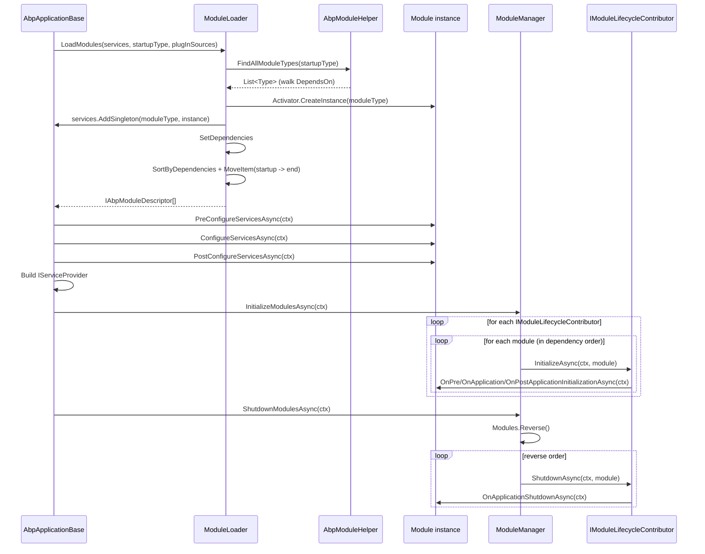
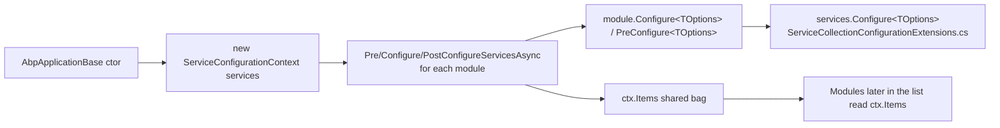
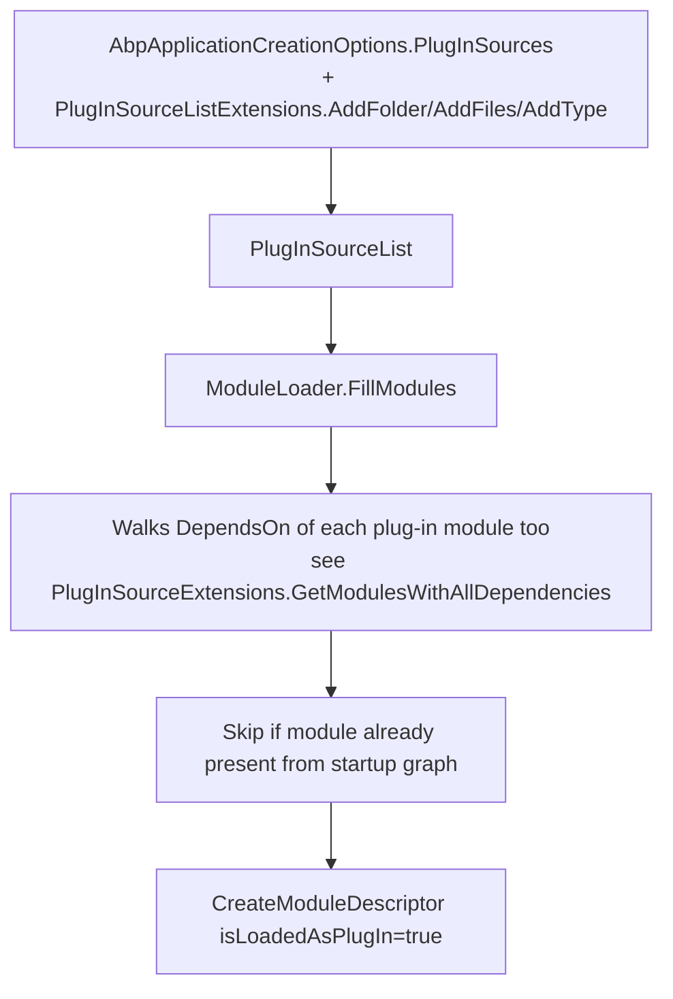

The ABP Framework's modularity system is what lets you compose an application out of independently developed, versioned packages that depend on each other transitively. This page covers everything under `framework/src/Volo.Abp.Core/Volo/Abp/Modularity/` — the `AbpModule` base class and its lifecycle interfaces, how `ModuleLoader` walks the `[DependsOn]` graph, how `ModuleManager` invokes each `IModuleLifecycleContributor` in the right order, and how plug-in sources extend the graph at runtime.

## Responsibility

The Modularity subsystem owns:

- **Discovery** — given a startup module `Type`, find every transitively-depended module class and load every plug-in source.
- **Topological sort** — order the modules so that a module's dependencies are configured/initialized before it.
- **Service configuration** — drive `PreConfigureServices` → `ConfigureServices` → `PostConfigureServices` on every module while passing a single `ServiceConfigurationContext` instance.
- **Lifecycle dispatch** — call `OnPreApplicationInitialization` → `OnApplicationInitialization` → `OnPostApplicationInitialization` on every module after the `IServiceProvider` is ready, and `OnApplicationShutdown` in reverse order on dispose.
- **Plug-in support** — accept modules from `IPlugInSource` instances (files, folders, or types) that are not reachable through `[DependsOn]`.

## File inventory

| File | Purpose |
| --- | --- |
| `AbpModule.cs` | Abstract base class implementing every lifecycle interface with empty virtuals. |
| `IAbpModule.cs` | Minimum contract: `ConfigureServicesAsync` + `ConfigureServices`. |
| `AbpModuleDescriptor.cs` | Runtime metadata for a loaded module (type, assembly, instance, dependencies, plug-in flag). |
| `IAbpModuleDescriptor.cs` | Interface for the above. |
| `AbpModuleDescriptorExtensions.cs` | `GetAdditionalAssemblies()` helper. |
| `AbpModuleHelper.cs` | `FindAllModuleTypes`, `FindDependedModuleTypes`, `GetAllAssemblies` — pure static reflection. |
| `DependsOnAttribute.cs` | Class attribute marking module dependencies; implements `IDependedTypesProvider`. |
| `AdditionalAssemblyAttribute.cs` | Class attribute marking extra assemblies for the module; implements `IAdditionalModuleAssemblyProvider`. |
| `IDependedTypesProvider.cs` | Contract powering `[DependsOn]`-style attributes. |
| `IAdditionalModuleAssemblyProvider.cs` | Contract powering `[AdditionalAssembly]`-style attributes. |
| `IModuleLoader.cs` | The contract `AbpApplicationBase` uses. |
| `ModuleLoader.cs` | Default `IModuleLoader` — walks dependencies, registers instances as singletons, sorts. |
| `IModuleManager.cs` | The contract for lifecycle dispatch. |
| `ModuleManager.cs` | Default `IModuleManager` — registered as `ISingletonDependency`, iterates contributors × modules. |
| `IModuleContainer.cs` | `IReadOnlyList<IAbpModuleDescriptor> Modules` — implemented by `AbpApplicationBase`. |
| `IModuleLifecycleContributor.cs` | Per-phase hook implemented by the four `OnXyzModuleLifecycleContributor` classes. |
| `ModuleLifecycleContributorBase.cs` | No-op base class for contributors. |
| `DefaultModuleLifecycleContributor.cs` | The four built-in contributors: `OnPreApplicationInitialization…`, `OnApplicationInitialization…`, `OnPostApplicationInitialization…`, `OnApplicationShutdown…`. |
| `AbpModuleLifecycleOptions.cs` | `Contributors` `ITypeList` populated by `InternalServiceCollectionExtensions.AddCoreAbpServices`. |
| `IOnPreApplicationInitialization.cs` | Pre-init contract. |
| `IOnPostApplicationInitialization.cs` | Post-init contract. |
| `IPreConfigureServices.cs` | Pre-configure contract. |
| `IPostConfigureServices.cs` | Post-configure contract. |
| `ServiceConfigurationContext.cs` | Carries `IServiceCollection`, `IConfiguration`, and a shared `Items` bag during the configure phase. |
| `PlugIns/IPlugInSource.cs` | Plug-in source contract. |
| `PlugIns/PlugInSourceList.cs` | `List<IPlugInSource>` with `GetAllModules` helper. |
| `PlugIns/FilePlugInSource.cs` | Loads each `.dll` file path with `AssemblyLoadContext.Default.LoadFromAssemblyPath`. |
| `PlugIns/FolderPlugInSource.cs` | Enumerates assemblies in a folder (with `Filter` + `SearchOption`). |
| `PlugIns/TypePlugInSource.cs` | Wraps explicit `Type[]`. |
| `PlugIns/PlugInSourceExtensions.cs` | `GetModulesWithAllDependencies` — also walks the `[DependsOn]` graph for plug-in modules. |
| `PlugIns/PlugInSourceListExtensions.cs` | Fluent `AddType`, `AddFolder`, `AddFiles`. |

## Key abstractions

| Class / interface | File | What it does | Who calls it |
| --- | --- | --- | --- |
| `IAbpModule` | `IAbpModule.cs` | Marker for any class the loader will instantiate. | `AbpModule.IsAbpModule(Type)` |
| `AbpModule` | `AbpModule.cs` | Implements all lifecycle interfaces with empty virtuals; provides `Configure<T>` / `PreConfigure<T>` / `PostConfigure<T>` / `PostConfigureAll<T>` shortcuts that delegate to `ServiceConfigurationContext.Services`. | Every application module |
| `AbpModuleDescriptor` | `AbpModuleDescriptor.cs` | Holds the `Type`, `Assembly`, `AllAssemblies`, the singleton `Instance`, `IsLoadedAsPlugIn`, and an `AddDependency`-mutable `Dependencies` list. | `ModuleLoader`, `ModuleManager` |
| `DependsOnAttribute` | `DependsOnAttribute.cs` | `[AttributeUsage(AttributeTargets.Class, AllowMultiple = true)]`. Implements `IDependedTypesProvider`. Stored as `Type[] DependedTypes`. | `AbpModuleHelper.FindDependedModuleTypes` |
| `AdditionalAssemblyAttribute` | `AdditionalAssemblyAttribute.cs` | `[AttributeUsage(AttributeTargets.Class, AllowMultiple = true)]`. Implements `IAdditionalModuleAssemblyProvider`. Returns `TypesInAssemblies.Select(t => t.Assembly).Distinct()`. | `AbpModuleHelper.GetAllAssemblies` |
| `ServiceConfigurationContext` | `ServiceConfigurationContext.cs` | Wraps `IServiceCollection Services`, lazy `IConfiguration Configuration` (via `Services.GetConfiguration()`), and a shared `Dictionary<string, object?> Items`. The indexer `this[key]` is a shortcut for `Items`. | `AbpModule` virtuals; passed by `AbpApplicationBase` to every module |
| `IModuleLoader` / `ModuleLoader` | `ModuleLoader.cs` | Discovers module types, instantiates them via `Activator.CreateInstance(moduleType)`, registers each as a `Singleton`, sets `Dependencies`, and sorts via `SortByDependencies`. The startup module is moved to the **end** of the sorted list with `MoveItem(...)`. | `AbpApplicationBase.LoadModules` |
| `IModuleManager` / `ModuleManager` | `ModuleManager.cs` | `ISingletonDependency`. Reads `AbpModuleLifecycleOptions.Contributors`, resolves each contributor from `IServiceProvider`, and iterates contributors × modules. Wraps any error in `AbpInitializationException` / `AbpShutdownException`. Logs `"Initialized all ABP modules."` at the end of init. | `AbpApplicationBase.InitializeModulesAsync` / `Shutdown` |
| `IModuleLifecycleContributor` / `ModuleLifecycleContributorBase` | `ModuleLifecycleContributorBase.cs` | Per-phase contract. Default base has empty implementations. Custom contributors are added via `Options.Contributors.Add<T>()`. | `ModuleManager` |
| `OnApplicationInitializationModuleLifecycleContributor` / `OnPreApplicationInitializationModuleLifecycleContributor` / `OnPostApplicationInitializationModuleLifecycleContributor` / `OnApplicationShutdownModuleLifecycleContributor` | `DefaultModuleLifecycleContributor.cs` | Each calls the matching method on the module if it implements the corresponding interface. | `ModuleManager` |
| `AbpModuleHelper` | `AbpModuleHelper.cs` | `FindAllModuleTypes(startupType, logger)` recurses through `[DependsOn]`; `GetAllAssemblies(type)` reads `[AdditionalAssembly]`. | `ModuleLoader`, `AbpModuleDescriptor` |
| `PlugInSourceList` | `PlugIns/PlugInSourceList.cs` | `List<IPlugInSource>` with `GetAllModules` that walks every plug-in's transitive `[DependsOn]`. | `ModuleLoader.FillModules` |

## Attribute inventory

| Attribute | Targets | Multiple | Implements | Effect |
| --- | --- | --- | --- | --- |
| `DependsOn` | `Class` | yes | `IDependedTypesProvider` | Each provided type is added as a depended module; the loader will instantiate it before the depending module and sort it earlier. |
| `AdditionalAssembly` | `Class` | yes | `IAdditionalModuleAssemblyProvider` | The provided types' assemblies are added to `AllAssemblies` so conventional registration and resource discovery scan them. |
| `DisableConventionalRegistration` | `Class` | no | (none) | Read by `ConventionalRegistrarBase.IsConventionalRegistrationDisabled` and `DefaultConventionalRegistrar.AddType` to skip the class. (Implemented in `Volo/Abp/DependencyInjection/`; mentioned here because it interacts with module-driven assembly scanning.) |

## Lifecycle diagram



## Control & data flow

### Discovery

`AbpModuleHelper.FindAllModuleTypes` (`Volo/Abp/Modularity/AbpModuleHelper.cs`) recursively visits the startup module and every type returned by `IDependedTypesProvider.GetDependedTypes()`. Each type is checked with `AbpModule.CheckAbpModuleType` (verifies `IsClass && !IsAbstract && !IsGenericType && implements IAbpModule`). Duplicates are filtered with `AddIfNotContains`. The logger receives one debug line per loaded module, indented by recursion depth — that is how the boot log produces the indented dependency tree you see at startup.

In parallel, every `IPlugInSource` in the application's `PlugInSourceList` (`Volo/Abp/Modularity/PlugIns/PlugInSourceList.cs`) is asked for `Type[] GetModules()`. `FilePlugInSource` calls `AssemblyLoadContext.Default.LoadFromAssemblyPath(filePath)` and scans for `AbpModule.IsAbpModule`. `FolderPlugInSource` enumerates `*.dll` / `*.exe` using `AssemblyHelper.GetAssemblyFiles` and applies an optional `Filter` predicate. `TypePlugInSource` returns the explicit `Type[]` you passed in.

The merging happens in `ModuleLoader.FillModules` (`Volo/Abp/Modularity/ModuleLoader.cs`): non-plug-in modules are added first, then plug-in modules are added only if not already present, with `isLoadedAsPlugIn: true`.

### Instantiation

`ModuleLoader.CreateAndRegisterModule` calls `Activator.CreateInstance(moduleType)` (modules must have a parameterless constructor — there is no DI here yet) and immediately calls `services.AddSingleton(moduleType, module)`. The descriptor's `Instance` property holds the same object, so resolving the module type later from the container returns the very instance the loader created.

### Dependency wiring

`ModuleLoader.SetDependencies(modules, module)` reads the dependencies via `AbpModuleHelper.FindDependedModuleTypes` (which scans `IDependedTypesProvider` attributes) and calls `module.AddDependency(dependedDescriptor)`. If a dependency cannot be resolved (someone listed a non-loaded module type) the loader throws `AbpException("Could not find a depended module ...")`.

### Topological sort

`ModuleLoader.SortByDependency` calls `modules.SortByDependencies(m => m.Dependencies)` — a stable topological sort over the `Dependencies` graph — and then calls `sortedModules.MoveItem(m => m.Type == startupModuleType, modules.Count - 1)` to push the startup module to the **last** position. The effect: the startup module configures services *after* every dependency and initializes *after* every dependency.

### Configure phases

Back in `AbpApplicationBase` (`Volo/Abp/AbpApplicationBase.cs`), with the sorted descriptors in hand and `ServiceConfigurationContext` constructed, the framework calls — for each module, in order:

1. `((IPreConfigureServices)module).PreConfigureServicesAsync(ctx)`
2. `((IAbpModule)module).ConfigureServicesAsync(ctx)`
3. `((IPostConfigureServices)module).PostConfigureServicesAsync(ctx)`

Because `AbpModule` implements all three interfaces, every module participates in all three phases unless it overrides only the ones it cares about. The same `ServiceConfigurationContext` instance is reused across phases for a given module *but* between modules — making the `Items` dictionary a shared chalkboard between modules within a single phase.

The `AbpModule.ServiceConfigurationContext` property getter throws `AbpException` if accessed outside the three configure methods. The `Configure<T>` / `PreConfigure<T>` / `PostConfigure<T>` / `PostConfigureAll<T>` shortcuts on `AbpModule` are thin wrappers around `ServiceConfigurationContext.Services.{Configure,PreConfigure,PostConfigure,PostConfigureAll}<TOptions>` — that is where the [Options & Configuration](/core/options-and-configuration) chapter picks up.

### Initialization

After the `IServiceProvider` is built, `AbpApplicationBase.InitializeModulesAsync` creates a scope, resolves `IModuleManager`, and calls `InitializeModulesAsync(new ApplicationInitializationContext(scope.ServiceProvider))`. `ModuleManager` reads `AbpModuleLifecycleOptions.Contributors` (populated in `InternalServiceCollectionExtensions.AddCoreAbpServices` with the four default contributors) and calls each contributor for each module:

```csharp
foreach (var contributor in _lifecycleContributors)
{
    foreach (var module in _moduleContainer.Modules)
    {
        await contributor.InitializeAsync(context, module.Instance);
    }
}
```

The contributors registered by default are, in order: `OnPreApplicationInitializationModuleLifecycleContributor`, `OnApplicationInitializationModuleLifecycleContributor`, `OnPostApplicationInitializationModuleLifecycleContributor`, `OnApplicationShutdownModuleLifecycleContributor`. The shutdown contributor's `InitializeAsync` is a no-op (inherited from `ModuleLifecycleContributorBase`) — only its `ShutdownAsync` does anything.

Errors are translated into `AbpInitializationException` carrying the contributor type and module type in the message — invaluable during debugging.

### Shutdown

`ModuleManager.ShutdownModulesAsync` calls `_moduleContainer.Modules.Reverse().ToList()` and iterates the same contributors in their registered order. The shutdown contributor will dispatch to `IOnApplicationShutdown.OnApplicationShutdownAsync` if the module implements it. Errors become `AbpShutdownException`.

## ServiceConfigurationContext data flow



## Plug-in flow



`PlugInSourceListExtensions.AddFolder(folder, searchOption, filter)` instantiates `FolderPlugInSource`; `AddFiles(paths)` instantiates `FilePlugInSource`; `AddType<T>()` / `AddType(Type)` instantiates `TypePlugInSource`. Plug-in modules can themselves use `[DependsOn]` — `PlugInSourceExtensions.GetModulesWithAllDependencies` recursively pulls in their dependency closures using `AbpModuleHelper.FindAllModuleTypes`.

<Note>
A module loaded as a plug-in is visible via `IModuleContainer.Modules` with `IsLoadedAsPlugIn == true`. This lets diagnostic tooling distinguish "compiled-in" vs "discovered at runtime" modules.
</Note>

## Connections

**Depends on:**

- `Volo/Abp/DependencyInjection/` — `ISingletonDependency` (for `ModuleManager`), the registration action extensions invoked during `AddType`/`AddAssembly`.
- `Volo/Abp/Reflection/` — `AssemblyHelper.GetAllTypes`, `AssemblyFinder`.
- `Volo/Abp/Internal/InternalServiceCollectionExtensions.cs` — registers the four default contributors.
- `Volo/Abp/Logging/` — init logger for boot diagnostics.
- `Microsoft.Extensions.DependencyInjection`, `Microsoft.Extensions.Logging`, `Microsoft.Extensions.Options`, `Microsoft.Extensions.Configuration`.

**Depended on by:**

- `AbpApplicationBase` (`Volo/Abp/AbpApplicationBase.cs`) and the `Internal`/`External` service-provider variants.
- Every framework and application module — they inherit `AbpModule`.

## Gotchas & invariants

<Warning>
`ServiceConfigurationContext` is **only** valid inside the three configure methods. Accessing `AbpModule.ServiceConfigurationContext` from `OnApplicationInitialization`, a constructor, or any other place throws `AbpException`. The getter check in `AbpModule.cs` exists for exactly this reason — there is no service collection to mutate once the container has been built.
</Warning>

- **Module type must be a concrete, non-generic class implementing `IAbpModule`.** `AbpModule.CheckAbpModuleType` enforces this and the loader throws `ArgumentException` if violated.
- **Modules need a public, parameterless constructor.** `ModuleLoader.CreateAndRegisterModule` calls `Activator.CreateInstance(moduleType)`. Any constructor parameters are silently ignored unless they happen to be optional — your dependencies must wait for `OnApplicationInitialization`.
- **Initialization happens inside a scope.** `AbpApplicationBase` creates a `using (var scope = ServiceProvider.CreateScope())` around the call to `IModuleManager.InitializeModulesAsync`. Scoped services you resolve in `OnApplicationInitialization` are released when initialization completes.
- **Lifecycle contributors are resolved per-call.** `ModuleManager`'s constructor uses `serviceProvider.GetRequiredService(contributorType)` to materialise the list. Because `IModuleLifecycleContributor : ITransientDependency`, you get fresh instances; do not assume state is preserved between modules.
- **Shutdown order is `Modules.Reverse()`** — not "topological reverse" but literal list reversal. Because the loader has already sorted the list with the startup module last, that means shutdown starts at the startup module and ends at the leaf dependencies.
- **`SkipAutoServiceRegistration`** — `AbpModule` exposes a `protected internal bool SkipAutoServiceRegistration` flag. Setting it tells higher-level extensions (e.g. `ServiceCollectionConventionalRegistrationExtensions`) not to add the module's assembly via `services.AddAssembly(...)`. Used by modules that ship interfaces only.
- **`PostConfigureAll<T>`** vs `PostConfigure<T>` — the former calls `services.PostConfigureAll<T>(...)`, applying to *every* named instance of `TOptions`; useful for cross-cutting overrides like adding handlers to every JWT bearer scheme.

## Worked example

A minimal module that uses every interface might look like:

```csharp
[DependsOn(typeof(AbpAutofacModule), typeof(AbpAuditingModule))]
[AdditionalAssembly(typeof(SomeTypeInAnotherDll))]
public class MyAppModule : AbpModule,
    IPreConfigureServices,
    IPostConfigureServices,
    IOnPreApplicationInitialization,
    IOnApplicationInitialization,
    IOnPostApplicationInitialization,
    IOnApplicationShutdown
{
    public override void PreConfigureServices(ServiceConfigurationContext ctx)
        => ctx.Services.PreConfigure<MvcOptions>(o => { /* ... */ });

    public override void ConfigureServices(ServiceConfigurationContext ctx)
        => Configure<MyOptions>(o => o.Foo = ctx.Configuration["Foo"]);

    public override void PostConfigureServices(ServiceConfigurationContext ctx)
        => ctx["MyAppReady"] = true;  // shared via ctx.Items

    public override void OnApplicationInitialization(ApplicationInitializationContext ctx)
        => ctx.ServiceProvider.GetRequiredService<IMyService>().Start();

    public override void OnApplicationShutdown(ApplicationShutdownContext ctx)
        => ctx.ServiceProvider.GetRequiredService<IMyService>().Stop();
}
```

`AbpModule` already implements all six lifecycle interfaces, so re-declaring them above is redundant; it is shown only to make the contract explicit.

## Related pages

<CardGroup cols={2}>
  <Card title="Dependency Injection" icon="plug" href="/core/dependency-injection">
    What happens to your `[ExposeServices]` classes during `ConfigureServices`.
  </Card>
  <Card title="Options & Configuration" icon="gear" href="/core/options-and-configuration">
    The `Configure<T>` / `PreConfigure<T>` helpers in detail.
  </Card>
  <Card title="Exception Handling" icon="triangle-exclamation" href="/core/exception-handling">
    `AbpInitializationException` and `AbpShutdownException`.
  </Card>
  <Card title="Reflection & Internal" icon="microscope" href="/core/reflection-and-internal">
    `AssemblyHelper` and `AssemblyFinder` are used by the loader.
  </Card>
</CardGroup>
