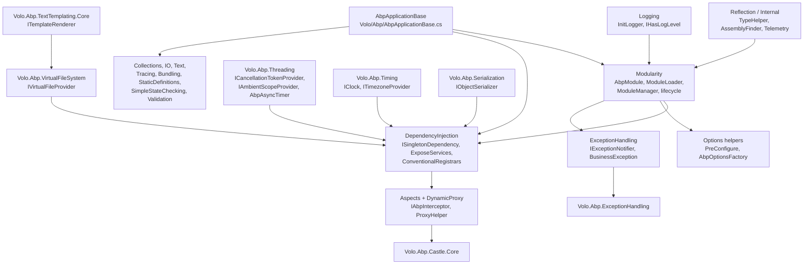
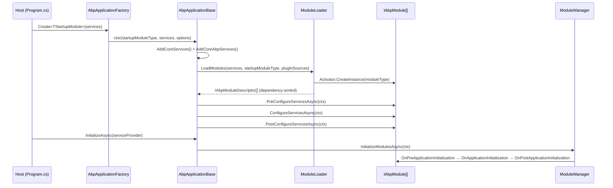

The ABP Framework is built around a single foundation assembly, `Volo.Abp.Core`, that every other module ultimately depends on. This page introduces the namespaces under that assembly, the satellite packages that build on top of it (`Volo.Abp.Threading`, `Volo.Abp.Timing`, `Volo.Abp.Serialization`, `Volo.Abp.VirtualFileSystem`, `Volo.Abp.TextTemplating`, `Volo.Abp.ExceptionHandling`, `Volo.Abp.Castle.Core`, and the meta `Volo.Abp` package), and links to the dedicated deep-dive pages where each subsystem is unpacked in detail.

## What "Core" means in ABP

When ABP talks about "core" it really refers to two different things bundled into one csproj. The first is **plumbing for the module system** — the loader, descriptor, lifecycle contributors, and `AbpApplicationBase` driver that boot a graph of `AbpModule` classes. The second is a **toolbox of small primitives** — DI markers, reflection helpers, virtual file system hooks, options helpers, and string/IO/threading utilities — that other modules import without thinking about it. Both ship from `framework/src/Volo.Abp.Core/Volo.Abp.Core.csproj`, which targets `netstandard2.0`, `netstandard2.1`, `net8.0`, `net9.0`, and `net10.0`.

`Volo.Abp.Core` itself only depends on a thin set of Microsoft.Extensions.* packages (`DependencyInjection`, `Options`, `Logging`, `Localization`, `Configuration.*`, `Hosting.Abstractions`), plus `Nito.AsyncEx.Context`, `JetBrains.Annotations`, and `System.Linq.Dynamic.Core`. There is no ASP.NET Core, no EF Core, no Newtonsoft.Json here — those live in separate modules.

<Note>
The package name `Volo.Abp` (sometimes called the "meta-package") does not contain any code. Its `README.md` explicitly says: *"This package is a name holder. It just references to the `Volo.Abp.Core` package."* See [The Volo.Abp Meta-Package](/core/volo-abp-package) for the details.
</Note>

## Subsystem map

## Where things live on disk

The folder layout mirrors the namespaces. Under `framework/src/Volo.Abp.Core/Volo/Abp/` you will find the `Modularity/`, `DependencyInjection/`, `ExceptionHandling/`, `Aspects/`, `DynamicProxy/`, `Threading/`, `Reflection/`, `Internal/`, `Logging/`, `Options/`, `Bundling/`, `Collections/`, `Content/`, `IO/`, `Text/`, `Localization/`, `SimpleStateChecking/`, `StaticDefinitions/`, `Studio/`, `Validation/`, and `Tracing/` folders. Anything under `System/` or `Microsoft/Extensions/` are extension methods placed in those framework namespaces so consumers get them automatically.

The satellite packages live in sibling folders:

| Package | csproj | Top namespace |
| --- | --- | --- |
| `Volo.Abp` | `framework/src/Volo.Abp/Volo.Abp.csproj` | (none — meta) |
| `Volo.Abp.Core` | `framework/src/Volo.Abp.Core/Volo.Abp.Core.csproj` | `Volo.Abp.*` |
| `Volo.Abp.Threading` | `framework/src/Volo.Abp.Threading/Volo.Abp.Threading.csproj` | `Volo.Abp.Threading`, `Volo.Abp.Linq` |
| `Volo.Abp.Timing` | `framework/src/Volo.Abp.Timing/Volo.Abp.Timing.csproj` | `Volo.Abp.Timing` |
| `Volo.Abp.Serialization` | `framework/src/Volo.Abp.Serialization/Volo.Abp.Serialization.csproj` | `Volo.Abp.Serialization` |
| `Volo.Abp.VirtualFileSystem` | `framework/src/Volo.Abp.VirtualFileSystem/Volo.Abp.VirtualFileSystem.csproj` | `Volo.Abp.VirtualFileSystem` |
| `Volo.Abp.TextTemplating.Core` | `framework/src/Volo.Abp.TextTemplating.Core/...csproj` | `Volo.Abp.TextTemplating` |
| `Volo.Abp.TextTemplating.Razor` | `framework/src/Volo.Abp.TextTemplating.Razor/...csproj` | `Volo.Abp.TextTemplating.Razor` |
| `Volo.Abp.TextTemplating.Scriban` | `framework/src/Volo.Abp.TextTemplating.Scriban/...csproj` | `Volo.Abp.TextTemplating.Scriban` |
| `Volo.Abp.ExceptionHandling` | `framework/src/Volo.Abp.ExceptionHandling/Volo.Abp.ExceptionHandling.csproj` | `Volo.Abp.ExceptionHandling`, `Volo.Abp.Http` |
| `Volo.Abp.Castle.Core` | `framework/src/Volo.Abp.Castle.Core/Volo.Abp.Castle.Core.csproj` | `Volo.Abp.Castle.DynamicProxy` |
| `Volo.Abp.Autofac` | `framework/src/Volo.Abp.Autofac/Volo.Abp.Autofac.csproj` | `Volo.Abp.Autofac` |

## Deep-dive pages

<CardGroup cols={2}>
  <Card title="The Volo.Abp.Core package" icon="cube" href="/core/volo-abp-core">
    csproj target frameworks, dependency list, and the folder map of `framework/src/Volo.Abp.Core/`.
  </Card>
  <Card title="The Volo.Abp meta-package" icon="box" href="/core/volo-abp-package">
    The "name holder" NuGet that re-exports `Volo.Abp.Core`. Just one project reference.
  </Card>
  <Card title="Modularity" icon="layer-group" href="/core/modularity">
    `AbpModule`, `ModuleLoader`, `ModuleManager`, `[DependsOn]`, lifecycle contributors, plug-ins.
  </Card>
  <Card title="Dependency Injection" icon="plug" href="/core/dependency-injection">
    `ISingletonDependency`, `[ExposeServices]`, conventional registrars, lazy/cached service providers.
  </Card>
  <Card title="Options & Configuration" icon="gear" href="/core/options-and-configuration">
    `AbpOptionsFactory`, `AbpUnnamedOptionsManager`, `PreConfigure<T>`, `Configure<T>` on modules.
  </Card>
  <Card title="Exception Handling" icon="triangle-exclamation" href="/core/exception-handling">
    `AbpException`, `BusinessException`, `UserFriendlyException`, `IExceptionNotifier`, subscribers.
  </Card>
  <Card title="Aspects & Dynamic Proxy" icon="diagram-project" href="/core/aspects-and-dynamic-proxy">
    `AbpCrossCuttingConcerns`, `IAbpInterceptor`, `IAbpMethodInvocation`, Castle bridge.
  </Card>
  <Card title="Threading" icon="bolt" href="/core/threading">
    `ICancellationTokenProvider`, `IAmbientScopeProvider`, `AsyncHelper`, `AbpAsyncTimer`.
  </Card>
  <Card title="Timing" icon="clock" href="/core/timing">
    `IClock`, `AbpClockOptions`, `ITimezoneProvider`, `ICurrentTimezoneProvider`, `TimeZoneHelper`.
  </Card>
  <Card title="Serialization" icon="code" href="/core/serialization">
    `IObjectSerializer`, `IObjectSerializer<T>`, `DefaultObjectSerializer`, JSON-based fallback.
  </Card>
  <Card title="Reflection & Internal" icon="microscope" href="/core/reflection-and-internal">
    `TypeHelper`, `AssemblyFinder`, `TypeFinder`, `ReflectionHelper`, `TelemetryService`.
  </Card>
  <Card title="Virtual File System" icon="folder-tree" href="/core/virtual-file-system">
    `IVirtualFileProvider`, `AbpVirtualFileSystemOptions`, embedded & physical file sets.
  </Card>
  <Card title="Text Templating" icon="file-lines" href="/core/text-templating">
    `ITemplateRenderer`, `TemplateDefinition`, Razor and Scriban rendering engines.
  </Card>
</CardGroup>

## How a request flows through Core at startup

The driver of all of this — `AbpApplicationBase` in `framework/src/Volo.Abp.Core/Volo/Abp/AbpApplicationBase.cs` — wires `IAbpApplication`, `IApplicationInfoAccessor`, and `IModuleContainer` to itself via `services.AddSingleton(...)`. It then calls `services.AddCoreServices()` and `services.AddCoreAbpServices(this, options)` (see `InternalServiceCollectionExtensions.AddCoreAbpServices` in `framework/src/Volo.Abp.Core/Volo/Abp/Internal/InternalServiceCollectionExtensions.cs`) which registers `IModuleLoader`, `IAssemblyFinder`, `ITypeFinder`, the four default `IModuleLifecycleContributor` types, the `ISimpleStateCheckerManager<>` open generic, and the `IStaticDefinitionCache<,>` open generic.

## Boot sequence in detail

The bootstrap path runs in a fixed order regardless of whether you use the internal or external service-provider variants:

<Steps>
  <Step title="Create options bag">
    `AbpApplicationBase` constructs an `AbpApplicationCreationOptions(services)` (`Volo/Abp/AbpApplicationCreationOptions.cs`) and invokes the caller's `optionsAction` to let it set `ApplicationName`, `Environment`, `Configuration` builder knobs, and `PlugInSources`.
  </Step>
  <Step title="Register infrastructure singletons">
    `services.AddSingleton<IAbpApplication>(this)`, `IApplicationInfoAccessor`, `IModuleContainer`, and `IAbpHostEnvironment` are all registered against `this` — `AbpApplicationBase` implements them all. `services.TryAddObjectAccessor<IServiceProvider>()` reserves the slot for the future container.
  </Step>
  <Step title="Add core services">
    `services.AddCoreServices()` adds Microsoft `Options`, `Logging`, and `Localization` defaults. `services.AddCoreAbpServices(this, options)` registers `ModuleLoader`, `AssemblyFinder`, `TypeFinder`, `IInitLoggerFactory`, the four lifecycle contributors, and conditionally builds an `IConfiguration` if none was already added.
  </Step>
  <Step title="Load modules">
    `ModuleLoader.LoadModules(services, startupModuleType, options.PlugInSources)` walks `[DependsOn]`, discovers plug-ins, builds descriptors, sets dependencies, sorts topologically with the startup module pinned last, and returns `IAbpModuleDescriptor[]`.
  </Step>
  <Step title="Configure services">
    Unless `options.SkipConfigureServices == true`, `ConfigureServices()` runs each module's `Pre/Configure/PostConfigureServicesAsync` in turn, passing the same `ServiceConfigurationContext`.
  </Step>
  <Step title="Build container">
    The caller (or `AbpApplicationWithInternalServiceProvider`) builds the `IServiceProvider`. `SetServiceProvider(sp)` writes the value into the previously registered `ObjectAccessor<IServiceProvider>` so any singleton that captured it via `IObjectAccessor` sees the real instance.
  </Step>
  <Step title="Initialize modules">
    `InitializeAsync()` opens a scope, resolves `IModuleManager`, and runs `InitializeModulesAsync(new ApplicationInitializationContext(...))`. The four contributors are invoked in their registered order × every module in dependency order.
  </Step>
</Steps>

## Cross-cutting invariants

- **Every Core service prefers convention over configuration.** A class that implements `ISingletonDependency`/`IScopedDependency`/`ITransientDependency` is auto-registered by `DefaultConventionalRegistrar` (`Volo/Abp/DependencyInjection/DefaultConventionalRegistrar.cs`). The `[ExposeServices]` attribute pins the exposed service types.
- **Modules are stateless during configuration.** `ServiceConfigurationContext` is only valid inside `PreConfigureServices`/`ConfigureServices`/`PostConfigureServices`. Accessing `AbpModule.ServiceConfigurationContext` outside those throws `AbpException` — see the getter in `Volo/Abp/Modularity/AbpModule.cs`.
- **Initialization order matches dependency order.** `ModuleLoader.SortByDependency` (`Volo/Abp/Modularity/ModuleLoader.cs`) uses `SortByDependencies(...)` and then moves the startup module to the *end* of the list so it gets the last word.
- **Shutdown order is the reverse.** `ModuleManager.ShutdownModulesAsync` (`Volo/Abp/Modularity/ModuleManager.cs`) calls `_moduleContainer.Modules.Reverse().ToList()` before iterating.
- **The root `IServiceProvider` is wrapped.** `RootServiceProvider` (`Volo/Abp/DependencyInjection/RootServiceProvider.cs`) wraps the root container behind `IRootServiceProvider`. The docstring warns: *"Always create a new scope if you need to resolve any service."*

## Reading the file inventory tables

Each deep-dive page follows the same template:

| Section | What you can use it for |
| --- | --- |
| **Responsibility** | High-level summary in three bullets. |
| **File inventory** | Map every `.cs` file in the subsystem to a one-line summary. Use this to navigate the source tree. |
| **Key abstractions** | Detailed table with `class → file → what it does → who calls it`. |
| **Attribute inventory** | (where applicable) the attributes the subsystem defines, with target, multiplicity, and effect. |
| **Control & data flow** | Mermaid diagrams + prose tying file paths together. |
| **Connections** | Explicit "depends on" / "depended on by" lists so you know the blast radius of a change. |
| **Gotchas & invariants** | Concrete pitfalls drawn from comments and behavior in source. |
| **Worked example** | Minimal end-to-end snippet you can paste into a module. |

## Conventions used across the Core subsystem

- **Dependency markers** drive almost all registrations. A class implementing `ISingletonDependency`, `IScopedDependency`, or `ITransientDependency` is auto-registered (see `Volo/Abp/DependencyInjection/DefaultConventionalRegistrar.cs`). The matching `[ExposeServices(...)]` attribute pins the service types.
- **`[ExposeServices(typeof(...))]` on the abstract base** is how the framework keeps "implement this base, get the right registration" working. See `ExceptionSubscriber.cs` and `TemplateDefinitionProvider.cs` for examples.
- **Options classes are POCOs with a parameterless constructor.** Pre-configure via `services.PreConfigure<T>(...)`; configure via `Configure<T>(...)` in a module; post-configure via `PostConfigure<T>(...)`.
- **Async-first contracts ship sync overloads.** `IAbpModule.ConfigureServicesAsync` plus `ConfigureServices`. The async path defers to the sync path on `AbpModule` unless you override it.
- **Resources are localised through `IStringLocalizer`** and the `AbpLocalizationOptions.Resources` builder. Most framework modules embed JSON localisation files via `AbpVirtualFileSystemOptions.FileSets.AddEmbedded<TModule>()` and reference them with `AddVirtualJson(path)`.

## Next steps

If you are new to the codebase, read the pages in this order:

<Steps>
  <Step title="The Volo.Abp.Core package">
    Get the lay of the land — folder map, csproj, what each top-level namespace contains. See [Volo.Abp.Core package](/core/volo-abp-core).
  </Step>
  <Step title="Modularity">
    Understand `AbpModule`, the lifecycle, and how `ModuleLoader` builds a dependency graph from `[DependsOn]`. See [Modularity](/core/modularity).
  </Step>
  <Step title="Dependency Injection">
    Learn how `[ExposeServices]`, `DefaultConventionalRegistrar`, and the lazy/cached service providers extend Microsoft.Extensions.DependencyInjection. See [Dependency Injection](/core/dependency-injection).
  </Step>
  <Step title="Pick a subsystem">
    Then jump to whichever of Threading, Timing, Serialization, Virtual File System, Text Templating, Exception Handling, or Aspects you are working on.
  </Step>
</Steps>
