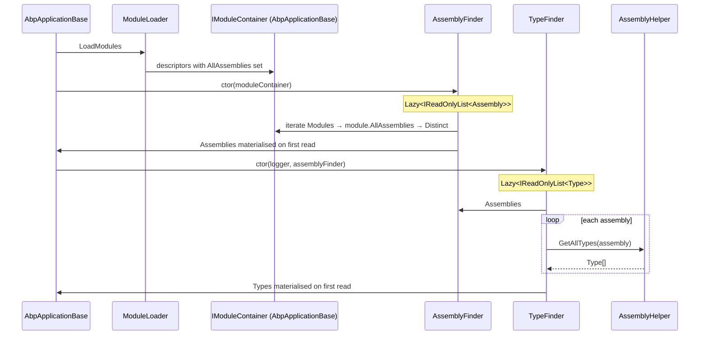
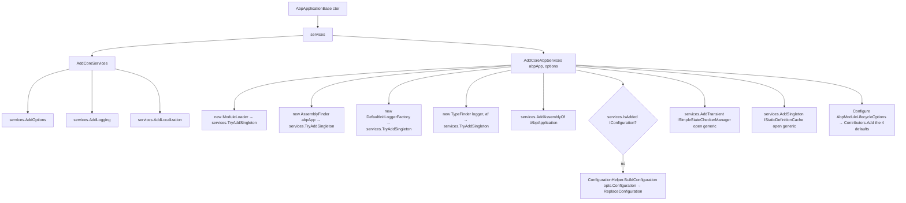
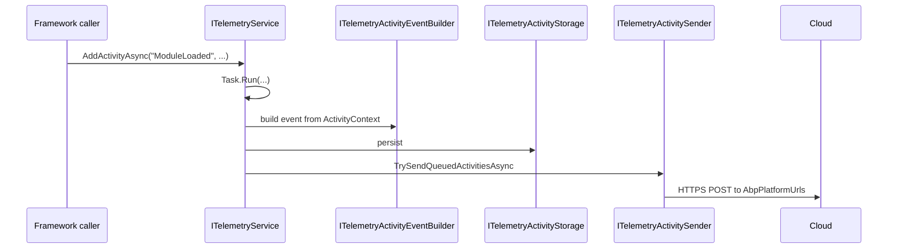

The ABP Framework relies on a small set of reflection utilities to walk module assemblies, identify primitive types, and find implementations of generic interfaces. Alongside these, the `Volo/Abp/Internal/` folder contains the framework's anonymous telemetry pipeline used by ABP Studio. This page covers `framework/src/Volo.Abp.Core/Volo/Abp/Reflection/` and `framework/src/Volo.Abp.Core/Volo/Abp/Internal/`.

## Responsibility

- **Type classification** — `TypeHelper` answers "is this primitive?", "is this a `Func<>`?", "is this `Task<T>`?" with frozen lookup tables.
- **Generic interface walks** — `ReflectionHelper.GetImplementedGenericTypes`, `IsAssignableToGenericType`, and `AddImplementedGenericTypes`.
- **Module-aware assembly discovery** — `IAssemblyFinder` exposes every assembly reachable from the loaded modules (via their `AllAssemblies`).
- **Lazy type indexing** — `ITypeFinder.Types` walks all those assemblies once on first access.
- **Internal startup wiring** — `InternalServiceCollectionExtensions.AddCoreServices` / `AddCoreAbpServices`.
- **Anonymous telemetry** — `ITelemetryService` / `TelemetryActivitySender` send activity events to ABP's telemetry endpoint, with environment detection and crypto helpers.

## File inventory

### `Volo/Abp/Reflection/`

| File | Purpose |
| --- | --- |
| `TypeHelper.cs` | Big bag of static methods. `IsNonNullablePrimitiveType`, `IsFunc<T>`, `IsPrimitiveExtended`, `IsNullable`, `GetDefaultValue`, `GetSimplifiedName`, etc. Uses `FrozenSet<Type>` for the primitive lookups. |
| `AssemblyHelper.cs` | `internal static`. `LoadAssemblies(folder, SearchOption)`, `GetAssemblyFiles(folder, SearchOption)` filtering `.dll`/`.exe`, `GetAllTypes(Assembly)`. |
| `ReflectionHelper.cs` | `public static`. `IsAssignableToGenericType(givenType, genericType)`, `GetImplementedGenericTypes(givenType, genericType)`, `GetSingleAttributeOrDefault`, `GetAttributesOfMember`, etc. |
| `IAssemblyFinder.cs` | `IReadOnlyList<Assembly> Assemblies { get; }`. |
| `AssemblyFinder.cs` | Default implementation. Takes `IModuleContainer`. `Lazy<IReadOnlyList<Assembly>>` built from `module.AllAssemblies.Distinct()`. |
| `ITypeFinder.cs` | `IReadOnlyList<Type> Types { get; }`. |
| `TypeFinder.cs` | Default implementation. Lazy. For each `AssemblyFinder.Assemblies` assembly, calls `AssemblyHelper.GetAllTypes` and aggregates. Catches `ReflectionTypeLoadException` and logs via `ILogger<TypeFinder>`. |

### `Volo/Abp/Internal/`

| File | Purpose |
| --- | --- |
| `InternalServiceCollectionExtensions.cs` | `internal static`. `AddCoreServices` adds `Options`, `Logging`, `Localization`. `AddCoreAbpServices` registers `ModuleLoader`, `AssemblyFinder`, `TypeFinder`, `IInitLoggerFactory`, the four module-lifecycle contributors, `ISimpleStateCheckerManager<>`, `IStaticDefinitionCache<,>`, and the default configuration if none exists. |
| `Utf8Helper.cs` | `ReadStringFromStream(Stream)` — gets all bytes, detects the UTF-8 BOM, returns the decoded string skipping the BOM. |
| `Telemetry/ITelemetryService.cs` / `TelemetryService.cs` | `IScopedDependency`. `TrackActivityAsync(name, ...)`, `AddActivityAsync(name, ...)`, `AddErrorActivityAsync`, `AddErrorForActivityAsync`. Uses `IServiceScopeFactory` + activity sender + storage. |
| `Telemetry/ITelemetryActivitySender.cs` / `TelemetryActivitySender.cs` | `TrySendQueuedActivitiesAsync` flushes stored activity events. |
| `Telemetry/Activity/ActivityContext.cs`, `ActivityEvent.cs`, `Contracts/`, `Providers/`, `Storage/`, `TelemetryJsonExtensions.cs` | Activity DTO/builder pipeline. |
| `Telemetry/Constants/AbpPlatformUrls.cs`, `ActivityNameConsts.cs`, `ActivityPropertyNames.cs`, `DeviceManager.cs`, `TelemetryConsts.cs`, `TelemetryPaths.cs`, `Enums/` | String/constant tables for the telemetry payload. |
| `Telemetry/EnvironmentInspection/Contracts/`, `Core/`, `Detectors/`, `Providers/` | OS/CPU/.NET version detectors. |
| `Telemetry/Helpers/AbpPackageMetadataReader.cs`, `AbpProjectMetaData.cs`, `Cryptography.cs`, `MutexExecutor.cs` | Helpers for extracting package metadata from `.abppkg` files and for cross-process coordination. |

## Key abstractions

| Class / interface | File | What it does | Who calls it |
| --- | --- | --- | --- |
| `TypeHelper.IsNonNullablePrimitiveType(Type)` | `TypeHelper.cs` | Frozen-set lookup over `byte, short, int, long, sbyte, ushort, uint, ulong, bool, float, decimal, DateTime, DateTimeOffset, TimeSpan, Guid`. | Validation, mapping |
| `TypeHelper.IsPrimitiveExtended(Type, includeNullables, includeEnums)` | `TypeHelper.cs` | Adds string + nullables to the predicate. | Validation |
| `TypeHelper.IsFunc(object)` / `IsFunc<TReturn>` | `TypeHelper.cs` | Detect `Func<>` shapes. | `LocalizableString` resolution |
| `TypeHelper.UnwrapTask(Type)` | (NB — `Volo/Abp/Threading/AsyncHelper.cs` actually owns this; `TypeHelper` only handles non-async type shaping.) | — | — |
| `ReflectionHelper.IsAssignableToGenericType(givenType, genericType)` | `ReflectionHelper.cs` | Walks interfaces and base types looking for the open generic. Recursive on `BaseType`. | `OnExposing` callbacks, modularity scanning |
| `ReflectionHelper.GetImplementedGenericTypes(givenType, genericType)` | `ReflectionHelper.cs` | Returns each closed generic of `genericType` that `givenType` implements. Used by `AbpSerializationModule.PreConfigureServices`. | [Serialization](/core/serialization) auto-exposure |
| `AssemblyHelper` (`internal`) | `AssemblyHelper.cs` | `LoadAssemblies(folder, SearchOption)` uses `AssemblyLoadContext.Default.LoadFromAssemblyPath`. `GetAssemblyFiles(folder, SearchOption)` filters `*.dll`/`*.exe`. `GetAllTypes(Assembly)` is `assembly.GetTypes()`. | `FolderPlugInSource`, `ConventionalRegistrarBase.AddAssembly`, `TypeFinder` |
| `IAssemblyFinder` / `AssemblyFinder` | `IAssemblyFinder.cs`, `AssemblyFinder.cs` | Lazily aggregates `module.AllAssemblies` across all loaded modules. Comment: *"It may not return all assemblies, but those are related with modules."* `LazyThreadSafetyMode.ExecutionAndPublication`. | Registrars, conventional registration, `ITypeFinder` |
| `ITypeFinder` / `TypeFinder` | `ITypeFinder.cs`, `TypeFinder.cs` | Lazily aggregates `AssemblyHelper.GetAllTypes` over `IAssemblyFinder.Assemblies`. Catches `ReflectionTypeLoadException` and logs. | Authorization, settings, features definition discovery |
| `InternalServiceCollectionExtensions.AddCoreServices` | `InternalServiceCollectionExtensions.cs` | `AddOptions`, `AddLogging`, `AddLocalization`. | `AbpApplicationBase` ctor |
| `InternalServiceCollectionExtensions.AddCoreAbpServices` | `InternalServiceCollectionExtensions.cs` | Instantiates `ModuleLoader` + `AssemblyFinder` ahead of DI; registers `IModuleLoader`, `IAssemblyFinder`, `IInitLoggerFactory`, `ITypeFinder`; calls `AddAssemblyOf<IAbpApplication>()`; registers `ISimpleStateCheckerManager<>` and `IStaticDefinitionCache<,>` open generics; configures `AbpModuleLifecycleOptions.Contributors` with the four default contributors. If no `IConfiguration` is registered, builds one via `ConfigurationHelper.BuildConfiguration(opts.Configuration)` and calls `ReplaceConfiguration`. | `AbpApplicationBase` ctor |
| `Utf8Helper.ReadStringFromStream(Stream)` | `Utf8Helper.cs` | Reads all bytes, detects UTF-8 BOM (`0xEF 0xBB 0xBF`), returns string skipping the BOM. | Localization resource readers, virtual file readers |
| `ITelemetryService` / `TelemetryService` | `Telemetry/ITelemetryService.cs`, `Telemetry/TelemetryService.cs` | `IScopedDependency`. `TrackActivityAsync` returns `IAsyncDisposable` (a `AsyncDisposeFunc` from `Volo/Abp/AsyncDisposeFunc.cs`) that records duration on dispose. `AddActivityAsync` queues an activity. `AddErrorActivityAsync` and `AddErrorForActivityAsync` wrap error events. Each `AddActivityAsync` runs a `Task.Run(async () => ...)` that creates a scope, resolves `ITelemetryActivityEventBuilder`, `ITelemetryActivityStorage`, `ITelemetryActivitySender`, and forwards. Hooks `AppDomain.CurrentDomain.ProcessExit` and `Console.CancelKeyPress` with a 10-second `Wait` to flush before exit. | ABP Studio, framework startup |
| `ITelemetryActivitySender` / `TelemetryActivitySender` | `Telemetry/ITelemetryActivitySender.cs`, `Telemetry/TelemetryActivitySender.cs` | `TrySendQueuedActivitiesAsync` flushes stored activity events to ABP's platform URL. | `TelemetryService` |
| `AbpPackageMetadataReader` | `Telemetry/Helpers/AbpPackageMetadataReader.cs` | Parses `.abppkg` / `.abppkg.analyze.json` files for package metadata. | ABP Studio |
| `Cryptography` | `Telemetry/Helpers/Cryptography.cs` | Hashing helpers for telemetry de-identification. | Telemetry |
| `MutexExecutor` | `Telemetry/Helpers/MutexExecutor.cs` | Cross-process mutex helper for "send telemetry only once per build". | Telemetry |
| `DeviceManager` | `Telemetry/Constants/DeviceManager.cs` | Resolves a stable per-device id. | Telemetry |

## TypeHelper highlights

The static `FrozenSet<Type>` fields are the most heavily-used parts:

- `FloatingTypes = { float, double, decimal }`.
- `NonNullablePrimitiveTypes = { byte, short, int, long, sbyte, ushort, uint, ulong, bool, float, decimal, DateTime, DateTimeOffset, TimeSpan, Guid }`.

`IsPrimitiveExtended(Type type, bool includeNullables = true, bool includeEnums = false)` returns true for the BCL primitives, plus `string`, plus (optionally) enums and (optionally) `Nullable<T>` wrappers. This is the predicate the framework uses for "this is a value-like type I can serialize directly" decisions.

`IsFunc(object obj)` returns true for any `Func<>` shape; `IsFunc<TReturn>(object obj)` is a strict check for `Func<TReturn>`. Used by `LocalizableString.Create` and `IObjectAccessor` patterns.

## Assembly and type discovery



`AssemblyFinder.FindAll()` walks `_moduleContainer.Modules`, accumulates each module's `AllAssemblies` (which includes the module's own assembly plus anything declared via `[AdditionalAssembly]`), and returns `Distinct().ToImmutableList()`. Order is insertion order; no topological sorting.

`TypeFinder.FindAll()` accepts that some assemblies might throw `ReflectionTypeLoadException` — when that happens, it captures `e.Types.Select(x => x!)` (the partial successful results) and logs the exception via `_logger.LogException(e)` (`Microsoft/Extensions/Logging/AbpLoggerExtensions.cs`). Generic `Exception` catches are also logged, with a TODO comment hinting at a future "global event" trigger.

## InternalServiceCollectionExtensions in detail



The four lifecycle contributors added are:

- `OnPreApplicationInitializationModuleLifecycleContributor`
- `OnApplicationInitializationModuleLifecycleContributor`
- `OnPostApplicationInitializationModuleLifecycleContributor`
- `OnApplicationShutdownModuleLifecycleContributor`

All defined in `Volo/Abp/Modularity/DefaultModuleLifecycleContributor.cs` (see [Modularity](/core/modularity)).

## Telemetry pipeline



Key invariants:

- All work happens on a `Task.Run(async () => ...)` so the caller never waits for I/O.
- `AppDomain.CurrentDomain.ProcessExit` and `Console.CancelKeyPress` both attach a `_ =>` handler that calls `telemetryTask.Wait(TimeSpan.FromSeconds(10))` inside try/catch so the queue gets a chance to flush before process exit, but never blocks indefinitely.
- The `IAsyncDisposable` returned by `TrackActivityAsync` wraps the activity with a `Stopwatch` and reports `ActivityPropertyNames.ActivityDuration` in milliseconds when disposed.

The full payload shape is in `Volo/Abp/Internal/Telemetry/Activity/Contracts/` and the field names live in `Volo/Abp/Internal/Telemetry/Constants/ActivityPropertyNames.cs`. Environment detection lives in `Volo/Abp/Internal/Telemetry/EnvironmentInspection/` and uses `System.Management` (referenced in `Volo.Abp.Core.csproj`) for Windows OS information.

## Connections

**Depends on:**

- `Volo/Abp/Modularity/` — `IModuleContainer`, `AbpModuleDescriptor.AllAssemblies`.
- `Volo/Abp/Logging/` — `IInitLogger`, `ILogger<T>`.
- `Microsoft.Extensions.DependencyInjection`, `Microsoft.Extensions.Logging`.
- `System.Reflection`, `System.Collections.Frozen`, `System.Runtime.Loader` (for `AssemblyLoadContext`).
- `System.Management` for environment detection.

**Depended on by:**

- `Volo/Abp/DependencyInjection/` — `ConventionalRegistrarBase.AddAssembly` uses `AssemblyHelper.GetAllTypes`.
- `Volo/Abp/Modularity/` — `FolderPlugInSource` uses `AssemblyHelper`.
- `Volo.Abp.Serialization` — uses `ReflectionHelper.GetImplementedGenericTypes`.
- `Volo.Abp.Authorization`, `Volo.Abp.Features`, `Volo.Abp.Settings`, `Volo.Abp.PermissionManagement` — use `ITypeFinder` to discover static definition providers.
- `Volo.Abp.Localization` — uses `Utf8Helper` to read JSON resources.

## Gotchas & invariants

<Warning>
`AssemblyHelper` is `internal`. Consumers outside `Volo.Abp.Core` cannot call it directly — use `IAssemblyFinder` from DI or `services.AddAssembly(...)` extensions. The `internal` modifier exists because the helper's `LoadFromAssemblyPath` behavior is not safe for arbitrary callers (it loads into the default `AssemblyLoadContext` and pins the path).
</Warning>

- **`AssemblyFinder.FindAll` returns an `ImmutableList`.** Subsequent reads see the same snapshot, even if a plug-in is hot-loaded later. There is no invalidation mechanism. Plug-ins added at startup are captured; plug-ins added at runtime are not visible.
- **`TypeFinder.FindAll` silently keeps partial results.** A `ReflectionTypeLoadException` is logged, but the loadable subset is still returned — `e.Types.Select(x => x!)`. Other exception types (file-not-found etc.) cause the assembly to contribute zero types but do not bring the whole walk down.
- **`TypeHelper.IsPrimitiveExtended` excludes enums by default.** Pass `includeEnums: true` if you want them included. Validation modules typically pass true.
- **`Utf8Helper.ReadStringFromStream` reads the entire stream into memory.** Calls `stream.GetAllBytes()` (extension in `Volo/Abp/IO/`). Don't use it for very large files.
- **Telemetry is opt-out, not always-on by default.** The framework wires `ITelemetryService` and friends but the *sender* runs only when telemetry is enabled via configuration. Inspect `EnvironmentInspection/` for the detection rules.
- **`AssemblyFinder` is constructed *before* DI is built.** `InternalServiceCollectionExtensions.AddCoreAbpServices` does `var assemblyFinder = new AssemblyFinder(abpApplication);` and registers it as a singleton. That works because `AbpApplicationBase` implements `IModuleContainer` itself. Replacing `IAssemblyFinder` via DI after this point is possible but uncommon.
- **The four lifecycle contributors are registered in a specific order.** `OnPre → OnApp → OnPost → OnShutdown`. The shutdown contributor is part of the init list because `ModuleManager` iterates the same list for shutdown — it just calls `ShutdownAsync` instead of `InitializeAsync`.
- **`Telemetry` types under `Volo.Abp.Internal.Telemetry` are not part of the public API surface.** They are exposed publicly only because C# does not have an "assembly-only public" modifier. Treat them as implementation detail.

## Worked example: discovering all `IFooProvider` implementations

```csharp
public class FooProviderCatalog : ISingletonDependency
{
    private readonly IReadOnlyList<Type> _providerTypes;

    public FooProviderCatalog(ITypeFinder typeFinder)
    {
        _providerTypes = typeFinder.Types
            .Where(t => typeof(IFooProvider).IsAssignableFrom(t)
                       && t is { IsClass: true, IsAbstract: false })
            .ToImmutableList();
    }

    public IReadOnlyList<Type> ProviderTypes => _providerTypes;
}
```

`ITypeFinder` is the canonical way to do this — it walks every module's assemblies, deduplicated, with `ReflectionTypeLoadException` already swallowed.

## Related pages

<CardGroup cols={2}>
  <Card title="Modularity" icon="layer-group" href="/core/modularity">
    `AbpModuleDescriptor.AllAssemblies` feeds `AssemblyFinder`.
  </Card>
  <Card title="Dependency Injection" icon="plug" href="/core/dependency-injection">
    `ConventionalRegistrarBase.AddAssembly` uses `AssemblyHelper.GetAllTypes`.
  </Card>
  <Card title="Serialization" icon="code" href="/core/serialization">
    `ReflectionHelper.GetImplementedGenericTypes` powers the auto-exposure.
  </Card>
  <Card title="Volo.Abp.Core" icon="cube" href="/core/volo-abp-core">
    `InternalServiceCollectionExtensions` is wired from `AbpApplicationBase`.
  </Card>
</CardGroup>
