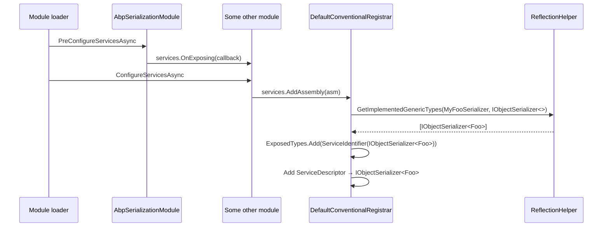

The ABP Framework provides a thin "serialize/deserialize an object to bytes" abstraction that infrastructure code uses without taking a hard dependency on `System.Text.Json` or `Newtonsoft.Json`. This page tours `framework/src/Volo.Abp.Serialization/` — only three production source files plus the module — and explains how typed `IObjectSerializer<T>` registrations are auto-exposed by `AbpSerializationModule.PreConfigureServices`.

## Responsibility

- **Provide a backend-agnostic byte-array serializer** through `IObjectSerializer`.
- **Allow per-type override** via `IObjectSerializer<T>` — registering one wins for that specific `T`.
- **Default to `System.Text.Json`** in `DefaultObjectSerializer` when no typed serializer is registered.
- **Auto-discover** typed serializers at module configuration time using the `OnExposing` hook from [Dependency Injection](/core/dependency-injection).

## File inventory

| File | Purpose |
| --- | --- |
| `framework/src/Volo.Abp.Serialization/Volo/Abp/Serialization/IObjectSerializer.cs` | Two interfaces: `IObjectSerializer` and `IObjectSerializer<T>`. |
| `framework/src/Volo.Abp.Serialization/Volo/Abp/Serialization/DefaultObjectSerializer.cs` | Default implementation. `ITransientDependency`. Uses `System.Text.Json`. |
| `framework/src/Volo.Abp.Serialization/Volo/Abp/Serialization/AbpSerializationModule.cs` | The module. Uses `services.OnExposing` to auto-add typed `IObjectSerializer<T>` exposures. |
| `framework/src/Volo.Abp.Serialization/Volo.Abp.Serialization.csproj` | Standard project layout; references `Volo.Abp.Core`. |
| `framework/src/Volo.Abp.Serialization/Volo.Abp.Serialization.abppkg` and `.abppkg.analyze.json` | ABP Studio analysis metadata. |
| `framework/src/Volo.Abp.Serialization/FodyWeavers.xml` / `.xsd` | Empty Fody configuration (no weavers active). |

## Key abstractions

| Class / interface | File | What it does | Who calls it |
| --- | --- | --- | --- |
| `IObjectSerializer` | `IObjectSerializer.cs` | `byte[]? Serialize<T>(T? obj)` and `T? Deserialize<T>(byte[] bytes)`. | Caches, distributed event bus, background jobs, multi-tenancy state |
| `IObjectSerializer<T>` | `IObjectSerializer.cs` | `byte[]? Serialize(T? obj)` and `T? Deserialize(byte[]? bytes)`. Per-type optimised serializer. | `DefaultObjectSerializer` dispatch |
| `DefaultObjectSerializer` | `DefaultObjectSerializer.cs` | `ITransientDependency`. Constructor takes `IServiceProvider`. Each `Serialize<T>` / `Deserialize<T>` call `CreateScope()`, looks up `IObjectSerializer<T>`, and uses it if present; otherwise falls back to `JsonSerializer.SerializeToUtf8Bytes(obj)` / `JsonSerializer.Deserialize<T>(bytes)`. | The default `IObjectSerializer` registration |
| `AbpSerializationModule` | `AbpSerializationModule.cs` | `PreConfigureServices` registers an `OnExposing` callback that adds, for every registered type, the implemented `IObjectSerializer<>` generic closures to `OnServiceExposingContext.ExposedTypes`. | The module loader |

## Attribute inventory

None — the package does not define attributes.

## Resolution flow

```mermaid
flowchart TB
    caller[Caller] --> ser[IObjectSerializer.Serialize&lt;Foo&gt;(foo)]
    ser --> def[DefaultObjectSerializer.Serialize]
    def --> nul{foo == null?}
    nul -->|yes| retNull[return null]
    nul -->|no| scope[CreateScope]
    scope --> lookup[scope.ServiceProvider.GetService&lt;IObjectSerializer&lt;Foo&gt;&gt;]
    lookup --> hit{specific serializer?}
    hit -->|yes| specific[specific.Serialize foo]
    hit -->|no| auto[AutoSerialize foo<br/>JsonSerializer.SerializeToUtf8Bytes]
    specific --> bytes[byte array]
    auto --> bytes
```

`DefaultObjectSerializer` always creates a fresh DI scope per call. That isolates any scoped state the specific serializer might hold (e.g. a `IStringLocalizerFactory` cache) and prevents accidental leakage across callers.

The fallback path uses `System.Text.Json`'s default options. There are no converters wired in — typed JSON shaping (camel-case, enum-as-string, polymorphism) requires writing an `IObjectSerializer<T>` implementation.

## Module auto-exposure

`AbpSerializationModule.PreConfigureServices` registers an `OnExposing` callback:

```csharp
public override void PreConfigureServices(ServiceConfigurationContext context)
{
    context.Services.OnExposing(onServiceExposingContext =>
    {
        // Register types for IObjectSerializer<T> if implements
        onServiceExposingContext.ExposedTypes.AddRange(
            ReflectionHelper.GetImplementedGenericTypes(
                onServiceExposingContext.ImplementationType,
                typeof(IObjectSerializer<>)
            ).ConvertAll(t => new ServiceIdentifier(t))
        );
    });
}
```

The effect: any class implementing `IObjectSerializer<MyEntity>` is automatically registered against `IObjectSerializer<MyEntity>` *in addition to* whatever the class declares via `[ExposeServices]`. The mechanism is the standard registration pipeline described in [Dependency Injection](/core/dependency-injection) — `OnExposing` callbacks mutate the `OnServiceExposingContext.ExposedTypes` list, then `DefaultConventionalRegistrar.AddType` materialises descriptors for each exposed type.



## DefaultObjectSerializer line by line

The full source of `DefaultObjectSerializer.cs` is short enough to walk in detail:

```csharp
public class DefaultObjectSerializer : IObjectSerializer, ITransientDependency
{
    private readonly IServiceProvider _serviceProvider;

    public DefaultObjectSerializer(IServiceProvider serviceProvider)
    {
        _serviceProvider = serviceProvider;
    }

    public virtual byte[]? Serialize<T>(T? obj)
    {
        if (obj == null) return null;

        using (var scope = _serviceProvider.CreateScope())
        {
            var specificSerializer = scope.ServiceProvider.GetService<IObjectSerializer<T>>();
            if (specificSerializer != null) return specificSerializer.Serialize(obj);
        }

        return AutoSerialize(obj);
    }

    public virtual T? Deserialize<T>(byte[]? bytes)
    {
        if (bytes == null) return default;

        using (var scope = _serviceProvider.CreateScope())
        {
            var specificSerializer = scope.ServiceProvider.GetService<IObjectSerializer<T>>();
            if (specificSerializer != null) return specificSerializer.Deserialize(bytes);
        }

        return AutoDeserialize<T>(bytes);
    }

    protected virtual byte[] AutoSerialize<T>(T obj) =>
        JsonSerializer.SerializeToUtf8Bytes(obj);

    protected virtual T? AutoDeserialize<T>(byte[] bytes) =>
        JsonSerializer.Deserialize<T>(bytes);
}
```

Key observations:

- `Serialize<T>` and `Deserialize<T>` are both `virtual`, so a subclass can override either independently.
- `AutoSerialize<T>` and `AutoDeserialize<T>` are `protected virtual` — subclasses can change the fallback encoding without touching the lookup logic. A subclass that overrides `AutoSerialize` to use `Newtonsoft.Json` keeps the typed-serializer lookup intact.
- The `using` block scopes the lookup so any disposables resolved while constructing `IObjectSerializer<T>` get cleaned up before the (possibly different) typed serializer is invoked.
- `JsonSerializer` is the BCL's `System.Text.Json.JsonSerializer`. No serializer options are passed — defaults apply (PascalCase property names, no enum string conversion, throws on cycles).

## How to override the default serializer

There are two ways. **Per-type**: implement `IObjectSerializer<T>` for the type you care about. The framework's auto-exposure (see below) registers it automatically. **Global**: replace the default `IObjectSerializer` registration.

<Tabs>
  <Tab title="Per-type override">
    ```csharp
    public class MessagePackBlobSerializer : IObjectSerializer<Blob>, ITransientDependency
    {
        public byte[]? Serialize(Blob? obj) => obj == null ? null : MessagePackSerializer.Serialize(obj);
        public Blob? Deserialize(byte[]? bytes) => bytes == null ? null : MessagePackSerializer.Deserialize<Blob>(bytes);
    }
    ```
    No `[ExposeServices]` needed — `AbpSerializationModule.PreConfigureServices` will add `IObjectSerializer<Blob>` to the exposed types via its `OnExposing` callback.
  </Tab>
  <Tab title="Global replacement">
    ```csharp
    public class MyAppModule : AbpModule
    {
        public override void ConfigureServices(ServiceConfigurationContext ctx)
        {
            ctx.Services.Replace(
                ServiceDescriptor.Transient<IObjectSerializer, MyCustomDefault>()
            );
        }
    }
    ```
    Use this when you want different JSON options globally (e.g. camelCase, enums as strings).
  </Tab>
</Tabs>

## Connections

**Depends on:**

- `Volo.Abp.Core` for `Reflection.ReflectionHelper.GetImplementedGenericTypes`, `IConventionalRegistrar` pipeline, and the `OnExposing` extension.
- `System.Text.Json` (transitively via `Volo.Abp.Core`'s package references on `Microsoft.Extensions.*` and the BCL).

**Depended on by:**

- `Volo.Abp.Caching` — distributed cache serialises values via `IObjectSerializer`.
- `Volo.Abp.BackgroundJobs` — job arguments are serialised before persistence.
- `Volo.Abp.EventBus.Distributed` — integration event envelopes use it.
- `Volo.Abp.MultiTenancy` — to round-trip tenant resolution state across queues.

## Gotchas & invariants

<Warning>
`DefaultObjectSerializer.AutoSerialize<T>` uses `System.Text.Json` with **no configured options**. That means enums serialise as numbers, properties are camelCase by JSON.NET history but PascalCase here, and reference cycles throw. Register an `IObjectSerializer<T>` if you need different shape for a specific type.
</Warning>

- **`Serialize<T>(null)` returns `null`.** The `T? obj` parameter is checked first; the result is `null` bytes, not an empty array.
- **`Deserialize<T>(null)` returns `default(T)`.** This means deserialising `null` bytes into `int` yields `0`, not an exception — be careful with non-nullable value types.
- **A fresh DI scope is created per call.** That is intentional but has a measurable cost. For very hot paths consider injecting `IObjectSerializer<T>` directly so you skip the lookup and scope creation.
- **`IObjectSerializer<T>` does not extend `IObjectSerializer`.** They are separate interfaces. A class can implement one without the other. Most type-specific serializers also implement `IObjectSerializer` so they can be used as the fallback for unspecified `T`.
- **The auto-exposing only inspects the *implementation* type for closed generic interfaces.** A class that implements `IObjectSerializer<Foo>` *through* a base class is fine; `ReflectionHelper.GetImplementedGenericTypes` walks the type's interfaces and base hierarchy.
- **No streaming API.** `IObjectSerializer.Serialize<T>` returns a `byte[]`. Large payloads materialise fully in memory.
- **No async API.** `System.Text.Json`'s sync path is used; large objects block the calling thread.

## Worked example: a typed serializer

```csharp
public class FooSerializer : IObjectSerializer<Foo>, ITransientDependency
{
    public byte[]? Serialize(Foo? obj)
    {
        if (obj == null) return null;
        // Custom binary layout, MessagePack, Avro, ...
        return MyEncoder.Encode(obj);
    }

    public Foo? Deserialize(byte[]? bytes)
    {
        if (bytes == null) return null;
        return MyEncoder.Decode<Foo>(bytes);
    }
}
```

Because `AbpSerializationModule` registered an `OnExposing` callback, `FooSerializer` is automatically registered as `IObjectSerializer<Foo>` even if you did not annotate it with `[ExposeServices(typeof(IObjectSerializer<Foo>))]`. Resolving `IObjectSerializer.Serialize<Foo>(...)` will route through `FooSerializer`; resolving `IObjectSerializer.Serialize<Bar>(...)` falls back to JSON.

## When to override the default

| Use case | Approach |
| --- | --- |
| Per-type custom JSON options | `IObjectSerializer<MyDto>` calling `JsonSerializer.Serialize(obj, customOptions)`. |
| MessagePack/binary format for caches | `IObjectSerializer<MyEntity>` returning MessagePack bytes. |
| Replace global default | `services.Replace(ServiceDescriptor.Transient<IObjectSerializer, MyCustomDefault>())` in your module. |
| Use Newtonsoft.Json globally | Implement your own `IObjectSerializer` over `Newtonsoft.Json` and replace the default registration. |

## Related pages

<CardGroup cols={2}>
  <Card title="Dependency Injection" icon="plug" href="/core/dependency-injection">
    `OnExposing` is the hook the module uses.
  </Card>
  <Card title="Reflection & Internal" icon="microscope" href="/core/reflection-and-internal">
    `ReflectionHelper.GetImplementedGenericTypes` does the heavy lifting.
  </Card>
  <Card title="Threading" icon="bolt" href="/core/threading">
    Avoid `AsyncHelper.RunSync` around `Serialize/Deserialize` — the calls are already sync.
  </Card>
  <Card title="Volo.Abp.Core" icon="cube" href="/core/volo-abp-core">
    `System.Text.Json` ships transitively; no explicit package reference here.
  </Card>
</CardGroup>
