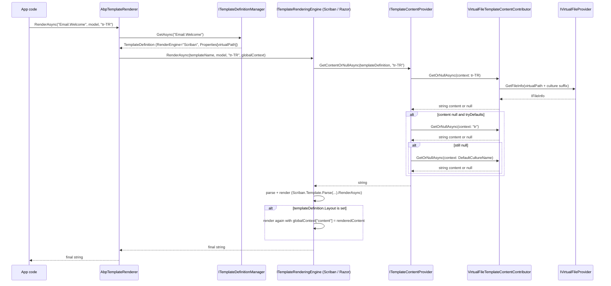
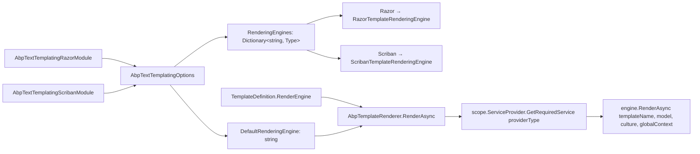

The ABP Framework provides a templating subsystem used for e-mail bodies, notification text, code generation, and any other "render a string from a model" scenario. The implementation is split into a Core package (definitions, renderer dispatch, virtual-file lookup) and two pluggable rendering engines (Razor, Scriban). This page walks `framework/src/Volo.Abp.TextTemplating.Core/`, `framework/src/Volo.Abp.TextTemplating.Razor/`, and `framework/src/Volo.Abp.TextTemplating.Scriban/`. The historical `Volo.Abp.TextTemplating` meta-package is also covered.

## Responsibility

- **Define templates statically** through `TemplateDefinitionProvider` and `Define(...)` so they participate in static-definition caching.
- **Look up template metadata** by name through `ITemplateDefinitionManager`, which composes a static and a dynamic store.
- **Find template content** through chained `ITemplateContentContributor`s — including the built-in virtual-file contributor that reads from `IVirtualFileProvider`.
- **Render** through `ITemplateRenderer` (`AbpTemplateRenderer`) which dispatches to a per-template or default rendering engine.
- **Support multiple engines simultaneously** — Scriban and Razor are registered side by side; a template's `RenderEngine` property picks the right one.
- **Handle culture fallback** — request culture → base culture (drop `-XX`) → default culture → culture-independent.
- **Support layouts** — Scriban and Razor templates can declare a parent layout that wraps the rendered content via the `content` global variable.

## File inventory

### `framework/src/Volo.Abp.TextTemplating/`

| File | Purpose |
| --- | --- |
| `AbpTextTemplatingModule.cs` | `[Obsolete]` meta-module that depends on `AbpTextTemplatingScribanModule`. Comment: *"This module will be removed in the future. Please use AbpTextTemplatingScribanModule or AbpTextTemplatingRazorModule."* |

### `framework/src/Volo.Abp.TextTemplating.Core/Volo/Abp/TextTemplating/`

| File | Purpose |
| --- | --- |
| `AbpTextTemplatingCoreModule.cs` | `[DependsOn(typeof(AbpVirtualFileSystemModule), typeof(AbpLocalizationAbstractionsModule))]`. `PreConfigureServices` auto-collects `ITemplateDefinitionProvider`s and `ITemplateContentContributor`s via `services.OnRegistered`. |
| `AbpTextTemplatingOptions.cs` | `ITypeList<ITemplateDefinitionProvider> DefinitionProviders`, `ITypeList<ITemplateContentContributor> ContentContributors`, `IDictionary<string, Type> RenderingEngines`, `string? DefaultRenderingEngine`, `HashSet<string> DeletedTemplates`. |
| `ITemplateRenderer.cs` | `Task<string> RenderAsync(templateName, model?, cultureName?, globalContext?)`. |
| `AbpTemplateRenderer.cs` | Default `ITemplateRenderer`, `ITransientDependency`. Looks up the template definition, picks the engine (`templateDefinition.RenderEngine ?? Options.DefaultRenderingEngine`), creates a scope, resolves the engine, and forwards. |
| `ITemplateRenderingEngine.cs` | `string Name { get; }` + `RenderAsync`. |
| `TemplateRenderingEngineBase.cs` | Shared base: stores `ITemplateDefinitionManager`, `ITemplateContentProvider`, `IStringLocalizerFactory`; helpers `GetContentOrNullAsync`, `GetLocalizerOrNull`. |
| `ITemplateDefinition*.cs` family | The provider/manager/context/store contracts. |
| `TemplateDefinition.cs` | The definition class — see [Modularity](/core/modularity) for `Properties` patterns. |
| `TemplateDefinitionProvider.cs` | Abstract base with `PreDefine`, `Define`, `PostDefine`. `ITransientDependency`. |
| `TemplateDefinitionManager.cs` | `ISingletonDependency`. Composes a static store and a dynamic store; static wins. |
| `StaticTemplateDefinitionStore.cs` | `ISingletonDependency`. Backed by `IStaticDefinitionCache<TemplateDefinition, Dictionary<string, TemplateDefinition>>`. Resolves providers in a scope and iterates `PreDefine` → `Define` → `PostDefine`. |
| `IDynamicTemplateDefinitionStore.cs` / `NullIDynamicTemplateDefinitionStore.cs` | Contract + no-op default. |
| `TemplateDefinitionExtensions.cs` | `WithVirtualFilePath(virtualPath, isInlineLocalized)` writes the virtual path into `Properties`. `GetVirtualFilePathOrNull` reads it. |
| `ITemplateContentProvider.cs` / `TemplateContentProvider.cs` | `GetContentOrNullAsync(templateName | TemplateDefinition, cultureName?, tryDefaults, useCurrentCultureIfCultureNameIsNull)`. The implementation iterates `Options.ContentContributors` and handles culture fallback. |
| `ITemplateContentContributor.cs` / `TemplateContentContributorContext.cs` | Per-content-source interface and the call-context bag. |
| `TemplateDefinitionContext.cs` | Mutable bag passed to providers' `Define`. |
| `StaticTemplateDefinitionChangedEvent.cs` | Distributed event raised when static definitions are invalidated. |
| `VirtualFiles/VirtualFileTemplateContentContributor.cs` | Reads template content from `IVirtualFileProvider` using the path stored via `WithVirtualFilePath`. |
| `VirtualFiles/ILocalizedTemplateContentReader.cs` etc. | Per-locale content reader chain (folder-based vs flat-file). |
| `VirtualFiles/TemplateContentFileProvider.cs` / `TemplateContentFileInfo.cs` | Virtual file wrappers. |

### `framework/src/Volo.Abp.TextTemplating.Razor/Volo/Abp/TextTemplating/Razor/`

| File | Purpose |
| --- | --- |
| `AbpTextTemplatingRazorModule.cs` | `[DependsOn(typeof(AbpTextTemplatingCoreModule))]`. Registers `RazorTemplateRenderingEngine` and sets `DefaultRenderingEngine` if no other engine claimed it. |
| `RazorTemplateRenderingEngine.cs` | The engine. `EngineName = "Razor"`. |
| `AbpRazorTemplateCSharpCompiler.cs`, `AbpRazorTemplateCSharpCompilerOptions.cs` | Roslyn compiler wrapper for Razor pages. |
| `AbpCompiledViewProviderOptions.cs`, `IAbpCompiledViewProvider.cs`, `DefaultAbpCompiledViewProvider.cs` | Caches compiled view delegates. |
| `IAbpRazorProjectEngineFactory.cs`, `DefaultAbpRazorProjectEngineFactory.cs` | Builds `RazorProjectEngine` instances. |
| `RazorTemplatePageBase.cs`, `IRazorTemplatePage.cs` | Base class generated Razor pages inherit. |
| `RazorTemplateDefinitionExtensions.cs` | `WithRazorEngine()` setter on `TemplateDefinition`. |
| `AbpRazorTemplateConsts.cs` | `DefaultNameSpace = "Abp.Razor"`, `DefaultClassName = "Template"`, `TypeName = "Abp.Razor.Template"`. |
| `EmptyProjectFileSystem.cs`, `NotFoundProjectItem.cs` | Razor virtual file system shims. |

### `framework/src/Volo.Abp.TextTemplating.Scriban/Volo/Abp/TextTemplating/Scriban/`

| File | Purpose |
| --- | --- |
| `AbpTextTemplatingScribanModule.cs` | `[DependsOn(typeof(AbpTextTemplatingCoreModule))]`. Sets `DefaultRenderingEngine = "Scriban"` and registers the engine type. |
| `ScribanTemplateRenderingEngine.cs` | The engine. `EngineName = "Scriban"`. |
| `ScribanTemplateLocalizer.cs` | Wraps `IStringLocalizer` so Scriban scripts can call `L("Key")`. |
| `ScribanTemplateDefinitionExtensions.cs` | `WithScribanEngine()` setter. |

## Key abstractions

| Class / interface | File | What it does | Who calls it |
| --- | --- | --- | --- |
| `ITemplateRenderer` | `ITemplateRenderer.cs` | Public entry point. | App code |
| `AbpTemplateRenderer` | `AbpTemplateRenderer.cs` | Looks up `templateDefinition.RenderEngine` or falls back to `Options.DefaultRenderingEngine`. Picks the engine type from `Options.RenderingEngines` and resolves it in a fresh scope. Throws `AbpException("There is no rendering engine found with template name: ...")` if neither is set. | DI resolution |
| `ITemplateRenderingEngine` | `ITemplateRenderingEngine.cs` | `Name` + `RenderAsync`. | `AbpTemplateRenderer` |
| `ScribanTemplateRenderingEngine` | `ScribanTemplateRenderingEngine.cs` | Uses `Scriban.Template.Parse(content).RenderAsync(context)`. Pushes culture and a `ScriptObject` containing `model`, `globalContext`, and an `L(...)` localizer if available. Supports `templateDefinition.Layout` — sets `globalContext["content"] = renderedContent`, then renders the layout. | DI resolution |
| `RazorTemplateRenderingEngine` | `RazorTemplateRenderingEngine.cs` | Uses `AbpRazorTemplateCSharpCompiler` to compile the template to a class deriving from `RazorTemplatePageBase`. | DI resolution |
| `ITemplateDefinitionManager` | `ITemplateDefinitionManager.cs` | `GetAsync`, `GetAllAsync`, `GetOrNullAsync`. | `AbpTemplateRenderer`, content provider |
| `TemplateDefinitionManager` | `TemplateDefinitionManager.cs` | Composes `IStaticTemplateDefinitionStore` and `IDynamicTemplateDefinitionStore`. Static wins on name collisions. `GetAsync` throws `AbpException("Undefined Template: ...")` if not found. | DI resolution |
| `IStaticTemplateDefinitionStore` / `StaticTemplateDefinitionStore` | `…StaticTemplateDefinitionStore.cs` | Uses `IStaticDefinitionCache<TemplateDefinition, Dictionary<string, TemplateDefinition>>` for memoisation. On miss, creates a scope, resolves each `Options.DefinitionProviders` entry, and runs `PreDefine`/`Define`/`PostDefine` over a shared `TemplateDefinitionContext`. | `TemplateDefinitionManager` |
| `IDynamicTemplateDefinitionStore` / `NullIDynamicTemplateDefinitionStore` | `…DynamicTemplateDefinitionStore.cs`, `NullIDynamicTemplateDefinitionStore.cs` | Default returns cached empty results. | `TemplateDefinitionManager` |
| `TemplateDefinition` | `TemplateDefinition.cs` | The metadata record. `Name`, `DisplayName` (`ILocalizableString`), `IsLayout`, `Layout`, `LocalizationResourceName`, `IsInlineLocalized`, `DefaultCultureName`, `RenderEngine`, `Properties` bag. `WithRenderEngine(name)` and `WithProperty(key, value)` fluent setters. `MaxNameLength = 128`. | Providers |
| `TemplateDefinitionProvider` | `TemplateDefinitionProvider.cs` | Abstract base; override `Define(context)`. `ITransientDependency`. | Application modules |
| `ITemplateContentProvider` / `TemplateContentProvider` | `ITemplateContentProvider.cs`, `TemplateContentProvider.cs` | Iterates `Options.ContentContributors` and applies culture fallback (`xx-YY` → `xx` → `IsInlineLocalized` ? culture-independent : `DefaultCultureName`). Throws `AbpException("No template content contributor was registered. Use AbpTextTemplatingOptions to register contributors!")` if none. | Rendering engines |
| `ITemplateContentContributor` | `ITemplateContentContributor.cs` | Single `GetOrNullAsync(TemplateContentContributorContext)` method. | `TemplateContentProvider` |
| `VirtualFileTemplateContentContributor` | `VirtualFiles/VirtualFileTemplateContentContributor.cs` | Reads content from `IVirtualFileProvider` using the path stored via `WithVirtualFilePath`. | Default contributor |
| `ScribanTemplateLocalizer` | `ScribanTemplateLocalizer.cs` | Bridges `IStringLocalizer` to Scriban's `IScriptObject`. The `L` member becomes callable from templates. | Scriban engine |
| `AbpTextTemplatingCoreModule` | `AbpTextTemplatingCoreModule.cs` | Auto-collects providers/contributors via `services.OnRegistered`. | Module loader |
| `AbpTextTemplatingScribanModule` / `AbpTextTemplatingRazorModule` | The two engine modules. | Configure `Options.DefaultRenderingEngine` and `Options.RenderingEngines[name] = engineType`. | Module loader |

## Module auto-collection

`AbpTextTemplatingCoreModule.PreConfigureServices` does the same trick as `AbpSerializationModule` — it inspects every type registered with the container and, if it implements `ITemplateDefinitionProvider` or `ITemplateContentContributor`, adds it to the corresponding `Options.DefinitionProviders` / `Options.ContentContributors` `ITypeList`:

```csharp
services.OnRegistered(context =>
{
    if (typeof(ITemplateDefinitionProvider).IsAssignableFrom(context.ImplementationType))
    {
        definitionProviders.Add(context.ImplementationType);
    }

    if (typeof(ITemplateContentContributor).IsAssignableFrom(context.ImplementationType))
    {
        contentContributors.Add(context.ImplementationType);
    }
});

services.Configure<AbpTextTemplatingOptions>(options =>
{
    options.DefinitionProviders.AddIfNotContains(definitionProviders);
    options.ContentContributors.AddIfNotContains(contentContributors);
});
```

That is why writing a new `TemplateDefinitionProvider` requires **zero** module wiring — `[ExposeServices]` is implicit via the base class's `[ExposeServices(typeof(ITemplateDefinitionProvider))]` (defined on `TemplateDefinitionProvider`).

## Render pipeline



## Culture fallback rules

`TemplateContentProvider.GetContentOrNullAsync` implements the fallback chain in this exact order:

1. **Requested culture** (or `CultureInfo.CurrentUICulture.Name` if `cultureName == null && useCurrentCultureIfCultureNameIsNull`).
2. If still null and `cultureName` contains `-` (e.g. `tr-TR`), try the **base culture** (`tr`) via `CultureHelper.GetBaseCultureName`.
3. If `IsInlineLocalized`, try **null culture** (culture-independent).
4. Otherwise try `templateDefinition.DefaultCultureName`.

If `Options.ContentContributors` is empty the method throws `AbpException("No template content contributor was registered. Use AbpTextTemplatingOptions to register contributors!")`.

## Layouts

A template definition can declare `Layout = "SomeLayoutName"`. When the engine sees a non-null `Layout`:

```csharp
if (templateDefinition.Layout != null)
{
    globalContext["content"] = renderedContent;
    renderedContent = await RenderInternalAsync(templateDefinition.Layout, globalContext);
}
```

The layout template is rendered with the inner template's output available as the `content` global variable. Layouts can themselves declare `IsLayout = true` — that flag is informational, not enforced.

## Engine registration



`AbpTextTemplatingScribanModule.ConfigureServices` always sets `DefaultRenderingEngine = "Scriban"`. `AbpTextTemplatingRazorModule.ConfigureServices` only sets the default if it is still null/whitespace — so depending on both modules makes Scriban the default unless you depend on Razor *first* and Scriban is absent.

## Connections

**Depends on:**

- `Volo.Abp.VirtualFileSystem` — for template content lookup.
- `Volo.Abp.Localization.Abstractions` — for `IStringLocalizer` integration.
- `Volo.Abp.StaticDefinitions` — for `IStaticDefinitionCache`.
- `Scriban` NuGet (for the Scriban engine).
- `Microsoft.AspNetCore.Razor.Language` + Roslyn (for the Razor engine).

**Depended on by:**

- `Volo.Abp.Emailing.Templates` — renders email bodies through `ITemplateRenderer`.
- `Volo.Abp.TextTemplateManagement` — provides the database-backed `IDynamicTemplateDefinitionStore`.
- `Volo.Abp.Identity.Pro` and modules with notification text.

## Gotchas & invariants

<Warning>
`AbpTextTemplatingModule` (in `framework/src/Volo.Abp.TextTemplating/`) is marked `[Obsolete]`. New modules should depend on `AbpTextTemplatingScribanModule` and/or `AbpTextTemplatingRazorModule` directly. The obsolete attribute carries a clear message: *"This module will be removed in the future."*
</Warning>

- **Static templates win over dynamic.** `TemplateDefinitionManager.GetAllAsync` projects static names into an `ImmutableHashSet<string>` and filters dynamic templates by `!staticTemplateNames.Contains(d.Name)`. A database-backed dynamic definition with the same name as a code-defined static one is invisible.
- **`Options.ContentContributors.Any() == false` throws.** Make sure at least one contributor is registered — `VirtualFileTemplateContentContributor` is the default but only kicks in when a template uses `WithVirtualFilePath`.
- **`AbpTemplateRenderer` resolves the engine in a fresh scope.** The engine instance does not survive across `RenderAsync` calls. Engines that hold expensive state (e.g. Razor compiled views) cache it through singleton-scoped helpers (`IAbpCompiledViewProvider`).
- **Culture fallback is not symmetric.** `tr-TR` falls back to `tr` only when the requested culture contains `-`. Asking for plain `tr` does not fall through to `tr-TR`.
- **`IsInlineLocalized` opts into culture-independent fallback.** When true, the contributor is asked for `null` culture before trying `DefaultCultureName`. When false, only `DefaultCultureName` is tried.
- **`TemplateDefinition.MaxNameLength = 128`.** `Check.NotNullOrWhiteSpace(name, nameof(name), MaxNameLength)` is called from the constructor — names ≥ 128 chars throw `ArgumentException`.
- **`TemplateDefinitionContext` is mutable and shared across `PreDefine` → `Define` → `PostDefine`.** Use `context.Add(...)` to add definitions. Two providers calling `context.Add(new TemplateDefinition("X", ...))` will produce a "Template with name 'X' already exists" duplicate-key error inside the dictionary.
- **Scriban renders inside `using (CultureHelper.Use(cultureName))`.** That changes `CultureInfo.CurrentCulture` for the duration of the render. Long-running templates therefore affect ambient culture in callees; design accordingly.
- **Razor compilation is *expensive on first call*.** `DefaultAbpCompiledViewProvider` caches the compiled assemblies; warm them at startup if first-render latency matters.

## Worked example: a Scriban template

```csharp
public class WelcomeTemplateDefinitionProvider : TemplateDefinitionProvider
{
    public override void Define(ITemplateDefinitionContext context)
    {
        context.Add(
            new TemplateDefinition("Email.Welcome", typeof(MyResource))
                .WithVirtualFilePath("/Templates/Welcome.tpl", isInlineLocalized: true)
                .WithScribanEngine()
                .WithProperty("Subject", "Welcome to MyApp"));
    }
}
```

Embed `Templates/Welcome.tpl` in the module (see [Virtual File System](/core/virtual-file-system)):

```
Hello {{ model.UserName }}, welcome to {{ L "AppName" }}.
```

Then render it from any service:

```csharp
public class WelcomeMailer : ITransientDependency
{
    private readonly ITemplateRenderer _renderer;
    public WelcomeMailer(ITemplateRenderer renderer) => _renderer = renderer;

    public Task<string> BuildAsync(string userName, string culture) =>
        _renderer.RenderAsync("Email.Welcome", new { UserName = userName }, culture);
}
```

## Related pages

<CardGroup cols={2}>
  <Card title="Virtual File System" icon="folder-tree" href="/core/virtual-file-system">
    Where template content lives.
  </Card>
  <Card title="Options & Configuration" icon="gear" href="/core/options-and-configuration">
    `AbpTextTemplatingOptions` is the configuration surface.
  </Card>
  <Card title="Reflection & Internal" icon="microscope" href="/core/reflection-and-internal">
    `IStaticDefinitionCache` memoises template definitions.
  </Card>
  <Card title="Modularity" icon="layer-group" href="/core/modularity">
    `[DependsOn]` for engine modules.
  </Card>
</CardGroup>
