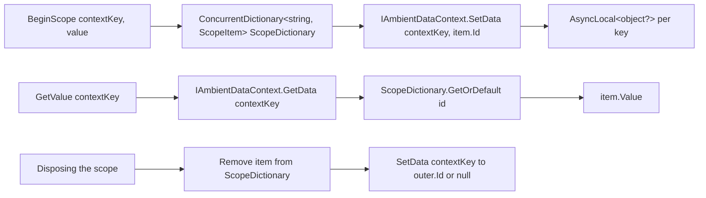
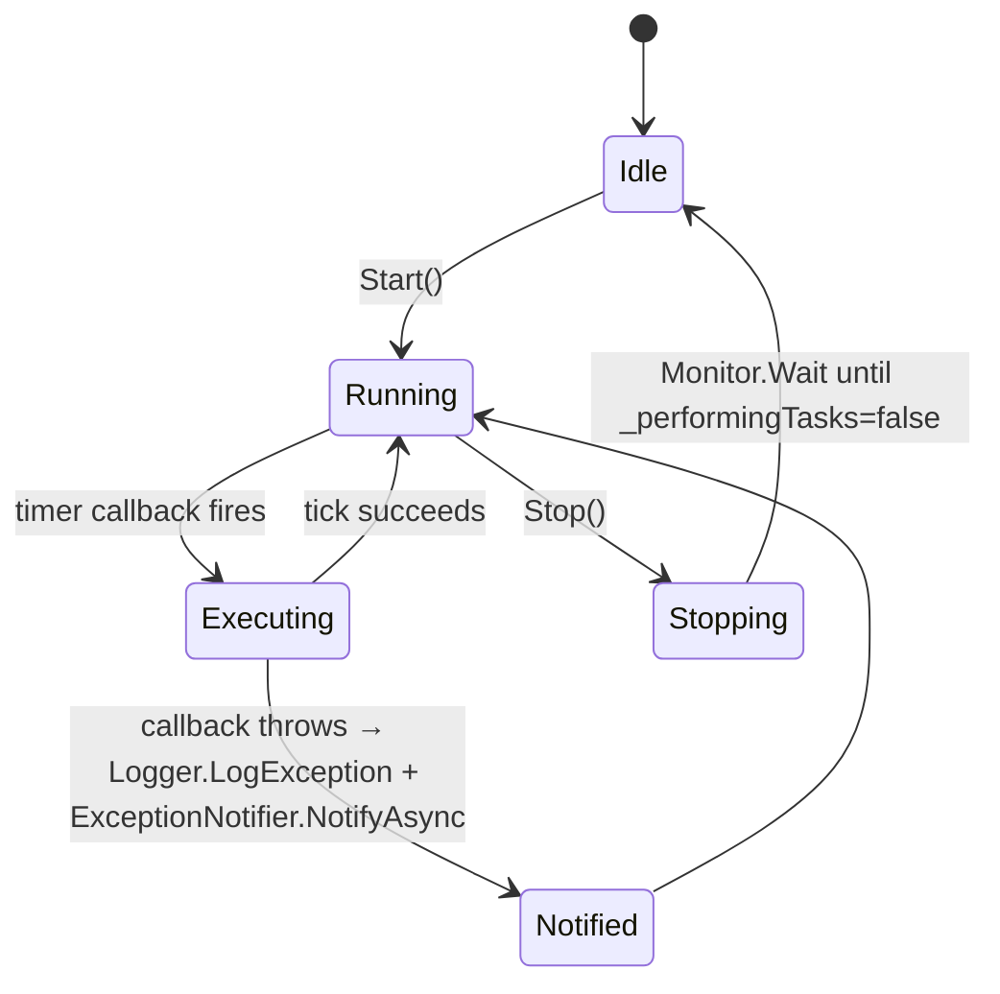

The ABP Framework groups its concurrency utilities into two locations: the small `Volo.Abp.Threading` package (`framework/src/Volo.Abp.Threading/`) for service-shaped helpers like `ICancellationTokenProvider`, `IAmbientScopeProvider`, and `AbpAsyncTimer`; and the `Volo/Abp/Threading/` folder in `Volo.Abp.Core` for static helpers like `AsyncHelper`, `KeyedLock`, and `OneTimeRunner`. This page tours both.

## Responsibility

- **Cancellation propagation** — `ICancellationTokenProvider` lets long-running code resolve "the current cancellation token", overriding it in a `using` scope when needed.
- **Ambient scope storage** — `IAmbientScopeProvider<T>` plus `IAmbientDataContext` provide a typed `AsyncLocal`-backed scope stack (used by unit-of-work, current tenant, current user, etc.).
- **Sync-over-async bridging** — `AsyncHelper.RunSync` wraps `Nito.AsyncEx.AsyncContext.Run`.
- **Reflection-time async detection** — `IsAsync`, `IsTaskOrTaskOfT`, `UnwrapTask`.
- **Concurrency primitives** — `SemaphoreSlim` extension, ref-counted `KeyedLock`, single-shot `OneTimeRunner` / `AsyncOneTimeRunner`.
- **Robust periodic execution** — `AbpTimer` (sync) and `AbpAsyncTimer` (async) that never overlap their callbacks.
- **Reusable cached tasks** — `TaskCache` holds completed `Task<T>` instances for common values.

## File inventory

### `framework/src/Volo.Abp.Core/Volo/Abp/Threading/`

| File | Purpose |
| --- | --- |
| `AsyncHelper.cs` | `RunSync`, `IsAsync`, `IsTaskOrTaskOfT`, `IsTaskOfT`, `UnwrapTask`. |
| `InternalAsyncHelper.cs` | Internal helpers like `AwaitTaskWithFinally`, used by interceptors. |
| `KeyedLock.cs` | Per-key ref-counted `SemaphoreSlim`. `LockAsync`, `TryLockAsync` with timeout/cancellation. |
| `LockExtensions.cs` | `WithLock` / `Locking` extensions on `object`. |
| `OneTimeRunner.cs` | Run a code block at most once (sync). |
| `AsyncOneTimeRunner.cs` | Async variant using a `SemaphoreSlim` to gate the second entrant. |
| `SemaphoreSlimExtensions.cs` | `LockAsync()` returning an `IDisposable` to release. |
| `TaskCache.cs` | Common pre-completed tasks (e.g. `Task<bool>` true/false). |

### `framework/src/Volo.Abp.Threading/Volo/Abp/Threading/`

| File | Purpose |
| --- | --- |
| `AbpThreadingModule.cs` | Module class that registers `NullCancellationTokenProvider.Instance` and the open-generic `AmbientDataContextAmbientScopeProvider<>`. |
| `ICancellationTokenProvider.cs` | `CancellationToken Token { get; }` plus `IDisposable Use(CancellationToken)`. |
| `CancellationTokenProviderBase.cs` | Abstract base storing the override in an `IAmbientScopeProvider<CancellationTokenOverride>` keyed by `"Volo.Abp.Threading.CancellationToken.Override"`. |
| `NullCancellationTokenProvider.cs` | Sealed `Instance` that returns `OverrideValue?.CancellationToken ?? CancellationToken.None`. |
| `CancellationTokenOverride.cs` | Simple `CancellationToken` wrapper used as the ambient value. |
| `CancellationTokenProviderExtensions.cs` | `FallbackToProvider(this CancellationToken? token, ICancellationTokenProvider provider)` and similar helpers. |
| `IAmbientScopeProvider.cs` | `GetValue(contextKey)`, `BeginScope(contextKey, value)`. |
| `AmbientDataContextAmbientScopeProvider.cs` | Open-generic implementation backed by a `ConcurrentDictionary<string, ScopeItem>` and an `IAmbientDataContext`. |
| `IAmbientDataContext.cs` | `SetData/GetData(key, value?)`. |
| `AsyncLocalAmbientDataContext.cs` | Default impl. `ISingletonDependency`. Stores per-key `AsyncLocal<object?>` in a `ConcurrentDictionary`. |
| `AsyncLocalSimpleScopeExtensions.cs` | `BeginAsyncLocalSimpleScope` helpers. |
| `AbpAsyncTimer.cs` | Async non-overlapping periodic callback. Holds `Logger` + `IExceptionNotifier` for error reporting. `ITransientDependency`. |
| `AbpTimer.cs` | Sync counterpart with event-style `Elapsed`. |
| `IRunnable.cs` | `StartAsync(CancellationToken)` / `StopAsync(CancellationToken)` contract for background workers. |
| `Linq/AsyncQueryableExecuter.cs`, `IAsyncQueryableExecuter.cs`, `IAsyncQueryableProvider.cs` | LINQ async bridge for repositories. |

## Key abstractions

| Class / interface | File | What it does | Who calls it |
| --- | --- | --- | --- |
| `AsyncHelper.RunSync` | `AsyncHelper.cs` | Wraps `Nito.AsyncEx.AsyncContext.Run(func)`. Two overloads — `Func<Task>` and `Func<Task<TResult>>`. | Bridge code that must call async from a sync API (avoid in app code) |
| `AsyncHelper.IsAsync(MethodInfo)` | `AsyncHelper.cs` | `method.ReturnType.IsTaskOrTaskOfT()`. | `AsyncDeterminationInterceptor`, reflection helpers |
| `AsyncHelper.UnwrapTask(Type)` | `AsyncHelper.cs` | Returns `void` for `Task`, the generic arg for `Task<T>`, else the input. | Interceptors |
| `KeyedLock` | `KeyedLock.cs` | Per-key ref-counted `SemaphoreSlim`. `LockAsync(object)`, `LockAsync(key, ct)`, `TryLockAsync(key)`, `TryLockAsync(key, timeout, ct)`. Releaser disposes the semaphore when refcount hits zero. | Anywhere you need "one writer per key" |
| `OneTimeRunner` / `AsyncOneTimeRunner` | `OneTimeRunner.cs`, `AsyncOneTimeRunner.cs` | Run once. Double-checked locking. The async variant uses `SemaphoreSlim.LockAsync()`. | Module init that should not double-fire under load |
| `SemaphoreSlimExtensions.LockAsync` | `SemaphoreSlimExtensions.cs` | `await semaphoreSlim.WaitAsync()` then returns `IDisposable` that calls `Release()`. `[MethodImpl(MethodImplOptions.AggressiveInlining)]`. | `AsyncOneTimeRunner`, app code |
| `ICancellationTokenProvider` / `NullCancellationTokenProvider` | `ICancellationTokenProvider.cs`, `NullCancellationTokenProvider.cs` | Resolve "the current token". The null implementation is the default registration in `AbpThreadingModule.ConfigureServices`. ASP.NET Core overrides this with an `HttpContextCancellationTokenProvider`. | Repositories, app services |
| `CancellationTokenProviderBase` | `CancellationTokenProviderBase.cs` | Stores the `CancellationTokenOverride` inside an `IAmbientScopeProvider<CancellationTokenOverride>` with context key `"Volo.Abp.Threading.CancellationToken.Override"`. `Use(ct)` calls `BeginScope`. | All real implementations |
| `IAmbientScopeProvider<T>` / `AmbientDataContextAmbientScopeProvider<T>` | `IAmbientScopeProvider.cs`, `AmbientDataContextAmbientScopeProvider.cs` | Push/pop scoped values. The provider stores items in a static `ConcurrentDictionary<string, ScopeItem>` and uses an `IAmbientDataContext` to track the *current* item id per async context. | Cancellation overrides, unit-of-work, multi-tenancy, current user |
| `AsyncLocalAmbientDataContext` | `AsyncLocalAmbientDataContext.cs` | Default `IAmbientDataContext`, `ISingletonDependency`. Holds a `ConcurrentDictionary<string, AsyncLocal<object?>>`. | All real `IAmbientScopeProvider` usage |
| `AbpAsyncTimer` | `AbpAsyncTimer.cs` | Robust periodic timer. Holds a `Func<AbpAsyncTimer, Task> Elapsed`, an `int Period`, a `bool RunOnStart`, and exposes `Logger` and `ExceptionNotifier` (default `NullExceptionNotifier.Instance`). Tick failures are logged and notified. | Background workers |
| `AbpTimer` | `AbpTimer.cs` | Same shape but sync event-based. | Less common — most ABP code is async |
| `IRunnable` | `IRunnable.cs` | `StartAsync(CancellationToken)` / `StopAsync(CancellationToken)`. | Background workers like `BackgroundWorkerBase` |
| `IAsyncQueryableExecuter` / `AsyncQueryableExecuter` | `Linq/…` | Bridges `IQueryable<T>` to async EF Core methods so generic repositories don't need to reference EF Core directly. | Repositories |

## Threading module

```csharp
public class AbpThreadingModule : AbpModule
{
    public override void ConfigureServices(ServiceConfigurationContext context)
    {
        context.Services.AddSingleton<ICancellationTokenProvider>(NullCancellationTokenProvider.Instance);
        context.Services.AddSingleton(typeof(IAmbientScopeProvider<>), typeof(AmbientDataContextAmbientScopeProvider<>));
    }
}
```

`AbpThreadingModule` is *not* depended on transitively by `AbpKernelModule` etc. — packages that need cancellation/ambient scope add `[DependsOn(typeof(AbpThreadingModule))]` to their own module. The default `NullCancellationTokenProvider` is good enough for tests and console hosts; ASP.NET Core replaces it with `[Dependency(ReplaceServices = true)]` providers.

## Cancellation token flow

```mermaid
sequenceDiagram
    participant Outer as Outer code
    participant Prov as ICancellationTokenProvider
    participant Base as CancellationTokenProviderBase
    participant Scope as IAmbientScopeProvider&lt;CancellationTokenOverride&gt;
    participant Inner as Inner async method

    Outer->>Prov: provider.Use(myToken) → IDisposable
    Prov->>Base: Use(myToken)
    Base->>Scope: BeginScope("Volo.Abp.Threading.CancellationToken.Override", new CancellationTokenOverride(myToken))
    Inner->>Prov: var ct = provider.Token
    Prov->>Base: OverrideValue?.CancellationToken
    Base->>Scope: GetValue("Volo.Abp.Threading.CancellationToken.Override")
    Scope-->>Inner: myToken
    Outer->>Outer: scope.Dispose()
    Outer->>Scope: pops scope; provider.Token reverts to fallback
```

`CancellationTokenProviderExtensions.FallbackToProvider(this CancellationToken? token, ICancellationTokenProvider provider)` returns `token ?? provider.Token` — the canonical pattern for repositories that accept an explicit token but want to fall back to the ambient one.

## Ambient scope mechanics



The trick is that the *value* is not stored in `AsyncLocal` directly — only a string id is. The actual value lives in the static `ConcurrentDictionary` keyed by id. That avoids the well-known `AsyncLocal` capture problem (mutating an `AsyncLocal<T>` after spawning child flows does not propagate down).

`AsyncLocalAmbientDataContext` lazily creates one `AsyncLocal<object?>` per context key. The keys are typically constants in interceptor modules (e.g. `UnitOfWorkScope.Key`).

## KeyedLock semantics

`KeyedLock` (`Volo/Abp/Threading/KeyedLock.cs`) is a static helper that hands out per-key `SemaphoreSlim` instances and tracks reference counts so the underlying semaphore is disposed when no longer in use.

| Method | Behavior |
| --- | --- |
| `LockAsync(object key)` | Wait forever. Returns `IDisposable`. |
| `LockAsync(object key, CancellationToken)` | Cancellable wait. If cancellation throws, the ref count is decremented and the semaphore disposed if it was the last reference. |
| `TryLockAsync(object key)` | Non-blocking attempt (`WaitAsync(0)`). Returns `null` if not acquired. |
| `TryLockAsync(object key, TimeSpan, CancellationToken)` | Bounded wait. `timeout == default` means a non-blocking attempt. |

`Check.NotNull(key, nameof(key))` is the first thing each method does. The internal `Releaser` uses `Interlocked.Exchange(ref _disposed, 1)` to guarantee at-most-once release.

<Note>
The class doc cites the StackOverflow pattern (`https://stackoverflow.com/a/31194647`) used as a basis. Use `KeyedLock` rather than rolling your own per-key semaphore dictionary — the ref-counting eliminates the leak that naive implementations suffer.
</Note>

## AbpAsyncTimer flow



Important properties (from `AbpAsyncTimer.cs`):

- `Period` is the ms interval. `Start()` throws `AbpException("Period should be set before starting the timer!")` if zero.
- `RunOnStart = true` triggers a tick immediately on `Start`.
- The internal `System.Threading.Timer` is paused before each tick to ensure no overlap: `_taskTimer.Change(Timeout.Infinite, Timeout.Infinite);` while `_performingTasks = true`. After the tick completes, it re-arms with `_taskTimer.Change(Period, Timeout.Infinite);` inside the same lock.
- `Stop()` waits via `Monitor.Wait` for the in-flight tick before returning.
- `ExceptionNotifier` defaults to `NullExceptionNotifier.Instance` — DI replaces it with a real notifier once the timer is constructed inside a scope.

## OneTimeRunner and AsyncOneTimeRunner

Both use double-checked locking against the volatile `_runBefore` flag. `OneTimeRunner` locks `this`; `AsyncOneTimeRunner` uses a `SemaphoreSlim(1, 1)` via `SemaphoreSlimExtensions.LockAsync`. The async version's body is:

```csharp
if (_runBefore) return;
using (await _semaphore.LockAsync())
{
    if (_runBefore) return;
    await action();
    _runBefore = true;
}
```

The pattern lets you assign a `private static readonly OneTimeRunner Init = new();` at class level and call `Init.Run(() => ...)` from a constructor without worrying about reentrancy.

## Async detection helpers

| Method | Returns | Use case |
| --- | --- | --- |
| `IsAsync(MethodInfo)` | bool | `AbpAsyncDeterminationInterceptor` to pick the sync vs async pipeline. |
| `IsTaskOrTaskOfT(Type)` | bool | Same |
| `IsTaskOfT(Type)` | bool | When you need to know the generic arg. |
| `UnwrapTask(Type)` | `Type` | `Type → void/T/Type`. Useful for code-gen and proxy logic. |

## Connections

**Depends on:**

- `Volo.Abp.Core` (`Volo/Abp/Threading/`, `Volo/Abp/DependencyInjection/`, `Volo/Abp/ExceptionHandling/`).
- `Nito.AsyncEx.Context` (for `AsyncContext.Run` in `AsyncHelper.RunSync`).

**Depended on by:**

- `Volo.Abp.Uow` — uses `IAmbientScopeProvider<UnitOfWork>`.
- `Volo.Abp.MultiTenancy` — `ICurrentTenant` is backed by an ambient scope.
- `Volo.Abp.Users` — `ICurrentUser` similarly.
- `Volo.Abp.Timing` — uses `IAmbientScopeProvider` for `ICurrentTimezoneProvider`.
- Repositories and background workers across the framework.

## Gotchas & invariants

<Warning>
`AsyncHelper.RunSync` deadlocks in some hosts. It relies on `Nito.AsyncEx.AsyncContext.Run`, which installs a temporary single-threaded synchronization context. If the awaited code reposts to a *different* synchronization context (e.g. an old WinForms one), the inner code may never resume. Use it only at hard sync boundaries (e.g. `Main`, native callbacks).
</Warning>

- **`NullCancellationTokenProvider.Token` honours overrides.** Even though the name says "Null", `OverrideValue?.CancellationToken` is consulted first. You can `Use(myToken)` in a scope and have the null provider report `myToken` until the scope is disposed.
- **`IAmbientScopeProvider` keys are strings.** Two unrelated modules picking the same key will trample each other. The convention is to use a fully-qualified, namespaced constant — e.g. `CancellationTokenProviderBase.CancellationTokenOverrideContextKey = "Volo.Abp.Threading.CancellationToken.Override"`.
- **`AsyncLocalAmbientDataContext` stores in a static dictionary.** Once registered, that dictionary lives for the lifetime of the AppDomain. Test runners that share an AppDomain across tests inherit prior values unless each test disposes its scope.
- **`AbpAsyncTimer.Period <= 0` throws on `Start`.** Setting `Period = 0` to mean "as fast as possible" does not work. Use a small positive value.
- **`AbpAsyncTimer.Stop()` blocks on `Monitor.Wait`.** Calling it from inside the `Elapsed` callback deadlocks — the callback holds `_performingTasks = true` while waiting for it to become false.
- **`KeyedLock` key equality is dictionary semantics.** Two distinct string instances of `"foo"` are the same key (string equality), but two distinct boxed `int` values that compare equal are also the same key. Using mutable reference types as keys is asking for trouble.
- **`OneTimeRunner.Run(action)` is not exception-safe.** If `action()` throws, `_runBefore` is **not** set, so the next caller will retry. Wrap `action` in a try/catch if you want "once even on failure".
- **`SemaphoreSlimExtensions.LockAsync` returns a `ValueTask<IDisposable>`.** Mixing `await sem.LockAsync()` with `.ConfigureAwait(false)` patterns works because the `ValueTask` is awaited once. Don't store it.
- **`AsyncQueryableExecuter` requires an `IAsyncQueryableProvider`.** Without one (e.g. unit tests that use `List<T>.AsQueryable()`), async LINQ over the executer falls back to synchronous execution.

## Worked example: ambient cancellation override

```csharp
public class MyService : ITransientDependency
{
    private readonly ICancellationTokenProvider _tokenProvider;
    private readonly IRepository<Foo> _foos;
    public MyService(ICancellationTokenProvider tokenProvider, IRepository<Foo> foos)
    {
        _tokenProvider = tokenProvider;
        _foos = foos;
    }

    public async Task RunBatchAsync(IEnumerable<Guid> ids)
    {
        using var cts = new CancellationTokenSource(TimeSpan.FromMinutes(2));
        using (_tokenProvider.Use(cts.Token))
        {
            foreach (var id in ids)
            {
                // The repository will read _tokenProvider.Token internally
                // and treat the 2-minute budget as the operation deadline.
                await _foos.GetAsync(id);
            }
        }
    }
}
```

## Related pages

<CardGroup cols={2}>
  <Card title="Timing" icon="clock" href="/core/timing">
    `ICurrentTimezoneProvider` is built on top of `IAmbientScopeProvider`.
  </Card>
  <Card title="Exception Handling" icon="triangle-exclamation" href="/core/exception-handling">
    `AbpAsyncTimer` reports tick failures via `IExceptionNotifier`.
  </Card>
  <Card title="Dependency Injection" icon="plug" href="/core/dependency-injection">
    `AsyncLocalAmbientDataContext` is `ISingletonDependency`.
  </Card>
  <Card title="Aspects & Dynamic Proxy" icon="diagram-project" href="/core/aspects-and-dynamic-proxy">
    `AsyncHelper.IsAsync` is consulted by `AsyncDeterminationInterceptor`.
  </Card>
</CardGroup>
