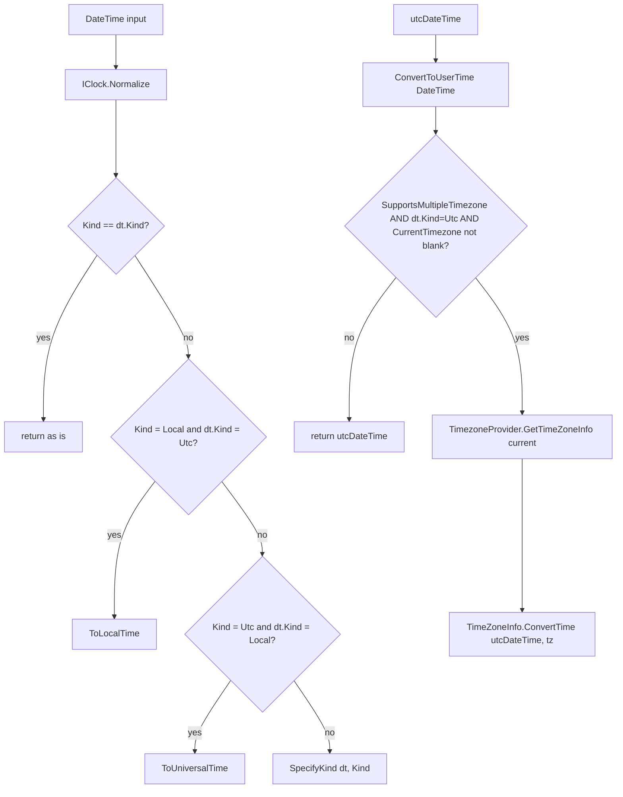
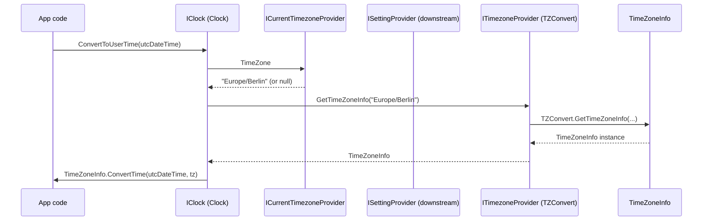
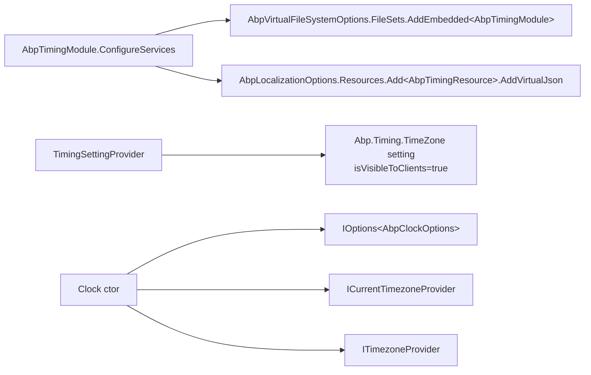

The ABP Framework standardises "what time is it?" across modules through the `Volo.Abp.Timing` package. This page covers `framework/src/Volo.Abp.Timing/Volo/Abp/Timing/` — the `IClock` abstraction, the `AbpClockOptions.Kind` knob that controls UTC vs Local handling, the `ITimezoneProvider`/`ICurrentTimezoneProvider` pair for multi-timezone deployments, and the TZConvert-based default backend.

## Responsibility

- **One canonical "now"** for the application through `IClock.Now` so domain code never has to choose between `DateTime.Now` and `DateTime.UtcNow`.
- **Normalisation** of incoming `DateTime` values to a chosen `DateTimeKind` (`Unspecified`, `Utc`, or `Local`) — entities are persisted with a consistent kind.
- **Per-call timezone override** via `ICurrentTimezoneProvider`, backed by `AsyncLocal<string?>`.
- **IANA ↔ Windows timezone conversion** via `TZConvert` (`TimeZoneConverter` NuGet package).
- **Localization resource** for displaying timezone strings.
- **Settings integration** — registers an `Abp.Timing.TimeZone` setting so administrators can pick the application-wide timezone.

## File inventory

| File | Purpose |
| --- | --- |
| `IClock.cs` | The clock contract. |
| `Clock.cs` | Default `IClock`, `ITransientDependency`. Uses `IOptions<AbpClockOptions>`, `ICurrentTimezoneProvider`, `ITimezoneProvider`. |
| `AbpClockOptions.cs` | `DateTimeKind Kind { get; set; }` — defaults to `Unspecified`. |
| `ITimezoneProvider.cs` | Cross-format timezone lookups. |
| `TZConvertTimezoneProvider.cs` | Default `ITimezoneProvider`, `ITransientDependency`. Wraps the `TimeZoneConverter.TZConvert` static. |
| `ICurrentTimezoneProvider.cs` | `string? TimeZone { get; set; }`. |
| `CurrentTimezoneProvider.cs` | `ISingletonDependency` backed by `AsyncLocal<string?>`. |
| `CurrentTimezoneProviderExtensions.cs` | `Change(timezone)` returns `IDisposable` that restores the previous timezone. |
| `IClientTimezoneProvider.cs` | Marker interface for client-side (Blazor/WASM) timezone discovery. |
| `DisableDateTimeNormalizationAttribute.cs` | Marker — applied on class, property, or parameter to skip normalisation. |
| `TimeZoneConsts.cs` | `public const string DefaultTimeZoneKey = "__timezone";`. |
| `TimeZoneHelper.cs` | `GetTimezones`, `TryCreateNameValueWithOffset`, `GetTimezoneOffset` formatting helpers. |
| `TimingSettingNames.cs` | `public const string TimeZone = "Abp.Timing.TimeZone";`. |
| `TimingSettingProvider.cs` | Registers the `Abp.Timing.TimeZone` setting definition. |
| `AbpTimingModule.cs` | `[DependsOn(typeof(AbpLocalizationModule), typeof(AbpSettingsModule))]`. Registers the embedded localization JSON and `AbpTimingResource`. |
| `Localization/AbpTimingResource.cs` | Localization resource type. |
| `Localization/Resources/AbpTiming/*.json` | Per-culture strings. |

Plus the BCL-namespace shim in `Volo.Abp.Core`: `framework/src/Volo.Abp.Core/System/AbpDateTimeExtensions.cs` — exposes `DateTime.ClearTime()`.

## Key abstractions

| Class / interface | File | What it does | Who calls it |
| --- | --- | --- | --- |
| `IClock` | `IClock.cs` | `DateTime Now`, `DateTimeKind Kind`, `bool SupportsMultipleTimezone`, `Normalize(DateTime)`, `ConvertToUserTime(DateTime)`, `ConvertToUserTime(DateTimeOffset)`, `ConvertToUtc(DateTime)`. | Anywhere domain/app code needs the current time. |
| `Clock` | `Clock.cs` | The default implementation. `Now` returns `Options.Kind == DateTimeKind.Utc ? DateTime.UtcNow : DateTime.Now`. `Kind` mirrors `Options.Kind`. `SupportsMultipleTimezone => Options.Kind == DateTimeKind.Utc`. | `IClock` resolution |
| `AbpClockOptions` | `AbpClockOptions.cs` | `DateTimeKind Kind { get; set; }`. Default `Unspecified`. Configure via `Configure<AbpClockOptions>(o => o.Kind = DateTimeKind.Utc)` in your host module. | `Clock` |
| `ITimezoneProvider` | `ITimezoneProvider.cs` | `GetWindowsTimezones()`, `GetIanaTimezones()`, `WindowsToIana(string)`, `IanaToWindows(string)`, `GetTimeZoneInfo(string)`. Cross-platform timezone lookup. | `Clock.ConvertToUserTime`, admin UIs |
| `TZConvertTimezoneProvider` | `TZConvertTimezoneProvider.cs` | Default `ITimezoneProvider`. `GetIanaTimezones` filters to ids containing `/` and excluding `Etc`, plus `UTC`. Backed by `TimeZoneConverter.TZConvert`. | DI resolution |
| `ICurrentTimezoneProvider` | `ICurrentTimezoneProvider.cs` | `string? TimeZone { get; set; }`. | `Clock.ConvertToUserTime`, time-aware UI code |
| `CurrentTimezoneProvider` | `CurrentTimezoneProvider.cs` | `ISingletonDependency`. Holds a single `AsyncLocal<string?>` field; reads/writes its `Value`. | DI resolution |
| `CurrentTimezoneProviderExtensions.Change(string?)` | `CurrentTimezoneProviderExtensions.cs` | Saves the previous value, sets the new one, returns a `DisposeAction<(provider, parentScope)>` that restores on dispose. | `using (currentTz.Change("Europe/Berlin")) { ... }` |
| `IClientTimezoneProvider` | `IClientTimezoneProvider.cs` | Marker interface for client-side providers (used by Blazor/WASM). | Theme/JS interop modules |
| `DisableDateTimeNormalizationAttribute` | `DisableDateTimeNormalizationAttribute.cs` | `[AttributeUsage(Class | Property | Parameter)]`. Read by integration layers (EF Core, JSON converters) that would otherwise call `Clock.Normalize`. | EF Core value converters, MVC model binding |
| `TimeZoneHelper.GetTimezones` | `TimeZoneHelper.cs` | Returns a sorted `List<NameValue>` with display labels like `"Europe/Berlin (+01:00)"`. | Admin UIs |
| `TimeZoneHelper.GetTimezoneOffset(TimeZoneInfo)` | `TimeZoneHelper.cs` | Formats `BaseUtcOffset` as `"+hh:mm"` / `"-hh:mm"`. | Same |
| `TimingSettingProvider` | `TimingSettingProvider.cs` | Registers `Abp.Timing.TimeZone` as a visible-to-clients setting backed by the timing localization resource. | Settings module |
| `AbpTimingModule` | `AbpTimingModule.cs` | `ConfigureServices` adds `AbpTimingResource` localization (`AddVirtualJson("/Volo/Abp/Timing/Localization")`) and embeds the module's own files. | Module loader |

## Attribute inventory

| Attribute | Targets | Multiple | Effect |
| --- | --- | --- | --- |
| `DisableDateTimeNormalization` | Class, Property, Parameter | no | Tell normalisation layers to leave the `DateTime` alone. |

## Clock semantics



`SupportsMultipleTimezone` is `Options.Kind == DateTimeKind.Utc` — the framework only supports per-user timezones when all stored times are UTC. If the host's `AbpClockOptions.Kind` is `Unspecified` or `Local`, every `ConvertToUserTime` call is a pass-through (returns the input unchanged).

`ConvertToUtc(DateTime)` applies the *reverse* logic: when the clock supports multiple timezones and the incoming value is not already UTC and the current timezone is set, it specifies `DateTimeKind.Unspecified` (otherwise `TimeZoneInfo.ConvertTimeToUtc` throws) and converts. Otherwise it returns the input.

## Timezone resolution flow



`ICurrentTimezoneProvider.TimeZone` is typically populated by:

- The Settings module's middleware, which copies the user's preferred timezone (or the tenant default) from `Abp.Timing.TimeZone`.
- An interactive call: `using (currentTimezoneProvider.Change("Asia/Tokyo")) { ... }` for one-off overrides (e.g. background job impersonation).

The setting `Abp.Timing.TimeZone` is registered by `TimingSettingProvider` with `isVisibleToClients: true`, so SPAs and Blazor clients can read it.

## TZConvert backend

`TZConvertTimezoneProvider` (`TZConvertTimezoneProvider.cs`) is a thin wrapper:

| Method | Behavior |
| --- | --- |
| `GetWindowsTimezones()` | `TZConvert.KnownWindowsTimeZoneIds.OrderBy(x => x).Select(x => new NameValue(x, x))`. |
| `GetIanaTimezones()` | `TZConvert.KnownIanaTimeZoneNames.OrderBy(x => x).Where(x => x.Contains("/") && !x.Contains("Etc") || x == "UTC")`. |
| `WindowsToIana(string)` | `TZConvert.WindowsToIana(...)`. |
| `IanaToWindows(string)` | `TZConvert.IanaToWindows(...)`. |
| `GetTimeZoneInfo(string)` | `TZConvert.GetTimeZoneInfo(...)` — accepts both Windows and IANA ids. |

`TimeZoneHelper.GetTimezones(List<NameValue>)` (separate static helper, `TimeZoneHelper.cs`) post-processes the result by ordering by name, mapping each id to `"{id} ({+hh:mm})"`, and silently dropping ids that throw (catches `Exception`, returns `null`, filtered with `OfType<NameValue>()`). The comment explains the swallow as intentional:

> Invalid or unknown timezone IDs are expected here (e.g. from user input or external sources). We intentionally swallow this exception and return null so callers (like GetTimezones) can filter out invalid entries.

## Disabling normalisation

Higher-level integrations (EF Core value converters, JSON converters in `Volo.Abp.Json`) call `Clock.Normalize(dt)` on every `DateTime` they pass between layers. To opt out, annotate the source with `[DisableDateTimeNormalization]`. The attribute is purely a marker — each integration layer is responsible for inspecting it. Currently:

- EF Core value converters check the property's attribute.
- MVC model binders check the parameter attribute.
- JSON converters check the property attribute (via `Volo.Abp.Json`).

## Control & data flow inside the module



## Connections

**Depends on:**

- `Volo.Abp.Localization` — for `AbpLocalizationModule`.
- `Volo.Abp.Settings` — for `AbpSettingsModule` and `SettingDefinitionProvider`.
- `Volo.Abp.VirtualFileSystem` — `AbpVirtualFileSystemOptions.FileSets.AddEmbedded<AbpTimingModule>()`.
- `TimeZoneConverter` NuGet — `TZConvert` static for cross-platform timezones.

**Depended on by:**

- Every framework module that timestamps domain events, audit logs, entities, or background jobs.
- `Volo.Abp.AspNetCore` adds an `AbpClockMiddleware` (in `Volo.Abp.AspNetCore`) that wires `ICurrentTimezoneProvider` from request headers/cookies.
- `Volo.Abp.EntityFrameworkCore` provides a `DateTimeKindValueConverter` that calls `IClock.Normalize` (honouring `[DisableDateTimeNormalization]`).

## Gotchas & invariants

<Warning>
`AbpClockOptions.Kind` defaults to `Unspecified`. That means `IClock.Now` returns `DateTime.Now` (local time) and `SupportsMultipleTimezone` is false. Most production deployments should set `Kind = DateTimeKind.Utc` early in the startup module's `ConfigureServices` — otherwise multi-timezone features silently no-op.
</Warning>

- **`Clock.ConvertToUserTime(DateTime)` requires `Kind == Utc` *and* `dt.Kind == Utc` *and* a non-empty timezone.** If any of those is false, the input is returned unchanged. Look at the guard clause in `Clock.cs`.
- **`Clock.ConvertToUtc(DateTime)` specifies `Unspecified` before converting.** This is necessary because `TimeZoneInfo.ConvertTimeToUtc` throws for `Kind=Local` inputs that match a different timezone. The cost: the returned value loses any local-time semantics.
- **`CurrentTimezoneProvider` is a singleton backed by `AsyncLocal<string?>`.** Setting `TimeZone` inside an async branch propagates *downward*, never *upward*. If a parent flow needs to see the child's value, communicate it explicitly.
- **`CurrentTimezoneProviderExtensions.Change` does *not* throw if the timezone string is invalid.** It only stores the string. The exception (from `TZConvert.GetTimeZoneInfo`) surfaces later when `Clock.ConvertToUserTime` resolves it. Validate up-front if you need an early failure.
- **`TZConvertTimezoneProvider.GetIanaTimezones` filters out `Etc/*` ids.** Use `GetWindowsTimezones()` if you need every Windows timezone id verbatim.
- **`DisableDateTimeNormalizationAttribute` is opt-in per integration.** A custom JSON converter you write *will not* respect it unless you explicitly inspect it.
- **`Clock.Now` does not return a `DateTimeOffset`.** Use `ConvertToUserTime(DateTimeOffset)` to get an offset-aware value; persist as `DateTimeOffset` in EF Core if you need exact timezone fidelity.
- **`TimeZoneHelper.GetTimezones` silently drops unknown ids.** No log line is emitted. If you provide a curated allow-list expect missing entries — never assume the output count equals the input.
- **The `Abp.Timing.TimeZone` setting is visible to clients (`isVisibleToClients: true`).** Web clients receive it through ABP's standard settings endpoint. Do not store sensitive timezone-derived info (e.g. user location) in this setting.

## Worked example: setting up UTC mode

```csharp
[DependsOn(typeof(AbpTimingModule))]
public class MyAppModule : AbpModule
{
    public override void ConfigureServices(ServiceConfigurationContext ctx)
    {
        Configure<AbpClockOptions>(o => o.Kind = DateTimeKind.Utc);
        // Optionally override the default current timezone:
        // ctx.Services.AddTransient<ICurrentTimezoneProvider, MyHttpHeaderTimezoneProvider>();
    }
}
```

Once `Kind = Utc`, `IClock.Now` returns UTC, `IClock.Normalize` converts everything to UTC, and `IClock.ConvertToUserTime` translates UTC to whatever `ICurrentTimezoneProvider.TimeZone` is set to (typically by middleware reading `__timezone`, the constant defined in `TimeZoneConsts.cs`).

## Related pages

<CardGroup cols={2}>
  <Card title="Options & Configuration" icon="gear" href="/core/options-and-configuration">
    `AbpClockOptions` is configured through `Configure<T>`.
  </Card>
  <Card title="Threading" icon="bolt" href="/core/threading">
    `CurrentTimezoneProvider`'s `AsyncLocal<string?>` mirrors the ambient-scope pattern.
  </Card>
  <Card title="Virtual File System" icon="folder-tree" href="/core/virtual-file-system">
    `AbpTimingModule` registers its localization JSON via `FileSets.AddEmbedded`.
  </Card>
  <Card title="Volo.Abp.Core" icon="cube" href="/core/volo-abp-core">
    `AbpDateTimeExtensions.ClearTime()` lives there.
  </Card>
</CardGroup>
