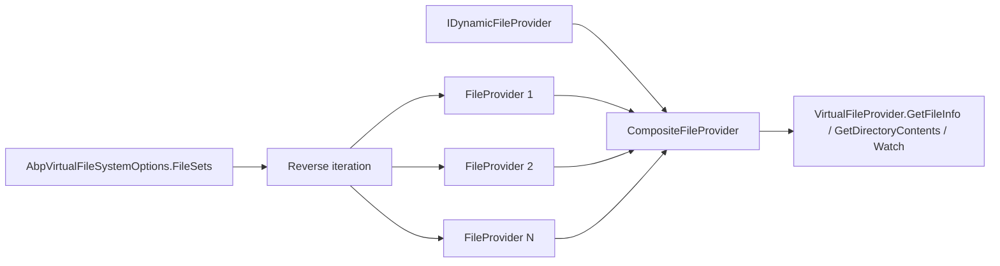

The ABP Framework lets modules ship resources — Razor views, localization JSON, JavaScript, CSS — embedded inside their assemblies and serve them through a single composite `IFileProvider` interface. This page covers `framework/src/Volo.Abp.VirtualFileSystem/Volo/Abp/VirtualFileSystem/` end to end.

## Responsibility

- **Unify resource access** across modules through one `IVirtualFileProvider` regardless of whether the file lives in an embedded resource, on disk, or in memory.
- **Compose providers** in dependency order via `AbpVirtualFileSystemOptions.FileSets`.
- **Embedded resources** — read manifest resources from any assembly via `AbpEmbeddedFileProvider`.
- **Physical files** — wrap `Microsoft.Extensions.FileProviders.PhysicalFileProvider` so modules can swap embedded content for live disk content during development.
- **Dynamic, in-memory files** — `DynamicFileProvider` lets modules add/remove `IFileInfo` instances at runtime and fires change tokens.
- **Replace embedded with physical** for hot-reload — `ReplaceEmbeddedByPhysical<TModule>(path)`.

## File inventory

| File | Purpose |
| --- | --- |
| `IVirtualFileProvider.cs` | Marker: `IVirtualFileProvider : IFileProvider`. |
| `VirtualFileProvider.cs` | Default implementation. `ISingletonDependency`. Composes a `CompositeFileProvider` from `[ dynamicFileProvider, ...options.FileSets.Reverse().Select(f => f.FileProvider) ]`. |
| `AbpVirtualFileSystemOptions.cs` | `VirtualFileSetList FileSets { get; }`. |
| `VirtualFileSetInfo.cs` | Base class wrapping an `IFileProvider`. |
| `VirtualFileSetList.cs` | `List<VirtualFileSetInfo>`. |
| `VirtualFileSetListExtensions.cs` | `AddEmbedded<T>(baseNamespace?, baseFolder?)`, `AddPhysical(root, exclusionFilters)`, `ReplaceEmbeddedByPhysical<T>(physicalPath, exclusionFilters)`. |
| `Embedded/EmbeddedVirtualFileSetInfo.cs` | `VirtualFileSetInfo` with `Assembly` and `BaseFolder`. |
| `Embedded/AbpEmbeddedFileProvider.cs` | `DictionaryBasedFileProvider`. Walks `Assembly.GetManifestResourceNames()` and indexes by virtual path. |
| `Embedded/EmbeddedResourceFileInfo.cs` | `IFileInfo` whose `CreateReadStream()` opens `assembly.GetManifestResourceStream(...)`. Lazy `Length`. |
| `Physical/PhysicalVirtualFileSetInfo.cs` | `VirtualFileSetInfo` with `Root` (string path). |
| `IDynamicFileProvider.cs` | `void AddOrUpdate(IFileInfo)`, `bool Delete(string filePath)`. |
| `DynamicFileProvider.cs` | `DictionaryBasedFileProvider`. `ISingletonDependency`. `ConcurrentDictionary<string, IFileInfo>` plus a per-path `CancellationChangeToken` map for `Watch`. |
| `DictionaryBasedFileProvider.cs` | Abstract base providing `GetFileInfo(subpath)`, `GetDirectoryContents(subpath)` over an `IDictionary<string, IFileInfo>`. |
| `InMemoryFileInfo.cs` | `IFileInfo` backed by `byte[]`. |
| `EnumerableDirectoryContents.cs` | `IDirectoryContents` over `IEnumerable<IFileInfo>`. |
| `VirtualDirectoryFileInfo.cs` | `IFileInfo` describing a directory (no content). |
| `VirtualFilePathHelper.cs` | `NormalizePath` (replace backslashes with `/`, prefix with `/`). |
| `AbpVirtualFileSystemModule.cs` | Empty module — exists only as a `[DependsOn]` target. |
| `Microsoft/Extensions/FileProviders/AbpFileInfoExtensions.cs` | `GetVirtualOrPhysicalPathOrNull(IFileInfo)` and `ReadAsString(IFileInfo)`. |

## Key abstractions

| Class / interface | File | What it does | Who calls it |
| --- | --- | --- | --- |
| `IVirtualFileProvider` | `IVirtualFileProvider.cs` | Marker `IFileProvider`. | Anywhere modules need files |
| `VirtualFileProvider` | `VirtualFileProvider.cs` | `ISingletonDependency`. Composes `IDynamicFileProvider` + every `VirtualFileSetInfo.FileProvider` (reverse-iterated). Empty `subpath` is normalised to `"/"`. | DI resolution |
| `AbpVirtualFileSystemOptions` | `AbpVirtualFileSystemOptions.cs` | Holds `FileSets`. | Module `ConfigureServices` |
| `VirtualFileSetList` | `VirtualFileSetList.cs` | `List<VirtualFileSetInfo>` — order matters. | Options |
| `VirtualFileSetListExtensions.AddEmbedded<T>` | `VirtualFileSetListExtensions.cs` | If the assembly has a `Microsoft.Extensions.FileProviders.Embedded.Manifest.xml`, use `ManifestEmbeddedFileProvider`; otherwise `AbpEmbeddedFileProvider`. Adds an `EmbeddedVirtualFileSetInfo`. | Modules |
| `VirtualFileSetListExtensions.AddPhysical` | `VirtualFileSetListExtensions.cs` | Wraps `PhysicalFileProvider(root, exclusionFilters)`. Adds a `PhysicalVirtualFileSetInfo`. | Modules |
| `VirtualFileSetListExtensions.ReplaceEmbeddedByPhysical<T>` | `VirtualFileSetListExtensions.cs` | Walks `fileSets`, finds an `EmbeddedVirtualFileSetInfo` whose `Assembly == typeof(T).Assembly`, replaces the entry with a `PhysicalVirtualFileSetInfo` pointing at `Path.Combine(physicalPath, embedded.BaseFolder ?? "")`. | Dev hot-reload |
| `AbpEmbeddedFileProvider` | `Embedded/AbpEmbeddedFileProvider.cs` | Walks `Assembly.GetManifestResourceNames()`, strips `BaseNamespace`, converts dots-to-slashes (preserving last two segments as `fileName.ext`), normalises with `EnsureStartsWith('/')`, and builds a dictionary keyed by virtual path. Adds parent directories recursively. Uses `File.GetLastWriteTimeUtc(Assembly.Location)` as `LastModified` (falls back to `DateTimeOffset.UtcNow`). | `AddEmbedded` extension |
| `EmbeddedResourceFileInfo` | `Embedded/EmbeddedResourceFileInfo.cs` | `IFileInfo`. `Length` is lazy (opens the stream once). `PhysicalPath` is null. `IsDirectory` is false. `CreateReadStream()` returns `_assembly.GetManifestResourceStream(_resourcePath)`. | `AbpEmbeddedFileProvider` |
| `IDynamicFileProvider` / `DynamicFileProvider` | `IDynamicFileProvider.cs`, `DynamicFileProvider.cs` | Thread-safe in-memory provider. `AddOrUpdate(IFileInfo)` and `Delete(filePath)` fire change tokens. `Watch(filter)` returns a `CancellationChangeToken` that is cancelled on next change. | Localization JSON hot reload, runtime template generation |
| `DictionaryBasedFileProvider` | `DictionaryBasedFileProvider.cs` | Abstract base. `GetFileInfo` returns `NotFoundFileInfo` if missing. `GetDirectoryContents` filters by the directory prefix and skips entries that contain a slash *after* the prefix. | `AbpEmbeddedFileProvider`, `DynamicFileProvider` |
| `InMemoryFileInfo` | `InMemoryFileInfo.cs` | `IFileInfo` backed by `byte[]`. | Dynamic templates |
| `VirtualDirectoryFileInfo` | `VirtualDirectoryFileInfo.cs` | `IFileInfo` representing a directory. `IsDirectory = true`, `CreateReadStream` throws. | Directory listings in embedded providers |
| `EnumerableDirectoryContents` | `EnumerableDirectoryContents.cs` | `IDirectoryContents` over `IEnumerable<IFileInfo>`. `Exists` is true if non-empty. | `DictionaryBasedFileProvider.GetDirectoryContents` |
| `VirtualFilePathHelper.NormalizePath` | `VirtualFilePathHelper.cs` | Replaces `\` with `/`, prepends `/` if missing. | `AbpEmbeddedFileProvider`, `DynamicFileProvider` |
| `AbpFileInfoExtensions.GetVirtualOrPhysicalPathOrNull(IFileInfo)` | `Microsoft/Extensions/FileProviders/AbpFileInfoExtensions.cs` | Returns `(file as IFileInfoWithVirtualPath)?.VirtualPath ?? file.PhysicalPath`. | Many consumers |
| `AbpFileInfoExtensions.ReadAsString(IFileInfo)` | Same | Opens `CreateReadStream`, uses `Utf8Helper.ReadStringFromStream`. | Localization, templating |

## Provider composition



`VirtualFileProvider.CreateHybridProvider(IDynamicFileProvider)` constructs the list in this exact order:

```csharp
var fileProviders = new List<IFileProvider>();
fileProviders.Add(dynamicFileProvider);

foreach (var fileSet in _options.FileSets.AsEnumerable().Reverse())
{
    fileProviders.Add(fileSet.FileProvider);
}

return new CompositeFileProvider(fileProviders);
```

That means:

1. **Dynamic provider has top priority.** A runtime-added file overrides any embedded resource with the same virtual path.
2. **File sets are searched in reverse insertion order.** Later-added providers win. Since modules add embedded file sets during `ConfigureServices`, the *last* module loaded (typically the host application) wins for any path collision — overriding plug-in resources without changing them on disk.

## Embedded path mapping

`AbpEmbeddedFileProvider.ConvertToRelativePath` turns manifest resource names like `Volo.Abp.Timing.Localization.Resources.AbpTiming.en.json` into virtual paths.

The mapping rules:

1. Strip `BaseNamespace + "."` from the start, if a base namespace was given.
2. Split by `.`. If there are ≤2 segments, return the resource name unchanged.
3. Otherwise treat the last two segments as `fileName.ext`. The rest is the folder, joined with `/`.

So `Volo.Abp.Timing.Localization.Resources.AbpTiming.en.json` with `BaseNamespace = "Volo.Abp.Timing"` becomes `Localization/Resources/AbpTiming/en.json`. Prefixed with `/` it is `/Localization/Resources/AbpTiming/en.json`.

<Warning>
The two-segment rule assumes the *file name has exactly one dot*. A file called `app.config.json` embedded directly would map to `app/config.json`, which is almost certainly wrong. If your module embeds files with dotted names, use `ManifestEmbeddedFileProvider` (by adding a `Microsoft.Extensions.FileProviders.Embedded.Manifest.xml` to the assembly via `<GenerateEmbeddedFilesManifest>true</GenerateEmbeddedFilesManifest>` in the csproj).
</Warning>

## Dynamic provider mechanics

```mermaid
sequenceDiagram
    participant Mod as Module
    participant Dyn as DynamicFileProvider
    participant Tokens as FilePathTokenLookup
    participant Watcher as Watch caller

    Watcher->>Dyn: Watch("/foo.json")
    Dyn->>Tokens: GetOrAdd path → ChangeTokenInfo
    Tokens-->>Dyn: CancellationChangeToken
    Dyn-->>Watcher: token

    Mod->>Dyn: AddOrUpdate(file)
    Dyn->>Dyn: DynamicFiles[path] = file
    Dyn->>Tokens: TryRemove(path, out info)
    Tokens-->>Dyn: info.TokenSource.Cancel()
    Watcher-->>Watcher: change token fires; caller re-Watches
```

The class doc notes: *"Current implementation only supports file watch. Does not support directory or wildcard watches."* The `Watch(filter)` method treats `filter` as a literal file path; a directory pattern like `**/*.json` will not be honored.

`StringComparer.OrdinalIgnoreCase` is used for the token lookup, so file path case is irrelevant when matching watchers — consistent with case-insensitive virtual file lookups elsewhere.

## ReplaceEmbeddedByPhysical

The most common dev-time pattern:

```csharp
public override void ConfigureServices(ServiceConfigurationContext ctx)
{
    if (ctx.Services.GetHostingEnvironment().IsDevelopment())
    {
        Configure<AbpVirtualFileSystemOptions>(opts =>
        {
            opts.FileSets.ReplaceEmbeddedByPhysical<MyModule>(
                Path.Combine(Directory.GetCurrentDirectory(),
                    $@"..\..\..\..\src\MyModule"));
        });
    }
}
```

The implementation in `VirtualFileSetListExtensions.cs`:

```csharp
for (var i = 0; i < fileSets.Count; i++)
{
    if (fileSets[i] is EmbeddedVirtualFileSetInfo embeddedVirtualFileSet &&
        embeddedVirtualFileSet.Assembly == assembly)
    {
        var thisPath = physicalPath;
        if (!embeddedVirtualFileSet.BaseFolder.IsNullOrEmpty())
        {
            thisPath = Path.Combine(thisPath, embeddedVirtualFileSet.BaseFolder!);
        }
        fileSets[i] = new PhysicalVirtualFileSetInfo(
            new PhysicalFileProvider(thisPath, exclusionFilters), thisPath);
    }
}
```

The walk replaces *every* embedded entry that came from the same assembly. If your module added multiple `AddEmbedded<MyModule>` calls with different `baseFolder`s, each gets its own combined `physicalPath` redirect.

## DictionaryBasedFileProvider semantics

`DictionaryBasedFileProvider.GetFileInfo(string? subpath)`:

1. If `subpath` is null, return `NotFoundFileInfo`.
2. Look up `Files.GetOrDefault(NormalizePath(subpath))` — if absent, return `NotFoundFileInfo(subpath)`.
3. Else return the stored `IFileInfo`.

`GetDirectoryContents(subpath)`:

1. Call `GetFileInfo(subpath)`. If it is not a directory (`!directory.IsDirectory`), return `NotFoundDirectoryContents.Singleton`.
2. Walk every value in `Files`, keep those whose path starts with `subpath.EnsureEndsWith('/')` and whose remainder does not contain `/` (so only direct children).

## Connections

**Depends on:**

- `Microsoft.Extensions.FileProviders` — `IFileProvider`, `IFileInfo`, `PhysicalFileProvider`, `CompositeFileProvider`, `NotFoundFileInfo`, `NotFoundDirectoryContents`, `IChangeToken`, `CancellationChangeToken`.
- `Volo.Abp.Core` — `Check`, `Volo/Abp/IO/`, extension methods on strings.
- `Microsoft.Extensions.FileProviders.Embedded` — `ManifestEmbeddedFileProvider`.

**Depended on by:**

- `Volo.Abp.Localization` — reads JSON resources through `IVirtualFileProvider`.
- `Volo.Abp.TextTemplating.*` — Razor and Scriban backends both read template definitions from the virtual file system.
- `Volo.Abp.AspNetCore.Mvc.UI.*` — serves bundles and static assets through the virtual file system.
- Every module that ships embedded resources.

## Gotchas & invariants

<Warning>
`AbpEmbeddedFileProvider`'s dot-to-slash mapping assumes the file name has exactly one dot before the extension. Embedded files like `appsettings.staging.json` become `appsettings/staging.json` — likely not what you want. Add `<GenerateEmbeddedFilesManifest>true</GenerateEmbeddedFilesManifest>` to your csproj to switch to the manifest provider, which preserves the original file name verbatim.
</Warning>

- **`AbpVirtualFileSystemModule` is empty.** It exists only to anchor `[DependsOn(typeof(AbpVirtualFileSystemModule))]` from downstream modules. The actual services (`VirtualFileProvider`, `DynamicFileProvider`) are registered via conventional registration because they implement `ISingletonDependency` directly.
- **File sets are searched in reverse order.** If two modules both `AddEmbedded<TheirModule>("/Foo/bar.json")` the *later-added* one (later module in dependency order) wins. To override a plug-in's resource from the host, just `AddEmbedded` your replacement.
- **`VirtualFileProvider.GetDirectoryContents("")` is normalised to `"/"`.** Inside `VirtualFileProvider.GetDirectoryContents` — call site `Volo/Abp/VirtualFileSystem/VirtualFileProvider.cs`.
- **`DynamicFileProvider.Watch` only fires for path equality.** A watcher on `/foo/bar.json` only fires when `bar.json` is updated, not when a sibling `baz.json` changes. Wildcards do not work.
- **`AbpEmbeddedFileProvider.LastModified` is the assembly's `LastWriteTimeUtc`.** When the assembly is loaded from a path-less location (e.g. `Assembly.Location == ""`), it falls back to `DateTimeOffset.UtcNow`. Both `PathTooLongException` and `UnauthorizedAccessException` are swallowed.
- **`AddPhysical(root)` uses `ExclusionFilters.Sensitive` by default.** That hides files starting with `.`, hidden files, and system files. Use the overload with `ExclusionFilters.None` if you need them.
- **`ReplaceEmbeddedByPhysical<T>` matches by `Assembly == typeof(T).Assembly`.** Reference-equal, not name-equal. Two assemblies with the same name but different paths will not match.
- **`EmbeddedResourceFileInfo.Length` opens the stream the first time.** The implementation uses `stream!.Length` then closes the stream; subsequent reads use the cached value. There is no Dispose call needed; the resource stream is wrapped in `using`.
- **`InMemoryFileInfo` does not own its byte[].** Mutating the array after passing it to `AddOrUpdate` mutates the served content. Treat the buffer as immutable after handoff.

## Worked example: registering an embedded file set

```csharp
[DependsOn(typeof(AbpVirtualFileSystemModule))]
public class MyModule : AbpModule
{
    public override void ConfigureServices(ServiceConfigurationContext ctx)
    {
        Configure<AbpVirtualFileSystemOptions>(opts =>
        {
            opts.FileSets.AddEmbedded<MyModule>();
        });
    }
}
```

`AddEmbedded<MyModule>()` reads `typeof(MyModule).Assembly`, looks for the `Microsoft.Extensions.FileProviders.Embedded.Manifest.xml` manifest, and either uses `ManifestEmbeddedFileProvider` or `AbpEmbeddedFileProvider`. If you want a custom base namespace (e.g. resources live under `MyCompany.Resources.*` instead of the assembly's default namespace), pass `baseNamespace: "MyCompany.Resources"`.

## Related pages

<CardGroup cols={2}>
  <Card title="Modularity" icon="layer-group" href="/core/modularity">
    File sets are configured per module.
  </Card>
  <Card title="Text Templating" icon="file-lines" href="/core/text-templating">
    Templates are typically stored as virtual files.
  </Card>
  <Card title="Options & Configuration" icon="gear" href="/core/options-and-configuration">
    `AbpVirtualFileSystemOptions` follows the standard pattern.
  </Card>
  <Card title="Reflection & Internal" icon="microscope" href="/core/reflection-and-internal">
    `Utf8Helper.ReadStringFromStream` powers `AbpFileInfoExtensions.ReadAsString`.
  </Card>
</CardGroup>
