The ABP Framework groups its non-optional building blocks into a single NuGet package and assembly called `Volo.Abp.Core`. This page is the structural tour of that csproj — target frameworks, dependency list, the folder map under `Volo/Abp/`, the shims under `System/` and `Microsoft/Extensions/`, and the `AbpApplicationBase` driver that ties everything together. Modularity and Dependency Injection have their own dedicated pages, so they are referenced here but not duplicated.

## Responsibility

`Volo.Abp.Core` is responsible for:

- Defining the **module abstraction** (`IAbpModule`, `AbpModule`, descriptors, lifecycle interfaces) — covered in detail on [Modularity](/core/modularity).
- Hosting the **conventional dependency injection layer** (`ISingletonDependency`/`IScopedDependency`/`ITransientDependency`, `[ExposeServices]`, `DefaultConventionalRegistrar`) — covered on [Dependency Injection](/core/dependency-injection).
- Shipping a **set of small primitives** used by every other module: type/assembly helpers, init-time logging, collections, options helpers, exception base types, in-memory bundling models, virtual file content abstractions, simple state checking, static-definition caching, tracing/correlation, telemetry, and validation attributes.
- Providing the **`AbpApplicationBase` driver** that boots a module graph against an `IServiceCollection`.

## csproj at a glance

The project file lives at `framework/src/Volo.Abp.Core/Volo.Abp.Core.csproj`. The relevant settings:

```xml
<TargetFrameworks>netstandard2.0;netstandard2.1;net8.0;net9.0;net10.0</TargetFrameworks>
<Nullable>enable</Nullable>
<WarningsAsErrors>Nullable</WarningsAsErrors>
<AssemblyName>Volo.Abp.Core</AssemblyName>
<PackageId>Volo.Abp.Core</PackageId>
<RootNamespace />
```

`RootNamespace` is empty so that files under `System/`, `Microsoft/Extensions/`, and `Volo/Abp/` declare their namespaces literally — that is how ABP can inject extension methods into Microsoft namespaces.

`PackageReference` set (verbatim from the csproj):

| Package | Why |
| --- | --- |
| `Microsoft.Extensions.DependencyInjection` | The `IServiceCollection` / `IServiceProvider` contract every module uses. |
| `Microsoft.Extensions.Options` | The base options pattern; ABP wraps it with `AbpOptionsFactory`. |
| `Microsoft.Extensions.Options.ConfigurationExtensions` | `Configure<T>(IConfiguration)` overloads called by `AbpModule.Configure<T>`. |
| `Microsoft.Extensions.Configuration.EnvironmentVariables` | Used by `ConfigurationHelper.BuildConfiguration` in `Microsoft/Extensions/Configuration/ConfigurationHelper.cs`. |
| `Microsoft.Extensions.Configuration.UserSecrets` | Same — picked up at startup. |
| `Microsoft.Extensions.Configuration.CommandLine` | Same. |
| `Microsoft.Extensions.Logging` | The logging contract. |
| `Microsoft.Extensions.Localization` | Used by `IStringLocalizer` plumbing. |
| `Microsoft.Extensions.Hosting.Abstractions` | `AbpHostingHostBuilderExtensions.cs` wires `IHostBuilder`. |
| `System.Management` | Used by environment inspection helpers under `Volo/Abp/Internal/Telemetry/EnvironmentInspection/`. |
| `System.Linq.Dynamic.Core` | Used by data and querying utilities downstream. |
| `JetBrains.Annotations` | `[NotNull]`, `[CanBeNull]` annotations. |
| `Nito.AsyncEx.Context` | Powers `AsyncHelper.RunSync`. |

Conditional references (verbatim from the csproj `ItemGroup Condition=` blocks):

- `netstandard2.0` also adds `System.Threading.Tasks.Extensions`.
- `.NETStandard >= 2.1` adds `System.ComponentModel.Annotations`.
- `.NETStandard >= 2.0` adds `System.Collections.Immutable`, `System.Text.Encodings.Web`, `System.Runtime.Loader`, `System.Linq.Queryable`, and the `Nullable` polyfill (private asset).

<Tip>
Knowing that `Volo.Abp.Core` is the only required package makes plug-and-play hosting easy: you can boot a console app with just `Volo.Abp.Core` plus your modules and call `AbpApplicationFactory.Create<TStartupModule>` from `framework/src/Volo.Abp.Core/Volo/Abp/AbpApplicationFactory.cs`.
</Tip>

## Folder map

The assembly is organised under three top-level folders.

### `Volo/Abp/` — the framework namespace

| Folder | What lives here | Deep-dive |
| --- | --- | --- |
| `Modularity/` | `AbpModule`, `AbpModuleDescriptor`, `ModuleLoader`, `ModuleManager`, lifecycle contributors, `DependsOn` / `AdditionalAssembly` attributes, `PlugIns/`. | [Modularity](/core/modularity) |
| `DependencyInjection/` | Dependency markers, `[ExposeServices]`, `DefaultConventionalRegistrar`, lazy/cached service providers, `IObjectAccessor`, `IRootServiceProvider`. | [Dependency Injection](/core/dependency-injection) |
| `ExceptionHandling/` | `IExceptionNotifier`, `IExceptionSubscriber`, `ExceptionNotificationContext`, error code/details/log level interfaces. | [Exception Handling](/core/exception-handling) |
| `Aspects/` | `AbpCrossCuttingConcerns`, `IAvoidDuplicateCrossCuttingConcerns`. | [Aspects & Dynamic Proxy](/core/aspects-and-dynamic-proxy) |
| `DynamicProxy/` | `IAbpInterceptor`, `IAbpMethodInvocation`, `ProxyHelper`, `DynamicProxyIgnoreTypes`. | [Aspects & Dynamic Proxy](/core/aspects-and-dynamic-proxy) |
| `Threading/` | `AsyncHelper`, `KeyedLock`, `OneTimeRunner`, `AsyncOneTimeRunner`, `SemaphoreSlimExtensions`, `LockExtensions`, `TaskCache`. | [Threading](/core/threading) |
| `Reflection/` | `TypeHelper`, `AssemblyHelper`, `ReflectionHelper`, `AssemblyFinder`, `TypeFinder`. | [Reflection & Internal](/core/reflection-and-internal) |
| `Internal/` | `InternalServiceCollectionExtensions`, `Utf8Helper`, the `Telemetry/` subtree. | [Reflection & Internal](/core/reflection-and-internal) |
| `Options/` | `AbpOptionsFactory`, `AbpDynamicOptionsManager`, `AbpUnnamedOptionsManager`, `PreConfigureActionList`. | [Options & Configuration](/core/options-and-configuration) |
| `Logging/` | `IInitLogger`, `IInitLoggerFactory`, `DefaultInitLogger`, `IHasLogLevel`, `IExceptionWithSelfLogging`. | this page |
| `Bundling/` | `BundleContext`, `BundleDefinition`, `BundleParameterDictionary`, `IBundleContributor` + `Styles/` subfolder. | this page |
| `Collections/` | `ITypeList<T>`, `TypeList<T>`, `NamedActionList`, `NamedObjectList`. | this page |
| `Content/` | `IRemoteStreamContent`, `RemoteStreamContent`. | this page |
| `IO/` | `DirectoryHelper`, `FileHelper`. | this page |
| `Text/` | `StringHelper`, `Formatting/` token tools. | this page |
| `Localization/` | `CultureHelper`, `LocalizationContext` — entry points to the dedicated Localization module. | this page (overview only) |
| `SimpleStateChecking/` | `ISimpleStateChecker`, `SimpleStateCheckerManager`, batch checkers and serializers. | this page |
| `StaticDefinitions/` | `IStaticDefinitionCache`, `StaticDefinitionCache` — used by features/permissions/settings. | this page |
| `Studio/` | `AbpStudioAnalyzeHelper` — runtime hook for ABP Studio analysis. | this page |
| `Validation/` | `DynamicMaxLengthAttribute`, `DynamicRangeAttribute`, `DynamicStringLengthAttribute`. | this page |
| `Tracing/` | `AbpCorrelationIdOptions`, `ICorrelationIdProvider`, `DefaultCorrelationIdProvider`. | this page |
| (root) | `AbpApplicationBase`, `AbpApplicationFactory`, `AbpException`, `BusinessException`, `UserFriendlyException`, `Check`, `RandomHelper`, `ObjectHelper`, …shared marker interfaces. | this page |

### `System/` — extension methods in the BCL namespace

| File | Purpose |
| --- | --- |
| `AbpComparableExtensions.cs` | `IsBetween`. |
| `AbpDateTimeExtensions.cs` | `ClearTime`, `ToCalendarString`. |
| `AbpDayOfWeekExtensions.cs` | Helpers for `DayOfWeek`. |
| `AbpEventHandlerExtensions.cs` | `InvokeSafely` for `EventHandler`. |
| `AbpExceptionExtensions.cs` | `ReThrow` preserving stack via `ExceptionDispatchInfo`. |
| `AbpObjectExtensions.cs` | `As<T>`, `To<T>`, `If(…)`. |
| `AbpStringExtensions.cs` | `EnsureEndsWith`, `Left/Right`, `RemovePostFix/Prefix`, `Truncate`, `Split` variants. |
| `AbpTypeExtensions.cs` | `IsAssignableTo<T>`, generic display name helpers. |
| `Collections/`, `IO/`, `Linq/`, `Reflection/`, `Runtime/`, `Text/` | Targeted extension classes (e.g. `AbpListExtensions`, `AbpEnumerableExtensions`). |

### `Microsoft/Extensions/` — extension methods on M.E.* abstractions

| File | What it adds |
| --- | --- |
| `Configuration/AbpConfigurationExtensions.cs` | `GetConfiguration()` / `ReplaceConfiguration()` on `IServiceCollection`. |
| `Configuration/ConfigurationHelper.cs` | `BuildConfiguration(AbpConfigurationBuilderOptions)`. |
| `DependencyInjection/ServiceCollectionApplicationExtensions.cs` | `services.GetSingletonInstance<T>()` etc. |
| `DependencyInjection/ServiceCollectionCommonExtensions.cs` | `IsAdded<T>`, `GetSingletonInstanceOrNull<T>()`. |
| `DependencyInjection/ServiceCollectionConfigurationExtensions.cs` | `Configure<TOptions>(...)` named overloads matching the framework signatures. |
| `DependencyInjection/ServiceCollectionConventionalRegistrationExtensions.cs` | `AddAssembly`, `AddType`, `AddTypes`. |
| `DependencyInjection/ServiceCollectionDynamicOptionsManagerExtensions.cs` | `AddAbpDynamicOptions<TOptions, TManager>()`. |
| `DependencyInjection/ServiceCollectionLifetimeEventExtensions.cs` | `OnRegistered`, `OnExposing`, `OnActivated`. |
| `DependencyInjection/ServiceCollectionLoggingExtensions.cs` | `GetInitLogger<T>()` used during module loading. |
| `DependencyInjection/ServiceCollectionObjectAccessorExtensions.cs` | `TryAddObjectAccessor`, `AddObjectAccessor`. |
| `DependencyInjection/ServiceCollectionOptionsExtensions.cs` | `AddAbpOptions<TOptions>()` returning an `OptionsBuilder<TOptions>`. |
| `DependencyInjection/ServiceCollectionPreConfigureExtensions.cs` | `PreConfigure<TOptions>` and `ExecutePreConfiguredActions<TOptions>`. |
| `DependencyInjection/ServiceCollectionRegistrationActionExtensions.cs` | The plumbing behind the `OnRegistered/OnExposing/OnActivated` hooks. |
| `DependencyInjection/ServiceDescriptorExtensions.cs` | Convert between `ServiceDescriptor` and `ServiceIdentifier`. |
| `Hosting/AbpHostExtensions.cs` + `AbpHostingHostBuilderExtensions.cs` | `IHost.InitializeAsync()`, `UseAutofac`-style hooks. |
| `Localization/AbpCoreStringLocalizerFactoryExtensions.cs` | Hooks for the localization module. |
| `Logging/AbpLoggerExtensions.cs` | `LogException(Exception, LogLevel?)`. |
| `Options/OptionsAbpDynamicOptionsManagerExtensions.cs` | `SetAsync()` on the dynamic options manager. |

## Key root-level classes

| Class | File | What it does | Called by |
| --- | --- | --- | --- |
| `AbpApplicationBase` | `Volo/Abp/AbpApplicationBase.cs` | Implements `IAbpApplication`. Wires `IObjectAccessor<IServiceProvider>`, calls `AddCoreServices` + `AddCoreAbpServices`, runs `LoadModules`, then drives `(Pre|Post)?ConfigureServicesAsync` and module init/shutdown via `IModuleManager`. | `AbpApplicationWithInternalServiceProvider`, `AbpApplicationWithExternalServiceProvider` |
| `AbpApplicationFactory` | `Volo/Abp/AbpApplicationFactory.cs` | Static `Create<TModule>(services, options)` and `CreateAsync<TModule>(services, options)`. | Host bootstrap code |
| `AbpApplicationWithInternalServiceProvider` | `Volo/Abp/AbpApplicationWithInternalServiceProvider.cs` | Builds its own `IServiceProvider` via `services.BuildServiceProviderFromFactory(…)`. | Console-style hosts |
| `AbpApplicationWithExternalServiceProvider` | `Volo/Abp/AbpApplicationWithExternalServiceProvider.cs` | Lets the caller pass in a pre-built `IServiceProvider`. | ASP.NET Core integration |
| `AbpApplicationCreationOptions` | `Volo/Abp/AbpApplicationCreationOptions.cs` | Holds `Services`, `Configuration` setup, `PlugInSources`, `Environment`, `ApplicationName`. | Host startup |
| `ApplicationInitializationContext` | `Volo/Abp/ApplicationInitializationContext.cs` | Carries `IServiceProvider` into `OnApplicationInitialization`. | All modules |
| `ApplicationShutdownContext` | `Volo/Abp/ApplicationShutdownContext.cs` | Carries `IServiceProvider` into `OnApplicationShutdown`. | All modules |
| `AbpException` | `Volo/Abp/AbpException.cs` | Base type for framework exceptions. | Everything |
| `AbpInitializationException` | `Volo/Abp/AbpInitializationException.cs` | Thrown by `ModuleManager` when a lifecycle phase fails. | `ModuleManager` |
| `AbpShutdownException` | `Volo/Abp/AbpShutdownException.cs` | Thrown by `ModuleManager` when shutdown fails. | `ModuleManager` |
| `BusinessException` | `Volo/Abp/BusinessException.cs` | Base for domain errors; implements `IHasErrorCode`, `IHasErrorDetails`, `IHasLogLevel`. | Domain code |
| `UserFriendlyException` | `Volo/Abp/UserFriendlyException.cs` | Inherits `BusinessException`; safe to show to end users. | Domain/UI |
| `Check` | `Volo/Abp/Check.cs` | `NotNull`, `NotNullOrEmpty`, `NotNullOrWhiteSpace`, `Length` guards. | Everywhere |
| `RandomHelper` | `Volo/Abp/RandomHelper.cs` | Thread-safe random number/string utilities. | Everywhere |
| `DisposeAction` | `Volo/Abp/DisposeAction.cs` | `IDisposable` that runs an `Action` on dispose; generic `state` overload to avoid closures. | `AbpCrossCuttingConcerns.Applying`, `AmbientDataContextAmbientScopeProvider` |
| `AsyncDisposeFunc` | `Volo/Abp/AsyncDisposeFunc.cs` | `IAsyncDisposable` counterpart. | `TelemetryService.TrackActivityAsync` |
| `NullDisposable`, `NullAsyncDisposable` | `Volo/Abp/NullDisposable.cs`, `…Async.cs` | Singleton no-op disposables. | Various |
| `NameValue` / `NameValue<T>` | `Volo/Abp/NameValue.cs` | Simple `Name`/`Value` pair used everywhere (timezones, settings, dropdowns). | Many |

## What the small folders contain

### `Volo/Abp/Logging/`

This is **not** the general logging module — that lives elsewhere. The classes here exist so modules can write log entries *before* `IServiceProvider` is built.

| Class/Interface | What it does |
| --- | --- |
| `IInitLogger<T>` / `IInitLoggerFactory` | Buffered logger consumed by `ConventionalRegistrarBase`, `ModuleLoader`, and `AssemblyFinder` during boot. |
| `DefaultInitLogger`, `DefaultInitLoggerFactory` | In-memory buffer that is flushed to real loggers after the container is built. |
| `AbpInitLogEntry` | The struct buffered by the default factory. |
| `IHasLogLevel` | Implemented by `BusinessException` so loggers can call `exception.GetLogLevel()`. |
| `HasLogLevelExtensions` | `GetLogLevel(this Exception)` extension. |
| `IExceptionWithSelfLogging` | Marker so exceptions can render themselves. |

### `Volo/Abp/Bundling/`

The in-process model for the bundling system that is fully implemented in `Volo.Abp.AspNetCore.Mvc.UI.Bundling`. The Core package only contains the lightweight DTOs and the `IBundleContributor` interface so non-MVC code (e.g. Blazor bundling) can reference them without dragging in MVC.

| File | Purpose |
| --- | --- |
| `BundleContext.cs` | Build context with `BundleFiles`, `Parameters`. |
| `BundleDefinition.cs` | Definition entries (`Source`, `Order`). |
| `BundleParameterDictionary.cs` | Strongly-typed dictionary for bundle parameters. |
| `IBundleContributor.cs` | Contract for `AddFiles`, `PreConfigureBundle`, `PostConfigureBundle`. |
| `Styles/` | Style-specific subclasses. |

### `Volo/Abp/Collections/`

| Class | Purpose |
| --- | --- |
| `ITypeList<TBase>` / `TypeList<TBase>` | A `List<Type>` constrained to subclasses of `TBase`. Used by `AbpModuleLifecycleOptions.Contributors` and `AbpTextTemplatingOptions.DefinitionProviders`. |
| `NamedObjectList<T>` | List with `Name`-keyed lookup. |
| `NamedActionList<T>` | Variant for `Action<T>` items used by various contributor pipelines. |

### `Volo/Abp/Content/`

| Class | Purpose |
| --- | --- |
| `IRemoteStreamContent` | A `Stream`-shaped object plus file name and content type — used by upload/download remote services. |
| `RemoteStreamContent` | Default implementation. |

### `Volo/Abp/IO/`

| Class | Purpose |
| --- | --- |
| `DirectoryHelper.cs` | `CreateIfNotExists`, `DeleteIfExists`, `IsSubDirectoryOf`. |
| `FileHelper.cs` | `DeleteIfExists`, `GetFileExtensionFromUrl`, `ReadAllText`/`Bytes` async wrappers. |

### `Volo/Abp/Text/`

`StringHelper.cs` plus a `Formatting/` subfolder with the tokenizer used by ABP localization placeholder substitution:

- `FormatStringToken.cs`
- `FormatStringTokenType.cs`
- `FormatStringTokenizer.cs`
- `FormattedStringValueExtracter.cs`

### `Volo/Abp/Localization/`

Only two files in Core — the rest of the Localization stack ships in the dedicated `Volo.Abp.Localization` module.

- `CultureHelper.cs` — `IsRtl`, `Use(string cultureName)` ambient scope helper.
- `LocalizationContext.cs` — wraps `IServiceProvider` for `ILocalizableString` resolution.

### `Volo/Abp/SimpleStateChecking/`

A reusable pattern used by Features, Permissions and Settings to ask "is X allowed for this target right now?". `ISimpleStateChecker<TState>` returns a boolean; `SimpleStateCheckerManager<TState>` (registered as open generic in `InternalServiceCollectionExtensions.AddCoreAbpServices`) walks the list. Batch variants are supplied for performance.

### `Volo/Abp/StaticDefinitions/`

`IStaticDefinitionCache<TDefinition, TRecord>` and the default `StaticDefinitionCache` — used by static features/settings/permissions to memoise the result of definition providers. Registered as open generic in `InternalServiceCollectionExtensions.AddCoreAbpServices`.

### `Volo/Abp/Tracing/`

| Class | Purpose |
| --- | --- |
| `AbpCorrelationIdOptions` | The header name (`X-Correlation-Id` by default). |
| `ICorrelationIdProvider` | Resolves the current correlation id. |
| `DefaultCorrelationIdProvider` | Generates a GUID if none is set. |

### `Volo/Abp/Validation/`

Three dynamic counterparts to the BCL `DataAnnotations` attributes:

| Attribute | Allows |
| --- | --- |
| `DynamicMaxLengthAttribute` | Pulling the max-length from a service-located source at validation time. |
| `DynamicRangeAttribute` | Same for `Range`. |
| `DynamicStringLengthAttribute` | Same for `StringLength`. |

### `Volo/Abp/Studio/`

`AbpStudioAnalyzeHelper.cs` — runtime hook that ABP Studio inspects to record module/dependency telemetry.

## Control & data flow at startup

```mermaid
flowchart LR
    cfg[AbpApplicationCreationOptions<br/>Volo/Abp/AbpApplicationCreationOptions.cs] --> base
    base[AbpApplicationBase ctor<br/>Volo/Abp/AbpApplicationBase.cs] --> add[services.AddCoreServices<br/>+ AddCoreAbpServices<br/>Volo/Abp/Internal/InternalServiceCollectionExtensions.cs]
    add --> regOpts[Default IModuleLoader,<br/>IAssemblyFinder, ITypeFinder,<br/>IInitLoggerFactory,<br/>AbpModuleLifecycleOptions]
    base --> load[ModuleLoader.LoadModules<br/>Volo/Abp/Modularity/ModuleLoader.cs]
    load --> sortAll[Walk DependsOn graph<br/>AbpModuleHelper.FindAllModuleTypes]
    sortAll --> descAll[Create AbpModuleDescriptor]
    descAll --> services[Register modules as singletons]
    services --> phase[Pre/Configure/PostConfigureServicesAsync]
    phase --> svc[IServiceProvider built]
    svc --> init[ModuleManager.InitializeModulesAsync<br/>Volo/Abp/Modularity/ModuleManager.cs]
```



## Connections

**Depends on (NuGet-only):** `Microsoft.Extensions.*`, `JetBrains.Annotations`, `Nito.AsyncEx.Context`, `System.Linq.Dynamic.Core`. No project references.

**Depended on by (inside the repo):**

- `Volo.Abp` (meta package — see [The Volo.Abp meta-package](/core/volo-abp-package)).
- All `Volo.Abp.Threading`, `Volo.Abp.Timing`, `Volo.Abp.Serialization`, `Volo.Abp.VirtualFileSystem`, `Volo.Abp.TextTemplating.Core`, `Volo.Abp.ExceptionHandling`, `Volo.Abp.Castle.Core`, `Volo.Abp.Autofac` packages.
- Every other module under `framework/src/` — there is no way to use the framework without `Volo.Abp.Core`.

## Gotchas & invariants

<Warning>
Do not put anything ASP.NET Core-specific into `Volo.Abp.Core`. The whole point of the package layout is that you can boot a console app or a Worker Service with only `Volo.Abp.Core` and your modules — see how `AbpApplicationWithInternalServiceProvider` calls `services.BuildServiceProviderFromFactory(...)` in `Volo/Abp/AbpApplicationWithInternalServiceProvider.cs`.
</Warning>

- The csproj sets `<RootNamespace />` (empty) on purpose. That is what allows files placed under `System/AbpStringExtensions.cs` to declare `namespace System;` and therefore become **automatically visible** to every consumer of `Volo.Abp.Core` without an explicit `using`. Removing this would silently break thousands of call sites.
- `[ExposeServices(typeof(IAbpApplication))]` is not used on `AbpApplicationBase`. Instead the constructor calls `services.AddSingleton<IAbpApplication>(this);` directly — see `AbpApplicationBase.cs`. That is because the application instance exists before any service provider does.
- `IInitLogger<T>` is *not* `Microsoft.Extensions.Logging.ILogger<T>`. It is a buffer that is only valid before the container is built. After `SetServiceProvider`, the framework uses real `ILogger<T>`s. Mixing them up logs to the wrong sink.
- The `Microsoft/Extensions/Hosting/AbpHostingHostBuilderExtensions.cs` extensions live in `Microsoft.Extensions.Hosting` namespace, not `Volo.Abp.*`. That is intentional — IDE auto-import picks them up.

## Next steps

<CardGroup cols={2}>
  <Card title="Volo.Abp meta-package" icon="box" href="/core/volo-abp-package">
    The empty NuGet that just forwards to `Volo.Abp.Core`.
  </Card>
  <Card title="Modularity" icon="layer-group" href="/core/modularity">
    How `AbpApplicationBase` actually loads modules.
  </Card>
  <Card title="Dependency Injection" icon="plug" href="/core/dependency-injection">
    The DI hooks that make conventional registration work.
  </Card>
  <Card title="Reflection & Internal" icon="microscope" href="/core/reflection-and-internal">
    `AssemblyFinder`, `TypeFinder`, the telemetry subsystem.
  </Card>
</CardGroup>
