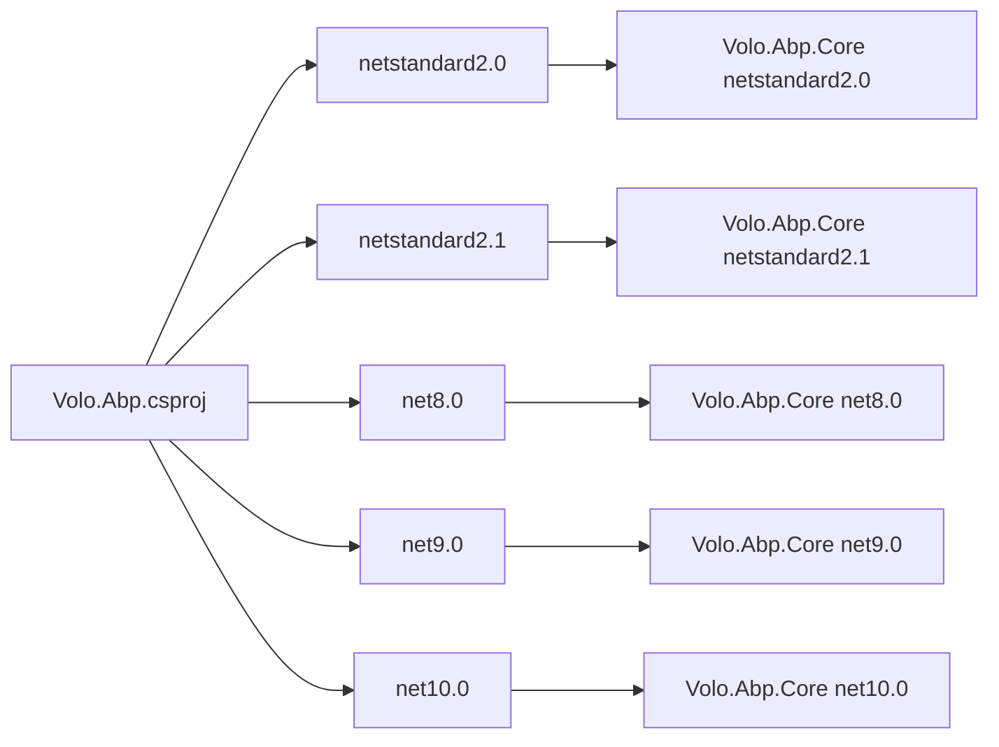
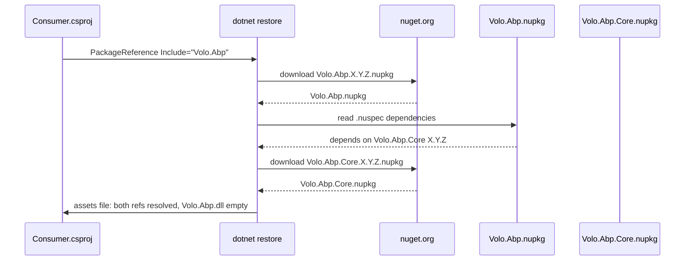

The ABP Framework reserves the short name `Volo.Abp` as a NuGet package — but the package itself contains no code. It exists purely as a "name holder" that forwards to `Volo.Abp.Core`. This page explains why that arrangement exists, walks through the `Volo.Abp.csproj` file line by line, and shows the multi-target framework matrix the package ships under.

## Responsibility

The `Volo.Abp` package has exactly one job: **own the short, friendly NuGet ID** so nobody else can publish under it, while pointing consumers at the real implementation in `Volo.Abp.Core`. Its README, located at `framework/src/Volo.Abp/README.md`, says it plainly:

> This package is a name holder. It just references to the `Volo.Abp.Core` package.

That single sentence is the entire human-readable description of the package.

## File inventory

| File | Lines | What it contains |
| --- | --- | --- |
| `framework/src/Volo.Abp/Volo.Abp.csproj` | ~22 | The project file with one `<ProjectReference>` and standard ABP property imports. |
| `framework/src/Volo.Abp/README.md` | 3 | The "name holder" notice. |
| `framework/src/Volo.Abp/FodyWeavers.xml` | small | Empty Fody weavers configuration (no weavers active). |
| `framework/src/Volo.Abp/FodyWeavers.xsd` | small | Generated XSD for the above. |

There is no `.cs` file in this project at all. `dotnet build` produces an empty assembly that re-exports types from `Volo.Abp.Core` via the package dependency.

## csproj walkthrough

The complete `framework/src/Volo.Abp/Volo.Abp.csproj` is:

```xml
<Project Sdk="Microsoft.NET.Sdk">

  <Import Project="..\..\..\configureawait.props" />
  <Import Project="..\..\..\common.props" />

  <PropertyGroup>
    <TargetFrameworks>netstandard2.0;netstandard2.1;net8.0;net9.0;net10.0</TargetFrameworks>
    <AssemblyName>Volo.Abp</AssemblyName>
    <PackageId>Volo.Abp</PackageId>
    <AssetTargetFallback>$(AssetTargetFallback);portable-net45+win8+wp8+wpa81;</AssetTargetFallback>
    <GenerateAssemblyConfigurationAttribute>false</GenerateAssemblyConfigurationAttribute>
    <GenerateAssemblyCompanyAttribute>false</GenerateAssemblyCompanyAttribute>
    <GenerateAssemblyProductAttribute>false</GenerateAssemblyProductAttribute>
    <RootNamespace />
  </PropertyGroup>

  <ItemGroup>
    <ProjectReference Include="..\Volo.Abp.Core\Volo.Abp.Core.csproj" />
  </ItemGroup>
</Project>
```

Notable lines:

| Line | Why it matters |
| --- | --- |
| `<Import Project="..\..\..\configureawait.props" />` | Pulls in the repo-wide `ConfigureAwait` analyzer rules so the (otherwise empty) library still passes the global lint policy. |
| `<Import Project="..\..\..\common.props" />` | Pulls in versioning, packaging metadata (authors, project URL, license), repository URL, and PDB symbol settings shared by every NuGet in the repo. |
| `<TargetFrameworks>netstandard2.0;netstandard2.1;net8.0;net9.0;net10.0</TargetFrameworks>` | Identical to `Volo.Abp.Core`. This is important — if the meta package targeted fewer frameworks, consumers on those frameworks could not reference `Volo.Abp`. |
| `<AssemblyName>Volo.Abp</AssemblyName>` and `<PackageId>Volo.Abp</PackageId>` | Reserve both the assembly identity and the NuGet ID. |
| `<AssetTargetFallback>…portable-net45+win8+wp8+wpa81;</AssetTargetFallback>` | Compatibility hint for very old portable-class-library consumers — matches `Volo.Abp.Core`. |
| `<GenerateAssemblyConfigurationAttribute>false</GenerateAssemblyConfigurationAttribute>` (and the `Company`/`Product` variants) | Suppresses the SDK-generated assembly attributes so they come from `common.props` instead, keeping metadata uniform across the repo. |
| `<RootNamespace />` | Empty — there is no code, but if anyone ever adds a `.cs` it would inherit Volo's namespace policy. |
| `<ProjectReference Include="..\Volo.Abp.Core\Volo.Abp.Core.csproj" />` | The single dependency that forwards all types. |

<Note>
`common.props` and `configureawait.props` live three levels up at the repo root (`abp/common.props` and `abp/configureawait.props`). Every csproj in the repo imports them. They are how ABP keeps `<Version>`, `<Authors>`, license SPDX, and ConfigureAwait analyzer settings consistent across hundreds of projects.
</Note>

## Multi-targeting

The `<TargetFrameworks>` value compiles five different assemblies inside one NuGet package:



When a consumer adds `<PackageReference Include="Volo.Abp" />` NuGet picks the closest matching TFM from the meta-package's `lib/` folder, which transitively pulls the matching `Volo.Abp.Core` TFM.

## Why have a meta-package at all?

Three reasons that all show up in the ABP repository history:

<Steps>
  <Step title="Name reservation">
    `Volo.Abp` is shorter and more memorable than `Volo.Abp.Core`. If the framework did not publish it, someone else could squat the name on nuget.org. The README explicitly calls it a "name holder".
  </Step>
  <Step title="Backwards compatibility for old templates">
    Pre-2.x ABP templates referenced `Volo.Abp`. Keeping that ID alive — even though all code now lives under `Volo.Abp.Core` — avoids breaking upgrade paths.
  </Step>
  <Step title="Forwarding semantics">
    A `ProjectReference` (rather than `PackageReference` to `Volo.Abp.Core`) means consumers transitively get the *same* version of `Volo.Abp.Core` that was built alongside `Volo.Abp`. There is no risk of version drift.
  </Step>
</Steps>

## Key abstractions

There is nothing to inventory — `Volo.Abp` contains no public types of its own. Every API a caller sees through this package actually lives in `Volo.Abp.Core`.

| Apparent API | Real location |
| --- | --- |
| `AbpModule`, `IAbpModule` | `framework/src/Volo.Abp.Core/Volo/Abp/Modularity/` |
| `[DependsOn]`, `[ExposeServices]` | `framework/src/Volo.Abp.Core/Volo/Abp/Modularity/` and `Volo/Abp/DependencyInjection/` |
| `IServiceCollection.PreConfigure<T>` | `framework/src/Volo.Abp.Core/Microsoft/Extensions/DependencyInjection/ServiceCollectionPreConfigureExtensions.cs` |
| Anything else under `Volo.Abp.*` | `framework/src/Volo.Abp.Core/` |

## Control & data flow

Because the package has no code, "flow" reduces to NuGet resolution at restore time:



At build time the consumer's compiler sees the empty `Volo.Abp.dll` plus the populated `Volo.Abp.Core.dll`. All `using Volo.Abp.*` directives are resolved against `Volo.Abp.Core.dll`.

## Connections

**Depends on:**

- `Volo.Abp.Core` (project reference — `framework/src/Volo.Abp.Core/Volo.Abp.Core.csproj`).
- The repo-wide `common.props` and `configureawait.props` import projects.

**Depended on by:**

- Application templates that historically referenced `Volo.Abp`.
- Documentation snippets that say `dotnet add package Volo.Abp`.
- Nothing inside the `framework/src/` tree — the other framework modules reference `Volo.Abp.Core` directly.

## Gotchas & invariants

<Warning>
Do **not** add a `.cs` file under `framework/src/Volo.Abp/`. The package is supposed to be empty. If you need to add a type, add it to `Volo.Abp.Core` (or a more specific module) and let `Volo.Abp` continue to forward.
</Warning>

- Adding a `<PackageReference>` (instead of `<ProjectReference>`) to `Volo.Abp.Core` would break the in-repo build, because during repo builds the local `Volo.Abp.Core` has not been published yet.
- The README is intentionally one line. Any expansion would mislead readers into thinking the package has its own surface area.
- Both `Volo.Abp` and `Volo.Abp.Core` must keep their `<TargetFrameworks>` in sync. If a consumer is on `net9.0` and only one of the two ships a `net9.0` flavour, NuGet falls back to `netstandard2.1` and silently loses framework-specific APIs.
- `GenerateAssemblyConfigurationAttribute=false` etc. must stay disabled here too, otherwise the SDK injects mismatched attributes and the package validation in CI fails.

## When to use `Volo.Abp` vs `Volo.Abp.Core`

| Scenario | Recommended package |
| --- | --- |
| New solution from a recent ABP template | `Volo.Abp.Core` (templates have moved). |
| Legacy solution upgraded from < 2.x | Either works — keep what you have. |
| Inside the `abp` repository itself | Always `Volo.Abp.Core`. The meta package is for external consumers. |
| You want a one-line "I depend on ABP" reference | `Volo.Abp` is shorter. |

<Tip>
If you want to verify the package is truly empty after build, run `ildasm` or `dotnet-ildasm` against the output `Volo.Abp.dll` — you will see no namespaces, only the assembly header forwarding to `Volo.Abp.Core`.
</Tip>

## Comparison with similar patterns

ABP's meta-package approach mirrors patterns elsewhere in the .NET ecosystem. The mechanism is the same in each case: an empty assembly with a `ProjectReference` (or `PackageReference` to a sibling sub-package) that holds the catchy name.

| Ecosystem | "Meta" package | Real implementation |
| --- | --- | --- |
| ABP Framework | `Volo.Abp` | `Volo.Abp.Core` |
| Microsoft.Extensions | none (each split intentionally) | n/a |
| ASP.NET Core | `Microsoft.AspNetCore.App` (framework reference) | dozens of `Microsoft.AspNetCore.*` |
| Serilog | none | `Serilog` itself is the canonical name |

The trade-off is **discoverability vs control**: meta-packages help newcomers but make it harder to reason about transitive dependencies. ABP picks the meta-package approach because the framework historically launched under the `Volo.Abp` name.

## Version pinning

Both `Volo.Abp.csproj` and `Volo.Abp.Core.csproj` consume `common.props` (located at the repo root), which centralises:

- `<Version>` — the package version computed from build metadata.
- `<Authors>` — `ABP`.
- `<RepositoryUrl>` — the GitHub URL.
- `<PackageProjectUrl>`, `<PackageLicenseExpression>`, `<PackageRequireLicenseAcceptance>` — license + project URL.
- `<PublishRepositoryUrl>true</PublishRepositoryUrl>` for SourceLink.

Because both projects import the same props file, the two packages are always published with **identical** version numbers. A NuGet feed that hosts `Volo.Abp 9.2.3` is guaranteed to also host `Volo.Abp.Core 9.2.3`.

## Fody weavers

The `FodyWeavers.xml` next to the csproj is intentionally empty:

```xml
<Weavers />
```

The `FodyWeavers.xsd` is the auto-generated schema that the Fody MSBuild tasks emit on first build. No actual weaver runs against `Volo.Abp` (there is no code to weave) — but keeping the files present matches the rest of the repository's project shape, simplifying scripts that scan for ABP-format projects.

## Related pages

<CardGroup cols={2}>
  <Card title="Volo.Abp.Core package" icon="cube" href="/core/volo-abp-core">
    Where the real code lives.
  </Card>
  <Card title="Core overview" icon="map" href="/core/overview">
    Map of all subsystems under `Volo.Abp.Core`.
  </Card>
</CardGroup>
