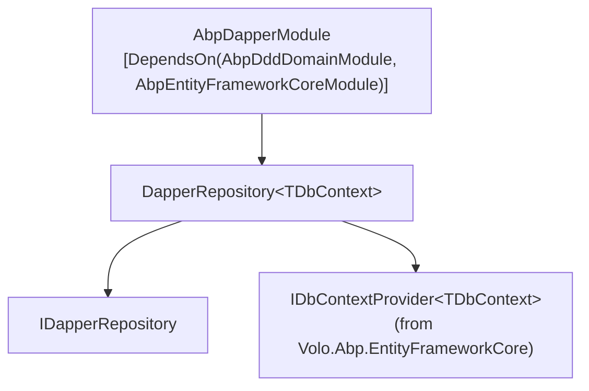

`Volo.Abp.Dapper` is the smallest data package the ABP Framework ships. It does not introduce a new connection model or a new repository abstraction — instead, it piggy-backs on an existing EF Core `IDbContextProvider<TDbContext>` so a custom Dapper repository can issue raw SQL against the *same* connection and transaction that the active unit of work has already opened for the EF Core DbContext.

All types referenced here live under `framework/src/Volo.Abp.Dapper/`.

## Package layout



## Module

`Volo/Abp/Dapper/AbpDapperModule.cs`:

```csharp
using Volo.Abp.Domain;
using Volo.Abp.EntityFrameworkCore;
using Volo.Abp.Modularity;

namespace Volo.Abp.Dapper;

[DependsOn(
    typeof(AbpDddDomainModule),
    typeof(AbpEntityFrameworkCoreModule))]
public class AbpDapperModule : AbpModule
{
}
```

The module body is empty — no services, no options. The only declarative statement is the dependency: `AbpEntityFrameworkCoreModule` is required because Dapper repositories share that module's `IDbContextProvider<TDbContext>` and the unit-of-work plumbing it brings in.

The `.csproj` reflects the same minimalism:

```xml
<PackageReference Include="Dapper" />
<ProjectReference Include="..\Volo.Abp.EntityFrameworkCore\Volo.Abp.EntityFrameworkCore.csproj" />
```

## `IDapperRepository`

`Volo/Abp/Domain/Repositories/Dapper/IDapperRepository.cs`:

```csharp
public interface IDapperRepository
{
    [Obsolete("Use GetDbConnectionAsync method.")]
    IDbConnection DbConnection { get; }

    Task<IDbConnection> GetDbConnectionAsync();

    [Obsolete("Use GetDbTransactionAsync method.")]
    IDbTransaction? DbTransaction { get; }

    Task<IDbTransaction?> GetDbTransactionAsync();
}
```

Two pairs, sync (`[Obsolete]`) and async. A consumer never *constructs* a connection — it asks the repository for the ambient one and runs `connection.QueryAsync(...)` directly using the Dapper `IDbConnection` extension methods.

## `DapperRepository<TDbContext>`

`Volo/Abp/Domain/Repositories/Dapper/DapperRepository.cs`:

```csharp
public class DapperRepository<TDbContext> : IDapperRepository, IUnitOfWorkEnabled
    where TDbContext : IEfCoreDbContext
{
    public IAbpLazyServiceProvider LazyServiceProvider { get; set; } = default!;
    public IDataFilter DataFilter => LazyServiceProvider.LazyGetRequiredService<IDataFilter>();
    public ICurrentTenant CurrentTenant => LazyServiceProvider.LazyGetRequiredService<ICurrentTenant>();
    public IUnitOfWorkManager UnitOfWorkManager => LazyServiceProvider.LazyGetRequiredService<IUnitOfWorkManager>();
    public ICancellationTokenProvider CancellationTokenProvider => LazyServiceProvider.LazyGetService<ICancellationTokenProvider>(NullCancellationTokenProvider.Instance);

    private readonly IDbContextProvider<TDbContext> _dbContextProvider;

    public DapperRepository(IDbContextProvider<TDbContext> dbContextProvider)
    {
        _dbContextProvider = dbContextProvider;
    }

    [Obsolete("Use GetDbConnectionAsync method.")]
    public IDbConnection DbConnection => _dbContextProvider.GetDbContext().Database.GetDbConnection();

    public virtual async Task<IDbConnection> GetDbConnectionAsync()
        => (await _dbContextProvider.GetDbContextAsync()).Database.GetDbConnection();

    [Obsolete("Use GetDbTransactionAsync method.")]
    public IDbTransaction? DbTransaction => _dbContextProvider.GetDbContext().Database.CurrentTransaction?.GetDbTransaction();

    public virtual async Task<IDbTransaction?> GetDbTransactionAsync()
        => (await _dbContextProvider.GetDbContextAsync()).Database.CurrentTransaction?.GetDbTransaction();

    protected virtual CancellationToken GetCancellationToken(CancellationToken preferredValue = default)
    {
        return CancellationTokenProvider.FallbackToProvider(preferredValue);
    }
}
```

Five things to notice:

1. **Generic on `TDbContext : IEfCoreDbContext`.** The Dapper repository is bound to an EF Core context type — not a raw connection. That's how it inherits the connection-string resolution that ABP's `IConnectionStringResolver` performs for that DbContext.
2. **`IUnitOfWorkEnabled` marker.** Members of any class marked this way trigger ABP's UoW interceptor — calls go through the active unit of work, opening one if none exists.
3. **`LazyServiceProvider`-injected services.** `IDataFilter`, `ICurrentTenant`, `IUnitOfWorkManager`, `ICancellationTokenProvider` are all available to subclasses without further DI ceremony. The base class does not *use* them directly, but they are wired so that hand-written SQL queries can honour ambient filter and tenant state.
4. **Connection comes from the DbContext.** `Database.GetDbConnection()` returns the EF Core-managed `DbConnection` for the current context — the very same instance EF Core uses. If a UoW transaction is open, `Database.CurrentTransaction?.GetDbTransaction()` returns its `IDbTransaction`.
5. **No table-name conventions, no entity tracking.** Unlike `EfCoreRepository`, this class does not implement `IRepository<TEntity>` and does not know about your entity types. Subclasses write their own SQL.

```mermaid
flowchart LR
    Caller["Custom MyDapperRepository : DapperRepository&lt;MyDbContext&gt;"]
    Caller -->|GetDbConnectionAsync| Provider["IDbContextProvider&lt;MyDbContext&gt;"]
    Provider -->|GetDbContextAsync| Uow["UnitOfWork"]
    Uow -->|cached| Ctx["AbpDbContext"]
    Ctx -->|Database.GetDbConnection()| Conn["DbConnection"]
    Ctx -->|Database.CurrentTransaction.GetDbTransaction()| Txn["IDbTransaction"]
    Caller -->|conn.QueryAsync(sql, txn)| Dapper["Dapper extensions"]
```

## Why piggy-back on EF Core?

ABP's unit of work guarantees a single open `DbConnection` and `DbTransaction` per `IUnitOfWork` per DbContext type. By routing through `IDbContextProvider<TDbContext>` instead of opening a fresh `SqlConnection` from a connection string, the Dapper repository inherits:

- **Transaction enlistment** — Dapper queries automatically participate in the same transaction EF Core mutations join.
- **Connection-string resolution** — `IConnectionStringResolver` handles tenant-aware connection-string selection. The Dapper repo does not duplicate the resolution path.
- **Connection sharing** — A single connection per UoW avoids exhausting the pool when both EF Core and Dapper queries run in the same request.

## Building a custom Dapper repository

The canonical pattern:

```csharp
public class BookDapperRepository : DapperRepository<MyAppDbContext>, ITransientDependency
{
    public BookDapperRepository(IDbContextProvider<MyAppDbContext> dbContextProvider)
        : base(dbContextProvider) { }

    public async Task<List<BookSlimDto>> GetSlimListAsync(string? search, CancellationToken ct = default)
    {
        var connection = await GetDbConnectionAsync();
        var transaction = await GetDbTransactionAsync();

        var rows = await connection.QueryAsync<BookSlimDto>(
            @"SELECT Id, Name, AuthorId
              FROM Books
              WHERE @Search IS NULL OR Name LIKE '%' + @Search + '%'",
            param: new { Search = search },
            transaction: transaction);

        return rows.AsList();
    }
}
```

The class is `ITransientDependency` so it is conventionally registered. The constructor only needs `IDbContextProvider<TDbContext>`; all the cross-cutting services come through `LazyServiceProvider` already.

## Multi-tenancy in raw SQL

Because the Dapper repository does *not* go through `EfCoreRepository`'s LINQ provider, it does not inherit EF Core's global query filters. The host has to filter by `CurrentTenant.Id` explicitly:

```csharp
var rows = await connection.QueryAsync<MyEntity>(
    @"SELECT *
      FROM MyEntities
      WHERE TenantId = @TenantId OR @TenantId IS NULL",
    param: new { TenantId = CurrentTenant.Id },
    transaction: transaction);
```

The `IDataFilter` and `ICurrentTenant` properties surfaced on the base class are exactly what makes this possible without resolving them in every subclass.

## Sequence of a call

```mermaid
sequenceDiagram
    participant Service as Application Service
    participant Repo as BookDapperRepository
    participant Prov as IDbContextProvider&lt;MyAppDbContext&gt;
    participant Uow as IUnitOfWork
    participant Ef as AbpDbContext
    participant Db as Database
    Service->>Repo: GetSlimListAsync(search)
    Repo->>Prov: GetDbContextAsync()
    Prov->>Uow: GetOrAddDatabaseApi (cached or new)
    Uow->>Ef: new (opts), Initialize(...)
    Ef-->>Uow: Database.GetDbConnection() (opened on first use)
    Uow-->>Prov: TDbContext
    Prov-->>Repo: TDbContext
    Repo->>Repo: GetDbTransactionAsync()
    Repo->>Db: conn.QueryAsync(sql, params, transaction)
    Db-->>Repo: rows
    Repo-->>Service: List&lt;BookSlimDto&gt;
```

## Common pitfalls

<Warning>
Mixing Dapper writes and EF Core writes in the *same* UoW requires care. EF Core's change tracker doesn't see Dapper-issued INSERT/UPDATE/DELETE, so subsequent `SaveChangesAsync()` calls won't refresh the tracked entities. Either flush EF Core first or detach tracked instances before issuing Dapper mutations.
</Warning>

<Warning>
`GetDbTransactionAsync()` returns `null` when the UoW is *not* transactional (`IsTransactional = false` is set on `AbpUnitOfWorkDefaultOptions` or the calling `[UnitOfWork(isTransactional: false)]` attribute). In that mode, every Dapper call is auto-committed at the statement level — domain events and audit logs may still be queued but not undone if a later step throws.
</Warning>

<Warning>
`DapperRepository<TDbContext>` has no built-in `IDataFilter` integration. Soft-delete and multi-tenant filters that `EfCoreRepository` honours via global query filters are *not* applied to raw SQL. Always add `WHERE IsDeleted = 0` and `WHERE TenantId = @TenantId` predicates manually.
</Warning>

<Tip>
For complex projections that don't translate cleanly via EF Core LINQ, a Dapper repository on the same DbContext is the canonical ABP pattern — better than dropping to `Database.SqlQueryRaw` because it keeps the UoW transactional boundary intact.
</Tip>

See [entity-framework-core.mdx](/data/entity-framework-core) for the EF Core machinery that Dapper repositories reuse.
