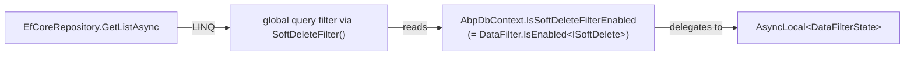
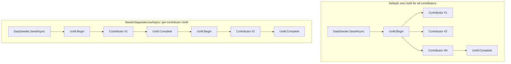

`IDataFilter` and `IDataSeeder` are the two ambient-state services every ABP Framework application interacts with — often without writing a single direct call. Soft-delete, multi-tenancy filters, and the test harness's "create a fresh admin user" all flow through these two abstractions. This page is the user-facing companion to [volo-abp-data.mdx](/data/volo-abp-data); it focuses on patterns, not on internals.

All types referenced here live under `framework/src/Volo.Abp.Data/Volo/Abp/Data/`.

## Filtering: marker interfaces

A "filter" in ABP is a marker *interface* used as a generic type argument to `IDataFilter<TFilter>`. The two well-known markers used framework-wide are:

| Marker | Defined in | Behaviour when enabled |
| --- | --- | --- |
| `ISoftDelete` | `Volo.Abp.Domain.Entities/ISoftDelete.cs` | Entities with `IsDeleted = true` are excluded from queries and DELETE is rewritten to UPDATE. |
| `IMultiTenant` | `Volo.Abp.MultiTenancy/IMultiTenant.cs` | Entities whose `TenantId` differs from `ICurrentTenant.Id` are excluded. |

Both are enabled by default. The filter state lives in an `AsyncLocal<DataFilterState>` per type so it flows through async boundaries cleanly.

## Disabling a filter

The disposable pattern is the canonical way to scope a filter change:

```csharp
public class BookAppService : ApplicationService
{
    private readonly IRepository<Book, Guid> _bookRepository;

    public BookAppService(IRepository<Book, Guid> bookRepository) { _bookRepository = bookRepository; }

    public async Task<List<Book>> GetAllIncludingDeletedAsync()
    {
        using (DataFilter.Disable<ISoftDelete>())
        {
            return await _bookRepository.GetListAsync();
        }
    }
}
```

The `DataFilter` property on `ApplicationService` (and `DomainService`) is an `IDataFilter`. When the `using` block ends, the original state is restored — even if it was already disabled, in which case `Disable()` short-circuits to `NullDisposable.Instance`:

```csharp
// From DataFilter.cs
public IDisposable Disable()
{
    if (!IsEnabled) { return NullDisposable.Instance; }
    _filter.Value!.IsEnabled = false;
    return new DisposeAction(() => Enable());
}
```

```mermaid
sequenceDiagram
    participant Caller
    participant Filter as IDataFilter
    participant State as AsyncLocal&lt;DataFilterState&gt;
    Caller->>Filter: Disable&lt;ISoftDelete&gt;()
    Filter->>State: IsEnabled = false
    Filter-->>Caller: IDisposable (DisposeAction)
    Caller->>Caller: query inside using block
    Note over State: query sees soft-deleted rows
    Caller->>Filter: dispose()
    Filter->>State: IsEnabled = true
```

## Disabling multiple filters at once

`DataFilterExtensions.cs` provides `Disable<T1, T2>` ... `Disable<T1, ..., T8>` overloads that compose into a `CompositeDisposable`:

```csharp
public static IDisposable Disable<T1, T2>(this IDataFilter filter)
    where T1 : class where T2 : class
{
    return new CompositeDisposable(new[]
    {
        filter.Disable<T1>(),
        filter.Disable<T2>()
    });
}
```

A common combination: drop both soft-delete *and* tenant boundaries while running a host-side maintenance job:

```csharp
using (DataFilter.Disable<ISoftDelete, IMultiTenant>())
{
    // sees every row in every tenant, including soft-deleted ones
    var stragglers = await _repo.GetListAsync(b => b.Status == BookStatus.Orphaned);
}
```

`Enable<T1, ..., T8>` overloads exist symmetrically.

## Custom filter markers

Any class type can be a filter marker. The convention is to declare an empty marker *interface* on entities you want to filter:

```csharp
public interface IArchivable
{
    bool IsArchived { get; set; }
}

public class Article : Entity<Guid>, IArchivable
{
    public bool IsArchived { get; set; }
    // ...
}
```

The EF Core context then adds a global query filter for that interface, gated on `DataFilter?.IsEnabled<IArchivable>() ?? false`. Module-level code can scope the filter:

```csharp
using (DataFilter.Disable<IArchivable>())
{
    var allIncludingArchived = await _articleRepo.GetListAsync();
}
```

The default state is *on*, because `DataFilter<TFilter>.EnsureInitialized()` falls back to `new DataFilterState(true)` when `AbpDataFilterOptions.DefaultStates` is missing an entry. To make a custom filter default-off:

```csharp
// in YourModule.ConfigureServices
Configure<AbpDataFilterOptions>(options =>
{
    options.DefaultStates[typeof(IArchivable)] = new DataFilterState(false);
});
```

## `DataFilterState` clone semantics

`DataFilterState.cs`:

```csharp
public class DataFilterState
{
    public bool IsEnabled { get; set; }
    public DataFilterState(bool isEnabled) { IsEnabled = isEnabled; }
    public DataFilterState Clone() => new DataFilterState(IsEnabled);
}
```

`Clone()` is called inside `DataFilter<TFilter>.EnsureInitialized()`:

```csharp
_filter.Value = _options.DefaultStates.GetOrDefault(typeof(TFilter))?.Clone() ?? new DataFilterState(true);
```

Cloning matters because the *same* `DataFilterState` reference must not be shared across `AsyncLocal` slots — that would mean one request's `Disable()` affects every other request that initialised against the same default.

## Filtering at the repository level

`EfCoreRepository<TDbContext, TEntity>` consults `IDataFilter` indirectly through global query filters wired up in `AbpDbContext.ConfigureGlobalFilters<TEntity>`. The expression compiled into the model is:

```csharp
e => AbpEfCoreDataFilterDbFunctionMethods.SoftDeleteFilter(((ISoftDelete)e).IsDeleted, true)
```

`AbpEfCoreDataFilterDbFunctionMethods` is registered as a database function (`UseDbFunction = true` is set in every provider module). At query-time the function evaluates the *current* `IsSoftDeleteFilterEnabled` ambient flag and decides whether to filter. The compiled-query cache key doesn't change when the flag flips — only the parameter value does — so disabling a filter mid-process doesn't blow the cache.



## Seeding: contributors

`IDataSeedContributor`:

```csharp
public interface IDataSeedContributor
{
    Task SeedAsync(DataSeedContext context);
}
```

Implementations are auto-discovered by `AbpDataModule.AutoAddDataSeedContributors`:

```csharp
services.OnRegistered(context =>
{
    if (typeof(IDataSeedContributor).IsAssignableFrom(context.ImplementationType))
    {
        contributors.Add(context.ImplementationType);
    }
});

services.Configure<AbpDataSeedOptions>(options =>
{
    options.Contributors.AddIfNotContains(contributors);
});
```

`AbpDataSeedOptions` (`AbpDataSeedOptions.cs`) holds a `DataSeedContributorList`, which is a `TypeList<IDataSeedContributor>` from `Volo.Abp.Collections`:

```csharp
public class AbpDataSeedOptions
{
    public DataSeedContributorList Contributors { get; }
    public AbpDataSeedOptions() { Contributors = new DataSeedContributorList(); }
}

public class DataSeedContributorList : TypeList<IDataSeedContributor> { }
```

Contributors execute in registration order. To enforce ordering, manipulate the list explicitly:

```csharp
Configure<AbpDataSeedOptions>(options =>
{
    options.Contributors.TryAdd<MyTenantSeedContributor>();   // must precede UserSeed
    options.Contributors.TryAdd<MyUserSeedContributor>();
});
```

## Sample contributor

```csharp
public class DemoBookSeedContributor : IDataSeedContributor, ITransientDependency
{
    private readonly IRepository<Book, Guid> _bookRepository;
    private readonly IGuidGenerator _guidGenerator;

    public DemoBookSeedContributor(IRepository<Book, Guid> bookRepository, IGuidGenerator guidGenerator)
    {
        _bookRepository = bookRepository;
        _guidGenerator = guidGenerator;
    }

    public async Task SeedAsync(DataSeedContext context)
    {
        if (await _bookRepository.GetCountAsync() > 0) { return; }   // idempotent

        await _bookRepository.InsertAsync(new Book(_guidGenerator.Create(), "1984"));
        await _bookRepository.InsertAsync(new Book(_guidGenerator.Create(), "Brave New World"));
    }
}
```

Three patterns the framework expects:

1. **Idempotent** — `SeedAsync` runs on every host bootstrap. Always check before inserting.
2. **Per-tenant aware** — `DataSeedContext.TenantId` is non-null when seeding a specific tenant. The contributor should switch tenant scope: `using (CurrentTenant.Change(context.TenantId)) { ... }`.
3. **`DataSeedContext.Properties` carries cross-contributor state** — for instance, the Identity seed contributor stashes the admin user's password into `context["AdminPassword"]` so a downstream module can read it.

## Invoking the seeder

The framework-level entry point is `IDataSeeder.SeedAsync(DataSeedContext)`. From `DataSeederExtensions.cs`:

```csharp
public static Task SeedAsync(this IDataSeeder seeder, Guid? tenantId = null)
{
    return seeder.SeedAsync(new DataSeedContext(tenantId));
}

public static Task SeedInSeparateUowAsync(this IDataSeeder seeder, Guid? tenantId = null,
    AbpUnitOfWorkOptions? options = null, bool requiresNew = false)
{
    var context = new DataSeedContext(tenantId);
    context.WithProperty(SeedInSeparateUow, true);
    context.WithProperty(SeedInSeparateUowOptions, options);
    context.WithProperty(SeedInSeparateUowRequiresNew, requiresNew);
    return seeder.SeedAsync(context);
}
```

Two execution modes:



Use `SeedInSeparateUowAsync` when:

- A contributor calls `_settingManager.SetForGlobalAsync(...)` whose change must be visible to subsequent contributors.
- A contributor publishes a distributed event whose handler must run before later contributors execute.
- A long-running seed should commit progressively rather than all-or-nothing.

Use the default single-UoW mode when:

- Atomicity matters — a failure in any contributor rolls back the whole seed.
- All contributors are pure inserts and there is no cross-contributor read dependency.

## Per-tenant seeding

The host typically invokes the seeder once per known tenant:

```csharp
public class MyAppSeederHelper : ITransientDependency
{
    private readonly IDataSeeder _dataSeeder;
    private readonly ITenantStore _tenantStore;
    private readonly ICurrentTenant _currentTenant;

    public async Task SeedAllAsync()
    {
        await _dataSeeder.SeedAsync();                                // host
        foreach (var tenant in await _tenantStore.GetListAsync())
        {
            using (_currentTenant.Change(tenant.Id))
            {
                await _dataSeeder.SeedAsync(tenant.Id);                // per tenant
            }
        }
    }
}
```

Inside the per-tenant call, every contributor receives `context.TenantId == tenant.Id`. Aggregate roots that implement `IMultiTenant` automatically pick up `CurrentTenant.Id` on insert via the property setter in `AuditPropertySetter`.

## Filtering inside seeding

A frequent pattern: a seeder needs to *find* a soft-deleted seed row to re-activate it rather than create a duplicate:

```csharp
public async Task SeedAsync(DataSeedContext context)
{
    using (_dataFilter.Disable<ISoftDelete>())
    {
        var existing = await _bookRepo.FindAsync(b => b.Name == "1984");
        if (existing != null)
        {
            if (existing.IsDeleted)
            {
                existing.IsDeleted = false;
                await _bookRepo.UpdateAsync(existing);
            }
            return;
        }
    }
    // create fresh
}
```

The `Disable<ISoftDelete>()` scope ensures the `FindAsync` query returns soft-deleted matches; the `using` block disposes deterministically.

## Common pitfalls

<Warning>
`IDataFilter` is a *singleton*, but its state is `AsyncLocal`. Disabling a filter inside a fire-and-forget `Task.Run(...)` (which doesn't capture `ExecutionContext`) leaks the disable into the original async context and *misses* the disable in the new context. Always `await` inside a `using` block.
</Warning>

<Warning>
`IDataSeedContributor` implementations are *transient* dependencies. The seeder builds a fresh service scope and resolves a fresh contributor instance per call. Do not cache repositories in instance fields across `SeedAsync` calls.
</Warning>

<Warning>
`DataSeedContext.Properties` is a `Dictionary<string, object?>` shared between *all* contributors within one `SeedAsync` invocation. Use prefixed keys (e.g., `"Identity:AdminPassword"`) to avoid collisions with other modules.
</Warning>

<Tip>
For test fixtures, replace `IDataSeeder` with a no-op or supply an empty `AbpDataSeedOptions.Contributors` list to skip seeding entirely — useful when an integration test wants a pristine database without the framework's default admin user.
</Tip>

See [volo-abp-data.mdx](/data/volo-abp-data) for the internals of `IDataFilter` and `IDataSeeder`.
