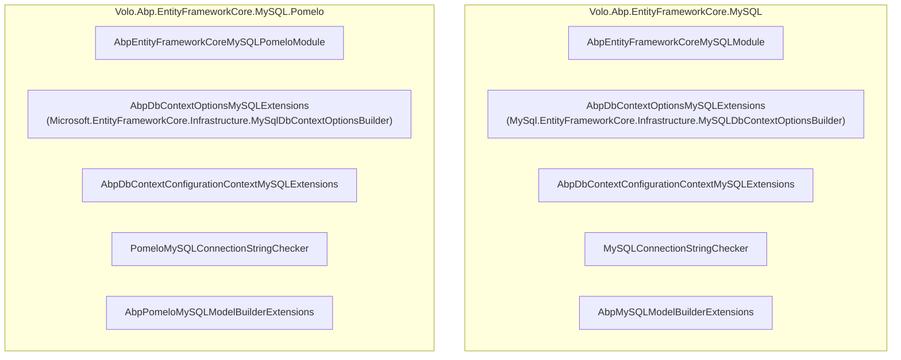
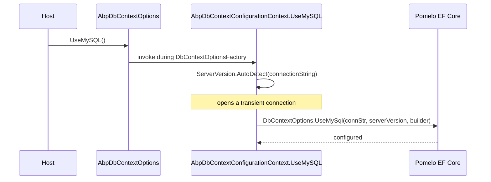

ABP Framework is the only data integration in the repo that ships *two* mutually exclusive provider packages for one database product: `Volo.Abp.EntityFrameworkCore.MySQL` (built on Oracle's official `MySql.EntityFrameworkCore` driver) and `Volo.Abp.EntityFrameworkCore.MySQL.Pomelo` (built on the community `Pomelo.EntityFrameworkCore.MySql` driver). Both expose a `UseMySQL(...)` extension under the same `Volo.Abp.EntityFrameworkCore` namespace, so a host references exactly one.

All types referenced here live under `framework/src/Volo.Abp.EntityFrameworkCore.MySQL/` and `framework/src/Volo.Abp.EntityFrameworkCore.MySQL.Pomelo/`.

## Package overview



The two packages are structurally parallel but bind to different EF Core relational drivers. Both modules apply the same two ABP-side defaults:

| Setting | Both packages |
| --- | --- |
| `AbpSequentialGuidGeneratorOptions.DefaultSequentialGuidType` | `SequentialAsString` |
| `AbpEfCoreGlobalFilterOptions.UseDbFunction` | `true` |

## The Oracle/MySQL official package

### Module

`Volo.Abp.EntityFrameworkCore.MySQL/Volo/Abp/EntityFrameworkCore/MySQL/AbpEntityFrameworkCoreMySQLModule.cs`:

```csharp
[DependsOn(typeof(AbpEntityFrameworkCoreModule))]
public class AbpEntityFrameworkCoreMySQLModule : AbpModule
{
    public override void ConfigureServices(ServiceConfigurationContext context)
    {
        Configure<AbpSequentialGuidGeneratorOptions>(options =>
        {
            if (options.DefaultSequentialGuidType == null)
            {
                options.DefaultSequentialGuidType = SequentialGuidType.SequentialAsString;
            }
        });

        Configure<AbpEfCoreGlobalFilterOptions>(options =>
        {
            options.UseDbFunction = true;
        });
    }
}
```

### `.csproj`

```xml
<PackageReference Include="MySql.EntityFrameworkCore" />
```

This is **Oracle/MySQL's** EF Core provider, not Pomelo's. It is the package shipped by MySQL Corporation; the namespace is `MySql.EntityFrameworkCore.*`.

### `UseMySQL` extensions

```csharp
// AbpDbContextOptionsMySQLExtensions.cs
public static void UseMySQL(
    this AbpDbContextOptions options,
    Action<MySql.EntityFrameworkCore.Infrastructure.MySQLDbContextOptionsBuilder>? mySQLOptionsAction = null)
{
    options.Configure(context => { context.UseMySQL(mySQLOptionsAction); });
}
```

```csharp
// AbpDbContextConfigurationContextMySQLExtensions.cs
public static DbContextOptionsBuilder UseMySQL(
    this AbpDbContextConfigurationContext context,
    Action<MySql.EntityFrameworkCore.Infrastructure.MySQLDbContextOptionsBuilder>? mySQLOptionsAction = null)
{
    if (context.ExistingConnection != null)
    {
        return context.DbContextOptions.UseMySQL(context.ExistingConnection, optionsBuilder =>
        {
            optionsBuilder.UseQuerySplittingBehavior(QuerySplittingBehavior.SplitQuery);
            mySQLOptionsAction?.Invoke(optionsBuilder);
        });
    }
    else
    {
        return context.DbContextOptions.UseMySQL(context.ConnectionString, optionsBuilder =>
        {
            optionsBuilder.UseQuerySplittingBehavior(QuerySplittingBehavior.SplitQuery);
            mySQLOptionsAction?.Invoke(optionsBuilder);
        });
    }
}
```

Note the `Action<>` type parameter — `MySql.EntityFrameworkCore.Infrastructure.MySQLDbContextOptionsBuilder` (capital `SQL`).

## The Pomelo package

### Module

`Volo.Abp.EntityFrameworkCore.MySQL.Pomelo/Volo/Abp/EntityFrameworkCore/MySQL/AbpEntityFrameworkCoreMySQLPomeloModule.cs`:

```csharp
[DependsOn(typeof(AbpEntityFrameworkCoreModule))]
public class AbpEntityFrameworkCoreMySQLPomeloModule : AbpModule
{
    // identical to the official module
}
```

### `.csproj`

```xml
<PackageReference Include="Pomelo.EntityFrameworkCore.MySql" />
<PackageReference Include="Microsoft.EntityFrameworkCore.Relational" />
```

The community Pomelo driver registers its provider call on `DbContextOptionsBuilder` under the *Microsoft* namespace — `UseMySql` (lowercase `sql`) — and pulls in `MySqlDbContextOptionsBuilder` from `Microsoft.EntityFrameworkCore.Infrastructure`.

### `UseMySQL` extension

The Pomelo configuration-context extension adds a substantial twist — it auto-detects the server version:

```csharp
// AbpDbContextConfigurationContextMySQLExtensions.cs (Pomelo)
public static DbContextOptionsBuilder UseMySQL(
    this AbpDbContextConfigurationContext context,
    Action<Microsoft.EntityFrameworkCore.Infrastructure.MySqlDbContextOptionsBuilder>? mySQLOptionsAction = null)
{
    if (context.ExistingConnection != null)
    {
        return context.DbContextOptions.UseMySql(context.ExistingConnection,
            ServerVersion.AutoDetect(context.ConnectionString), optionsBuilder =>
            {
                optionsBuilder.UseQuerySplittingBehavior(QuerySplittingBehavior.SplitQuery);
                mySQLOptionsAction?.Invoke(optionsBuilder);
            });
    }
    else
    {
        return context.DbContextOptions.UseMySql(context.ConnectionString,
            ServerVersion.AutoDetect(context.ConnectionString), optionsBuilder => { ... });
    }
}
```

The `ServerVersion.AutoDetect(context.ConnectionString)` call opens a temporary connection at startup to read `@@version` and pick the right SQL dialect. This is *the* defining difference between the two packages from a host's perspective:

| Concern | MySQL official package | MySQL.Pomelo package |
| --- | --- | --- |
| Server version detection | Caller's responsibility (the Oracle driver figures it out internally) | `ServerVersion.AutoDetect(connString)` runs at startup |
| Underlying namespace | `MySql.EntityFrameworkCore.*` | `Microsoft.EntityFrameworkCore.*` (Pomelo overlays here) |
| Provider call | `UseMySQL` | `UseMySql` (Pomelo's lowercase) |
| Connection-string checker | `MySQLConnectionStringChecker` | `PomeloMySQLConnectionStringChecker` |



<Warning>
`ServerVersion.AutoDetect` opens a connection at the moment `UseMySQL` is invoked. If the database is unavailable at process startup, the host will fail to construct DbContext options. Pomelo's recommended workaround is `ServerVersion.Create(new Version(8,0,32), ServerType.MySql)` for environments where the server cannot be contacted at startup; pass it through a host-side override.
</Warning>

## Choosing between the two

<AccordionGroup>
  <Accordion title="Pick the official package when">
    - Your operations team mandates Oracle-supported drivers.
    - You need the licensing/support contract that comes with `MySql.EntityFrameworkCore`.
    - You are comfortable with a stricter EF Core feature lag (Oracle's driver historically trails Pomelo in EF Core release alignment).
  </Accordion>
  <Accordion title="Pick the Pomelo package when">
    - You want fast EF Core version alignment (Pomelo typically ships within days of an EF Core minor release).
    - You target MariaDB — Pomelo has first-class MariaDB dialect support.
    - You are willing to handle `ServerVersion` resolution explicitly.
  </Accordion>
</AccordionGroup>

## Wiring a host

```csharp
// AppModule.cs - choose ONE
[DependsOn(typeof(AbpEntityFrameworkCoreMySQLModule))]            // Oracle official
// or
[DependsOn(typeof(AbpEntityFrameworkCoreMySQLPomeloModule))]     // Pomelo
public class MyAppEfCoreModule : AbpModule
{
    public override void ConfigureServices(ServiceConfigurationContext context)
    {
        Configure<AbpDbContextOptions>(options =>
        {
            options.UseMySQL();   // resolves to whichever extension namespace is in scope
        });
    }
}
```

Both `UseMySQL` overloads live in `Volo.Abp.EntityFrameworkCore` — referencing *both* packages in the same project produces a compile-time `CS0121` ambiguity error, which is the intended guard.

## Connection-string checkers

Each package replaces `IConnectionStringChecker`:

- `MySQLConnectionStringChecker` (Oracle official) probes by parsing the connection string with the Oracle MySQL connector's builder.
- `PomeloMySQLConnectionStringChecker` (Pomelo) uses the Pomelo Connector/NET-compatible builder.

Both follow the same pattern as the SQL Server and PostgreSQL checkers: try to open, set `Connected = true`, attempt to use the target database, set `DatabaseExists = true`.

## Model builder marker

Each package ships its own:

- `AbpMySQLModelBuilderExtensions.UseMySQL(this ModelBuilder)` in the official package.
- `AbpPomeloMySQLModelBuilderExtensions.UseMySQL(this ModelBuilder)` in the Pomelo package.

Both call `modelBuilder.SetDatabaseProvider(EfCoreDatabaseProvider.MySql)` so module `OnModelCreating` extensions can branch on provider type uniformly.

## Common pitfalls

<Warning>
MySQL's default character set for older servers is `latin1`. ABP modules assume `utf8mb4`. Always set `character-set-server=utf8mb4` and `collation-server=utf8mb4_unicode_ci` on the server, or your migration will fail on the first non-ASCII seed entry.
</Warning>

<Warning>
`SequentialAsString` requires the GUID column to be stored as `CHAR(36)`, not `BINARY(16)`. Both Pomelo and the official driver default to `CHAR(36)` for `Guid` properties; do not override unless you also flip `AbpSequentialGuidGeneratorOptions.DefaultSequentialGuidType`.
</Warning>

See [efcore-providers.mdx](/data/efcore-providers) for the cross-provider comparison.
