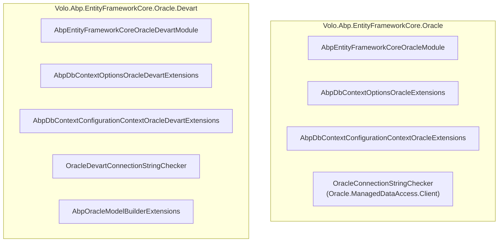

The ABP Framework ships two Oracle EF Core integrations: `Volo.Abp.EntityFrameworkCore.Oracle` (built on `Oracle.EntityFrameworkCore`, the vendor's official EF Core provider) and `Volo.Abp.EntityFrameworkCore.Oracle.Devart` (built on `Devart.Data.Oracle.EFCore`, the commercial Devart dotConnect driver). Both modules expose a `UseOracle(...)` extension under the same `Volo.Abp.EntityFrameworkCore` namespace, so a host references exactly one.

All types referenced here live under `framework/src/Volo.Abp.EntityFrameworkCore.Oracle/` and `framework/src/Volo.Abp.EntityFrameworkCore.Oracle.Devart/`.

## Side-by-side



Both modules share the same two ABP-level configuration tweaks:

| Setting | Both Oracle packages |
| --- | --- |
| `AbpSequentialGuidGeneratorOptions.DefaultSequentialGuidType` | `SequentialAsBinary` |
| `AbpEfCoreGlobalFilterOptions.UseDbFunction` | `true` |

`SequentialAsBinary` is the right choice because Oracle stores GUIDs as `RAW(16)`, and `RAW` columns sort byte-wise. ABP's sequential generator places the timestamp prefix in the first 6 bytes for binary mode, so newly minted GUIDs cluster in arrival order on a primary-key index.

## The official Oracle package

### Module

`Volo.Abp.EntityFrameworkCore.Oracle/Volo/Abp/EntityFrameworkCore/Oracle/AbpEntityFrameworkCoreOracleModule.cs`:

```csharp
[DependsOn(typeof(AbpEntityFrameworkCoreModule))]
public class AbpEntityFrameworkCoreOracleModule : AbpModule
{
    public override void ConfigureServices(ServiceConfigurationContext context)
    {
        Configure<AbpSequentialGuidGeneratorOptions>(options =>
        {
            if (options.DefaultSequentialGuidType == null)
            {
                options.DefaultSequentialGuidType = SequentialGuidType.SequentialAsBinary;
            }
        });

        Configure<AbpEfCoreGlobalFilterOptions>(options =>
        {
            options.UseDbFunction = true;
        });
    }
}
```

### `.csproj`

```xml
<PackageReference Include="Oracle.EntityFrameworkCore" />
```

### `UseOracle` configuration-context extension

```csharp
// AbpDbContextConfigurationContextOracleExtensions.cs
public static DbContextOptionsBuilder UseOracle(
    this AbpDbContextConfigurationContext context,
    Action<OracleDbContextOptionsBuilder>? oracleOptionsAction = null)
{
    if (context.ExistingConnection != null)
    {
        return context.DbContextOptions.UseOracle(context.ExistingConnection, optionsBuilder =>
        {
            optionsBuilder.UseQuerySplittingBehavior(QuerySplittingBehavior.SplitQuery);
            oracleOptionsAction?.Invoke(optionsBuilder);
        });
    }
    else
    {
        return context.DbContextOptions.UseOracle(context.ConnectionString, optionsBuilder =>
        {
            optionsBuilder.UseQuerySplittingBehavior(QuerySplittingBehavior.SplitQuery);
            oracleOptionsAction?.Invoke(optionsBuilder);
        });
    }
}
```

The `OracleDbContextOptionsBuilder` type comes from `Oracle.EntityFrameworkCore.Infrastructure`.

### Connection-string checker

`ConnectionStrings/OracleConnectionStringChecker.cs` uses `Oracle.ManagedDataAccess.Client`:

```csharp
[Dependency(ReplaceServices = true)]
public class OracleConnectionStringChecker : IConnectionStringChecker, ITransientDependency
{
    public virtual async Task<AbpConnectionStringCheckResult> CheckAsync(string connectionString)
    {
        var result = new AbpConnectionStringCheckResult();
        try
        {
            var connString = new OracleConnectionStringBuilder(connectionString) { ConnectionTimeout = 1 };
            await using var conn = new OracleConnection(connString.ConnectionString);
            await conn.OpenAsync();
            result.Connected = true;
            result.DatabaseExists = true;
            await conn.CloseAsync();
            return result;
        }
        catch (Exception) { return result; }
    }
}
```

Note that — unlike SQL Server and PostgreSQL — Oracle's checker collapses `Connected` and `DatabaseExists` into a single open. This is because Oracle's notion of "database" is the *instance*; a successful login implies the schema is reachable. There is no `ChangeDatabaseAsync` step.

## The Devart commercial package

### Module

`Volo.Abp.EntityFrameworkCore.Oracle.Devart/Volo/Abp/EntityFrameworkCore/Oracle/Devart/AbpEntityFrameworkCoreOracleDevartModule.cs`:

```csharp
[DependsOn(typeof(AbpEntityFrameworkCoreModule))]
public class AbpEntityFrameworkCoreOracleDevartModule : AbpModule
{
    public override void ConfigureServices(ServiceConfigurationContext context)
    {
        Configure<AbpSequentialGuidGeneratorOptions>(options =>
        {
            if (options.DefaultSequentialGuidType == null)
            {
                options.DefaultSequentialGuidType = SequentialGuidType.SequentialAsBinary;
            }
        });

        Configure<AbpEfCoreGlobalFilterOptions>(options =>
        {
            options.UseDbFunction = true;
        });
    }
}
```

The body is identical to the official module — module-level differences are zero. All the real divergence is at the configuration-context level.

### `.csproj`

```xml
<PackageReference Include="Devart.Data.Oracle.EFCore" />
<PackageReference Include="Microsoft.EntityFrameworkCore.Relational" VersionOverride="9.0.12" />
```

The Devart package pins `Microsoft.EntityFrameworkCore.Relational` to a specific version with `VersionOverride` because the Devart driver lags one EF Core minor version behind. Hosts must accept this constraint.

### `UseOracle` configuration-context extension

```csharp
// AbpDbContextConfigurationContextOracleDevartExtensions.cs
public static DbContextOptionsBuilder UseOracle(
    this AbpDbContextConfigurationContext context,
    Action<Devart.Data.Oracle.Entity.OracleDbContextOptionsBuilder>? oracleOptionsAction = null,
    bool useExistingConnectionIfAvailable = false)
{
    if (useExistingConnectionIfAvailable && context.ExistingConnection != null)
    {
        return context.DbContextOptions.UseOracle(context.ExistingConnection, optionsBuilder => { ... });
    }
    else
    {
        return context.DbContextOptions.UseOracle(context.ConnectionString, optionsBuilder => { ... });
    }
}
```

Two differences from the official package:

1. The builder action type is `Devart.Data.Oracle.Entity.OracleDbContextOptionsBuilder`, not the Oracle Inc. type.
2. There is an extra `bool useExistingConnectionIfAvailable` parameter on both `AbpDbContextOptions.UseOracle` and the inner configuration-context method. Even when an existing connection exists in the UoW, the Devart extension only reuses it when the caller opts in.

The `useExistingConnectionIfAvailable` flag exists because the Devart driver has historically had quirks with connection-pool sharing across multiple DbContexts in one UoW. Defaulting to `false` opens a fresh `OracleConnection` per DbContext, sidestepping the issue at the cost of one extra connection.

### Model builder marker

The Devart package ships `AbpOracleModelBuilderExtensions` in `Microsoft.EntityFrameworkCore` namespace:

```csharp
public static class AbpOracleModelBuilderExtensions
{
    public static void UseOracle(this ModelBuilder modelBuilder)
    {
        modelBuilder.SetDatabaseProvider(EfCoreDatabaseProvider.Oracle);
    }
}
```

The official Oracle package does *not* ship a separate model-builder marker file (one is not strictly required because the database provider can be inferred from the EF Core relational provider at runtime).

## Choosing between the two

| Aspect | Oracle.EntityFrameworkCore | Devart.Data.Oracle.EFCore |
| --- | --- | --- |
| Vendor | Oracle Corporation | Devart |
| Licensing | Free | Commercial (Devart dotConnect for Oracle) |
| EF Core alignment | Vendor-maintained, occasional lag | Pinned via `VersionOverride` per ABP release |
| Connection reuse | Default | Opt-in via `useExistingConnectionIfAvailable` |
| `OracleDbContextOptionsBuilder` namespace | `Oracle.EntityFrameworkCore.Infrastructure` | `Devart.Data.Oracle.Entity` |

<CardGroup cols={2}>
  <Card title="Pick the official package when" icon="building-columns">
    You want a free Oracle driver with vendor support and you can live with EF Core feature lag.
  </Card>
  <Card title="Pick the Devart package when" icon="gem">
    You already license dotConnect or you need its richer feature surface (e.g., Oracle XE compatibility, embedded mode).
  </Card>
</CardGroup>

## Wiring a host

```csharp
// AppModule.cs - pick ONE
[DependsOn(typeof(AbpEntityFrameworkCoreOracleModule))]            // Oracle vendor
// or
[DependsOn(typeof(AbpEntityFrameworkCoreOracleDevartModule))]      // Devart
public class MyAppEfCoreModule : AbpModule
{
    public override void ConfigureServices(ServiceConfigurationContext context)
    {
        Configure<AbpDbContextOptions>(options =>
        {
            options.UseOracle();
        });
    }
}
```

Referencing both packages causes a `CS0121` ambiguity on `UseOracle` — the namespace collision is intentional.

## Wiring with the Devart connection-reuse flag

```csharp
Configure<AbpDbContextOptions>(options =>
{
    options.UseOracle(
        oracleOptionsAction: builder =>
        {
            builder.CommandTimeout(30);
        },
        useExistingConnectionIfAvailable: true);   // Devart only
});
```

The `useExistingConnectionIfAvailable` parameter does not exist on the official package's overload — passing it there is a compile error.

## Common pitfalls

<Warning>
Oracle identifiers default to 30 characters (12c) or 128 characters (19c+). ABP module table and column names can exceed 30 chars (`AbpOpenIddictAuthorizations`, `AbpFeatureManagementFeatureGroup`). Always target 19c or later or override the model builder's `ToTable("ShorterName")` for affected entities.
</Warning>

<Warning>
The Devart package's `VersionOverride="9.0.12"` on `Microsoft.EntityFrameworkCore.Relational` will not match a host that floats EF Core to a newer minor. The override wins because it is `Override`, but the EF Core core package may then be a different version than the host expects — keep EF Core core and Relational aligned, or remove the override in your own consolidating `.csproj`.
</Warning>

<Tip>
Both checkers set `ConnectionTimeout = 1` second so health probes stay snappy. If your Oracle TNS resolution is slow, override the checker by registering your own `IConnectionStringChecker` with `[Dependency(ReplaceServices = true)]`.
</Tip>

See [efcore-providers.mdx](/data/efcore-providers) for the cross-provider matrix.
