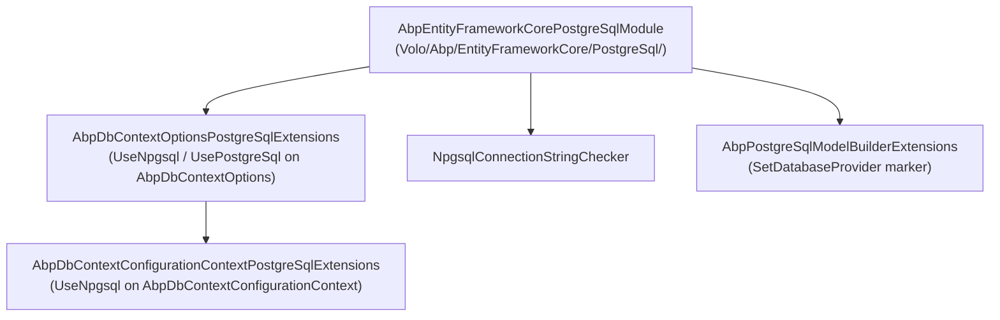
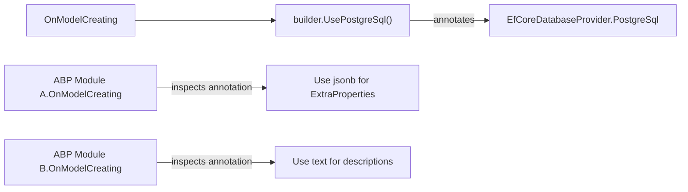
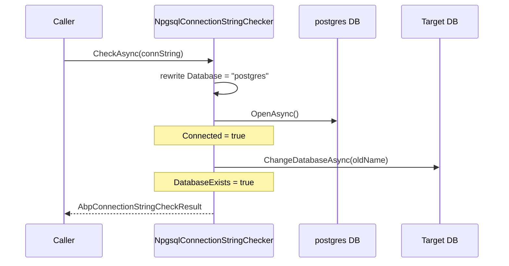

`Volo.Abp.EntityFrameworkCore.PostgreSql` integrates the Npgsql EF Core provider into the ABP Framework data stack. It is a thin shim over `Npgsql.EntityFrameworkCore.PostgreSQL` that registers a `SequentialAsString` Guid default, exposes `UseNpgsql(...)` (and the now-legacy `UsePostgreSql(...)`) extensions, and replaces the connection-string checker with an Npgsql-aware variant.

All types referenced here live under `framework/src/Volo.Abp.EntityFrameworkCore.PostgreSql/`.

## Package layout



## The module

`AbpEntityFrameworkCorePostgreSqlModule` is the smallest possible provider module:

```csharp
[DependsOn(typeof(AbpEntityFrameworkCoreModule))]
public class AbpEntityFrameworkCorePostgreSqlModule : AbpModule
{
    public override void ConfigureServices(ServiceConfigurationContext context)
    {
        Configure<AbpSequentialGuidGeneratorOptions>(options =>
        {
            if (options.DefaultSequentialGuidType == null)
            {
                options.DefaultSequentialGuidType = SequentialGuidType.SequentialAsString;
            }
        });

        Configure<AbpEfCoreGlobalFilterOptions>(options =>
        {
            options.UseDbFunction = true;
        });
    }
}
```

The defaults differ from SQL Server in one key place: `SequentialAsString`. PostgreSQL's `uuid` type is canonical-string-comparable in indexes when collation is set right; ABP's sequential generator emits a timestamp prefix at the *start* of the textual representation, so newly minted GUIDs sort in arrival order.

`UseDbFunction = true` is the same global-filter optimisation used by every provider module — see [efcore-providers.mdx](/data/efcore-providers).

## `UseNpgsql` extensions

`AbpDbContextOptionsPostgreSqlExtensions.cs` exposes both the current `UseNpgsql` API and the legacy `UsePostgreSql` API (marked `[Obsolete]`) for backward compatibility:

```csharp
public static class AbpDbContextOptionsPostgreSqlExtensions
{
    [Obsolete("Use 'UseNpgsql(...)' method instead. This will be removed in future versions.")]
    public static void UsePostgreSql(
        this AbpDbContextOptions options,
        Action<NpgsqlDbContextOptionsBuilder>? postgreSqlOptionsAction = null)
    {
        options.Configure(context => { context.UseNpgsql(postgreSqlOptionsAction); });
    }

    public static void UseNpgsql(
        this AbpDbContextOptions options,
        Action<NpgsqlDbContextOptionsBuilder>? postgreSqlOptionsAction = null)
    {
        options.Configure(context => { context.UseNpgsql(postgreSqlOptionsAction); });
    }

    public static void UseNpgsql<TDbContext>(
        this AbpDbContextOptions options,
        Action<NpgsqlDbContextOptionsBuilder>? postgreSqlOptionsAction = null)
        where TDbContext : AbpDbContext<TDbContext>
    { ... }
}
```

<Warning>
`UsePostgreSql` is `[Obsolete]`. New code should call `UseNpgsql`. The two are identical at runtime — both forward to the inner `AbpDbContextConfigurationContext.UseNpgsql`.
</Warning>

## `UseNpgsql` on `AbpDbContextConfigurationContext`

The inner extension is where the EF Core relational call happens. From `AbpDbContextConfigurationContextPostgreSqlExtensions.cs`:

```csharp
public static DbContextOptionsBuilder UseNpgsql(
    this AbpDbContextConfigurationContext context,
    Action<NpgsqlDbContextOptionsBuilder>? postgreSqlOptionsAction = null)
{
    if (context.ExistingConnection != null)
    {
        return context.DbContextOptions.UseNpgsql(context.ExistingConnection, optionsBuilder =>
        {
            optionsBuilder.UseQuerySplittingBehavior(QuerySplittingBehavior.SplitQuery);
            postgreSqlOptionsAction?.Invoke(optionsBuilder);
        });
    }
    else
    {
        return context.DbContextOptions.UseNpgsql(context.ConnectionString, optionsBuilder =>
        {
            optionsBuilder.UseQuerySplittingBehavior(QuerySplittingBehavior.SplitQuery);
            postgreSqlOptionsAction?.Invoke(optionsBuilder);
        });
    }
}
```

`QuerySplittingBehavior.SplitQuery` is the same default ABP applies for SQL Server, for the same reason — ABP aggregate roots typically have multiple collection navigations (e.g., `IdentityUser.Roles`, `IdentityUser.Claims`, `IdentityUser.Logins`) and the default single-query strategy yields cartesian explosions in row counts.

The legacy `UsePostgreSql` is also present on `AbpDbContextConfigurationContext` and delegates to `UseNpgsql`.

## `AbpPostgreSqlModelBuilderExtensions`

`Microsoft/EntityFrameworkCore/AbpPostgreSqlModelBuilderExtensions.cs` is a single helper:

```csharp
namespace Microsoft.EntityFrameworkCore;

public static class AbpPostgreSqlModelBuilderExtensions
{
    public static void UsePostgreSql(this ModelBuilder modelBuilder)
    {
        modelBuilder.SetDatabaseProvider(EfCoreDatabaseProvider.PostgreSql);
    }
}
```

It tags the model with `EfCoreDatabaseProvider.PostgreSql`. Module `OnModelCreating` extensions read the tag and switch between provider-specific column types — for instance, `text` vs. `nvarchar(max)` for free-form blob columns, or `jsonb` vs. `nvarchar(max)` for the `ExtraProperties` column carried by `IHasExtraProperties` entities.



## `NpgsqlConnectionStringChecker`

`ConnectionStrings/NpgsqlConnectionStringChecker.cs` replaces the default `IConnectionStringChecker` with a PostgreSQL-aware probe:

```csharp
[Dependency(ReplaceServices = true)]
public class NpgsqlConnectionStringChecker : IConnectionStringChecker, ITransientDependency
{
    public virtual async Task<AbpConnectionStringCheckResult> CheckAsync(string connectionString)
    {
        var result = new AbpConnectionStringCheckResult();
        try
        {
            var connString = new NpgsqlConnectionStringBuilder(connectionString) { Timeout = 1 };
            var oldDatabaseName = connString.Database;
            connString.Database = "postgres";

            await using var conn = new NpgsqlConnection(connString.ConnectionString);
            await conn.OpenAsync();
            result.Connected = true;
            await conn.ChangeDatabaseAsync(oldDatabaseName!);
            result.DatabaseExists = true;

            await conn.CloseAsync();

            return result;
        }
        catch (Exception) { return result; }
    }
}
```

The pattern mirrors `SqlServerConnectionStringChecker`: connect to the always-existing `postgres` administrative database first, set `Connected = true`, then `ChangeDatabaseAsync(oldDatabaseName)` to verify the target database exists. The 1-second `Timeout` keeps probes fast for CLI workflows.



## Version constraints

```xml
<TargetFramework>net10.0</TargetFramework>
<ItemGroup>
  <ProjectReference Include="..\Volo.Abp.EntityFrameworkCore\Volo.Abp.EntityFrameworkCore.csproj" />
</ItemGroup>
<ItemGroup>
  <PackageReference Include="Npgsql.EntityFrameworkCore.PostgreSQL" />
</ItemGroup>
```

Versions are not pinned in the `.csproj` — they come from the repo's central `common.props`. Hosts that ship their own `Directory.Packages.props` must keep `Npgsql.EntityFrameworkCore.PostgreSQL` and `Microsoft.EntityFrameworkCore.Relational` aligned with the EF Core core version.

## Wiring a host

<Steps>
  <Step title="Reference">
    Add `<PackageReference Include="Volo.Abp.EntityFrameworkCore.PostgreSql" />` to the EF Core layer's `.csproj`.
  </Step>
  <Step title="Module dependency">
    Add `typeof(AbpEntityFrameworkCorePostgreSqlModule)` to `[DependsOn]`.
  </Step>
  <Step title="Configure">
    ```csharp
    Configure<AbpDbContextOptions>(options =>
    {
        options.UseNpgsql();
    });
    ```
  </Step>
  <Step title="(Optional) Npgsql tweaks">
    ```csharp
    options.UseNpgsql(builder =>
    {
        builder.EnableRetryOnFailure(maxRetryCount: 3);
        builder.MigrationsHistoryTable("__EFMigrationsHistory", "abp");
    });
    ```
  </Step>
</Steps>

## Common pitfalls

<Warning>
The legacy `UsePostgreSql` method on `AbpDbContextOptions` is `[Obsolete]` and slated for removal. Call `UseNpgsql` in new code.
</Warning>

<Warning>
`NpgsqlConnection.ChangeDatabaseAsync` requires an open connection. The checker switches `Database = "postgres"` *before* opening to avoid touching a possibly-missing target DB.
</Warning>

<Tip>
PostgreSQL's case-folding rules collide with EF Core's default identifier quoting. ABP's `SetDatabaseProvider(PostgreSql)` lets module model builders emit `b.ToTable("AbpUsers")` knowing Npgsql will quote correctly. If you map to lowercase manually, do it consistently across all modules.
</Tip>

See [efcore-providers.mdx](/data/efcore-providers) for the cross-provider matrix.
