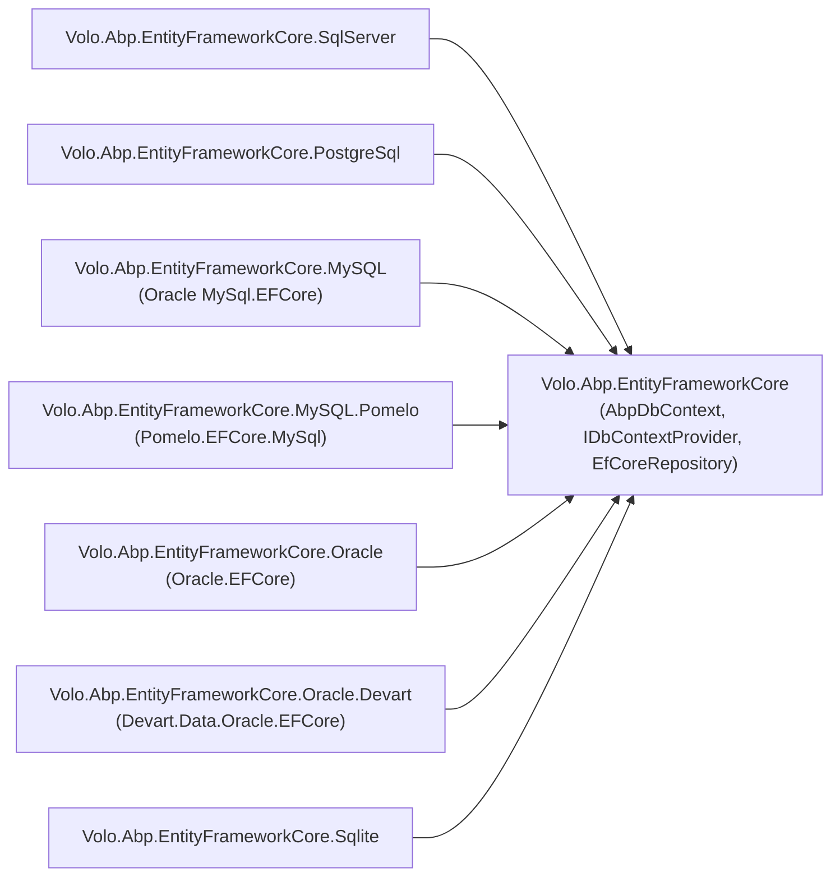

The ABP Framework ships seven thin provider packages on top of `Volo.Abp.EntityFrameworkCore`. Every one of them is structurally identical: a `[DependsOn(AbpEntityFrameworkCoreModule)]` module that nudges defaults, an `AbpDbContextOptions.UseXxx(...)` extension that wires the EF Core relational provider, an `AbpDbContextConfigurationContext.UseXxx(...)` per-DbContext counterpart, and an `XxxConnectionStringChecker : IConnectionStringChecker`. This page is the single-source-of-truth comparison; the deep dives live on the per-provider pages.

## Package matrix

| Package (under `framework/src/`) | Module | NuGet provider | `Use*` extension | Default `SequentialGuidType` |
| --- | --- | --- | --- | --- |
| `Volo.Abp.EntityFrameworkCore.SqlServer` | `AbpEntityFrameworkCoreSqlServerModule` | `Microsoft.EntityFrameworkCore.SqlServer` | `UseSqlServer` | `SequentialAtEnd` |
| `Volo.Abp.EntityFrameworkCore.PostgreSql` | `AbpEntityFrameworkCorePostgreSqlModule` | `Npgsql.EntityFrameworkCore.PostgreSQL` | `UseNpgsql` (legacy: `UsePostgreSql`) | `SequentialAsString` |
| `Volo.Abp.EntityFrameworkCore.MySQL` | `AbpEntityFrameworkCoreMySQLModule` | `MySql.EntityFrameworkCore` (Oracle's official) | `UseMySQL` | `SequentialAsString` |
| `Volo.Abp.EntityFrameworkCore.MySQL.Pomelo` | `AbpEntityFrameworkCoreMySQLPomeloModule` | `Pomelo.EntityFrameworkCore.MySql` | `UseMySQL` (uses `MySqlDbContextOptionsBuilder`) | `SequentialAsString` |
| `Volo.Abp.EntityFrameworkCore.Oracle` | `AbpEntityFrameworkCoreOracleModule` | `Oracle.EntityFrameworkCore` | `UseOracle` | `SequentialAsBinary` |
| `Volo.Abp.EntityFrameworkCore.Oracle.Devart` | `AbpEntityFrameworkCoreOracleDevartModule` | `Devart.Data.Oracle.EFCore` | `UseOracle` (with `useExistingConnectionIfAvailable`) | `SequentialAsBinary` |
| `Volo.Abp.EntityFrameworkCore.Sqlite` | `AbpEntityFrameworkCoreSqliteModule` | `Microsoft.EntityFrameworkCore.Sqlite` | `UseSqlite` | inherits default |

All seven packages set `AbpEfCoreGlobalFilterOptions.UseDbFunction = true` so soft-delete and multi-tenancy filters render as `dbo.SoftDeleteFilter(...)` user-defined functions — see `AbpEfCoreDataFilterDbFunctionMethods` in the EF Core core package.

## Conceptual shape of a provider package

```mermaid
flowchart TB
    subgraph PkgX["Volo.Abp.EntityFrameworkCore.XYZ"]
      ModuleX["AbpEntityFrameworkCoreXyzModule<br/>[DependsOn(AbpEntityFrameworkCoreModule)]"]
      OptExt["AbpDbContextOptionsXyzExtensions<br/>(UseXyz on AbpDbContextOptions)"]
      CtxExt["AbpDbContextConfigurationContextXyzExtensions<br/>(UseXyz on AbpDbContextConfigurationContext)"]
      Checker["XyzConnectionStringChecker : IConnectionStringChecker"]
      ModelExt["AbpXyzModelBuilderExtensions<br/>(SetDatabaseProvider marker)"]
    end
    ModuleX --> OptExt
    OptExt --> CtxExt
    CtxExt -->|context.DbContextOptions.UseXyz(connString, ...)| EFP["EF Core provider package"]
    ModuleX --> Checker
```

Each provider module is also responsible for selecting a sensible `SequentialGuidType` default for `AbpSequentialGuidGeneratorOptions`. The four-value enum lives in `framework/src/Volo.Abp.Guids/Volo/Abp/Guids/SequentialGuidType.cs`; the choice depends on how the underlying database orders byte arrays vs. strings:

| Provider | `SequentialGuidType` | Rationale |
| --- | --- | --- |
| SQL Server | `SequentialAtEnd` | SQL Server's `uniqueidentifier` sorts the last 6 bytes; ABP places the timestamp there. |
| PostgreSQL | `SequentialAsString` | Npgsql writes Guids as canonical string when needed; canonical-string ordering aligns. |
| MySQL (official) | `SequentialAsString` | Same as PostgreSQL — string-based column ordering. |
| MySQL (Pomelo) | `SequentialAsString` | Same as above. |
| Oracle | `SequentialAsBinary` | RAW(16) columns sort byte-wise. |
| Oracle Devart | `SequentialAsBinary` | Same as Oracle. |
| SQLite | inherits framework default | SQLite is not opinionated. |

All providers wrap the choice with `if (options.DefaultSequentialGuidType == null)` so a host that explicitly sets a different value via `Configure<AbpSequentialGuidGeneratorOptions>` wins.

## `Use*` extension method shapes

The relational provider integration is two-tier:

1. `AbpDbContextOptions.UseXxx(...)` — host calls this in `AppModule.ConfigureServices` as a default for *all* DbContexts.
2. `AbpDbContextConfigurationContext.UseXxx(...)` — the inner method that actually wires `DbContextOptionsBuilder.UseXxx(...)` after a connection string has been resolved.

The PostgreSQL package is illustrative because it does extra work — `QuerySplittingBehavior.SplitQuery` is set as a default:

```csharp
// AbpDbContextConfigurationContextPostgreSqlExtensions.cs
public static DbContextOptionsBuilder UseNpgsql(
    this AbpDbContextConfigurationContext context,
    Action<NpgsqlDbContextOptionsBuilder>? postgreSqlOptionsAction = null)
{
    if (context.ExistingConnection != null)
    {
        return context.DbContextOptions.UseNpgsql(context.ExistingConnection, optionsBuilder =>
        {
            optionsBuilder.UseQuerySplittingBehavior(QuerySplittingBehavior.SplitQuery);
            postgreSqlOptionsAction?.Invoke(optionsBuilder);
        });
    }
    else
    {
        return context.DbContextOptions.UseNpgsql(context.ConnectionString, ...);
    }
}
```

The other providers' configuration-context extensions are thinner; they delegate straight to the EF Core relational `Use*` method.

## Where each provider package lives



## Choosing between two MySQL packages

The MySQL situation is the only one where ABP ships *two* mutually exclusive provider packages. Both export a module named `AbpEntityFrameworkCoreMySQL...Module` and both expose a `UseMySQL(...)` extension, but they reference *different* NuGet packages and *different* `Action<...DbContextOptionsBuilder>` types.

| Aspect | `Volo.Abp.EntityFrameworkCore.MySQL` | `Volo.Abp.EntityFrameworkCore.MySQL.Pomelo` |
| --- | --- | --- |
| Provider DLL | `MySql.EntityFrameworkCore` (Oracle/MySQL official) | `Pomelo.EntityFrameworkCore.MySql` (community) |
| Module type | `AbpEntityFrameworkCoreMySQLModule` | `AbpEntityFrameworkCoreMySQLPomeloModule` |
| Builder action type | `MySql.EntityFrameworkCore.Infrastructure.MySQLDbContextOptionsBuilder` | `Microsoft.EntityFrameworkCore.Infrastructure.MySqlDbContextOptionsBuilder` |
| Server-version detection | Manual | Auto via `ServerVersion.AutoDetect(connStr)` (caller responsibility) |
| Csproj | `<PackageReference Include="MySql.EntityFrameworkCore" />` | `<PackageReference Include="Pomelo.EntityFrameworkCore.MySql" />` + `Microsoft.EntityFrameworkCore.Relational` |

The two packages cannot coexist in one host — the namespace `Volo.Abp.EntityFrameworkCore` would have two `UseMySQL` extensions with conflicting `Action<...>` parameter types.

## Oracle vs. Oracle.Devart

| Aspect | `Volo.Abp.EntityFrameworkCore.Oracle` | `Volo.Abp.EntityFrameworkCore.Oracle.Devart` |
| --- | --- | --- |
| Provider DLL | `Oracle.EntityFrameworkCore` (Oracle Inc.) | `Devart.Data.Oracle.EFCore` (commercial) |
| `UseOracle` signature | `Action<Oracle.EntityFrameworkCore.Infrastructure.OracleDbContextOptionsBuilder>` | `Action<Devart.Data.Oracle.Entity.OracleDbContextOptionsBuilder>` + `bool useExistingConnectionIfAvailable` |
| Model builder marker | (none separate) | `AbpOracleModelBuilderExtensions.UseOracle(modelBuilder)` |
| EF Core ref | latest matching framework target | pins `Microsoft.EntityFrameworkCore.Relational` via `VersionOverride` |

The Devart variant is the only one with a third explicit boolean parameter (`useExistingConnectionIfAvailable`), threaded all the way through to the Devart `UseOracle` call.

## Quick selection guide

<Tip>
Pick the provider package that matches *both* the database product and (for MySQL/Oracle) the EF Core driver vendor your team prefers. The host should reference exactly one provider package per DbContext.
</Tip>

<CardGroup cols={2}>
  <Card title="SQL Server" icon="server" href="/data/efcore-sqlserver">
    Production default for the ABP startup templates.
  </Card>
  <Card title="PostgreSQL" icon="elephant" href="/data/efcore-postgresql">
    Splits queries by default to dodge cartesian explosion.
  </Card>
  <Card title="MySQL" icon="dolphin" href="/data/efcore-mysql">
    Two providers — Oracle's official vs. Pomelo community.
  </Card>
  <Card title="Oracle" icon="building-columns" href="/data/efcore-oracle">
    Oracle Inc. driver vs. Devart commercial driver.
  </Card>
  <Card title="SQLite" icon="file" href="/data/efcore-sqlite">
    Includes a busy-timeout interceptor and a thread-safe test connection.
  </Card>
  <Card title="Core EF Core" icon="database" href="/data/entity-framework-core">
    `AbpDbContext`, `IDbContextProvider`, `EfCoreRepository`.
  </Card>
</CardGroup>

## How `UseXxx` flows into EF Core

```mermaid
sequenceDiagram
    participant AppMod as AppModule.ConfigureServices
    participant Opts as AbpDbContextOptions
    participant Factory as DbContextOptionsFactory
    participant Ctx as AbpDbContextConfigurationContext
    participant EFCore as DbContextOptionsBuilder
    AppMod->>Opts: UseSqlServer() / UseNpgsql() / UseMySQL() / UseOracle() / UseSqlite()
    Opts->>Opts: store as DefaultConfigureAction
    Factory->>Factory: Create&lt;TDbContext&gt;(sp)
    Factory->>Ctx: new (connectionString, dbContextOptionsBuilder)
    Factory->>Opts: invoke ConfigureAction (per type) or DefaultConfigureAction
    Opts->>Ctx: context.UseXxx(action)
    Ctx->>EFCore: DbContextOptions.UseXxx(connectionString, action)
    EFCore-->>Factory: configured DbContextOptions
```

The host typically registers one default per process:

```csharp
// AppModule.cs
Configure<AbpDbContextOptions>(options =>
{
    options.UseSqlServer();   // or .UseNpgsql() / .UseMySQL() / .UseOracle() / .UseSqlite()
});
```

A per-DbContext override is rare but legal:

```csharp
Configure<AbpDbContextOptions>(options =>
{
    options.UseSqlServer();
    options.UseSqlite<TestSandboxDbContext>();
});
```

Continue to a specific provider page for version constraints, model-builder extensions, and known pitfalls.
