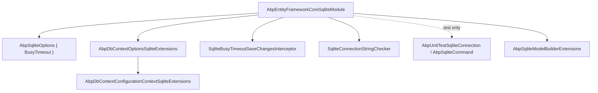
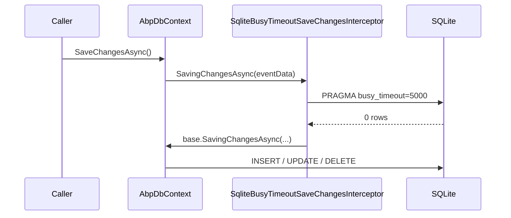
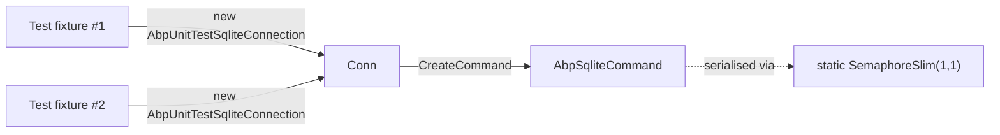

`Volo.Abp.EntityFrameworkCore.Sqlite` is the only ABP Framework EF Core provider package whose primary intended audience is tests, demos, and embedded hosts rather than production multi-tenant deployments. It is the smallest and most opinionated provider package — it ships an `AbpSqliteOptions.BusyTimeout` knob (defaulting to 5 seconds), a `SaveChangesInterceptor` that pushes the busy timeout into every connection, and an `AbpUnitTestSqliteConnection` shim that serialises concurrent commands so xUnit can run parallel test classes against the same in-memory database.

All types referenced here live under `framework/src/Volo.Abp.EntityFrameworkCore.Sqlite/`.

## Package layout



## The module

`Volo/Abp/EntityFrameworkCore/Sqlite/AbpEntityFrameworkCoreSqliteModule.cs`:

```csharp
[DependsOn(typeof(AbpEntityFrameworkCoreModule))]
public class AbpEntityFrameworkCoreSqliteModule : AbpModule
{
    public override void PreConfigureServices(ServiceConfigurationContext context)
    {
        PreConfigure<AbpSqliteOptions>(options =>
        {
            options.BusyTimeout = 5000;
        });
    }

    public override void ConfigureServices(ServiceConfigurationContext context)
    {
        Configure<AbpEfCoreGlobalFilterOptions>(options =>
        {
            options.UseDbFunction = true;
        });

        var sqliteOptions = context.Services.ExecutePreConfiguredActions<AbpSqliteOptions>();
        if (sqliteOptions.BusyTimeout.HasValue)
        {
            Configure<AbpDbContextOptions>(options =>
            {
                options.ConfigureDefaultOnConfiguring((dbContext, dbContextOptionsBuilder) =>
                {
                    if (dbContextOptionsBuilder.Options.Extensions.Any(extension => extension is SqliteOptionsExtension))
                    {
                        dbContextOptionsBuilder.AddInterceptors(
                            new SqliteBusyTimeoutSaveChangesInterceptor(sqliteOptions.BusyTimeout.Value));
                    }
                }, overrideExisting: false);
            });
        }
    }
}
```

Two notable differences from every other provider module:

1. `PreConfigureServices` sets a default `BusyTimeout = 5000` via `PreConfigure<AbpSqliteOptions>`, then `ConfigureServices` *reads back* the pre-configured value via `ExecutePreConfiguredActions<AbpSqliteOptions>()`. This dance lets downstream modules override the timeout in their own `PreConfigureServices` and have the interceptor wired with the overridden value.
2. The interceptor is only attached when the active provider for a given DbContext is `SqliteOptionsExtension`. This conditional is necessary because `ConfigureDefaultOnConfiguring` runs for *every* DbContext, not just SQLite-bound ones, so the predicate keeps the SQLite interceptor from leaking into a sibling SQL Server DbContext in the same host.

There is **no `AbpSequentialGuidGeneratorOptions` configuration** in this module — SQLite stores `Guid` as a 16-byte BLOB by default, and ABP's framework-level default (set elsewhere) is sufficient.

## `AbpSqliteOptions`

The options class (`Volo/Abp/EntityFrameworkCore/AbpSqliteOptions.cs`) is one property:

```csharp
namespace Volo.Abp.EntityFrameworkCore;

public class AbpSqliteOptions
{
    public int? BusyTimeout { get; set; }
}
```

Setting `BusyTimeout` to `null` (rather than `0`) is the documented way to disable the interceptor entirely.

## The busy-timeout interceptor

`Volo/Abp/EntityFrameworkCore/Interceptors/SqliteBusyTimeoutSaveChangesInterceptor.cs`:

```csharp
/// <summary>
/// https://github.com/dotnet/efcore/issues/29514
/// </summary>
public class SqliteBusyTimeoutSaveChangesInterceptor : SaveChangesInterceptor
{
    private readonly string _pragmaCommand;

    public SqliteBusyTimeoutSaveChangesInterceptor(int timeoutMilliseconds)
    {
        _pragmaCommand = $"PRAGMA busy_timeout={timeoutMilliseconds};";
    }

    public override InterceptionResult<int> SavingChanges(...)
    {
        if (eventData.Context != null)
        {
            eventData.Context.Database.ExecuteSqlRaw(_pragmaCommand);
        }
        return result;
    }

    public override async ValueTask<InterceptionResult<int>> SavingChangesAsync(...)
    {
        if (eventData.Context != null)
        {
            await eventData.Context.Database.ExecuteSqlRawAsync(_pragmaCommand, cancellationToken: cancellationToken);
        }
        return await base.SavingChangesAsync(eventData, result, cancellationToken);
    }
}
```

The XML doc-comment links to https://github.com/dotnet/efcore/issues/29514 — the upstream bug that prompted this fix. EF Core's connection-pooling logic with `Microsoft.Data.Sqlite` does not reliably persist a connection-level `busy_timeout` across pooled checkouts. The interceptor re-issues the `PRAGMA` on the *first SQL statement of every SaveChanges call* so a writer never crashes with `SQLITE_BUSY` when a sibling reader holds the database file.



## `UseSqlite` extensions

`Volo/Abp/EntityFrameworkCore/AbpDbContextOptionsSqliteExtensions.cs` exposes the host-tier API:

```csharp
public static class AbpDbContextOptionsSqliteExtensions
{
    public static void UseSqlite(
        this AbpDbContextOptions options,
        Action<SqliteDbContextOptionsBuilder>? sqliteOptionsAction = null)
    {
        options.Configure(context => { context.UseSqlite(sqliteOptionsAction); });
    }

    public static void UseSqlite<TDbContext>(
        this AbpDbContextOptions options,
        Action<SqliteDbContextOptionsBuilder>? sqliteOptionsAction = null)
        where TDbContext : AbpDbContext<TDbContext>
    { ... }
}
```

The configuration-context extension is interesting because it has *two* overloads — one that takes only an action, and one that also takes a `DbConnection`:

```csharp
public static DbContextOptionsBuilder UseSqlite(
    this AbpDbContextConfigurationContext context,
    DbConnection connection,
    Action<SqliteDbContextOptionsBuilder>? sqliteOptionsAction = null)
{
    if (context.ExistingConnection != null)
    {
        return context.DbContextOptions.UseSqlite(context.ExistingConnection, builder => { ... });
    }
    else
    {
        return context.DbContextOptions.UseSqlite(connection, builder => { ... });
    }
}
```

This second overload is what test helpers call when they want to share a single `SqliteConnection` (often opened in `:memory:` mode) across multiple DbContext instances in a single test fixture. Without sharing, each DbContext would open its own in-memory database and migrations would not be visible.

## `SqliteConnectionStringChecker`

The checker is the simplest of the bunch:

```csharp
[Dependency(ReplaceServices = true)]
public class SqliteConnectionStringChecker : IConnectionStringChecker, ITransientDependency
{
    public virtual async Task<AbpConnectionStringCheckResult> CheckAsync(string connectionString)
    {
        var result = new AbpConnectionStringCheckResult();
        try
        {
            await using var conn = new SqliteConnection(connectionString);
            await conn.OpenAsync();
            result.Connected = true;
            result.DatabaseExists = true;
            await conn.CloseAsync();
            return result;
        }
        catch (Exception) { return result; }
    }
}
```

There is no "open a system database first" step because SQLite is file-based — opening a connection either succeeds (file exists or is created) or fails entirely. `Connected` and `DatabaseExists` always move together.

## `AbpUnitTestSqliteConnection`

`Volo/Abp/EntityFrameworkCore/Sqlite/AbpUnitTestSqliteConnection.cs` is a test-only helper that wraps `SqliteConnection` with a per-process semaphore:

```csharp
public class AbpUnitTestSqliteConnection : SqliteConnection
{
    public AbpUnitTestSqliteConnection(string connectionString) : base(connectionString) { }

    public override SqliteCommand CreateCommand()
    {
        return new AbpSqliteCommand
        {
            Connection = this,
            CommandTimeout = DefaultTimeout,
            Transaction = Transaction
        };
    }
}

internal class AbpSqliteCommand : SqliteCommand
{
    private static readonly SemaphoreSlim Semaphore = new SemaphoreSlim(1, 1);

    public override SqliteConnection? Connection
    {
        get => base.Connection;
        set
        {
            using (Semaphore.Lock())
            {
                base.Connection = value;
            }
        }
    }

    protected override void Dispose(bool disposing)
    {
        using (Semaphore.Lock())
        {
            base.Dispose(disposing);
        }
    }
}
```

The XML comment is explicit:

> This class is for unit testing purposes. It prevents exceptions in concurrent testing because Sqlite is not thread-safe.

xUnit's default is `[Collection]`-parallel — multiple test fixtures can hit the same in-memory database. The single static semaphore in `AbpSqliteCommand` linearises connection assignment and command disposal, eliminating the race that produces sporadic `SQLITE_MISUSE` exceptions.



## Model builder marker

```csharp
public static class AbpSqliteModelBuilderExtensions
{
    public static void UseSqlite(this ModelBuilder modelBuilder)
    {
        modelBuilder.SetDatabaseProvider(EfCoreDatabaseProvider.Sqlite);
    }
}
```

Same pattern as the other providers — tag the model so module `OnModelCreating` extensions can branch.

## Wiring a host

<Steps>
  <Step title="Reference">
    Add `<PackageReference Include="Volo.Abp.EntityFrameworkCore.Sqlite" />`.
  </Step>
  <Step title="Module dependency">
    `typeof(AbpEntityFrameworkCoreSqliteModule)` in `[DependsOn]`.
  </Step>
  <Step title="Configure">
    ```csharp
    Configure<AbpDbContextOptions>(options =>
    {
        options.UseSqlite();
    });
    ```
  </Step>
  <Step title="(Optional) Custom busy timeout">
    ```csharp
    PreConfigure<AbpSqliteOptions>(options =>
    {
        options.BusyTimeout = 10000;   // 10 seconds
    });
    ```
  </Step>
</Steps>

## Common pitfalls

<Warning>
SQLite stores `DateTime` as TEXT with millisecond precision, no time-zone info. ABP's audit columns (`CreationTime`, `LastModificationTime`) are normalised through `IClock`; if you query directly with Dapper or raw SQL, expect to lose the time-zone metadata round-tripped through ADO.NET.
</Warning>

<Warning>
**Foreign key enforcement is OFF by default in SQLite.** EF Core sets `PRAGMA foreign_keys = 1` on each connection open, but only via the relational provider's own connection initialisation. If you swap in `AbpUnitTestSqliteConnection` for tests, verify that `Database.OpenConnection()` has already been called before issuing data; otherwise relationship constraints will silently no-op.
</Warning>

<Warning>
`PRAGMA busy_timeout` is connection-scoped. The `SqliteBusyTimeoutSaveChangesInterceptor` re-issues it on every `SaveChanges` — but plain read queries do *not* go through the interceptor. If you mix long-running reader transactions with writers, raise the read query's command timeout independently.
</Warning>

<Tip>
For an in-memory test database that survives across DbContext instances, share one open `SqliteConnection` with `DataSource=:memory:;Cache=Shared` and pass it through the `UseSqlite(connection, ...)` overload on `AbpDbContextConfigurationContext`.
</Tip>

See [efcore-providers.mdx](/data/efcore-providers) for the cross-provider comparison.
