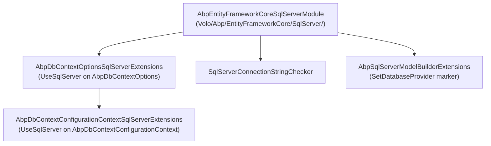
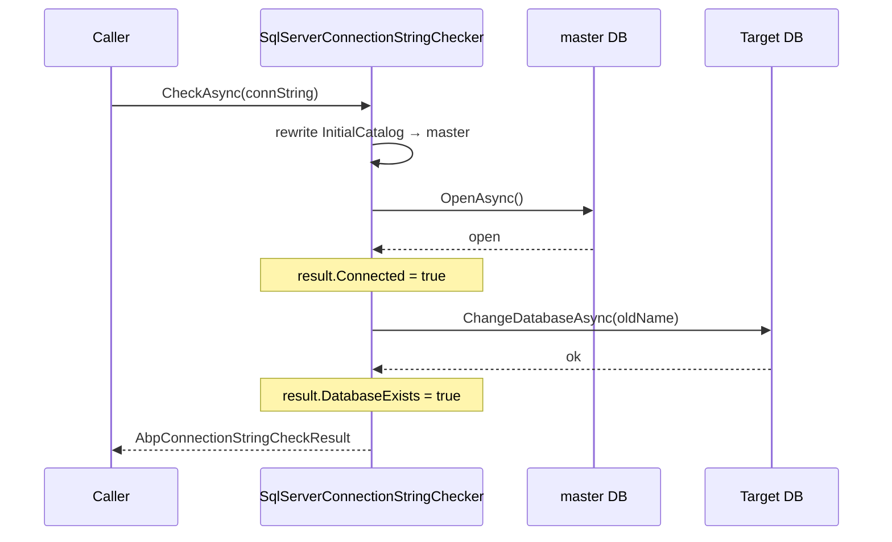

`Volo.Abp.EntityFrameworkCore.SqlServer` is the default EF Core provider package shipped by the ABP Framework startup templates. It is a thin shim over `Microsoft.EntityFrameworkCore.SqlServer` that registers a sensible `SequentialGuidType`, exposes a host-friendly `UseSqlServer(...)` extension, and adds a connection-string checker that probes the `master` database first.

All types referenced here live under `framework/src/Volo.Abp.EntityFrameworkCore.SqlServer/`.

## Package layout



## The module

`AbpEntityFrameworkCoreSqlServerModule` (`Volo/Abp/EntityFrameworkCore/SqlServer/AbpEntityFrameworkCoreSqlServerModule.cs`) declares one dependency and two configuration tweaks:

```csharp
[DependsOn(typeof(AbpEntityFrameworkCoreModule))]
public class AbpEntityFrameworkCoreSqlServerModule : AbpModule
{
    public override void ConfigureServices(ServiceConfigurationContext context)
    {
        Configure<AbpSequentialGuidGeneratorOptions>(options =>
        {
            if (options.DefaultSequentialGuidType == null)
            {
                options.DefaultSequentialGuidType = SequentialGuidType.SequentialAtEnd;
            }
        });

        Configure<AbpEfCoreGlobalFilterOptions>(options =>
        {
            options.UseDbFunction = true;
        });
    }
}
```

Two notes:

- `SequentialAtEnd` is the right choice because SQL Server `uniqueidentifier` sorts the *last* 6 bytes of the GUID. ABP places its sequential timestamp there so newly generated GUIDs cluster monotonically and the clustered-index page splits stay cheap.
- `UseDbFunction = true` means soft-delete and multi-tenant query filters compile to `dbo.SoftDeleteFilter(...)` user-defined functions (`AbpEfCoreDataFilterDbFunctionMethods`). EF Core's compiled-query cache hashes by *expression*; the DB-function form keeps the expression constant while the *value* (ambient enabled flag) varies, dramatically reducing cache misses when filters toggle on and off via `IDataFilter`.

## `UseSqlServer` on `AbpDbContextOptions`

`AbpDbContextOptionsSqlServerExtensions.cs` is the API a host module calls in `AppModule.ConfigureServices`:

```csharp
public static class AbpDbContextOptionsSqlServerExtensions
{
    public static void UseSqlServer(
        this AbpDbContextOptions options,
        Action<SqlServerDbContextOptionsBuilder>? sqlServerOptionsAction = null)
    {
        options.Configure(context => { context.UseSqlServer(sqlServerOptionsAction); });
    }

    public static void UseSqlServer<TDbContext>(
        this AbpDbContextOptions options,
        Action<SqlServerDbContextOptionsBuilder>? sqlServerOptionsAction = null)
        where TDbContext : AbpDbContext<TDbContext>
    {
        options.Configure<TDbContext>(context => { context.UseSqlServer(sqlServerOptionsAction); });
    }
}
```

The non-generic overload sets the *default* configuration for all DbContexts; the generic overload overrides it for a specific `TDbContext`. Both delegate to the per-`AbpDbContextConfigurationContext` extension below.

## `UseSqlServer` on `AbpDbContextConfigurationContext`

The inner-tier extension does the real EF Core wiring. From `AbpDbContextConfigurationContextSqlServerExtensions.cs`:

```csharp
public static DbContextOptionsBuilder UseSqlServer(
    this AbpDbContextConfigurationContext context,
    Action<SqlServerDbContextOptionsBuilder>? sqlServerOptionsAction = null)
{
    if (context.ExistingConnection != null)
    {
        return context.DbContextOptions.UseSqlServer(context.ExistingConnection, optionsBuilder =>
        {
            optionsBuilder.UseQuerySplittingBehavior(QuerySplittingBehavior.SplitQuery);
            sqlServerOptionsAction?.Invoke(optionsBuilder);
        });
    }
    else
    {
        return context.DbContextOptions.UseSqlServer(context.ConnectionString, optionsBuilder =>
        {
            optionsBuilder.UseQuerySplittingBehavior(QuerySplittingBehavior.SplitQuery);
            sqlServerOptionsAction?.Invoke(optionsBuilder);
        });
    }
}
```

`QuerySplittingBehavior.SplitQuery` is the default ABP picks for SQL Server. This is the same default the PostgreSQL extension applies, and for the same reason: when a single `Include` chain expands to multiple collection navigations (typical for ABP aggregate roots like `IdentityUser` with both `Roles` and `Claims`), single-query mode produces a cartesian explosion. Hosts that prefer the EF Core default can override:

```csharp
options.UseSqlServer(sqlServerOptions => sqlServerOptions.UseQuerySplittingBehavior(QuerySplittingBehavior.SingleQuery));
```

The two branches (`ExistingConnection` vs `ConnectionString`) cover the testing scenario where a SqlConnection is reused across DbContexts inside one transaction — the UoW provider sets `ExistingConnection` after the first DbContext in a UoW opens its connection.

## Connection string checker

`SqlServerConnectionStringChecker` (`ConnectionStrings/SqlServerConnectionStringChecker.cs`) replaces the default `IConnectionStringChecker`:

```csharp
[Dependency(ReplaceServices = true)]
public class SqlServerConnectionStringChecker : IConnectionStringChecker, ITransientDependency
{
    public virtual async Task<AbpConnectionStringCheckResult> CheckAsync(string connectionString)
    {
        var result = new AbpConnectionStringCheckResult();
        try
        {
            var connString = new SqlConnectionStringBuilder(connectionString) { ConnectTimeout = 1 };
            var oldDatabaseName = connString.InitialCatalog;
            connString.InitialCatalog = "master";

            await using var conn = new SqlConnection(connString.ConnectionString);
            await conn.OpenAsync();
            result.Connected = true;
            await conn.ChangeDatabaseAsync(oldDatabaseName);
            result.DatabaseExists = true;

            await conn.CloseAsync();

            return result;
        }
        catch (Exception) { return result; }
    }
}
```

The checker probes `master` first so that hosts can distinguish three states before running migrations:

| Outcome | `Connected` | `DatabaseExists` |
| --- | --- | --- |
| SQL Server unreachable | `false` | `false` |
| SQL Server reachable, target DB missing | `true` | `false` |
| Both server and target DB exist | `true` | `true` |

Host migration utilities use the `Connected && !DatabaseExists` state to call `CREATE DATABASE` before running `EnsureCreatedAsync` / `MigrateAsync`.



The 1-second `ConnectTimeout` keeps health probes snappy — host CLIs run this on every startup.

## Model builder marker

`Microsoft/EntityFrameworkCore/AbpSqlServerModelBuilderExtensions.cs` exposes one tiny helper:

```csharp
public static class AbpSqlServerModelBuilderExtensions
{
    public static void UseSqlServer(this ModelBuilder modelBuilder)
    {
        modelBuilder.SetDatabaseProvider(EfCoreDatabaseProvider.SqlServer);
    }
}
```

`SetDatabaseProvider` (from the core EF Core package's `EfCoreDatabaseProviderHelper`) tags the model with an `EfCoreDatabaseProvider` annotation. Module-specific `OnModelCreating` extensions inspect this tag to emit provider-flavored conventions — e.g., `varchar(max)` for SQL Server vs. `text` for PostgreSQL on extra-property columns.

## Version constraints

The `.csproj` (`Volo.Abp.EntityFrameworkCore.SqlServer.csproj`) is intentionally loose:

```xml
<TargetFramework>net10.0</TargetFramework>
<ItemGroup>
  <ProjectReference Include="..\Volo.Abp.EntityFrameworkCore\Volo.Abp.EntityFrameworkCore.csproj" />
</ItemGroup>
<ItemGroup>
  <PackageReference Include="Microsoft.EntityFrameworkCore.SqlServer" />
</ItemGroup>
```

Versions float to whatever the repo's central `common.props` pins for `Microsoft.EntityFrameworkCore.SqlServer`. This matters when a host ships its own `Directory.Packages.props` — both EF Core core and the SQL Server provider must move in lockstep across major versions.

## Wiring a host

<Steps>
  <Step title="Reference the package">
    Add `<PackageReference Include="Volo.Abp.EntityFrameworkCore.SqlServer" />` to the EF Core layer's `.csproj`.
  </Step>
  <Step title="Depend on the module">
    Add `typeof(AbpEntityFrameworkCoreSqlServerModule)` to the `[DependsOn]` of the EF Core module class.
  </Step>
  <Step title="Configure">
    In `AppModule.ConfigureServices`:
    ```csharp
    Configure<AbpDbContextOptions>(options =>
    {
        options.UseSqlServer();
    });
    ```
  </Step>
  <Step title="(Optional) Provider tweaks">
    Customise `SqlServerDbContextOptionsBuilder`:
    ```csharp
    options.UseSqlServer(builder =>
    {
        builder.EnableRetryOnFailure(maxRetryCount: 3);
        builder.CommandTimeout(30);
    });
    ```
  </Step>
</Steps>

## Common pitfalls

<Warning>
The default `QuerySplittingBehavior.SplitQuery` changes EF Core's transaction semantics — collection includes are loaded across multiple round-trips. If a host disables ABP's UoW transaction (`IsTransactional = false`), split-query results can read inconsistent snapshots. Either keep transactions on, or revert to `SingleQuery`.
</Warning>

<Warning>
`SequentialGuidType.SequentialAtEnd` makes `Guid.NewGuid()`-generated values *not* sort with ABP-generated ones. Mixing the two on the same clustered key triggers heavy page splits — always use `IGuidGenerator.Create()`.
</Warning>

See [efcore-providers.mdx](/data/efcore-providers) for the cross-provider matrix and [entity-framework-core.mdx](/data/entity-framework-core) for the core integration.
