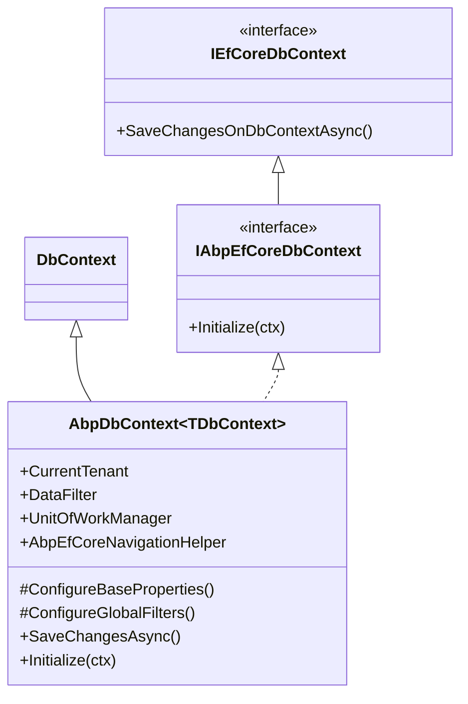
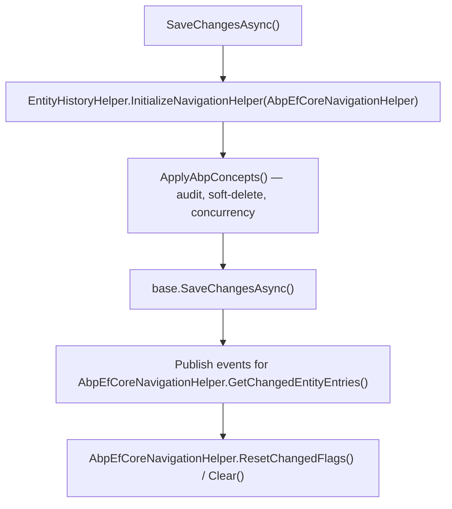
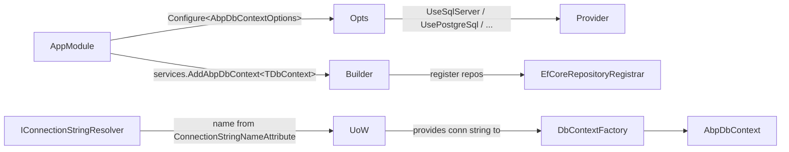

`Volo.Abp.EntityFrameworkCore` is the ABP Framework's primary persistence integration. It wraps Microsoft.EntityFrameworkCore with a base `AbpDbContext<TDbContext>` that wires multi-tenancy, soft delete, auditing, concurrency stamps, and the unit-of-work model, and ships a generic `EfCoreRepository<TDbContext, TEntity>` that fulfils `IRepository<TEntity>` for any EF-backed module.

All types referenced in this page live under `framework/src/Volo.Abp.EntityFrameworkCore/`. The provider-specific extensions (`UseSqlServer`, `UsePostgreSql`, etc.) are documented under [efcore-providers.mdx](/data/efcore-providers).

## Module composition

`AbpEntityFrameworkCoreModule` (`Volo/Abp/EntityFrameworkCore/AbpEntityFrameworkCoreModule.cs`) depends on `AbpDddDomainModule` and does three things in `ConfigureServices`:

```csharp
[DependsOn(typeof(AbpDddDomainModule))]
public class AbpEntityFrameworkCoreModule : AbpModule
{
    public override void ConfigureServices(ServiceConfigurationContext context)
    {
        Configure<AbpDbContextOptions>(options =>
        {
            options.PreConfigure(abpDbContextConfigurationContext =>
            {
                abpDbContextConfigurationContext.DbContextOptions
                    .ConfigureWarnings(warnings =>
                    {
                        warnings.Ignore(CoreEventId.LazyLoadOnDisposedContextWarning);
                    });
            });
        });

        context.Services.TryAddTransient(typeof(IDbContextProvider<>), typeof(UnitOfWorkDbContextProvider<>));
        context.Services.AddTransient(typeof(IDbContextEventOutbox<>), typeof(DbContextEventOutbox<>));
        context.Services.AddTransient(typeof(IDbContextEventInbox<>), typeof(DbContextEventInbox<>));

        Configure<AbpDistributedEntityEventOptions>(options =>
        {
            options.IgnoredEventSelectors.Add<OutgoingEventRecord>();
            options.IgnoredEventSelectors.Add<IncomingEventRecord>();
        });
    }
}
```

The lazy-load-on-disposed-context warning is suppressed because ABP's UoW manages context disposal explicitly. The default `IDbContextProvider<>` binding is `UnitOfWorkDbContextProvider<>` (in `Volo.Abp.Uow.EntityFrameworkCore`); this is what makes the repository → DbContext resolution flow through the active unit of work.

## DbContext base class

### `IEfCoreDbContext` and `IAbpEfCoreDbContext`

`IEfCoreDbContext` (`Volo/Abp/EntityFrameworkCore/IEfCoreDbContext.cs`) is a near-1:1 mirror of `Microsoft.EntityFrameworkCore.DbContext`'s public surface — `Set<T>()`, `Add`, `Remove`, `SaveChangesAsync`, `Find`, `Attach`, plus one ABP-specific method:

```csharp
/// This method will call the DbContext SaveChangesAsync directly of EF Core,
/// which doesn't apply concepts of abp.
Task<int> SaveChangesOnDbContextAsync(bool acceptAllChangesOnSuccess, CancellationToken cancellationToken = default);
```

`IAbpEfCoreDbContext` (`IAbpEfCoreDbContext.cs`) extends it with one initialization hook:

```csharp
public interface IAbpEfCoreDbContext : IEfCoreDbContext
{
    void Initialize(AbpEfCoreDbContextInitializationContext initializationContext);
}
```

### `AbpDbContext<TDbContext>`

`AbpDbContext<TDbContext>` (`AbpDbContext.cs`, ~1000 lines) is the abstract base for every ABP-aware DbContext. Its class header signals what it implements:

```csharp
public abstract class AbpDbContext<TDbContext>
    : DbContext, IAbpEfCoreDbContext, IAbpEfCoreDbFunctionContext, ITransientDependency
```

All cross-cutting services are resolved via `IAbpLazyServiceProvider` (property `LazyServiceProvider`) so subclasses do not need constructor wiring:

| Property | Service |
| --- | --- |
| `CurrentTenant` | `ICurrentTenant` |
| `GuidGenerator` | `IGuidGenerator` (defaults to `SimpleGuidGenerator.Instance`) |
| `DataFilter` | `IDataFilter` (from `Volo.Abp.Data`) |
| `EntityChangeEventHelper` | `IEntityChangeEventHelper` |
| `AuditPropertySetter` | `IAuditPropertySetter` |
| `EntityHistoryHelper` | `IEntityHistoryHelper` |
| `AuditingManager` | `IAuditingManager` |
| `UnitOfWorkManager` | `IUnitOfWorkManager` |
| `Clock` | `IClock` |
| `DistributedEventBus` | `IDistributedEventBus` |
| `LocalEventBus` | `ILocalEventBus` |
| `AbpEfCoreNavigationHelper` | `AbpEfCoreNavigationHelper` (see below) |

`IsSoftDeleteFilterEnabled` reads `DataFilter?.IsEnabled<ISoftDelete>() ?? false`; `IsMultiTenantFilterEnabled` is the analogous check. These two booleans drive both ambient SaveChanges behavior *and* the global query filters baked into the model.



### `OnModelCreating` and `ConfigureBaseProperties`

`AbpDbContext.OnModelCreating` walks every entity type in the model and dispatches to `ConfigureBaseProperties<TEntity>` via reflection (cached `ConfigureBasePropertiesMethodInfo`). The work happens in:

```csharp
protected virtual void ConfigureBaseProperties<TEntity>(
    ModelBuilder modelBuilder,
    IMutableEntityType mutableEntityType)
    where TEntity : class
{
    if (mutableEntityType.IsOwned()) return;
    if (!typeof(IEntity).IsAssignableFrom(typeof(TEntity))) return;

    var entityTypeBuilder = CreateEntityTypeBuilderFromMutableEntityType<TEntity>(modelBuilder, mutableEntityType);
    entityTypeBuilder.ConfigureByConvention();   // shared with manual model config
    ConfigureGlobalFilters<TEntity>(modelBuilder, mutableEntityType, entityTypeBuilder);
}
```

`ConfigureByConvention()` is defined in `Modeling/AbpEntityTypeBuilderExtensions.cs` — it is the single hook subclasses can also call from `OnModelCreating` after their own configuration. Internally it calls:

- `TryConfigureConcurrencyStamp()` — sets the column as `IsConcurrencyToken()` if the entity implements `IHasConcurrencyStamp`.
- `TryConfigureExtraProperties()` and `TryConfigureObjectExtensions()` — wire the JSON `ExtraProperties` dictionary used by `IHasExtraProperties`.
- `TryConfigureSoftDelete()` and `TryConfigureDeletionTime()` — set `IsDeleted` / `DeletionTime` columns for `ISoftDelete` / `IHasDeletionTime`.
- `TryConfigureMustHaveCreator()` / `TryConfigureMayHaveCreator()` and `TryConfigureDeletionAudited()` — auditing columns.

`ConfigureGlobalFilters` calls `entityTypeBuilder.HasAbpQueryFilter(filterExpression)` (see `Modeling/AbpEntityTypeBuilderExtensions.cs`); the filter expression uses `AbpEfCoreDataFilterDbFunctionMethods` so the ambient `IsSoftDeleteFilterEnabled` / `IsMultiTenantFilterEnabled` state participates in compiled queries.

### `SaveChangesAsync`

The override at line 203 of `AbpDbContext.cs` orchestrates change tracking, auditing, soft-delete conversion, and event publication:



The soft-delete conversion replaces `EntityState.Deleted` with `EntityState.Modified` on entities implementing `ISoftDelete`, sets `IsDeleted = true` via `ObjectHelper.TrySetProperty`, and lets normal EF Core update the row.

### `AbpEfCoreNavigationHelper`

`ChangeTrackers/AbpEfCoreNavigationHelper.cs` (`public class AbpEfCoreNavigationHelper : ITransientDependency`) tracks navigation-collection changes by hooking the `ChangeTracker.Tracked` and `ChangeTracker.StateChanged` events. EF Core does not natively flag an entity as Modified when only a collection navigation changes — this helper fills that gap so domain events fire for navigation-only edits. Key methods:

- `ChangeTracker_Tracked(sender, EntityTrackedEventArgs)`
- `ChangeTracker_StateChanged(sender, EntityStateChangedEventArgs)`
- `GetChangedEntityEntries()`
- `IsEntityEntryModified(EntityEntry)` and `IsNavigationEntryModified(EntityEntry, int?)`
- `GetNavigationEntry(EntityEntry, int)` returning `AbpNavigationEntry?`
- `ResetChangedFlags()` / `Clear()`

`AbpDbContext.Initialize(...)` subscribes the helper to the change tracker; `SaveChangesAsync` consults it to decide which entries need entity-change events.

## DbContext provider

`IDbContextProvider<TDbContext>` (`IDbContextProvider.cs`) is the single seam between a repository and the active unit of work:

```csharp
public interface IDbContextProvider<TDbContext> where TDbContext : IEfCoreDbContext
{
    [Obsolete("Use GetDbContextAsync method.")]
    TDbContext GetDbContext();

    Task<TDbContext> GetDbContextAsync();
}
```

The default implementation, `UnitOfWorkDbContextProvider<TDbContext>` (in `framework/src/Volo.Abp.Uow.EntityFrameworkCore/`), grabs the current UoW from `IUnitOfWorkManager.Current`, resolves the right connection string via `IConnectionStringResolver`, and lazily creates the `TDbContext` on first request, storing it as an `EfCoreDatabaseApi` on the unit of work.

```mermaid
sequenceDiagram
    participant Repo as EfCoreRepository
    participant Prov as UnitOfWorkDbContextProvider
    participant Uow as IUnitOfWork
    participant Res as IConnectionStringResolver
    participant Factory as DbContextOptionsFactory
    Repo->>Prov: GetDbContextAsync()
    Prov->>Uow: GetOrAddDatabaseApiAsync(key)
    Uow->>Res: ResolveAsync(connStringName)
    Res-->>Uow: "Server=..."
    Uow->>Factory: Create&lt;TDbContext&gt;(serviceProvider)
    Factory-->>Uow: DbContextOptions&lt;T&gt;
    Uow->>Uow: new TDbContext(opts)
    Uow-->>Prov: cached EfCoreDatabaseApi
    Prov-->>Repo: TDbContext
```

`DbContextOptionsFactory.Create<TDbContext>` (in `Volo/Abp/EntityFrameworkCore/DependencyInjection/DbContextOptionsFactory.cs`) is registered as a transient via `services.TryAddTransient(DbContextOptionsFactory.Create<TDbContext>)`. It pulls `AbpDbContextOptions` from DI, runs both default and per-DbContext `PreConfigureActions`, then the per-DbContext `ConfigureAction` (or default), and finally calls `context.DbContextOptions.AddAbpDbContextOptionsExtension()` to attach `AbpDbContextOptionsExtension`.

## `AbpDbContextOptions`

`AbpDbContextOptions.cs` is the configuration object every host fills in `AppModule.ConfigureServices`. It stores actions, not data:

```csharp
internal List<Action<AbpDbContextConfigurationContext>> DefaultPreConfigureActions { get; }
internal Action<AbpDbContextConfigurationContext>? DefaultConfigureAction { get; set; }
internal Dictionary<Type, List<object>> PreConfigureActions { get; }
internal Dictionary<Type, object> ConfigureActions { get; }
internal Dictionary<MultiTenantDbContextType, Type> DbContextReplacements { get; }
internal Action<DbContext, ModelConfigurationBuilder>? DefaultConventionAction { get; set; }
internal Dictionary<Type, List<object>> ConventionActions { get; }
internal Action<DbContext, ModelBuilder>? DefaultOnModelCreatingAction { get; set; }
internal Dictionary<Type, List<object>> OnModelCreatingActions { get; }
internal Action<DbContext, DbContextOptionsBuilder>? DefaultOnConfiguringAction { get; set; }
internal Dictionary<Type, List<object>> OnConfiguringActions { get; }
```

Public API:

| Method | Effect |
| --- | --- |
| `PreConfigure(Action<AbpDbContextConfigurationContext>)` | Runs before per-DbContext config; useful for cross-cutting interceptors. |
| `Configure(Action<AbpDbContextConfigurationContext>)` | Default provider call — e.g., `ctx.UseSqlServer()`. |
| `Configure<TDbContext>(...)` | Per-DbContext provider call — overrides the default. |
| `ConfigureDefaultConvention(Action<DbContext, ModelConfigurationBuilder>, bool overrideExisting)` | Hooks `ConfigureConventions` for every DbContext. |
| `ConfigureConventions<TDbContext>(...)` | Per-DbContext convention hook. |

The `AbpDbContextConfigurationContext.UseSqlServer / UsePostgreSql / UseMySQL / UseOracle / UseSqlite` extension methods come from the provider packages — see [efcore-providers.mdx](/data/efcore-providers).

## Registering a DbContext

`AbpEfCoreServiceCollectionExtensions.AddAbpDbContext<TDbContext>` (`Microsoft/Extensions/DependencyInjection/AbpEfCoreServiceCollectionExtensions.cs`) is the entry point modules and hosts call:

```csharp
public static IServiceCollection AddAbpDbContext<TDbContext>(
    this IServiceCollection services,
    Action<IAbpDbContextRegistrationOptionsBuilder>? optionsBuilder = null)
    where TDbContext : AbpDbContext<TDbContext>
{
    services.AddMemoryCache();

    var options = new AbpDbContextRegistrationOptions(typeof(TDbContext), services);

    var replacedMultiTenantDbContextTypes = typeof(TDbContext).GetCustomAttributes<ReplaceDbContextAttribute>(true)
        .SelectMany(x => x.ReplacedDbContextTypes).ToList();
    foreach (var dbContextType in replacedMultiTenantDbContextTypes)
    {
        options.ReplaceDbContext(dbContextType.Type, multiTenancySides: dbContextType.MultiTenancySide);
    }

    optionsBuilder?.Invoke(options);

    services.TryAddTransient(DbContextOptionsFactory.Create<TDbContext>);

    foreach (var entry in options.ReplacedDbContextTypes)
    {
        // wire IEfCoreDbContextTypeProvider redirect + opts.DbContextReplacements
    }

    new EfCoreRepositoryRegistrar(options).AddRepositories();

    return services;
}
```

The two distinguishing capabilities:

### `[ReplaceDbContext]` attribute and `ReplaceDbContext`

Application hosts typically subclass module DbContexts (e.g., `MyAppDbContext : AbpDbContext<MyAppDbContext>` that also implements `IIdentityDbContext`, `IPermissionManagementDbContext`, etc.) and attach `[ReplaceDbContext(typeof(IIdentityDbContext))]`. `AddAbpDbContext` enumerates the attribute, then `options.ReplaceDbContext(originalType, multiTenancySides)` records the mapping in `AbpDbContextOptions.DbContextReplacements`. The DI registration becomes:

```csharp
services.Replace(ServiceDescriptor.Transient(originalDbContextType, sp =>
{
    var dbContextType = sp.GetRequiredService<IEfCoreDbContextTypeProvider>()
        .GetDbContextType(originalDbContextType);
    return sp.GetRequiredService(dbContextType);
}));
```

At runtime, every repository that asks for the *module's* `IIdentityDbContext` receives an instance of the host's combined DbContext. Multi-tenancy sides (`MultiTenancySides.Host`, `Tenant`) let a single original type be replaced by *different* concrete types depending on `ICurrentTenant`.

### `Entity<TEntity>(...)` and `AbpEntityOptions`

`AbpDbContextRegistrationOptions.Entity<TEntity>` (`DependencyInjection/AbpDbContextRegistrationOptions.cs`):

```csharp
public void Entity<TEntity>(Action<AbpEntityOptions<TEntity>> optionsAction) where TEntity : IEntity
{
    Services.Configure<AbpEntityOptions>(options => { options.Entity(optionsAction); });
}
```

`AbpEntityOptions<TEntity>.DefaultWithDetailsFunc` lets a host customise how `WithDetails()` builds eager-load expressions for a given aggregate root — typically `q => q.Include(x => x.Roles).ThenInclude(...)`. The `IIncludeAggregateRoot` marker on certain repositories opts into honoring this option.

## `EfCoreRepository`

`EfCoreRepository<TDbContext, TEntity>` (`Volo/Abp/Domain/Repositories/EntityFrameworkCore/EfCoreRepository.cs`) is the generic repository implementation registered by `EfCoreRepositoryRegistrar`:

```csharp
public class EfCoreRepository<TDbContext, TEntity> : RepositoryBase<TEntity>, IEfCoreRepository<TEntity>
    where TEntity : class, IEntity
{
    public virtual DbSet<TEntity> DbSet => GetDbSetInternal(DbContext);
    public IEfCoreBulkOperationProvider? BulkOperationProvider
        => LazyServiceProvider.LazyGetService<IEfCoreBulkOperationProvider>();

    public EfCoreRepository(IDbContextProvider<TDbContext> dbContextProvider) { ... }

    public async override Task<TEntity> InsertAsync(TEntity entity, bool autoSave = false, ...);
    public async override Task<TEntity> UpdateAsync(TEntity entity, bool autoSave = false, ...);
    public async override Task DeleteAsync(TEntity entity, bool autoSave = false, ...);
    public async override Task<List<TEntity>> GetListAsync(bool includeDetails = false, ...);
    public async override Task<long> GetCountAsync(...);
    public async override Task<IQueryable<TEntity>> GetQueryableAsync();
    public async override Task DeleteDirectAsync(Expression<Func<TEntity, bool>> predicate, ...);
}
```

The constructor receives `IDbContextProvider<TDbContext>` only — there is no `DbContextOptions` or connection string in scope. Every override calls `await GetDbContextAsync()` first.

`DeleteDirectAsync` uses EF Core 7+ `ExecuteDeleteAsync` and bypasses ABP concepts (no domain events, no soft delete) — the doc-comment in source explicitly calls this out.

## DbContext options extension

`AbpDbContextOptionsExtension.cs` is a custom `IDbContextOptionsExtension` that surfaces ABP services to EF Core's internal service provider (e.g., a custom `IQueryProvider` for compiled query cache keys via `AbpEntityQueryProvider`). `AddAbpDbContextOptionsExtension` is called by `DbContextOptionsFactory` after the host's `Configure` callback runs.

## Model builder extensions and global filters

`Microsoft/Extensions/DependencyInjection/AbpEfCoreModelBuilderExtensions.cs` exposes static helpers used by `AbpDbContext`:

```csharp
public static ModelBuilder ConfigureSoftDeleteDbFunction(
    this ModelBuilder modelBuilder, MethodInfo methodInfo, AbpEfCoreCurrentDbContext abpEfCoreCurrentDbContext);
public static ModelBuilder ConfigureMultiTenantDbFunction(
    this ModelBuilder modelBuilder, MethodInfo methodInfo, AbpEfCoreCurrentDbContext abpEfCoreCurrentDbContext);
```

These register *user-defined SQL functions* whose body is `AbpEfCoreDataFilterDbFunctionMethods.SoftDeleteFilter(IsDeleted, IsSoftDeleteFilterEnabled)` / `MultiTenantFilter(TenantId, CurrentTenantId, IsMultiTenantFilterEnabled)`. Because they are DB functions, EF Core hashes them in the compiled-query cache key only when the *value* changes, not the *expression* — that is why `UseDbFunction` is enabled by default in every provider module's `AbpEfCoreGlobalFilterOptions`.

`AbpEfCoreGlobalFilterOptions.UseDbFunction` is the single switch; provider modules all set it to `true`:

```csharp
// e.g. AbpEntityFrameworkCoreSqlServerModule.cs
Configure<AbpEfCoreGlobalFilterOptions>(options =>
{
    options.UseDbFunction = true;
});
```

## `IIncludeAggregateRoot` and eager loading

`IIncludeAggregateRoot<TEntity>` is the marker added to a custom repository to opt into ABP's `WithDetails()` machinery. When present, `EfCoreRepository.GetQueryableAsync()` and the `GetListAsync(bool includeDetails)` overloads route through `AbpEntityOptions<TEntity>.DefaultWithDetailsFunc` (configured via `services.AddAbpDbContext<...>(opts => opts.Entity<MyEntity>(e => e.DefaultWithDetailsFunc = q => q.Include(...)))`).

## Connection-string flow



## Common patterns

<AccordionGroup>
  <Accordion title="Wire a host DbContext with all module replacements">
    ```csharp
    [ReplaceDbContext(typeof(IIdentityDbContext))]
    [ReplaceDbContext(typeof(IPermissionManagementDbContext))]
    [ConnectionStringName("Default")]
    public class MyAppDbContext : AbpDbContext<MyAppDbContext>, IIdentityDbContext, IPermissionManagementDbContext { ... }

    // AppModule.ConfigureServices:
    context.Services.AddAbpDbContext<MyAppDbContext>(options =>
    {
        options.AddDefaultRepositories(includeAllEntities: true);
    });

    Configure<AbpDbContextOptions>(options =>
    {
        options.UseSqlServer();
    });
    ```
  </Accordion>
  <Accordion title="Custom OnModelCreating with ConfigureByConvention">
    ```csharp
    protected override void OnModelCreating(ModelBuilder builder)
    {
        base.OnModelCreating(builder);             // runs ConfigureBaseProperties on every IEntity
        builder.ConfigurePermissionManagement();   // module extension
        builder.Entity<MyAggregate>(b =>
        {
            b.ToTable("MyAggregates");
            b.ConfigureByConvention();             // re-apply ABP conventions after manual config
            b.Property(x => x.Name).IsRequired();
        });
    }
    ```
  </Accordion>
  <Accordion title="Replace a module DbContext only on the host side">
    ```csharp
    context.Services.AddAbpDbContext<MyAppDbContext>(options =>
    {
        options.ReplaceDbContext<IIdentityDbContext>(MultiTenancySides.Host);
    });
    ```
    With `MultiTenancySides.Host`, requests inside `using (CurrentTenant.Change(tenantId)) { ... }` resolve the original `IdentityDbContext` instead.
  </Accordion>
</AccordionGroup>

Continue with [efcore-providers.mdx](/data/efcore-providers) to see how each provider package exposes its `Use*` extension.
