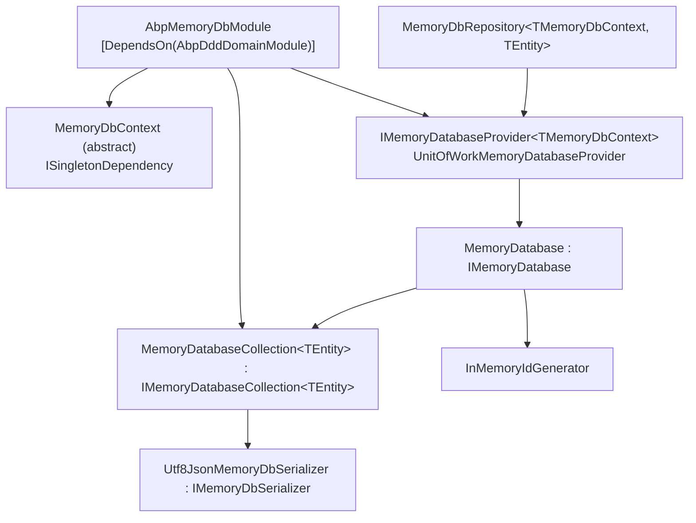

`Volo.Abp.MemoryDb` is the ABP Framework's *in-process* persistence backend. It is not a database — there is no SQL, no driver, no connection string. Instead, it stores serialised entity bytes inside a `Dictionary<string, byte[]>` per `IEntity` type. The package exists for two scenarios: integration tests that need a repository implementation without spinning up a real store, and the ABP CLI sample/demo paths where data persistence beyond process lifetime is irrelevant.

All types referenced here live under `framework/src/Volo.Abp.MemoryDb/`.

## Package layout



## Module

`Volo/Abp/MemoryDb/AbpMemoryDbModule.cs`:

```csharp
[DependsOn(typeof(AbpDddDomainModule))]
public class AbpMemoryDbModule : AbpModule
{
    public override void ConfigureServices(ServiceConfigurationContext context)
    {
        context.Services.TryAddTransient(typeof(IMemoryDatabaseProvider<>), typeof(UnitOfWorkMemoryDatabaseProvider<>));
        context.Services.TryAddTransient(typeof(IMemoryDatabaseCollection<>), typeof(MemoryDatabaseCollection<>));
    }
}
```

Two open generic registrations: an `IMemoryDatabaseProvider<>` that resolves the singleton database per-DbContext through the unit of work, and an `IMemoryDatabaseCollection<>` factory used by `MemoryDatabase` to lazily materialise per-entity collections.

## `MemoryDbContext`

`Volo/Abp/MemoryDb/MemoryDbContext.cs` is comically small:

```csharp
public abstract class MemoryDbContext : ISingletonDependency
{
    private static readonly Type[] EmptyTypeList = new Type[0];

    public virtual IReadOnlyList<Type> GetEntityTypes()
    {
        return EmptyTypeList;
    }
}
```

It is `ISingletonDependency` — a single instance lives for the process. Subclasses do not declare `DbSet<T>` properties; they only enumerate which entity types they own via `GetEntityTypes()`. The default empty list is fine because the repository registrar already discovers types from `AbpMemoryDbContextRegistrationOptions`.

## `IMemoryDatabase` and `MemoryDatabase`

`Volo/Abp/Domain/Repositories/MemoryDb/IMemoryDatabase.cs`:

```csharp
public interface IMemoryDatabase
{
    IMemoryDatabaseCollection<TEntity> Collection<TEntity>() where TEntity : class, IEntity;
    TKey GenerateNextId<TEntity, TKey>();
}
```

`MemoryDatabase` (`MemoryDatabase.cs`) is the implementation:

```csharp
public class MemoryDatabase : IMemoryDatabase, ITransientDependency
{
    private readonly ConcurrentDictionary<Type, object> _sets;
    private readonly ConcurrentDictionary<Type, InMemoryIdGenerator> _entityIdGenerators;
    private readonly IServiceProvider _serviceProvider;

    public MemoryDatabase(IServiceProvider serviceProvider)
    {
        _serviceProvider = serviceProvider;
        _sets = new ConcurrentDictionary<Type, object>();
        _entityIdGenerators = new ConcurrentDictionary<Type, InMemoryIdGenerator>();
    }

    public IMemoryDatabaseCollection<TEntity> Collection<TEntity>()
        where TEntity : class, IEntity
    {
        return (_sets.GetOrAdd(typeof(TEntity),
                _ => _serviceProvider.GetRequiredService<IMemoryDatabaseCollection<TEntity>>())
            as IMemoryDatabaseCollection<TEntity>)!;
    }

    public TKey GenerateNextId<TEntity, TKey>()
    {
        return _entityIdGenerators
            .GetOrAdd(typeof(TEntity), () => new InMemoryIdGenerator())
            .GenerateNext<TKey>();
    }
}
```

`_sets` holds one collection per entity type. The collection is lazily resolved from DI the first time anyone asks for it. `_entityIdGenerators` keeps a per-type `InMemoryIdGenerator`:

```csharp
internal class InMemoryIdGenerator
{
    private int _lastInt;
    private long _lastLong;

    public TKey GenerateNext<TKey>()
    {
        if (typeof(TKey) == typeof(Guid)) { return (TKey)(object)Guid.NewGuid(); }
        if (typeof(TKey) == typeof(int))  { return (TKey)(object)Interlocked.Increment(ref _lastInt); }
        if (typeof(TKey) == typeof(long)) { return (TKey)(object)Interlocked.Increment(ref _lastLong); }
        throw new AbpException("Not supported PrimaryKey type: " + typeof(TKey).FullName);
    }
}
```

Only `Guid`, `int`, and `long` are supported key types. The Guid path is not sequential — `Guid.NewGuid()` is used directly. The int and long paths use `Interlocked.Increment` so concurrent inserts get unique IDs without locking.

## `MemoryDatabaseCollection<TEntity>`

`MemoryDatabaseCollection.cs` is the per-entity storage:

```csharp
public class MemoryDatabaseCollection<TEntity> : IMemoryDatabaseCollection<TEntity>
    where TEntity : class, IEntity
{
    private readonly Dictionary<string, byte[]> _dictionary = [];
    private readonly IMemoryDbSerializer _memoryDbSerializer;

    public MemoryDatabaseCollection(IMemoryDbSerializer memoryDbSerializer)
    {
        _memoryDbSerializer = memoryDbSerializer;
    }

    public IEnumerator<TEntity> GetEnumerator()
    {
        foreach (var entity in _dictionary.Values)
        {
            yield return _memoryDbSerializer.Deserialize(entity, typeof(TEntity)).As<TEntity>();
        }
    }

    public void Add(TEntity entity)
    {
        _dictionary.Add(GetEntityKey(entity), _memoryDbSerializer.Serialize(entity));
    }

    public void Update(TEntity entity)
    {
        if (!_dictionary.ContainsKey(GetEntityKey(entity))) { return; }

        var originalEntity = _memoryDbSerializer.Deserialize(_dictionary[GetEntityKey(entity)], typeof(TEntity)).As<TEntity>();
        if (entity is IHasConcurrencyStamp hasConcurrencyStamp &&
            originalEntity is IHasConcurrencyStamp originalHasConcurrencyStamp)
        {
            if (hasConcurrencyStamp.ConcurrencyStamp != originalHasConcurrencyStamp.ConcurrencyStamp)
            {
                throw new AbpDbConcurrencyException(
                    "Database operation expected to affect 1 row but actually affected 0 row. " +
                    "Data may have been modified or deleted since entities were loaded. " +
                    "This exception has been thrown on optimistic concurrency check.");
            }
        }

        _dictionary[GetEntityKey(entity)] = _memoryDbSerializer.Serialize(entity);
    }

    public void Remove(TEntity entity)
    {
        _dictionary.Remove(GetEntityKey(entity));
    }

    private string GetEntityKey(TEntity entity)
    {
        return entity.GetKeys().JoinAsString(",");
    }
}
```

Three interesting design choices:

1. **Serialise on write, deserialise on read.** Storing `byte[]` instead of the live entity means each call to `Collection<TEntity>()` returns a *fresh* deserialised instance — modifications to that instance do not affect the stored copy until `Update` is called. This mimics the EF Core "tracked copy vs. snapshot" semantics that domain code expects.
2. **`AbpDbConcurrencyException` on stamp mismatch.** `IHasConcurrencyStamp` is honored — if the in-memory snapshot's stamp does not match the incoming entity's stamp, the same exception EF Core would throw is raised. Domain code does not need to branch by provider to handle concurrency.
3. **Composite-key support.** `entity.GetKeys().JoinAsString(",")` produces a comma-joined string for the dictionary key, so multi-property primary keys round-trip cleanly.

## `Utf8JsonMemoryDbSerializer`

`Volo/Abp/Domain/Repositories/MemoryDb/Utf8JsonMemoryDbSerializer.cs`:

```csharp
public class Utf8JsonMemoryDbSerializer : IMemoryDbSerializer, ITransientDependency
{
    protected Utf8JsonMemoryDbSerializerOptions Options { get; }

    public Utf8JsonMemoryDbSerializer(IOptions<Utf8JsonMemoryDbSerializerOptions> options)
    {
        Options = options.Value;
    }

    byte[] IMemoryDbSerializer.Serialize(object obj)
        => JsonSerializer.SerializeToUtf8Bytes(obj, Options.JsonSerializerOptions);

    public object Deserialize(byte[] value, Type type)
        => JsonSerializer.Deserialize(value, type, Options.JsonSerializerOptions)!;
}
```

`System.Text.Json` is the default backbone. `Utf8JsonMemoryDbSerializerOptions.JsonSerializerOptions` lets a host plug converters (for `ExtraProperties`, for instance) or change naming policy.

## `IMemoryDatabaseProvider<TMemoryDbContext>`

`Volo/Abp/MemoryDb/IMemoryDatabaseProvider.cs`:

```csharp
public interface IMemoryDatabaseProvider<TMemoryDbContext> where TMemoryDbContext : MemoryDbContext
{
    [Obsolete("Use GetDbContextAsync method.")]
    TMemoryDbContext DbContext { get; }

    Task<TMemoryDbContext> GetDbContextAsync();

    [Obsolete("Use GetDatabaseAsync method.")]
    IMemoryDatabase GetDatabase();

    Task<IMemoryDatabase> GetDatabaseAsync();
}
```

The default binding is `UnitOfWorkMemoryDatabaseProvider<TMemoryDbContext>` (`Volo/Abp/Uow/MemoryDb/`). Like the EF Core counterpart, it integrates with `IUnitOfWorkManager` so each UoW caches its database resolution.

## `MemoryDbRepository<TMemoryDbContext, TEntity>`

`Volo/Abp/Domain/Repositories/MemoryDb/MemoryDbRepository.cs`:

```csharp
public class MemoryDbRepository<TMemoryDbContext, TEntity> : RepositoryBase<TEntity>, IMemoryDbRepository<TEntity>
    where TMemoryDbContext : MemoryDbContext
    where TEntity : class, IEntity
{
    public virtual async Task<IMemoryDatabaseCollection<TEntity>> GetCollectionAsync()
        => (await GetDatabaseAsync()).Collection<TEntity>();

    public Task<IMemoryDatabase> GetDatabaseAsync()
        => DatabaseProvider.GetDatabaseAsync();

    protected IMemoryDatabaseProvider<TMemoryDbContext> DatabaseProvider { get; }

    public ILocalEventBus LocalEventBus => LazyServiceProvider.LazyGetService<ILocalEventBus>(NullLocalEventBus.Instance);
    public IDistributedEventBus DistributedEventBus => LazyServiceProvider.LazyGetService<IDistributedEventBus>(NullDistributedEventBus.Instance);
    public IEntityChangeEventHelper EntityChangeEventHelper => LazyServiceProvider.LazyGetService<IEntityChangeEventHelper>(NullEntityChangeEventHelper.Instance);
    public IGuidGenerator GuidGenerator => LazyServiceProvider.LazyGetService<IGuidGenerator>(SimpleGuidGenerator.Instance);
    public IAuditPropertySetter AuditPropertySetter => LazyServiceProvider.LazyGetRequiredService<IAuditPropertySetter>();

    public MemoryDbRepository(IMemoryDatabaseProvider<TMemoryDbContext> databaseProvider)
        : base(AbpMemoryDbConsts.ProviderName)
    {
        DatabaseProvider = databaseProvider;
    }
}
```

The full repository implementation overrides `RepositoryBase<TEntity>`'s `InsertAsync`, `UpdateAsync`, `DeleteAsync`, and the queryable surface — all by calling `GetCollectionAsync()` and operating on its `Add`/`Update`/`Remove`/`GetEnumerator`. Domain events still fire through `LocalEventBus` and `DistributedEventBus`, and audit properties are still set via `IAuditPropertySetter` — these are the same services `EfCoreRepository` and `MongoDbRepository` use, so behaviour is consistent across providers.

## Registration

`Microsoft/Extensions/DependencyInjection/AbpMemoryDbServiceCollectionExtensions.cs`:

```csharp
public static IServiceCollection AddMemoryDbContext<TMemoryDbContext>(
    this IServiceCollection services,
    Action<IAbpMemoryDbContextRegistrationOptionsBuilder>? optionsBuilder = null)
    where TMemoryDbContext : MemoryDbContext
{
    var options = new AbpMemoryDbContextRegistrationOptions(typeof(TMemoryDbContext), services);
    optionsBuilder?.Invoke(options);

    if (options.DefaultRepositoryDbContextType != typeof(TMemoryDbContext))
    {
        services.TryAddSingleton(options.DefaultRepositoryDbContextType,
            sp => sp.GetRequiredService<TMemoryDbContext>());
    }

    foreach (var entry in options.ReplacedDbContextTypes)
    {
        var originalDbContextType = entry.Key.Type;
        var targetDbContextType = entry.Value ?? typeof(TMemoryDbContext);

        services.Replace(
            ServiceDescriptor.Singleton(
                originalDbContextType,
                sp => sp.GetRequiredService(targetDbContextType)
            )
        );
    }

    new MemoryDbRepositoryRegistrar(options).AddRepositories();
    return services;
}
```

The shape is structurally identical to `AddAbpDbContext<TDbContext>` and `AddMongoDbContext<TDbContext>` — the same builder API (`AddDefaultRepositories`, `ReplaceDbContext`) carries over so test harnesses can swap in a memory DbContext for the same module DbContext interface a real test would target.

## Test wiring

A typical xUnit collection sets up a memory-backed host like:

```csharp
[DependsOn(typeof(AbpMemoryDbModule), typeof(MyAppDomainModule))]
public class MyAppTestModule : AbpModule
{
    public override void ConfigureServices(ServiceConfigurationContext context)
    {
        context.Services.AddMemoryDbContext<MyAppMemoryDbContext>(options =>
        {
            options.AddDefaultRepositories(includeAllEntities: true);
            options.ReplaceDbContext<IIdentityDbContext>();
        });
    }
}

public class MyAppMemoryDbContext : MemoryDbContext, IIdentityDbContext { }
```

`AddDefaultRepositories(includeAllEntities: true)` registers `MemoryDbRepository<MyAppMemoryDbContext, TEntity>` for every `IEntity` ABP can find in domain assemblies — so application services that depend on `IRepository<MyEntity>` get a fully-functional in-memory backend.

## End-to-end flow

```mermaid
sequenceDiagram
    participant Test
    participant Repo as MemoryDbRepository
    participant Prov as IMemoryDatabaseProvider
    participant Db as MemoryDatabase
    participant Coll as MemoryDatabaseCollection
    participant Ser as IMemoryDbSerializer
    Test->>Repo: InsertAsync(entity)
    Repo->>Prov: GetDatabaseAsync()
    Prov-->>Repo: IMemoryDatabase
    Repo->>Db: Collection&lt;TEntity&gt;()
    Db-->>Repo: IMemoryDatabaseCollection
    Repo->>Coll: Add(entity)
    Coll->>Ser: Serialize(entity)
    Ser-->>Coll: byte[]
    Coll->>Coll: _dictionary[key] = bytes
```

## Common pitfalls

<Warning>
`MemoryDatabase` is `ITransientDependency` but its data lives in the `_sets` dictionary fed by `IServiceProvider`. In practice the *collections* are singletons (registered via `TryAddTransient` but cached inside `MemoryDatabase._sets` for the database instance's lifetime). The provider is what ties a single `MemoryDatabase` to a UoW. Tests that span multiple UoWs may see a fresh `MemoryDatabase` per UoW unless the test fixture overrides the lifetime.
</Warning>

<Warning>
`Utf8JsonMemoryDbSerializer` does not handle reference cycles. Aggregate roots with bidirectional navigation properties will throw `JsonException` on serialise. Configure `ReferenceHandler.IgnoreCycles` via `Utf8JsonMemoryDbSerializerOptions` for affected entities.
</Warning>

<Warning>
There is no query optimisation. Every LINQ query iterates the dictionary and deserialises each entry. For test fixtures with thousands of rows, prefer EF Core's SQLite in-memory provider — see [efcore-sqlite.mdx](/data/efcore-sqlite).
</Warning>

<Tip>
The Memory DB integration is *not* an ABP standalone production backend — it intentionally exists for tests, demos, and the ABP CLI sample paths. Use one of the EF Core providers or MongoDB for real workloads.
</Tip>

See [overview.mdx](/data/overview) for cross-provider context.
