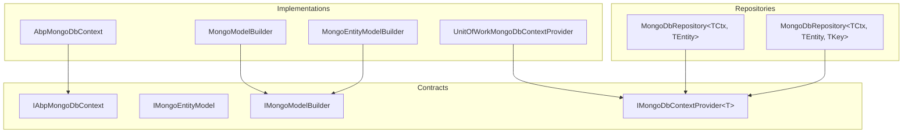
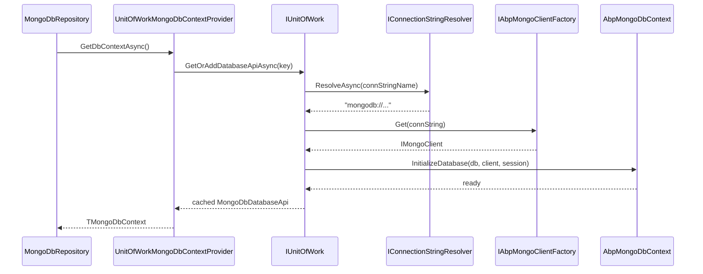

`Volo.Abp.MongoDB` is the ABP Framework's MongoDB persistence integration. It mirrors the EF Core integration in shape — an `AbpMongoDbContext` base class, an `IMongoDbContextProvider<TMongoDbContext>` seam, a generic `MongoDbRepository<TMongoDbContext, TEntity>`, and a registration extension on `IServiceCollection` — but underneath uses the official MongoDB.Driver client and a BSON class-map model rather than EF Core's relational stack.

All types referenced here live under `framework/src/Volo.Abp.MongoDB/`.

## Module composition

`AbpMongoDbModule` (`Volo/Abp/MongoDB/AbpMongoDbModule.cs`) depends on `AbpDddDomainModule` and does three things:

```csharp
[DependsOn(typeof(AbpDddDomainModule))]
public class AbpMongoDbModule : AbpModule
{
    static AbpMongoDbModule()
    {
        AbpBsonSerializer.RemoveSerializer<Guid>();
        BsonSerializer.RegisterSerializer(new GuidSerializer(GuidRepresentation.Standard));
        BsonTypeMapper.RegisterCustomTypeMapper(typeof(Guid), new AbpGuidCustomBsonTypeMapper());
    }

    public override void PreConfigureServices(ServiceConfigurationContext context)
    {
        context.Services.AddConventionalRegistrar(new AbpMongoDbConventionalRegistrar());
    }

    public override void ConfigureServices(ServiceConfigurationContext context)
    {
        context.Services.TryAddTransient(
            typeof(IMongoDbContextProvider<>),
            typeof(UnitOfWorkMongoDbContextProvider<>)
        );

        context.Services.TryAddEnumerable(
            ServiceDescriptor.Transient(typeof(IMongoDbRepositoryFilterer<>),
                typeof(MongoDbRepositoryFilterer<>)));
        context.Services.TryAddEnumerable(
            ServiceDescriptor.Transient(typeof(IMongoDbRepositoryFilterer<,>),
                typeof(MongoDbRepositoryFilterer<,>)));

        context.Services.AddTransient(typeof(IMongoDbContextEventOutbox<>), typeof(MongoDbContextEventOutbox<>));
        context.Services.AddTransient(typeof(IMongoDbContextEventInbox<>), typeof(MongoDbContextEventInbox<>));

        Configure<AbpDistributedEntityEventOptions>(options =>
        {
            options.IgnoredEventSelectors.Add<OutgoingEventRecord>();
            options.IgnoredEventSelectors.Add<IncomingEventRecord>();
        });
    }
}
```

The static constructor is critical: it forces the global BSON GUID representation to `GuidRepresentation.Standard` (16-byte canonical UUID, not the legacy `CSharpLegacy` byte-swapped variant). Mixing the two representations corrupts queries on Guid keys — every ABP MongoDB host inherits the Standard mode.

`AbpMongoDbConventionalRegistrar` is what scans the `IServiceCollection` for `AbpMongoDbContext` subclasses; this is the parallel of `EfCoreConventionalRegistrar` on the EF Core side.

## Package layout



## `IAbpMongoDbContext` and `AbpMongoDbContext`

`Volo/Abp/MongoDB/IAbpMongoDbContext.cs` defines the surface:

```csharp
public interface IAbpMongoDbContext
{
    IMongoClient Client { get; }
    IMongoDatabase Database { get; }
    IMongoCollection<T> Collection<T>();
    IClientSessionHandle? SessionHandle { get; }
}
```

`AbpMongoDbContext` (`Volo/Abp/MongoDB/AbpMongoDbContext.cs`) is the abstract base every host MongoDb context inherits from:

```csharp
public abstract class AbpMongoDbContext : IAbpMongoDbContext, ITransientDependency
{
    public IAbpLazyServiceProvider LazyServiceProvider { get; set; } = default!;
    public IMongoModelSource ModelSource { get; set; } = default!;

    public IMongoClient Client { get; private set; } = default!;
    public IMongoDatabase Database { get; private set; } = default!;
    public IClientSessionHandle? SessionHandle { get; private set; }

    protected internal virtual void CreateModel(IMongoModelBuilder modelBuilder) { }

    public virtual void InitializeDatabase(IMongoDatabase database, IMongoClient client, IClientSessionHandle? sessionHandle)
    {
        Database = database;
        Client = client;
        SessionHandle = sessionHandle;
    }

    public virtual IMongoCollection<T> Collection<T>()
    {
        return Database.GetCollection<T>(GetCollectionName<T>());
    }

    public virtual void InitializeCollections(IMongoDatabase database)
    {
        Database = database;
        ModelSource.GetModel(this);
    }

    protected virtual string GetCollectionName<T>()
        => GetEntityModel<T>().CollectionName;

    protected virtual IMongoEntityModel GetEntityModel<TEntity>()
    {
        var model = ModelSource.GetModel(this).Entities.GetOrDefault(typeof(TEntity));
        if (model == null)
            throw new AbpException("Could not find a model for given entity type: " + typeof(TEntity).AssemblyQualifiedName);
        return model;
    }
}
```

Two extension points subclasses use:

| Method | Purpose |
| --- | --- |
| `CreateModel(IMongoModelBuilder)` | Override to register entities, collection names, BSON class maps, indexes. Called once per context type, cached by `IMongoModelSource`. |
| `InitializeCollections(IMongoDatabase)` | Override for one-time index creation. The base implementation just stashes the database; module DbContexts (e.g., `IdentityMongoDbContext`) use this to ensure indexes on first connect. |

The `Client`, `Database`, and `SessionHandle` properties are set by `InitializeDatabase`, which `UnitOfWorkMongoDbContextProvider<T>` calls after constructing the context.

## `IMongoEntityModel` and `IMongoEntityModelBuilder`

`IMongoEntityModel.cs`:

```csharp
public interface IMongoEntityModel
{
    Type EntityType { get; }
    string CollectionName { get; }
}
```

`IMongoEntityModelBuilder.cs` is the builder used inside `CreateModel`:

```csharp
public interface IMongoEntityModelBuilder<TEntity>
{
    Type EntityType { get; }
    string CollectionName { get; set; }
    BsonClassMap<TEntity> BsonMap { get; }
    CreateCollectionOptions<BsonDocument> CreateCollectionOptions { get; }
    void ConfigureIndexes(Action<IMongoIndexManager<BsonDocument>> action);
}
```

A typical override looks like:

```csharp
protected internal override void CreateModel(IMongoModelBuilder modelBuilder)
{
    base.CreateModel(modelBuilder);
    modelBuilder.Entity<MyAggregate>(b =>
    {
        b.CollectionName = "MyAggregates";
        b.BsonMap.MapMember(x => x.Name).SetIsRequired(true);
        b.ConfigureIndexes(im =>
        {
            im.CreateOne(new CreateIndexModel<BsonDocument>(
                Builders<BsonDocument>.IndexKeys.Ascending("Name"),
                new CreateIndexOptions { Unique = true }));
        });
    });
}
```

`MongoModelBuilder` (`MongoModelBuilder.cs`) implements `IMongoModelBuilder` and snapshots the final `MongoDbContextModel`:

```csharp
public class MongoModelBuilder : IMongoModelBuilder
{
    public virtual MongoDbContextModel Build(AbpMongoDbContext dbContext) { ... }
    public virtual void Entity<TEntity>(Action<IMongoEntityModelBuilder<TEntity>>? buildAction = null) { ... }
    public virtual void Entity(Type entityType, Action<IMongoEntityModelBuilder>? buildAction = null) { ... }
    public virtual IReadOnlyList<IMongoEntityModel> GetEntities() { ... }
}
```

## BSON class maps and `IHasBsonClassMap`

`IHasBsonClassMap.cs`:

```csharp
public interface IHasBsonClassMap
{
    BsonClassMap GetMap();
}
```

Entities that need *non-trivial* BSON serialization (e.g., custom discriminators, computed members) can implement `IHasBsonClassMap` and return a pre-built `BsonClassMap`. The framework discovers these and registers them with `BsonClassMap.RegisterClassMap`.

`AbpBsonClassMapExtensions.cs` is the helper that wires `IHasExtraProperties` to BSON's "extra elements" slot:

```csharp
public static class AbpBsonClassMapExtensions
{
    public static void ConfigureAbpConventions(this BsonClassMap map)
    {
        map.AutoMap();
        map.TryConfigureExtraProperties();
    }

    public static bool TryConfigureExtraProperties(this BsonClassMap map)
    {
        if (!map.ClassType.IsAssignableTo<IHasExtraProperties>()) { return false; }

        var property = map.ClassType.GetProperty(nameof(IHasExtraProperties.ExtraProperties), ...);
        if (property?.DeclaringType != map.ClassType) { return false; }

        map.SetExtraElementsMember(...);
        return true;
    }
}
```

`SetExtraElementsMember` is how the `ExtraProperties` dictionary captures *unknown* document fields without losing them on round-trip — the same role that the `ExtraProperties` JSON column plays in the EF Core ConfigureByConvention path.

## `MongoCollectionAttribute`

`MongoCollectionAttribute.cs`:

```csharp
public class MongoCollectionAttribute : Attribute
{
    public string? CollectionName { get; set; }
    public MongoCollectionAttribute() { }
    public MongoCollectionAttribute(string collectionName) { CollectionName = collectionName; }
}
```

When `IMongoEntityModelBuilder.CollectionName` is not set explicitly inside `CreateModel`, the registrar inspects this attribute on the entity type. ABP framework modules use both — the attribute as a sensible default, an explicit override in `CreateModel` when a host wants a different collection name.

## `IMongoDbContextProvider` and the UoW provider

`IMongoDbContextProvider.cs`:

```csharp
public interface IMongoDbContextProvider<TMongoDbContext>
    where TMongoDbContext : IAbpMongoDbContext
{
    [Obsolete("Use CreateDbContextAsync")]
    TMongoDbContext GetDbContext();
    Task<TMongoDbContext> GetDbContextAsync(CancellationToken cancellationToken = default);
}
```

`UnitOfWorkMongoDbContextProvider<TMongoDbContext>` (in `Volo/Abp/Uow/MongoDB/`) is the default implementation registered by the module. It is structurally identical to the EF Core variant: ask `IUnitOfWorkManager.Current`, resolve the connection string via `IConnectionStringResolver`, build (or fetch cached) `IMongoClient` from `IAbpMongoClientFactory`, attach a `IClientSessionHandle` for transactional writes, and hand the context back.



## `AbpMongoDbContextOptions`

`Volo/Abp/MongoDB/AbpMongoDbContextOptions.cs`:

```csharp
public class AbpMongoDbContextOptions
{
    internal Dictionary<MultiTenantDbContextType, Type> DbContextReplacements { get; }
    public Action<MongoClientSettings>? MongoClientSettingsConfigurer { get; set; }

    internal Type GetReplacedTypeOrSelf(Type dbContextType, MultiTenancySides multiTenancySides = MultiTenancySides.Both)
    {
        // walk DbContextReplacements until no further replacement, detect cycles
    }
}
```

`MongoClientSettingsConfigurer` is the hook for customising `MongoClientSettings` (TLS, server-selection timeout, write concern). It is invoked inside `AbpMongoClientFactory` before `new MongoClient(settings)`.

`DbContextReplacements` works exactly like its EF Core counterpart — a host MongoDb context that aggregates `IIdentityMongoDbContext`, `IPermissionManagementMongoDbContext`, etc., uses `AddMongoDbContext<MyHostDbContext>(...).ReplaceDbContext<TOriginal>()`.

## `AbpMongoDbContextRegistrationOptions`

`Volo/Abp/MongoDB/DependencyInjection/AbpMongoDbContextRegistrationOptions.cs`:

```csharp
public class AbpMongoDbContextRegistrationOptions : AbpCommonDbContextRegistrationOptions, IAbpMongoDbContextRegistrationOptionsBuilder
{
    public AbpMongoDbContextRegistrationOptions(Type originalDbContextType, IServiceCollection services)
        : base(originalDbContextType, services) { }
}
```

It inherits all of `AbpCommonDbContextRegistrationOptions` (`AddDefaultRepositories`, `AddRepository<TEntity, TRepository>`, `ReplaceDbContext<>`) — the same surface used by EF Core. Hosts call `services.AddMongoDbContext<TDbContext>(opts => opts.AddDefaultRepositories(includeAllEntities: true))` in `Microsoft/Extensions/DependencyInjection/AbpMongoDbServiceCollectionExtensions.cs`.

## `AbpMongoDbOptions`

`AbpMongoDbOptions.cs`:

```csharp
public class AbpMongoDbOptions
{
    /// <summary>
    /// Serializer the datetime based on <see cref="AbpClockOptions.Kind"/> in MongoDb.
    /// Default: true.
    /// </summary>
    public bool UseAbpClockHandleDateTime { get; set; }

    public AbpMongoDbOptions()
    {
        UseAbpClockHandleDateTime = true;
    }
}
```

When `true`, ABP's `AbpMongoDbDateTimeSerializer` overrides MongoDB.Driver's default `DateTime` serializer so reads and writes go through `IClock.Normalize` — guaranteeing that UTC-Kind values come back as UTC even when MongoDB stored them as `DateTimeKind.Local`.

## `MongoDbRepository`

`Volo/Abp/Domain/Repositories/MongoDB/MongoDbRepository.cs` ships two generic shapes:

```csharp
public class MongoDbRepository<TMongoDbContext, TEntity>
{
    public virtual IMongoCollection<TEntity> Collection => DbContext.Collection<TEntity>();
    public virtual async Task<IMongoCollection<TEntity>> GetCollectionAsync(CancellationToken cancellationToken = default);
    public virtual IMongoDatabase Database => DbContext.Database;
    public virtual async Task<IMongoDatabase> GetDatabaseAsync(CancellationToken cancellationToken = default);
    public virtual IQueryable<TEntity> GetMongoQueryable();
    public virtual Task<IQueryable<TEntity>> GetMongoQueryableAsync(...);
    public virtual async Task<IQueryable<TEntity>> GetQueryableAsync(...);
    public virtual async Task<IAggregateFluent<TEntity>> GetAggregateAsync(...);
}

public class MongoDbRepository<TMongoDbContext, TEntity, TKey>
{
    public virtual async Task<TEntity> GetAsync(TKey id, ...);
    public virtual async Task<TEntity?> FindAsync(TKey id, ...);
    public virtual Task DeleteAsync(TKey id, ...);
    public virtual async Task DeleteManyAsync(IEnumerable<TKey> ids, bool autoSave = false, CancellationToken cancellationToken = default);
}
```

Notable surface differences from the EF Core repository:

- `GetMongoQueryable()` returns the driver-native LINQ provider (`IMongoQueryable` underneath).
- `GetAggregateAsync()` returns a fluent aggregate pipeline — useful for `$lookup`, `$facet`, and other features that don't translate from LINQ.
- Mutation methods accept the same `bool autoSave` parameter as the EF Core repository, but autoSave on Mongo is a no-op for inserts/updates (Mongo writes are durable on acknowledgement, not on a SaveChanges call).

## End-to-end wiring

<Steps>
  <Step title="Reference packages">
    `<PackageReference Include="Volo.Abp.MongoDB" />` in the Mongo DB layer.
  </Step>
  <Step title="DbContext">
    ```csharp
    [ConnectionStringName("Default")]
    public class MyMongoDbContext : AbpMongoDbContext, IMyMongoDbContext
    {
        public IMongoCollection<Book> Books => Collection<Book>();

        protected internal override void CreateModel(IMongoModelBuilder modelBuilder)
        {
            base.CreateModel(modelBuilder);
            modelBuilder.Entity<Book>(b => { b.CollectionName = "Books"; });
        }
    }
    ```
  </Step>
  <Step title="Register">
    ```csharp
    context.Services.AddMongoDbContext<MyMongoDbContext>(options =>
    {
        options.AddDefaultRepositories(includeAllEntities: true);
    });

    Configure<AbpMongoDbContextOptions>(opts =>
    {
        opts.MongoClientSettingsConfigurer = s => { s.ServerSelectionTimeout = TimeSpan.FromSeconds(5); };
    });
    ```
  </Step>
</Steps>

## Common pitfalls

<Warning>
The static constructor of `AbpMongoDbModule` is what forces `GuidRepresentation.Standard`. If a host references `Volo.Abp.MongoDB` *and* a third-party package that registers a different `GuidSerializer` at startup, the order of static initialisation determines which one wins. Always have `AbpMongoDbModule` (or a descendant) loaded first.
</Warning>

<Warning>
`InitializeCollections` is called once per DbContext type when the model is first built. Side-effecting index creation inside an override re-runs only when the cache invalidates (process restart). For dynamic indexes, run them inside a `IDataSeedContributor` instead.
</Warning>

See [overview.mdx](/data/overview) for the cross-provider context graph.
