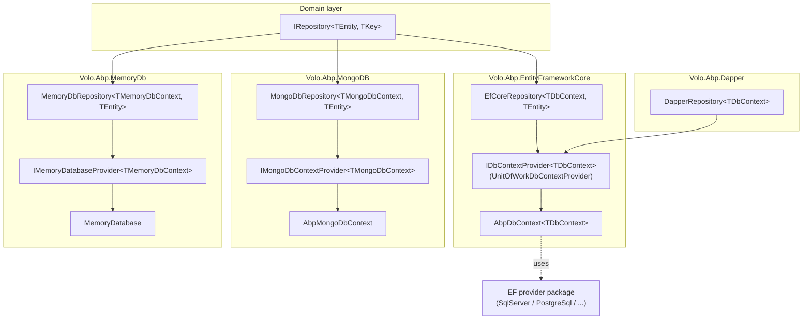
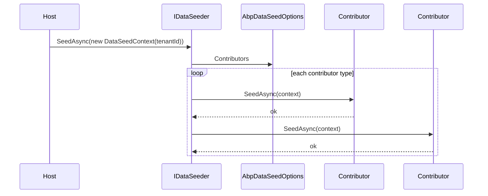

The ABP Framework data layer is split across one provider-agnostic kernel (`Volo.Abp.Data`) and a fan-out of concrete provider packages (`Volo.Abp.EntityFrameworkCore.*`, `Volo.Abp.MongoDB`, `Volo.Abp.Dapper`, `Volo.Abp.MemoryDb`). The kernel defines the contracts that the domain layer talks to — `IDataFilter`, `IDataSeeder`, `IConnectionStringResolver`, `AbpDbConnectionOptions` — while each provider implements `IDbContextProvider<TDbContext>` (or the Mongo / MemoryDb equivalent) so that repositories never bind to a specific database.

This page is the map: it links every public abstraction in `framework/src/Volo.Abp.Data/Volo/Abp/Data/` to the place that consumes it, then sketches the call graph from a domain repository down to the EF Core, MongoDB, Dapper, or in-memory implementation.

## The provider matrix

ABP ships twelve data packages under `framework/src/`. They split cleanly into the kernel, EF Core provider packages, and non-EF stores.

<CardGroup cols={2}>
  <Card title="Volo.Abp.Data" icon="layer-group" href="/data/volo-abp-data">
    Provider-agnostic kernel — `AbpDataModule`, `IDataFilter`, `IDataSeeder`, `IConnectionStringResolver`, `ConnectionStrings`.
  </Card>
  <Card title="Volo.Abp.EntityFrameworkCore" icon="database" href="/data/entity-framework-core">
    `AbpDbContext<TDbContext>`, `IDbContextProvider<>`, `EfCoreRepository<,,>`, registration via `AddAbpDbContext`.
  </Card>
  <Card title="EF Core providers" icon="layer-group" href="/data/efcore-providers">
    Seven thin packages: SQL Server, PostgreSQL, MySQL (Oracle), MySQL Pomelo, Oracle, Oracle Devart, SQLite.
  </Card>
  <Card title="Volo.Abp.MongoDB" icon="leaf" href="/data/mongodb">
    `AbpMongoDbContext`, `IMongoDbContextProvider<>`, `MongoDbRepository<,,>`, BSON class map plumbing.
  </Card>
  <Card title="Volo.Abp.Dapper" icon="bolt" href="/data/dapper">
    Thin facade — `AbpDapperModule`, `DapperRepository<TDbContext>` reuses the EF Core `DbContext` connection.
  </Card>
  <Card title="Volo.Abp.MemoryDb" icon="memory" href="/data/memorydb">
    `MemoryDatabase`, `MemoryDatabaseCollection<>`, `MemoryDbRepository<,>` — test-only in-process store.
  </Card>
</CardGroup>

## End-to-end call graph

A domain repository call never names a database product. The graph below shows how a generic `IRepository<TEntity, TKey>` reaches a concrete provider, regardless of which package the application module pulls in.



Concretely, `EfCoreRepository<TDbContext, TEntity>` in `framework/src/Volo.Abp.EntityFrameworkCore/Volo/Abp/Domain/Repositories/EntityFrameworkCore/EfCoreRepository.cs` only takes an `IDbContextProvider<TDbContext>` in its constructor. The default binding is `UnitOfWorkDbContextProvider<TDbContext>`, registered by `AbpEntityFrameworkCoreModule.ConfigureServices` with `services.TryAddTransient(typeof(IDbContextProvider<>), typeof(UnitOfWorkDbContextProvider<>))`.

## Kernel abstractions (`Volo.Abp.Data`)

`AbpDataModule`, defined in `framework/src/Volo.Abp.Data/Volo/Abp/Data/AbpDataModule.cs`, owns the kernel's startup contract. It depends on `AbpObjectExtendingModule`, `AbpUnitOfWorkModule`, and `AbpEventBusAbstractionsModule`, then registers `IDataFilter<>` as a singleton open generic and scans the DI container for `IDataSeedContributor` implementations.

<Steps>
  <Step title="PreConfigureServices">
    `AutoAddDataSeedContributors(context.Services)` hooks `services.OnRegistered` so every type that implements `IDataSeedContributor` is appended to `AbpDataSeedOptions.Contributors` automatically.
  </Step>
  <Step title="ConfigureServices">
    Binds `AbpDbConnectionOptions` from `IConfiguration` (so `ConnectionStrings:Default` flows in from `appsettings.json`), then `AddSingleton(typeof(IDataFilter<>), typeof(DataFilter<>))`.
  </Step>
  <Step title="PostConfigureServices">
    Calls `options.Databases.RefreshIndexes()` on `AbpDatabaseInfoDictionary`, building a connection-string-name → database lookup for fall-through resolution.
  </Step>
</Steps>

The kernel contracts are:

| Contract | Default impl | File |
| --- | --- | --- |
| `IDataFilter` / `IDataFilter<TFilter>` | `DataFilter` / `DataFilter<TFilter>` | `IDataFilter.cs`, `DataFilter.cs` |
| `IDataSeeder` | `DataSeeder` | `IDataSeeder.cs`, `DataSeeder.cs` |
| `IDataSeedContributor` | n/a — user code | `IDataSeedContributor.cs` |
| `IConnectionStringResolver` | `DefaultConnectionStringResolver` | `IConnectionStringResolver.cs`, `DefaultConnectionStringResolver.cs` |
| `IConnectionStringChecker` | `DefaultConnectionStringChecker` | `IConnectionStringChecker.cs`, `DefaultConnectionStringChecker.cs` |
| `ConnectionStrings` (dictionary) | n/a — value type | `ConnectionStrings.cs` |
| `AbpDbConnectionOptions` | n/a | `AbpDbConnectionOptions.cs` |
| `AbpDataFilterOptions` | n/a | `AbpDataFilterOptions.cs` |
| `AbpDataSeedOptions` | n/a | `AbpDataSeedOptions.cs` |

Repositories receive a resolved connection string through `IConnectionStringResolver.ResolveAsync(connectionStringName)`. `DefaultConnectionStringResolver` returns `Options.ConnectionStrings.Default` when no name is supplied, otherwise it delegates to `AbpDbConnectionOptions.GetConnectionStringOrNull(name, fallbackToDatabaseMappings: true, fallbackToDefault: true)`.

## DbContext lifecycle (EF Core path)

`AbpDbContext<TDbContext>` in `framework/src/Volo.Abp.EntityFrameworkCore/Volo/Abp/EntityFrameworkCore/AbpDbContext.cs` is the abstract base for every EF Core DbContext in ABP. It implements `IAbpEfCoreDbContext`, which extends `IEfCoreDbContext` with a single `Initialize(AbpEfCoreDbContextInitializationContext)` hook called by `UnitOfWorkDbContextProvider<TDbContext>` after construction.

```mermaid
sequenceDiagram
    participant Repo as EfCoreRepository
    participant Prov as IDbContextProvider&lt;T&gt;
    participant Uow as IUnitOfWork
    participant Ctx as AbpDbContext&lt;T&gt;
    participant Resolver as IConnectionStringResolver
    Repo->>Prov: GetDbContextAsync()
    Prov->>Uow: GetOrAddDatabaseApi()
    Uow->>Resolver: ResolveAsync(connStringName)
    Resolver-->>Uow: connection string
    Uow->>Ctx: new TDbContext(options)
    Ctx->>Ctx: Initialize(initContext)
    Ctx-->>Prov: ready
    Prov-->>Repo: TDbContext
```

`ConfigureBaseProperties<TEntity>` (line 828 of `AbpDbContext.cs`) iterates every entity type in `modelBuilder.Model.GetEntityTypes()` and calls `entityTypeBuilder.ConfigureByConvention()` (from `Modeling/AbpEntityTypeBuilderExtensions.cs`), wiring concurrency stamps, soft-delete flags, audit properties, extra-properties JSON columns, and global query filters per entity. The filter expressions delegate to `AbpEfCoreDataFilterDbFunctionMethods` so the `IsSoftDeleteFilterEnabled` and `IsMultiTenantFilterEnabled` ambient state can flow through compiled queries.

## Multi-database registration

Applications wire a DbContext through `services.AddAbpDbContext<TDbContext>(...)` in `framework/src/Volo.Abp.EntityFrameworkCore/Microsoft/Extensions/DependencyInjection/AbpEfCoreServiceCollectionExtensions.cs`. The builder lets the host register repositories, replace a generic module DbContext with the host-specific one (`options.ReplaceDbContext<TOriginal>()`), and configure per-entity options.

```mermaid
flowchart LR
    Host["Host AppModule"] -->|AddAbpDbContext&lt;HostDbContext&gt;| Builder["AbpDbContextRegistrationOptions"]
    Builder -->|ReplaceDbContext&lt;TModuleDbContext&gt;| Repl["DbContextReplacements map"]
    Builder -->|Entity&lt;TEntity&gt;(...)| EntOpts["AbpEntityOptions"]
    Builder -->|AddRepositories| Reg["EfCoreRepositoryRegistrar"]
    Reg --> DI["IServiceCollection"]
```

## Data filtering

`IDataFilter<TFilter>` is the typed contract; `IDataFilter` is the non-generic facade. `DataFilter<TFilter>` stores its state in `AsyncLocal<DataFilterState>` so `Disable()` / `Enable()` scopes flow across `await` boundaries and dispose back to the previous state. The defaults are seeded from `AbpDataFilterOptions.DefaultStates` — typically `ISoftDelete` is enabled and `IMultiTenant` is enabled.

```csharp
// From DataFilter.cs
public IDisposable Disable()
{
    if (!IsEnabled) { return NullDisposable.Instance; }
    _filter.Value!.IsEnabled = false;
    return new DisposeAction(() => Enable());
}
```

Read more in [data-seeding-and-filtering.mdx](/data/data-seeding-and-filtering).

## Data seeding pipeline

`IDataSeeder.SeedAsync(DataSeedContext)` is the orchestrator. The default `DataSeeder` opens a service scope, walks `AbpDataSeedOptions.Contributors` (auto-populated by `AbpDataModule.AutoAddDataSeedContributors`), and invokes each contributor inside either the ambient unit of work or — when `DataSeederExtensions.SeedInSeparateUow` is set — a fresh UoW per contributor.



## Where to go next

<CardGroup cols={2}>
  <Card title="Volo.Abp.Data internals" icon="gear" href="/data/volo-abp-data">
    Deep dive on every kernel type.
  </Card>
  <Card title="EF Core integration" icon="database" href="/data/entity-framework-core">
    `AbpDbContext`, repositories, replacement.
  </Card>
  <Card title="Provider matrix" icon="table" href="/data/efcore-providers">
    Compare the seven EF Core packages.
  </Card>
  <Card title="MongoDB integration" icon="leaf" href="/data/mongodb">
    `AbpMongoDbContext` and BSON mapping.
  </Card>
</CardGroup>
