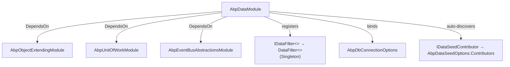
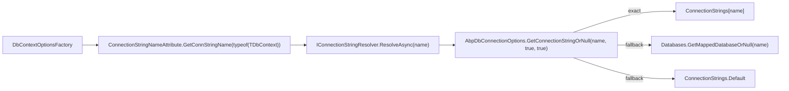
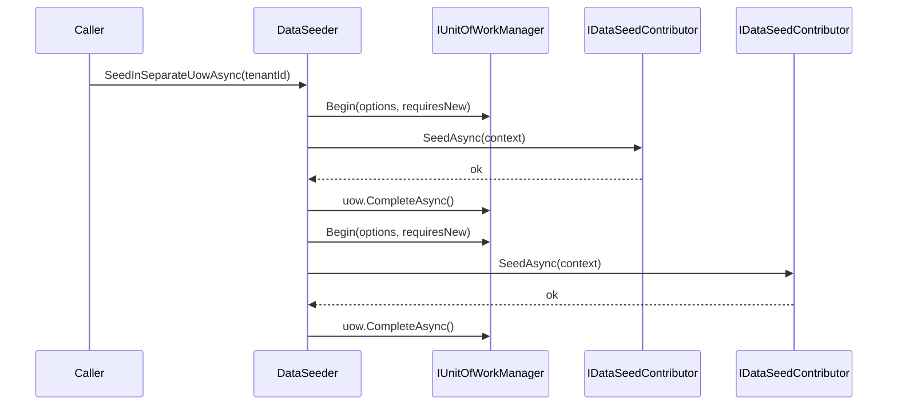

`Volo.Abp.Data` is the provider-agnostic core of the ABP Framework data stack. It contains no SQL, no LINQ provider, and no DbContext — only the contracts that EF Core, MongoDB, Dapper, and MemoryDb packages implement, plus a handful of ambient-state services (filters, seeders, connection-string resolution). Every page in the data area transitively depends on the types defined here under `framework/src/Volo.Abp.Data/Volo/Abp/Data/`.

This page enumerates the kernel surface area: the module wiring, options, filters, seeders, and the connection-string resolver pipeline.

## Module wiring

`AbpDataModule` (`AbpDataModule.cs`) is decorated with `[DependsOn(typeof(AbpObjectExtendingModule), typeof(AbpUnitOfWorkModule), typeof(AbpEventBusAbstractionsModule))]`. Those three dependencies matter:

- `AbpObjectExtendingModule` powers the `ExtraProperties` dictionary that `IHasExtraProperties` entities use.
- `AbpUnitOfWorkModule` ships `[UnitOfWork]` and `IUnitOfWorkManager`, used by `DataSeeder.SeedAsync`.
- `AbpEventBusAbstractionsModule` provides the contract for `ApplyDatabaseMigrationsEto` and `AppliedDatabaseMigrationsEto` event types defined in this assembly.



The three lifecycle hooks do:

<Steps>
  <Step title="PreConfigureServices">
    Calls `AutoAddDataSeedContributors(context.Services)`. This wires `services.OnRegistered` so every type whose `ImplementationType` is assignable to `IDataSeedContributor` is collected into a list and then handed to `services.Configure<AbpDataSeedOptions>(o => o.Contributors.AddIfNotContains(contributors))`.
  </Step>
  <Step title="ConfigureServices">
    Binds `AbpDbConnectionOptions` from `IConfiguration` via `Configure<AbpDbConnectionOptions>(configuration)` — this is what reads the `ConnectionStrings` section from `appsettings.json`. It then registers the open generic `IDataFilter<>` to `DataFilter<>` as a singleton.
  </Step>
  <Step title="PostConfigureServices">
    Re-opens `AbpDbConnectionOptions` and calls `options.Databases.RefreshIndexes()` on the `AbpDatabaseInfoDictionary`. This builds the reverse index used by `GetMappedDatabaseOrNull` when resolving a connection-string name to a database group.
  </Step>
</Steps>

## Data filtering

### Contracts

`IDataFilter` and `IDataFilter<TFilter>` are defined in `IDataFilter.cs`:

```csharp
public interface IDataFilter<TFilter> where TFilter : class
{
    IDisposable Enable();
    IDisposable Disable();
    bool IsEnabled { get; }
}

public interface IDataFilter
{
    IDisposable Enable<TFilter>() where TFilter : class;
    IDisposable Disable<TFilter>() where TFilter : class;
    bool IsEnabled<TFilter>() where TFilter : class;
}
```

The contract is intentionally narrow: filters do not carry data, only a boolean `IsEnabled` flag. The convention is that the type parameter `TFilter` is a *marker* interface — `ISoftDelete`, `IMultiTenant`, or user-defined interfaces such as `IHasStatus`.

### Implementation

`DataFilter` is a singleton facade (`DataFilter.cs`) that lazily fetches an `IDataFilter<TFilter>` per generic argument and caches it in a `ConcurrentDictionary<Type, object>`:

```csharp
public class DataFilter : IDataFilter, ISingletonDependency
{
    private readonly ConcurrentDictionary<Type, object> _filters;
    private readonly IServiceProvider _serviceProvider;
    // ...
    private IDataFilter<TFilter> GetFilter<TFilter>() where TFilter : class
        => (_filters.GetOrAdd(typeof(TFilter),
                factory: () => _serviceProvider.GetRequiredService<IDataFilter<TFilter>>())
            as IDataFilter<TFilter>)!;
}
```

`DataFilter<TFilter>` holds the actual ambient state in an `AsyncLocal<DataFilterState>`, so a `Disable()` scope is per-async-context (per request, per task) and reverts on `Dispose()`:

```csharp
public IDisposable Disable()
{
    if (!IsEnabled) { return NullDisposable.Instance; }
    _filter.Value!.IsEnabled = false;
    return new DisposeAction(() => Enable());
}
```

`EnsureInitialized()` lazily clones the per-type default from `AbpDataFilterOptions.DefaultStates`; if no default is registered, the state is `new DataFilterState(true)` — filters are *on* by default.

### Options

`AbpDataFilterOptions` (`AbpDataFilterOptions.cs`) is a single `Dictionary<Type, DataFilterState> DefaultStates`. Modules use it to flip a marker interface to default-off. For example, a tenant-management module might add `options.DefaultStates[typeof(IMultiTenant)] = new DataFilterState(false)` in host scenarios. `DataFilterState.Clone()` ensures each AsyncLocal value is independent of the shared default.

## Connection strings

### `ConnectionStrings`

`ConnectionStrings.cs` is a `Dictionary<string, string?>` with one well-known key:

```csharp
public const string DefaultConnectionStringName = "Default";
public string? Default
{
    get => this.GetOrDefault(DefaultConnectionStringName);
    set => this[DefaultConnectionStringName] = value;
}
```

Module-specific connection strings use the *module's* connection string name as the dictionary key (e.g., `"AbpIdentity"`, `"SaasService"`). When the key is absent, resolution falls back to `Default`.

### `AbpDbConnectionOptions`

`AbpDbConnectionOptions.cs` composes a `ConnectionStrings` dictionary with an `AbpDatabaseInfoDictionary` of named database groups. The non-trivial method is `GetConnectionStringOrNull`:

```csharp
public string? GetConnectionStringOrNull(
    string connectionStringName,
    bool fallbackToDatabaseMappings = true,
    bool fallbackToDefault = true)
{
    var connectionString = ConnectionStrings.GetOrDefault(connectionStringName);
    if (!connectionString.IsNullOrEmpty()) { return connectionString; }

    if (fallbackToDatabaseMappings)
    {
        var database = Databases.GetMappedDatabaseOrNull(connectionStringName);
        if (database != null)
        {
            connectionString = ConnectionStrings.GetOrDefault(database.DatabaseName);
            if (!connectionString.IsNullOrEmpty()) { return connectionString; }
        }
    }

    if (fallbackToDefault) { /* return ConnectionStrings.Default */ }

    return null;
}
```

The three-step lookup is: **exact name → database group name → Default**. This lets a host group multiple ABP modules into one physical database via `AbpDatabaseInfoDictionary` mappings.

### `IConnectionStringResolver`

The resolver (`IConnectionStringResolver.cs`) returns the resolved connection string string for a given name. The default implementation, `DefaultConnectionStringResolver` (registered as `ITransientDependency`), is a thin wrapper over `AbpDbConnectionOptions.GetConnectionStringOrNull`:

```csharp
public virtual Task<string> ResolveAsync(string? connectionStringName = null)
{
    return Task.FromResult(ResolveInternal(connectionStringName))!;
}
```

Multi-tenant SaaS scenarios override this — e.g., `TenantConnectionStringResolver` in the SaaS module checks `ICurrentTenant.ConnectionStrings` first, falling back to `base.ResolveAsync`.

### `ConnectionStringNameAttribute`

`ConnectionStringNameAttribute.cs` is what every ABP module DbContext carries:

```csharp
[ConnectionStringName("AbpIdentity")]
public class IdentityDbContext : AbpDbContext<IdentityDbContext> { ... }
```

The static helper `ConnectionStringNameAttribute.GetConnStringName(Type)` reads the attribute or falls back to `type.FullName!`. The EF Core integration calls it inside `DbContextOptionsFactory.Create<TDbContext>` to look up the right connection string per DbContext.



### `IConnectionStringChecker`

Defined in `IConnectionStringChecker.cs` with `DefaultConnectionStringChecker` as the implementation. Returns an `AbpConnectionStringCheckResult` with `Connected` / `DatabaseExists` flags. Modules use it before running migrations to decide whether to create the database first.

## Data seeding

### `DataSeedContext`

`DataSeedContext.cs` is the carrier object passed to every contributor:

```csharp
public class DataSeedContext
{
    public Guid? TenantId { get; set; }
    public Dictionary<string, object?> Properties { get; }
    public object? this[string name] { get => Properties.GetOrDefault(name); set => Properties[name] = value; }
    public virtual DataSeedContext WithProperty(string key, object? value)
    {
        Properties[key] = value;
        return this;
    }
}
```

`TenantId` is the only first-class field; everything else lives in the `Properties` bag. The `[key]` indexer and fluent `WithProperty` keep contributor code terse.

### `IDataSeedContributor`

```csharp
public interface IDataSeedContributor
{
    Task SeedAsync(DataSeedContext context);
}
```

Every implementation is auto-registered by `AbpDataModule.AutoAddDataSeedContributors`. There is no ordering attribute in the kernel — contributors run in the order they were added to `AbpDataSeedOptions.Contributors`. Order-sensitive seeders typically register a dependency on a logical predecessor inside their own `SeedAsync`.

### `IDataSeeder` and `DataSeeder`

`IDataSeeder.cs` is a one-method interface (`Task SeedAsync(DataSeedContext)`). `DataSeeder` (`DataSeeder.cs`) is the default `ITransientDependency` implementation; it is itself marked `[UnitOfWork]`. The two execution modes are visible in the implementation:

```csharp
[UnitOfWork]
public virtual async Task SeedAsync(DataSeedContext context)
{
    using (var scope = ServiceScopeFactory.CreateScope())
    {
        if (context.Properties.ContainsKey(DataSeederExtensions.SeedInSeparateUow))
        {
            var manager = scope.ServiceProvider.GetRequiredService<IUnitOfWorkManager>();
            foreach (var contributorType in Options.Contributors)
            {
                using (var uow = manager.Begin(options, requiresNew))
                {
                    var contributor = (IDataSeedContributor)scope.ServiceProvider.GetRequiredService(contributorType);
                    await contributor.SeedAsync(context);
                    await uow.CompleteAsync();
                }
            }
        }
        else
        {
            foreach (var contributorType in Options.Contributors)
            {
                var contributor = (IDataSeedContributor)scope.ServiceProvider.GetRequiredService(contributorType);
                await contributor.SeedAsync(context);
            }
        }
    }
}
```

`DataSeederExtensions.cs` exposes `SeedInSeparateUowAsync` to opt into the per-contributor UoW mode. The three property keys are private string constants:

```csharp
public const string SeedInSeparateUow = "__SeedInSeparateUow";
public const string SeedInSeparateUowOptions = "__SeedInSeparateUowOptions";
public const string SeedInSeparateUowRequiresNew = "__SeedInSeparateUowRequiresNew";
```



## Concurrency and extras

### `IHasConcurrencyStamp` and helpers

`Volo/Abp/Domain/Entities/IHasConcurrencyStamp.cs` and `ConcurrencyStampExtensions.cs` define the `string ConcurrencyStamp { get; set; }` contract used by aggregate roots. `TryConfigureConcurrencyStamp` in `Modeling/AbpEntityTypeBuilderExtensions.cs` (EF Core package) sets the column as `IsConcurrencyToken()`.

### `AbpDbConcurrencyException`

`AbpDbConcurrencyException.cs` is the cross-provider exception thrown when a `DbUpdateConcurrencyException` (EF Core) or equivalent surfaces. EF Core's `AbpDbContext.SaveChangesAsync` catches the provider exception and re-throws this wrapped variant so domain code can catch a single type.

### Database migration events

`ApplyDatabaseMigrationsEto.cs` and `AppliedDatabaseMigrationsEto.cs` are distributed event payloads (the `Eto` suffix is ABP convention). Host migration utilities raise these on the local/distributed event bus so other modules can wait until a tenant database is fully migrated.

### `AbpDataMigrationEnvironment`

`AbpDataMigrationEnvironment.cs` and its extension carry a `MigrationEnvironment` string (`"Development"`, `"Test"`, `"Staging"`, etc.) so seed contributors can branch behavior — typically seeding richer demo data in non-production environments.

## Settings provider compatibility

A subtle but important integration: `INonDistributedSettingValueProvider` (from the Settings module) is the interface ABP uses to filter out settings providers that are not safe before the database is reachable. The data layer is consumed by `DatabaseSettingValueProvider` (in the Settings.EF/Settings.Mongo packages), which is *not* an `INonDistributedSettingValueProvider`. When the settings stack is bootstrapping, the data kernel is one of the modules that has to be available before the database is consulted — which is why `AbpDataModule` depends only on Unit-of-Work and event bus *abstractions*, not on any concrete EF Core / Mongo binding.

## Quick reference

<AccordionGroup>
  <Accordion title="Default DI lifetimes">
    - `IDataFilter` → `DataFilter` (Singleton via `ISingletonDependency`).
    - `IDataFilter<TFilter>` → `DataFilter<TFilter>` (Singleton, open generic registered by the module).
    - `IDataSeeder` → `DataSeeder` (Transient via `ITransientDependency`).
    - `IConnectionStringResolver` → `DefaultConnectionStringResolver` (Transient).
    - `IConnectionStringChecker` → `DefaultConnectionStringChecker` (Transient).
  </Accordion>
  <Accordion title="Options classes">
    - `AbpDbConnectionOptions` — connection strings + database info dictionary.
    - `AbpDataFilterOptions` — default `DataFilterState` per filter type.
    - `AbpDataSeedOptions` — `Contributors` list (auto-populated).
  </Accordion>
  <Accordion title="Marker interfaces consumed">
    - `IDataSeedContributor` (auto-registered).
    - `IConnectionStringResolver` consumers usually receive it via `IUnitOfWork`.
  </Accordion>
</AccordionGroup>

Next, see [entity-framework-core.mdx](/data/entity-framework-core) for the EF Core implementation of these contracts.
