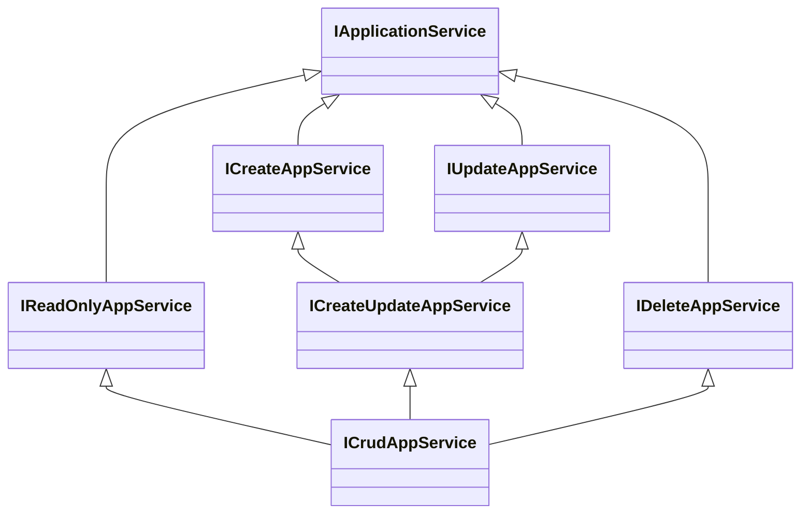
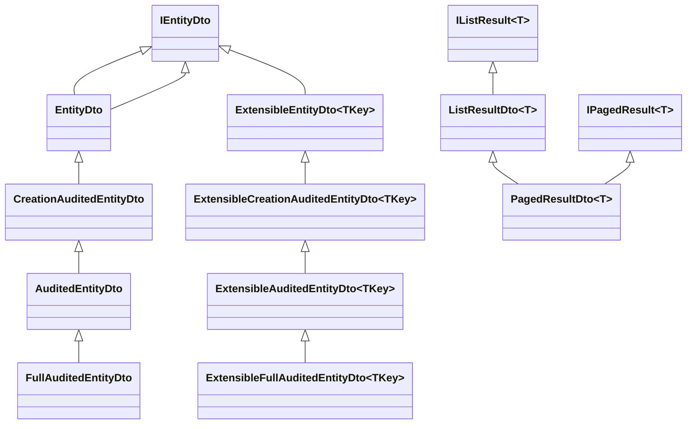

The ABP Framework's contracts layer lives in
`framework/src/Volo.Abp.Ddd.Application.Contracts/`. It is the assembly that
both UI clients and remote callers reference, so it deliberately ships only
interfaces and DTO base classes — never application-service implementations.
This page covers `IApplicationService`, `IRemoteService`, the
`ICrudAppService<...>` family, and the DTO classes under
`Volo/Abp/Application/Dtos/`.

## Module wiring

`framework/src/Volo.Abp.Ddd.Application.Contracts/Volo/Abp/Application/AbpDddApplicationContractsModule.cs`:

```csharp
[DependsOn(
    typeof(AbpLocalizationModule),
    typeof(AbpAuditingContractsModule),
    typeof(AbpDataModule)
    )]
public class AbpDddApplicationContractsModule : AbpModule
{
    public override void ConfigureServices(ServiceConfigurationContext context)
    {
        Configure<AbpVirtualFileSystemOptions>(options =>
        {
            options.FileSets.AddEmbedded<AbpDddApplicationContractsModule>();
        });

        Configure<AbpLocalizationOptions>(options =>
        {
            options.Resources
                .Add<AbpDddApplicationContractsResource>("en")
                .AddVirtualJson("/Volo/Abp/Application/Localization/Resources/AbpDdd");
        });
    }
}
```

The module embeds the localization JSON files for the `AbpDddApplicationContractsResource`
and registers them with `AbpLocalizationOptions`. Those localized strings are
what `LimitedResultRequestDto.Validate` uses for the
`"MaxResultCountExceededExceptionMessage"` error message.

## `IApplicationService` and `IRemoteService`

`framework/src/Volo.Abp.Ddd.Application.Contracts/Volo/Abp/Application/Services/IApplicationService.cs`:

```csharp
namespace Volo.Abp.Application.Services;

/// <summary>
/// This interface must be implemented by all application services to register and identify them by convention.
/// </summary>
public interface IApplicationService : IRemoteService
{

}
```

`IApplicationService` is a marker. `IRemoteService` (in the core assembly) is
the discriminator the auto-API controllers use to expose a service as HTTP.
Every application-service interface in a feature module ends up like:

```csharp
public interface IBookAppService : IApplicationService { ... }
```

The conventional auto-API controller then exposes every method on
`IBookAppService` as an action.

## The CRUD interface family

The folder
`framework/src/Volo.Abp.Ddd.Application.Contracts/Volo/Abp/Application/Services/`
contains six files that compose into the canonical CRUD contract:



### `IReadOnlyAppService`

`framework/src/Volo.Abp.Ddd.Application.Contracts/Volo/Abp/Application/Services/IReadOnlyAppService.cs`
defines:

```csharp
public interface IReadOnlyAppService<TGetOutputDto, TGetListOutputDto, in TKey, in TGetListInput>
    : IApplicationService
{
    Task<TGetOutputDto> GetAsync(TKey id);
    Task<PagedResultDto<TGetListOutputDto>> GetListAsync(TGetListInput input);
}
```

Two overloads collapse the generic count: `IReadOnlyAppService<TEntityDto, TKey>`
uses `PagedAndSortedResultRequestDto` for the list input and shares the same
DTO for both single-get and list-get outputs.

### `ICreateAppService` / `IUpdateAppService` / `IDeleteAppService`

Each is one method:

```csharp
public interface ICreateAppService<TGetOutputDto, in TCreateInput> : IApplicationService
{
    Task<TGetOutputDto> CreateAsync(TCreateInput input);
}

public interface IUpdateAppService<TGetOutputDto, in TKey, in TUpdateInput> : IApplicationService
{
    Task<TGetOutputDto> UpdateAsync(TKey id, TUpdateInput input);
}

public interface IDeleteAppService<in TKey> : IApplicationService
{
    Task DeleteAsync(TKey id);
}
```

`ICreateUpdateAppService<...>` simply composes `ICreateAppService` and
`IUpdateAppService` so the implementation can advertise both with one
inheritance line.

### `ICrudAppService`

`framework/src/Volo.Abp.Ddd.Application.Contracts/Volo/Abp/Application/Services/ICrudAppService.cs`
gathers everything into one tower of overloads:

```csharp
public interface ICrudAppService<TGetOutputDto, TGetListOutputDto, in TKey, in TGetListInput, in TCreateInput, in TUpdateInput>
    : IReadOnlyAppService<TGetOutputDto, TGetListOutputDto, TKey, TGetListInput>,
      ICreateUpdateAppService<TGetOutputDto, TKey, TCreateInput, TUpdateInput>,
      IDeleteAppService<TKey>
{
}
```

Plus simplified forms with 2–5 type parameters that fall back to defaults like
`PagedAndSortedResultRequestDto` and "use the same DTO for both get and list."
Pick the smallest generic that matches your contract.

## DTO base classes

The directory
`framework/src/Volo.Abp.Ddd.Application.Contracts/Volo/Abp/Application/Dtos/`
hosts the DTO base classes.

### `IEntityDto` / `EntityDto`

`IEntityDto.cs`:

```csharp
public interface IEntityDto { }

public interface IEntityDto<TKey> : IEntityDto, IKeyedObject
{
    TKey Id { get; set; }
}
```

`EntityDto.cs` provides the abstract base. Notice the TODO comment "Consider to
delete this class" — the framework keeps it for backward compatibility but
prefers `ExtensibleEntityDto<TKey>` for new code.

### `CreationAuditedEntityDto` / `AuditedEntityDto` / `FullAuditedEntityDto`

These mirror the entity-side hierarchy:

```csharp
public abstract class CreationAuditedEntityDto<TPrimaryKey>
    : EntityDto<TPrimaryKey>, ICreationAuditedObject
{
    public DateTime CreationTime { get; set; }
    public Guid? CreatorId { get; set; }
}

public abstract class AuditedEntityDto<TPrimaryKey>
    : CreationAuditedEntityDto<TPrimaryKey>, IAuditedObject
{
    public DateTime? LastModificationTime { get; set; }
    public Guid? LastModifierId { get; set; }
}

public abstract class FullAuditedEntityDto<TPrimaryKey>
    : AuditedEntityDto<TPrimaryKey>, IFullAuditedObject
{
    public bool IsDeleted { get; set; }
    public Guid? DeleterId { get; set; }
    public DateTime? DeletionTime { get; set; }
}
```

Both `*WithUser` and `Extensible*` variants exist, mirroring the
domain-layer pattern.

### `IListResult` / `ListResultDto<T>`

```csharp
public class ListResultDto<T> : IListResult<T>
{
    public IReadOnlyList<T> Items
    {
        get { return _items ?? (_items = new List<T>()); }
        set { _items = value; }
    }
    private IReadOnlyList<T>? _items;
}
```

The auto-init keeps `Items` non-null for callers that omit it on the wire.

### `IPagedResult` / `PagedResultDto<T>`

```csharp
public class PagedResultDto<T> : ListResultDto<T>, IPagedResult<T>
{
    public long TotalCount { get; set; }

    public PagedResultDto(long totalCount, IReadOnlyList<T> items) : base(items)
    {
        TotalCount = totalCount;
    }
}
```

This is the canonical return type for `GetListAsync`. `ICrudAppService.GetListAsync`
returns `Task<PagedResultDto<TGetListOutputDto>>`.

### Request DTOs

`LimitedResultRequestDto`, `PagedResultRequestDto`, and
`PagedAndSortedResultRequestDto` form a layered request hierarchy:

```csharp
public class LimitedResultRequestDto : ILimitedResultRequest, IValidatableObject
{
    public static int DefaultMaxResultCount { get; set; } = 10;
    public static int MaxMaxResultCount { get; set; } = 1000;

    [Range(1, int.MaxValue)]
    public virtual int MaxResultCount { get; set; } = DefaultMaxResultCount;

    public virtual IEnumerable<ValidationResult> Validate(ValidationContext validationContext)
    {
        if (MaxResultCount > MaxMaxResultCount)
        {
            var localizer = validationContext.GetRequiredService<IStringLocalizer<AbpDddApplicationContractsResource>>();
            yield return new ValidationResult(
                localizer["MaxResultCountExceededExceptionMessage",
                    nameof(MaxResultCount), MaxMaxResultCount,
                    typeof(LimitedResultRequestDto).FullName!,
                    nameof(MaxMaxResultCount)],
                new[] { nameof(MaxResultCount) });
        }
    }
}

public class PagedResultRequestDto : LimitedResultRequestDto, IPagedResultRequest
{
    [Range(0, int.MaxValue)]
    public virtual int SkipCount { get; set; }
}

public class PagedAndSortedResultRequestDto : PagedResultRequestDto, IPagedAndSortedResultRequest
{
    public virtual string? Sorting { get; set; }
}
```

`MaxMaxResultCount` is the *global* cap — it stops the caller from passing
`MaxResultCount = int.MaxValue` and pulling the whole table. The
`AbpDddApplicationContractsResource` makes the error message localizable.

### `ExtensibleEntityDto<TKey>`

`framework/src/Volo.Abp.Ddd.Application.Contracts/Volo/Abp/Application/Dtos/ExtensibleEntityDto.cs`
gives the DTO the same `ExtraProperties` bag that `AggregateRoot` has on the
domain side:

```csharp
public abstract class ExtensibleEntityDto<TKey> : ExtensibleObject, IEntityDto<TKey>
{
    public TKey Id { get; set; } = default!;

    protected ExtensibleEntityDto() : this(true) { }

    protected ExtensibleEntityDto(bool setDefaultsForExtraProperties)
        : base(setDefaultsForExtraProperties) { }
    ...
}
```

Pairs with `concerns/object-extending` — the extensible DTO carries object-extension
properties to the client, including the validation defaults registered with
the extension framework. The matching `ExtensibleAuditedEntityDto`,
`ExtensibleCreationAuditedEntityDto`, `ExtensibleFullAuditedEntityDto`, and
`*WithUser` variants follow the same layering.

## DTO hierarchy at a glance



## `IHasTotalCount`

`framework/src/Volo.Abp.Ddd.Application.Contracts/Volo/Abp/Application/Dtos/IHasTotalCount.cs`
declares the contract for DTOs that ship a `TotalCount`. `PagedResultDto<T>`
implements it via `IPagedResult<T>`, which inherits from `IListResult<T>` and
`IHasTotalCount`. Modules can implement `IHasTotalCount` independently for
custom response shapes.

## When to inherit from `Extensible*` DTOs

* Use the plain `EntityDto<TKey>` family when the DTO is closed and doesn't
  need to round-trip extra properties.
* Use the `Extensible*` family when:
  * The matching entity inherits from `AggregateRoot` and you want the
    object-extending properties to flow to and from the client.
  * You expect downstream modules to add fields without forking the contract.

The `ExtensibleObject` base validates extra properties via
`ExtensibleObjectValidator.GetValidationErrors`, so model-level validation
also covers extension fields.

## Cross-references

* `ddd/application-layer` — the implementation side of these interfaces and
  DTOs.
* `ddd/repositories` — `PagedResultDto<T>` returned from
  `IRepository<TEntity>.GetPagedListAsync` shapes.
* `concerns/object-extending` — `ExtensibleObject`, `ExtraProperties`.
* `concerns/validation` — `IValidatableObject` and the
  validation interceptor that consumes it.
* `http/mvc-conventions` — how `IApplicationService` is mapped to controllers.
