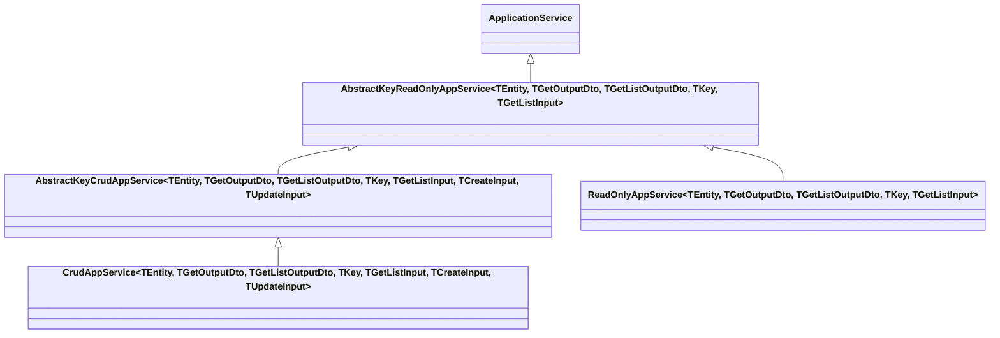
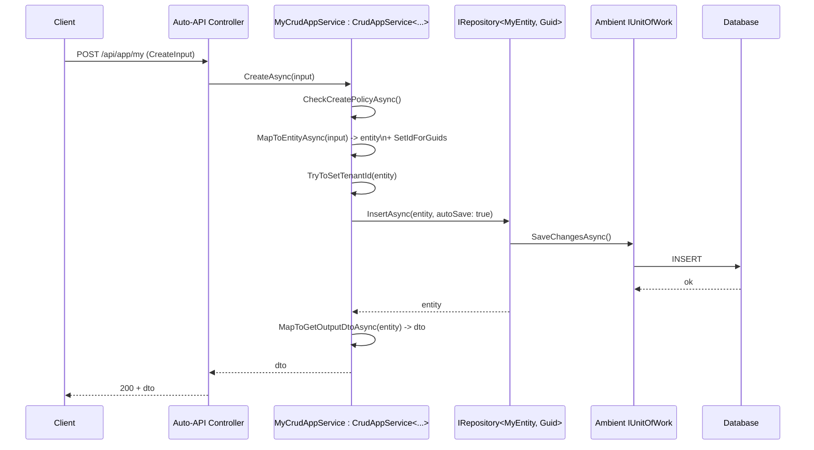

The ABP Framework's application-service layer lives in
`framework/src/Volo.Abp.Ddd.Application/Volo/Abp/Application/Services/`. Five
files implement the entire baseline: `ApplicationService.cs`,
`AbstractKeyReadOnlyAppService.cs`, `AbstractKeyCrudAppService.cs`,
`ReadOnlyAppService.cs`, and `CrudAppService.cs`. This page walks each one,
shows the inheritance chain, and explains how the cross-cutting concerns wire
into the base.

## `ApplicationService` base

`framework/src/Volo.Abp.Ddd.Application/Volo/Abp/Application/Services/ApplicationService.cs`
is the entry point — every higher-level service inherits from it. It implements
a stack of cross-cutting markers:

```csharp
public abstract class ApplicationService :
    IApplicationService,
    IAvoidDuplicateCrossCuttingConcerns,
    IValidationEnabled,
    IUnitOfWorkEnabled,
    IAuditingEnabled,
    IGlobalFeatureCheckingEnabled,
    ITransientDependency
{
    public IAbpLazyServiceProvider LazyServiceProvider { get; set; } = default!;

    [Obsolete("Use LazyServiceProvider instead.")]
    public IServiceProvider ServiceProvider { get; set; } = default!;

    public static string[] CommonPostfixes { get; set; } =
        { "AppService", "ApplicationService", "Service" };

    public List<string> AppliedCrossCuttingConcerns { get; } = new();
    ...
}
```

### What each marker buys

| Interface | Effect |
| --- | --- |
| `IApplicationService` | Auto-API discovery includes this service. |
| `IAvoidDuplicateCrossCuttingConcerns` | Concerns that look up `AppliedCrossCuttingConcerns` (e.g. validation) skip if already applied. |
| `IValidationEnabled` | The validation interceptor runs on every method. |
| `IUnitOfWorkEnabled` | The UoW interceptor wraps every non-`Get*` method in a UoW. |
| `IAuditingEnabled` | The auditing interceptor records the call into the audit log. |
| `IGlobalFeatureCheckingEnabled` | `[RequiresGlobalFeature]` checks are honored. |
| `ITransientDependency` | Conventional DI registration as transient. |

### Lazy services available to subclasses

```csharp
protected IUnitOfWorkManager UnitOfWorkManager => LazyServiceProvider.LazyGetRequiredService<IUnitOfWorkManager>();
protected IAsyncQueryableExecuter AsyncExecuter => LazyServiceProvider.LazyGetRequiredService<IAsyncQueryableExecuter>();
protected IGuidGenerator GuidGenerator => LazyServiceProvider.LazyGetService<IGuidGenerator>(SimpleGuidGenerator.Instance);
protected ILoggerFactory LoggerFactory => LazyServiceProvider.LazyGetRequiredService<ILoggerFactory>();
protected ICurrentTenant CurrentTenant => LazyServiceProvider.LazyGetRequiredService<ICurrentTenant>();
protected IDataFilter DataFilter => LazyServiceProvider.LazyGetRequiredService<IDataFilter>();
protected ICurrentUser CurrentUser => LazyServiceProvider.LazyGetRequiredService<ICurrentUser>();
protected ISettingProvider SettingProvider => LazyServiceProvider.LazyGetRequiredService<ISettingProvider>();
protected IClock Clock => LazyServiceProvider.LazyGetRequiredService<IClock>();
protected IAuthorizationService AuthorizationService => LazyServiceProvider.LazyGetRequiredService<IAuthorizationService>();
protected IFeatureChecker FeatureChecker => LazyServiceProvider.LazyGetRequiredService<IFeatureChecker>();
protected IStringLocalizerFactory StringLocalizerFactory => LazyServiceProvider.LazyGetRequiredService<IStringLocalizerFactory>();
protected IUnitOfWork? CurrentUnitOfWork => UnitOfWorkManager?.Current;
```

Every member is property-style and uses the lazy provider, so service
construction stays cheap until the first call.

### Object mapper context

```csharp
protected Type? ObjectMapperContext { get; set; }
protected IObjectMapper ObjectMapper => LazyServiceProvider.LazyGetService<IObjectMapper>(provider =>
    ObjectMapperContext == null
        ? provider.GetRequiredService<IObjectMapper>()
        : (IObjectMapper)provider.GetRequiredService(typeof(IObjectMapper<>).MakeGenericType(ObjectMapperContext)));
```

By default `ObjectMapper` resolves the global mapper. Setting
`ObjectMapperContext = typeof(MyModule)` switches to
`IObjectMapper<MyModule>`, which is how feature modules scope their AutoMapper
profiles.

### Localization

```csharp
protected IStringLocalizer L { get { ... } }
protected Type? LocalizationResource { get; set; } = typeof(DefaultResource);

protected virtual IStringLocalizer CreateLocalizer()
{
    if (LocalizationResource != null)
    {
        return StringLocalizerFactory.Create(LocalizationResource);
    }

    var localizer = StringLocalizerFactory.CreateDefaultOrNull();
    if (localizer == null)
    {
        throw new AbpException($"Set {nameof(LocalizationResource)} or define the default localization resource type...");
    }

    return localizer;
}
```

A feature module sets `LocalizationResource = typeof(MyModuleResource)` in the
constructor so `L["MyKey"]` resolves against the module's own resource.

### `CheckPolicyAsync`

The base class supplies the canonical authorization helper:

```csharp
protected virtual async Task CheckPolicyAsync(string? policyName)
{
    if (string.IsNullOrEmpty(policyName))
    {
        return;
    }

    await AuthorizationService.CheckAsync(policyName!);
}
```

Subclasses (and the CRUD ladder below) call it through the `*PolicyName`
properties.

## CRUD inheritance chain



`AbstractKey*` variants accept any `IEntity` (no `TKey` constraint), while
`CrudAppService<...>` and `ReadOnlyAppService<...>` constrain `TEntity` to
`IEntity<TKey>` and use a keyed repository.

## `AbstractKeyReadOnlyAppService`

`framework/src/Volo.Abp.Ddd.Application/Volo/Abp/Application/Services/AbstractKeyReadOnlyAppService.cs`
implements the read side. The 5-parameter generic is the canonical form:

```csharp
public abstract class AbstractKeyReadOnlyAppService<TEntity, TGetOutputDto, TGetListOutputDto, TKey, TGetListInput>
    : ApplicationService
    , IReadOnlyAppService<TGetOutputDto, TGetListOutputDto, TKey, TGetListInput>
    where TEntity : class, IEntity
{
    protected IReadOnlyRepository<TEntity> ReadOnlyRepository { get; }

    protected virtual string? GetPolicyName { get; set; }
    protected virtual string? GetListPolicyName { get; set; }
    ...
}
```

### `GetAsync` and `GetListAsync`

```csharp
public virtual async Task<TGetOutputDto> GetAsync(TKey id)
{
    await CheckGetPolicyAsync();
    var entity = await GetEntityByIdAsync(id);
    return await MapToGetOutputDtoAsync(entity);
}

public virtual async Task<PagedResultDto<TGetListOutputDto>> GetListAsync(TGetListInput input)
{
    await CheckGetListPolicyAsync();

    var query = await CreateFilteredQueryAsync(input);
    var totalCount = await AsyncExecuter.CountAsync(query);

    var entities = new List<TEntity>();
    var entityDtos = new List<TGetListOutputDto>();

    if (totalCount > 0)
    {
        query = ApplySorting(query, input);
        query = ApplyPaging(query, input);
        entities = await AsyncExecuter.ToListAsync(query);
        entityDtos = await MapToGetListOutputDtosAsync(entities);
    }

    return new PagedResultDto<TGetListOutputDto>(totalCount, entityDtos);
}
```

Three extension seams to override:

* `CreateFilteredQueryAsync(input)` — default `ReadOnlyRepository.GetQueryableAsync()`.
* `ApplySorting(query, input)` — defaults to `input.Sorting` if input is
  `ISortedResultRequest`, otherwise calls `ApplyDefaultSorting`.
* `ApplyPaging(query, input)` — defaults to `PageBy` for `IPagedResultRequest`,
  `Take` for `ILimitedResultRequest`.

### Default sorting fallback

```csharp
protected virtual IQueryable<TEntity> ApplyDefaultSorting(IQueryable<TEntity> query)
{
    if (typeof(TEntity).IsAssignableTo<IHasCreationTime>())
    {
        return query.OrderByDescending(e => ((IHasCreationTime)e).CreationTime);
    }

    throw new AbpException("No sorting specified but this query requires sorting. Override the ApplySorting or the ApplyDefaultSorting method...");
}
```

If `TEntity : IHasCreationTime`, the default is "newest first." Otherwise, the
method throws — the design forces callers to think about pagination ordering.

### Mapping hooks

```csharp
protected virtual Task<TGetOutputDto> MapToGetOutputDtoAsync(TEntity entity)
    => Task.FromResult(MapToGetOutputDto(entity));

protected virtual TGetOutputDto MapToGetOutputDto(TEntity entity)
    => ObjectMapper.Map<TEntity, TGetOutputDto>(entity);

protected virtual TGetListOutputDto MapToGetListOutputDto(TEntity entity)
    => ObjectMapper.Map<TEntity, TGetListOutputDto>(entity);
```

The async overload always exists alongside the sync one, so async overrides
can return a `Task<TDto>` without blocking.

## `AbstractKeyCrudAppService`

`framework/src/Volo.Abp.Ddd.Application/Volo/Abp/Application/Services/AbstractKeyCrudAppService.cs`
adds Create, Update, Delete on top of the read base:

```csharp
public virtual async Task<TGetOutputDto> CreateAsync(TCreateInput input)
{
    await CheckCreatePolicyAsync();
    var entity = await MapToEntityAsync(input);
    TryToSetTenantId(entity);
    await Repository.InsertAsync(entity, autoSave: true);
    return await MapToGetOutputDtoAsync(entity);
}

public virtual async Task<TGetOutputDto> UpdateAsync(TKey id, TUpdateInput input)
{
    await CheckUpdatePolicyAsync();
    var entity = await GetEntityByIdAsync(id);
    await MapToEntityAsync(input, entity);
    await Repository.UpdateAsync(entity, autoSave: true);
    return await MapToGetOutputDtoAsync(entity);
}

public virtual async Task DeleteAsync(TKey id)
{
    await CheckDeletePolicyAsync();
    await DeleteByIdAsync(id);
}
```

Each operation runs in three phases: **policy → mutate → map**, with both
mapping directions (`input → entity`, `entity → DTO`) overridable.

### `SetIdForGuids`

```csharp
protected virtual void SetIdForGuids(TEntity entity)
{
    if (entity is IEntity<Guid> entityWithGuidId && entityWithGuidId.Id == Guid.Empty)
    {
        EntityHelper.TrySetId(entityWithGuidId, () => GuidGenerator.Create(), true);
    }
}
```

Called from the default `MapToEntity(TCreateInput)`. Combined with
`IGuidGenerator`, this gives every newly created `Guid`-keyed aggregate a
sequential GUID without the caller writing any code.

### `TryToSetTenantId`

```csharp
protected virtual void TryToSetTenantId(TEntity entity)
{
    if (entity is IMultiTenant && HasTenantIdProperty(entity))
    {
        var tenantId = CurrentTenant.Id;
        if (!tenantId.HasValue) return;
        var propertyInfo = entity.GetType().GetProperty(nameof(IMultiTenant.TenantId));
        if (propertyInfo == null || propertyInfo.GetSetMethod(true) == null) return;
        propertyInfo.SetValue(entity, tenantId);
    }
}
```

This is the application-layer counterpart to `Entity()`'s
`EntityHelper.TrySetTenantId` — it ensures the tenant id is set even when the
ORM materializes the entity without invoking the constructor (e.g., AutoMapper
`Map<>` into a fresh object).

## `CrudAppService<...>`

`framework/src/Volo.Abp.Ddd.Application/Volo/Abp/Application/Services/CrudAppService.cs`
specializes for `IEntity<TKey>` and stores a strongly-typed
`IRepository<TEntity, TKey>`:

```csharp
public abstract class CrudAppService<TEntity, TGetOutputDto, TGetListOutputDto, TKey, TGetListInput, TCreateInput, TUpdateInput>
    : AbstractKeyCrudAppService<TEntity, TGetOutputDto, TGetListOutputDto, TKey, TGetListInput, TCreateInput, TUpdateInput>
    where TEntity : class, IEntity<TKey>
{
    protected new IRepository<TEntity, TKey> Repository { get; }

    protected CrudAppService(IRepository<TEntity, TKey> repository)
        : base(repository)
    {
        Repository = repository;
    }

    protected override async Task DeleteByIdAsync(TKey id)
    {
        await Repository.DeleteAsync(id);
    }

    protected override async Task<TEntity> GetEntityByIdAsync(TKey id)
    {
        return await Repository.GetAsync(id);
    }

    protected override IQueryable<TEntity> ApplyDefaultSorting(IQueryable<TEntity> query)
    {
        if (typeof(TEntity).IsAssignableTo<IHasCreationTime>())
        {
            return query.OrderByDescending(e => ((IHasCreationTime)e).CreationTime);
        }
        else
        {
            return query.OrderByDescending(e => e.Id);
        }
    }
}
```

Five overloads of `CrudAppService<...>` exist for callers who don't need every
generic parameter — the chain `3 → 4 → 5 → 6 → 7` generic parameters lets you
write just `CrudAppService<Book, BookDto, Guid>` for a simple case.

### Update binding subtlety

`MapToEntity(TUpdateInput, TEntity)` first checks whether `TUpdateInput`
implements `IEntityDto<TKey>` and forces the id to match:

```csharp
protected override void MapToEntity(TUpdateInput updateInput, TEntity entity)
{
    if (updateInput is IEntityDto<TKey> entityDto)
    {
        entityDto.Id = entity.Id;
    }
    base.MapToEntity(updateInput, entity);
}
```

This guards against `PUT /book/{id}` body smuggling a different id through the
input DTO.

## `ReadOnlyAppService<...>`

`framework/src/Volo.Abp.Ddd.Application/Volo/Abp/Application/Services/ReadOnlyAppService.cs`
mirrors `CrudAppService` but takes only `IReadOnlyRepository<TEntity, TKey>`:

```csharp
public abstract class ReadOnlyAppService<TEntity, TGetOutputDto, TGetListOutputDto, TKey, TGetListInput>
    : AbstractKeyReadOnlyAppService<TEntity, TGetOutputDto, TGetListOutputDto, TKey, TGetListInput>
    where TEntity : class, IEntity<TKey>
{
    protected IReadOnlyRepository<TEntity, TKey> Repository { get; }

    protected ReadOnlyAppService(IReadOnlyRepository<TEntity, TKey> repository) : base(repository)
    {
        Repository = repository;
    }

    protected override async Task<TEntity> GetEntityByIdAsync(TKey id)
        => await Repository.GetAsync(id);

    protected override IQueryable<TEntity> ApplyDefaultSorting(IQueryable<TEntity> query)
    {
        if (typeof(TEntity).IsAssignableTo<ICreationAuditedObject>())
        {
            return query.OrderByDescending(e => ((ICreationAuditedObject)e).CreationTime);
        }
        else
        {
            return query.OrderByDescending(e => e.Id);
        }
    }
}
```

Note the `IReadOnlyRepository<TEntity, TKey>` constraint — the application
service has no way to mutate the data even if a developer attempts to. Combined
with `[DisableEntityChangeTracking]` this becomes the framework's canonical
"read-only API surface."

## `IAsyncQueryableExecuter`

Each read method materializes the queryable through `AsyncExecuter` rather
than EF Core extension methods. This lets the *same* application service work
on top of any data provider, because `IAsyncQueryableExecuter` is implemented
by both the EF Core integration and the MongoDB integration.

## Auditing

`ApplicationService` implements `IAuditingEnabled`, but feature modules can
suppress auditing per method or per type using the standard `[DisableAuditing]`
attribute from `Volo.Abp.Auditing`. Conversely, an aggressive
`[AbpAuditedAttribute]` (also from `Volo.Abp.Auditing`) on a particular method
forces auditing even when the framework would have skipped the call.

## `AbpApplicationServiceOptions`

There is no dedicated `AbpApplicationServiceOptions` in the application
assembly today — the per-service knobs live on the base class itself
(`CommonPostfixes`, `LocalizationResource`, `ObjectMapperContext`, the
per-CRUD `*PolicyName` properties). Module-level wiring for application
services (controller route prefixes, conventional API exposure) lives in
`Volo.Abp.AspNetCore.Mvc` instead — see `http/mvc-conventions`.

## End-to-end CRUD trace



## Related pages

* `ddd/application-contracts` — `IApplicationService`, `ICrudAppService<...>`,
  and the DTOs the base classes consume.
* `ddd/repositories` — the repositories `CrudAppService<...>` calls.
* `ddd/unit-of-work` — how `autoSave: true` flushes the ambient UoW.
* `concerns/auditing` — `[AbpAudited]`, `[DisableAuditing]`.
* `concerns/authorization` — `CheckPolicyAsync` and policy-based gating.
* `concerns/object-mapping` — `IObjectMapper` and per-context mappers.
