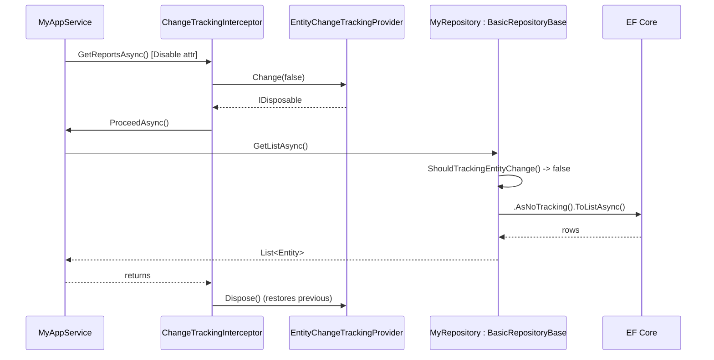

The ABP Framework lets a feature module turn EF Core change tracking on or off
per method or per class without scattering `AsNoTracking()` calls across the
data layer. The toggle is implemented in two folders:
`framework/src/Volo.Abp.Ddd.Domain/Volo/Abp/Domain/ChangeTracking/` for the
interceptor and attributes, and
`framework/src/Volo.Abp.Ddd.Domain/Volo/Abp/Domain/Repositories/` for the
ambient provider that repositories consult. This page covers each piece and
the end-to-end flow.

## The problem the toggle solves

EF Core's change tracker keeps an in-memory snapshot of every entity returned
from a query so it can later compute a diff for `SaveChanges`. For read-heavy
operations — listing pages, read-only reports — that overhead is wasted. Calling
`AsNoTracking()` on every query is verbose and easy to forget. ABP wraps the
behavior in an interceptor that toggles an `AsyncLocal<bool?>` for the duration
of a method, and `BasicRepositoryBase` consults that flag before issuing the
query.

## `IEntityChangeTrackingProvider`

`framework/src/Volo.Abp.Ddd.Domain/Volo/Abp/Domain/Repositories/IEntityChangeTrackingProvider.cs`
declares the contract:

```csharp
public interface IEntityChangeTrackingProvider
{
    bool? Enabled { get; }

    IDisposable Change(bool? enabled);
}
```

The `bool?` is tri-state on purpose: `true` forces tracking, `false` forces
no-tracking, and `null` means "no override — use the repository default."

## `EntityChangeTrackingProvider` (the implementation)

`framework/src/Volo.Abp.Ddd.Domain/Volo/Abp/Domain/Repositories/EntityChangeTrackingProvider.cs`:

```csharp
public class EntityChangeTrackingProvider : IEntityChangeTrackingProvider, ISingletonDependency
{
    public bool? Enabled => _current.Value;

    private readonly AsyncLocal<bool?> _current = new AsyncLocal<bool?>();

    public IDisposable Change(bool? enabled)
    {
        var previousValue = Enabled;
        _current.Value = enabled;
        return new DisposeAction(() => _current.Value = previousValue);
    }
}
```

Key facts:

* **Singleton + `AsyncLocal<bool?>`.** The singleton holds an
  `AsyncLocal<bool?>`, so the override is scoped to the async call chain. Two
  concurrent requests cannot stomp on each other's flag.
* **`DisposeAction` restores the previous value.** Nested overrides are honored
  — the outer override is restored when the inner `IDisposable` is disposed.

## The attributes

`framework/src/Volo.Abp.Ddd.Domain/Volo/Abp/Domain/ChangeTracking/EntityChangeTrackingAttribute.cs`
defines the abstract base, then the concrete attributes:

```csharp
[AttributeUsage(AttributeTargets.Method | AttributeTargets.Class)]
public abstract class EntityChangeTrackingAttribute : Attribute
{
    public virtual bool IsEnabled { get; set; }

    public EntityChangeTrackingAttribute(bool isEnabled)
    {
        IsEnabled = isEnabled;
    }
}

[AttributeUsage(AttributeTargets.Method | AttributeTargets.Class)]
public class EnableEntityChangeTrackingAttribute : EntityChangeTrackingAttribute
{
    public EnableEntityChangeTrackingAttribute() : base(true) { }
}

[AttributeUsage(AttributeTargets.Method | AttributeTargets.Class)]
public class DisableEntityChangeTrackingAttribute : EntityChangeTrackingAttribute
{
    public DisableEntityChangeTrackingAttribute() : base(false) { }
}
```

The `AllowMultiple = false` default applies (the attribute has no
`[AttributeUsage(..., AllowMultiple = true)]`), so a single method or class can
only carry one of the two.

## `ChangeTrackingHelper`

`framework/src/Volo.Abp.Ddd.Domain/Volo/Abp/Domain/ChangeTracking/ChangeTrackingHelper.cs`
performs reflection-based discovery:

```csharp
public static bool IsEntityChangeTrackingType(TypeInfo implementationType)
    => HasEntityChangeTrackingAttribute(implementationType)
       || AnyMethodHasEntityChangeTrackingAttribute(implementationType);

public static bool IsEntityChangeTrackingMethod(MethodInfo methodInfo,
    out EntityChangeTrackingAttribute? entityChangeTrackingAttribute)
{
    // method-level attribute wins, then class-level
    ...
}
```

The "type-level OR any-method" check is what
`ChangeTrackingInterceptorRegistrar.ShouldIntercept` uses to decide whether to
attach the interceptor at all — there's no point intercepting a class whose
methods would never trigger the override.

## `ChangeTrackingInterceptor`

`framework/src/Volo.Abp.Ddd.Domain/Volo/Abp/Domain/ChangeTracking/ChangeTrackingInterceptor.cs`:

```csharp
public class ChangeTrackingInterceptor : AbpInterceptor, ITransientDependency
{
    private readonly IEntityChangeTrackingProvider _entityChangeTrackingProvider;

    public ChangeTrackingInterceptor(IEntityChangeTrackingProvider entityChangeTrackingProvider)
    {
        _entityChangeTrackingProvider = entityChangeTrackingProvider;
    }

    public async override Task InterceptAsync(IAbpMethodInvocation invocation)
    {
        if (!ChangeTrackingHelper.IsEntityChangeTrackingMethod(invocation.Method,
            out var changeTrackingAttribute))
        {
            await invocation.ProceedAsync();
            return;
        }

        using (_entityChangeTrackingProvider.Change(changeTrackingAttribute?.IsEnabled))
        {
            await invocation.ProceedAsync();
        }
    }
}
```

When the invoked method (or its declaring class) carries one of the attributes,
the interceptor opens a `Change(...)` scope. The disposable returned by
`Change` resets the `AsyncLocal` when the scope exits — including on
exceptions, because `using` calls `Dispose` in the `finally`.

## `ChangeTrackingInterceptorRegistrar`

`framework/src/Volo.Abp.Ddd.Domain/Volo/Abp/Domain/ChangeTracking/ChangeTrackingInterceptorRegistrar.cs`
hooks the interceptor onto eligible service registrations:

```csharp
public static class ChangeTrackingInterceptorRegistrar
{
    public static void RegisterIfNeeded(IOnServiceRegistredContext context)
    {
        if (ShouldIntercept(context.ImplementationType))
        {
            context.Interceptors.TryAdd<ChangeTrackingInterceptor>();
        }
    }

    private static bool ShouldIntercept(Type type)
    {
        return !DynamicProxyIgnoreTypes.Contains(type)
               && ChangeTrackingHelper.IsEntityChangeTrackingType(type.GetTypeInfo());
    }
}
```

`AbpDddDomainModule.PreConfigureServices` registers this method:

```csharp
context.Services.OnRegistered(ChangeTrackingInterceptorRegistrar.RegisterIfNeeded);
```

(See `framework/src/Volo.Abp.Ddd.Domain/Volo/Abp/Domain/AbpDddDomainModule.cs`.)
Every service registration that flows through ABP's container is checked once;
only types that carry the attribute end up proxied.

## How the repository reads the provider

`framework/src/Volo.Abp.Ddd.Domain/Volo/Abp/Domain/Repositories/BasicRepositoryBase.cs`
exposes the provider through a lazy property and consults it in
`ShouldTrackingEntityChange`:

```csharp
public IEntityChangeTrackingProvider EntityChangeTrackingProvider
    => LazyServiceProvider.LazyGetRequiredService<IEntityChangeTrackingProvider>();

public bool? IsChangeTrackingEnabled { get; protected set; }

protected virtual bool ShouldTrackingEntityChange()
{
    if (IsChangeTrackingEnabled.HasValue)
    {
        return IsChangeTrackingEnabled.Value;
    }

    if (EntityChangeTrackingProvider.Enabled.HasValue)
    {
        return EntityChangeTrackingProvider.Enabled.Value;
    }

    return true;
}
```

The priority order is documented in the source comments:

1. **`IsChangeTrackingEnabled` on the repository instance.** Read-only
   repositories typically set this to `false` in their constructor.
2. **`EntityChangeTrackingProvider.Enabled`.** Toggled by the interceptor for
   the current async call.
3. **Default: tracking on.** Matches EF Core's default.

The EF Core integration calls `ShouldTrackingEntityChange()` from its
`GetQueryable()` implementation and applies `AsNoTracking()` when it returns
`false`.

## End-to-end flow



## Usage patterns

```csharp
public class ReportingAppService : ApplicationService, IReportingAppService
{
    private readonly IRepository<Order, Guid> _orderRepository;

    public ReportingAppService(IRepository<Order, Guid> orderRepository)
    {
        _orderRepository = orderRepository;
    }

    [DisableEntityChangeTracking]
    public virtual async Task<List<OrderSummaryDto>> GetSummariesAsync()
    {
        var query = await _orderRepository.GetQueryableAsync();
        // EF Core query runs with AsNoTracking() inside _orderRepository
        ...
    }
}
```

Or at class scope:

```csharp
[DisableEntityChangeTracking]
public class ReadOnlyOrderQueries : DomainService
{
    // every method in this class runs no-tracking
}
```

To force tracking inside an otherwise no-tracking class, mark a single method
with `[EnableEntityChangeTracking]`. Because `IsEntityChangeTrackingMethod`
prefers method-level over class-level attributes, the override sticks.

<Tip>
Because the override is `AsyncLocal`, calling `Task.Run` to escape the call
chain will *not* carry the override into the new thread by default. Use
`await` instead of `Task.Run` for any work that must remain in the override
scope.
</Tip>

## Boundaries and gotchas

* **Only proxied calls trigger the interceptor.** If you `new` a class
  directly (instead of resolving it from DI), the interceptor never runs and
  the attribute is silently ignored.
* **Sealed methods can't be intercepted.** The dynamic-proxy stack requires
  the method to be `virtual`.
* **Provider-name agnostic.** The provider is provider-agnostic; the MongoDB
  integration also reads `ShouldTrackingEntityChange` even though MongoDB has
  no change tracker — most non-EF integrations treat the flag as a no-op.

## Related pages

* `ddd/repositories` — `BasicRepositoryBase.ShouldTrackingEntityChange`.
* `core/aspects-and-dynamic-proxy` — how `AbpInterceptor` is wired.
* `core/dependency-injection` — `OnRegistered` and service-registration hooks.
* `data/entity-framework-core` — the integration that calls
  `ShouldTrackingEntityChange` to decide between tracking and `AsNoTracking()`.
