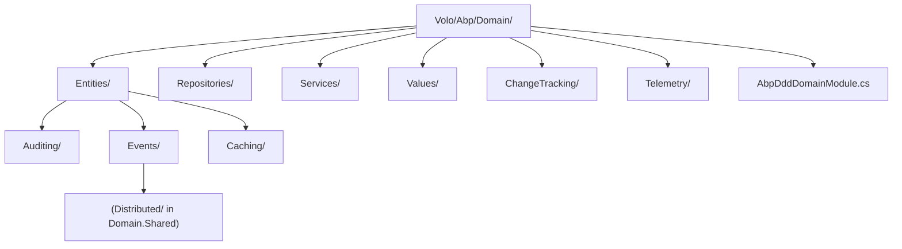

The ABP Framework concentrates the domain-layer abstractions in
`framework/src/Volo.Abp.Ddd.Domain/`. The assembly defines the entity and
aggregate-root shapes, the repository contracts and their default base classes,
the domain-service base class, the `ValueObject` primitive, and the change-tracking
interceptor. This page walks the module class, the folder layout, and the two
registrars that domain modules attach to ABP's DI pipeline. Sources are under
`framework/src/Volo.Abp.Ddd.Domain/Volo/Abp/Domain/`.

## `AbpDddDomainModule`

The module class is the only file in
`framework/src/Volo.Abp.Ddd.Domain/Volo/Abp/Domain/AbpDddDomainModule.cs`:

```csharp
[DependsOn(
    typeof(AbpAuditingModule),
    typeof(AbpDataModule),
    typeof(AbpEventBusModule),
    typeof(AbpGuidsModule),
    typeof(AbpTimingModule),
    typeof(AbpObjectMappingModule),
    typeof(AbpExceptionHandlingModule),
    typeof(AbpSpecificationsModule),
    typeof(AbpCachingModule),
    typeof(AbpDddDomainSharedModule)
    )]
public class AbpDddDomainModule : AbpModule
{
    public override void PreConfigureServices(ServiceConfigurationContext context)
    {
        context.Services.AddConventionalRegistrar(new AbpRepositoryConventionalRegistrar());
        context.Services.OnRegistered(ChangeTrackingInterceptorRegistrar.RegisterIfNeeded);
    }
}
```

Two things matter here. First, the dependency list is wide on purpose: a domain
project always needs auditing for `IAuditedObject`, `Volo.Abp.Data` for
`IDataFilter`, the event bus for domain events, GUID generation, the system
clock, object mapping (used by repositories that materialize child entities),
exception handling, specifications, and caching. Second,
`PreConfigureServices` runs before any other module's `ConfigureServices`, so the
registrars are in place before feature modules start registering their
repositories.

### `AbpRepositoryConventionalRegistrar`

`framework/src/Volo.Abp.Ddd.Domain/Volo/Abp/Domain/Repositories/AbpRepositoryConventionalRegistrar.cs`
specializes the default convention so repository *classes* are not exposed as
services by default — only their interfaces:

```csharp
public class AbpRepositoryConventionalRegistrar : DefaultConventionalRegistrar
{
    public static bool ExposeRepositoryClasses { get; set; }

    protected override bool IsConventionalRegistrationDisabled(Type type)
    {
        return !typeof(IRepository).IsAssignableFrom(type) || base.IsConventionalRegistrationDisabled(type);
    }

    protected override List<Type> GetExposedServiceTypes(Type type)
    {
        if (ExposeRepositoryClasses)
        {
            return base.GetExposedServiceTypes(type);
        }

        return base.GetExposedServiceTypes(type)
            .Where(x => x.IsInterface)
            .ToList();
    }

    protected override ServiceLifetime? GetDefaultLifeTimeOrNull(Type type)
    {
        return ServiceLifetime.Transient;
    }
}
```

Three behaviors are pinned by this class:

1. **Filter to repositories.** `IsConventionalRegistrationDisabled` short-circuits
   for any type that does not implement `IRepository`.
2. **Hide concrete classes.** `GetExposedServiceTypes` filters down to interface
   service types unless `ExposeRepositoryClasses` is flipped on (rarely needed).
3. **Transient lifetime.** Repositories are registered transient — they pull
   their `IUnitOfWorkManager`, `ICurrentTenant`, etc. from
   `IAbpLazyServiceProvider`, so transient is cheap.

### Change-tracking interceptor hook

`context.Services.OnRegistered(ChangeTrackingInterceptorRegistrar.RegisterIfNeeded)`
ensures every service registered after this module's `PreConfigureServices`
runs through
`framework/src/Volo.Abp.Ddd.Domain/Volo/Abp/Domain/ChangeTracking/ChangeTrackingInterceptorRegistrar.cs`,
which adds the `ChangeTrackingInterceptor` to types decorated with
`EnableEntityChangeTrackingAttribute` or `DisableEntityChangeTrackingAttribute`.
The change-tracking model is detailed in `ddd/change-tracking`.

## Domain folder map



Each folder owns a focused set of types:

| Folder | Contents | Detail page |
| --- | --- | --- |
| `Entities/` | `IEntity`, `Entity<TKey>`, `AggregateRoot<TKey>`, `BasicAggregateRoot<TKey>`, `EntityHelper`, `DomainEventRecord`, `ConcurrencyStampConsts`, `DisableIdGenerationAttribute`, `IGeneratesDomainEvents` | `ddd/entities-and-aggregate-roots` |
| `Entities/Auditing/` | `AuditedEntity<TKey>`, `CreationAuditedEntity<TKey>`, `FullAuditedEntity<TKey>`, plus `*WithUser` and `*AggregateRoot` variants | `ddd/entities-and-aggregate-roots`, `concerns/auditing` |
| `Entities/Events/` | `EntityChangeEventHelper`, `EntityCreatedEventData<T>`, `EntityChangedEventData<T>`, `EntityDeletedEventData<T>`, `EntityChangeEntry`, `AbpEntityChangeOptions`, `EntitySelectorList` | `events/local-event-bus` |
| `Entities/Caching/` | `EntityCacheBase<...>`, `IEntityCache<TItem,TKey>`, `EntityCacheWithObjectMapper<...>`, `EntityCacheServiceCollectionExtensions` | `caching/overview` |
| `Repositories/` | `IRepository`, `IRepository<TEntity,TKey>`, `IBasicRepository`, `IReadOnlyRepository`, `RepositoryBase<...>`, `BasicRepositoryBase<...>`, `RepositoryAsyncExtensions`, `RepositoryExtensions`, `RepositoryRegistrarBase`, `AbpRepositoryConventionalRegistrar`, `EntityChangeTrackingProvider`, `UnitOfWorkItemNames` | `ddd/repositories` |
| `Services/` | `IDomainService`, `DomainService` | `ddd/domain-services` |
| `Values/` | `ValueObject` | `ddd/value-objects` |
| `ChangeTracking/` | `ChangeTrackingHelper`, `ChangeTrackingInterceptor`, `ChangeTrackingInterceptorRegistrar`, `EntityChangeTrackingAttribute`, `EnableEntityChangeTrackingAttribute`, `DisableEntityChangeTrackingAttribute` | `ddd/change-tracking` |
| `Telemetry/` | `TelemetryDomainInfoEnricher` | this page (below) |

## Telemetry enrichment

`framework/src/Volo.Abp.Ddd.Domain/Volo/Abp/Domain/Telemetry/TelemetryDomainInfoEnricher.cs`
exposes itself as both `ITelemetryActivityEventEnricher` and
`IHasParentTelemetryActivityEventEnricher<TelemetryApplicationInfoEnricher>` so
it nests under the application enricher. Its `ExecuteAsync` counts non-abstract
`IEntity`-implementing types that are not in the `Volo.*` namespace and writes
the result to `context.Current[ActivityPropertyNames.EntityCount]`:

```csharp
var entityCount = _typeFinder.Types.Count(t =>
    typeof(IEntity).IsAssignableFrom(t) && !t.IsAbstract &&
    !t.AssemblyQualifiedName!.StartsWith(TelemetryConsts.VoloNameSpaceFilter));
context.Current[ActivityPropertyNames.EntityCount] = entityCount;
```

This is the domain layer's only telemetry contribution; richer per-entity
metrics live in the data-provider integrations.

## Domain-service conventional registration

The domain layer does *not* ship a dedicated `AbpDomainServiceConventionalRegistrar`.
Domain services are picked up through the standard convention because
`IDomainService` inherits `ITransientDependency` (see
`framework/src/Volo.Abp.Ddd.Domain/Volo/Abp/Domain/Services/IDomainService.cs`):

```csharp
public interface IDomainService : ITransientDependency
{

}
```

That single line is enough — when ABP's `DefaultConventionalRegistrar` sees a
class implementing `IDomainService`, it discovers `ITransientDependency` through
the interface chain and registers the class transient with its interface as the
exposed service.

## How a feature `MyDomainModule` looks

A typical feature-module `[Acme.Books.Domain]` class looks like:

```csharp
[DependsOn(
    typeof(AbpDddDomainModule),
    typeof(BooksDomainSharedModule)
)]
public class BooksDomainModule : AbpModule
{
    public override void ConfigureServices(ServiceConfigurationContext context)
    {
        Configure<AbpDistributedEntityEventOptions>(options =>
        {
            options.EtoMappings.Add<Book, BookEto>();
        });
    }
}
```

Pulling in `AbpDddDomainModule` automatically provides the repository registrar,
the change-tracking interceptor hook, the timing/guid services, and the
distributed-event options the module is tweaking.

## Where to go next

* `ddd/entities-and-aggregate-roots` — the deep dive into the `Entities/` folder.
* `ddd/repositories` — every type under `Repositories/` and how the registrar
  composes them.
* `ddd/change-tracking` — how the `OnRegistered` hook above gates the
  interceptor.
* `core/modularity` — the rules `[DependsOn]` follows.
* `core/dependency-injection` — how `DefaultConventionalRegistrar` discovers
  `ITransientDependency`-marked services.
