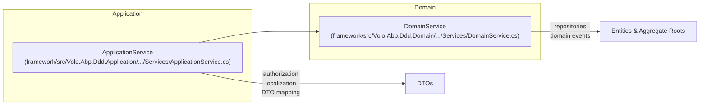

The ABP Framework treats domain services as the home for cross-aggregate
business logic that doesn't naturally belong on any single entity. The two
files involved are tiny but load-bearing:
`framework/src/Volo.Abp.Ddd.Domain/Volo/Abp/Domain/Services/IDomainService.cs`
and `framework/src/Volo.Abp.Ddd.Domain/Volo/Abp/Domain/Services/DomainService.cs`.
This page covers the marker interface, the base class's lazy services, and the
auto-registration pattern.

## What counts as a domain service

In ABP's convention, a domain service is a stateless service that:

* Coordinates work that touches more than one aggregate root.
* Encapsulates a domain rule that needs the system clock, GUID generation, or
  a current-tenant lookup — services the entity itself can't easily reach.
* Is allowed to call repositories directly (unlike an entity).
* Is consumed from application services, not from HTTP controllers directly.

When the rule fits on a single aggregate, prefer a method on the aggregate
itself; reach for `DomainService` only when the aggregate boundary would have
to be crossed.

## `IDomainService`

`framework/src/Volo.Abp.Ddd.Domain/Volo/Abp/Domain/Services/IDomainService.cs`:

```csharp
using Volo.Abp.DependencyInjection;

namespace Volo.Abp.Domain.Services;

/// <summary>
/// This interface can be implemented by all domain services to identify them by convention.
/// </summary>
public interface IDomainService : ITransientDependency
{

}
```

Two things to notice:

1. **Marker only.** There are no methods. The interface exists so the framework
   (and your own code) can identify domain services by convention.
2. **Inherits `ITransientDependency`.** That single inheritance is enough for
   the default conventional registrar to discover every concrete domain service
   and register it transient with the standard exposed-service types. There is
   no dedicated `AbpDomainServiceConventionalRegistrar`; the standard
   `DefaultConventionalRegistrar` does the work because the chain
   `MyService → IDomainService → ITransientDependency` makes the service
   qualify.

<Info>
Because domain services are transient, each call into one resolves a fresh
instance. The lazy properties on `DomainService` make this cheap — the
underlying singletons (clock, GUID generator) are resolved only when actually
used.
</Info>

## `DomainService` base class

`framework/src/Volo.Abp.Ddd.Domain/Volo/Abp/Domain/Services/DomainService.cs` is
the conventional base most domain services extend:

```csharp
public abstract class DomainService : IDomainService
{
    public IAbpLazyServiceProvider LazyServiceProvider { get; set; } = default!;

    [Obsolete("Use LazyServiceProvider instead.")]
    public IServiceProvider ServiceProvider { get; set; } = default!;

    protected IClock Clock => LazyServiceProvider.LazyGetRequiredService<IClock>();

    protected IGuidGenerator GuidGenerator
        => LazyServiceProvider.LazyGetService<IGuidGenerator>(SimpleGuidGenerator.Instance);

    protected ILoggerFactory LoggerFactory
        => LazyServiceProvider.LazyGetRequiredService<ILoggerFactory>();

    protected ICurrentTenant CurrentTenant
        => LazyServiceProvider.LazyGetRequiredService<ICurrentTenant>();

    protected IAsyncQueryableExecuter AsyncExecuter
        => LazyServiceProvider.LazyGetRequiredService<IAsyncQueryableExecuter>();

    protected ILogger Logger => LazyServiceProvider.LazyGetService<ILogger>(provider
        => LoggerFactory?.CreateLogger(GetType().FullName!) ?? NullLogger.Instance);
}
```

### Property-injected lazy provider

`LazyServiceProvider` is set by property injection rather than constructor
injection, so subclasses don't need to forward constructor arguments. This is
the same pattern used by `ApplicationService` and `BasicRepositoryBase` — see
`ddd/application-layer` and `ddd/repositories`.

### Lazy-resolved services

| Property | Service | Notes |
| --- | --- | --- |
| `Clock` | `IClock` | Time abstraction; respects `AbpClockOptions.Kind`. |
| `GuidGenerator` | `IGuidGenerator` | Falls back to `SimpleGuidGenerator.Instance` if not registered. |
| `LoggerFactory` | `ILoggerFactory` | Required. |
| `CurrentTenant` | `ICurrentTenant` | Use to write tenant-aware logic. |
| `AsyncExecuter` | `IAsyncQueryableExecuter` | Lets the service operate on `IQueryable<T>` returned by `IReadOnlyRepository<T>.GetQueryableAsync()`. |
| `Logger` | `ILogger` | Per-type logger created from `LoggerFactory`; falls back to `NullLogger.Instance`. |

### The obsolete `ServiceProvider`

The `ServiceProvider` property is kept marked `[Obsolete]` for backward
compatibility, with the explicit guidance "Use `LazyServiceProvider` instead."
New code should always use the lazy provider so unused services aren't
resolved.

## How `DomainService` and `ApplicationService` differ



`ApplicationService` adds the cross-cutting concerns suitable at the
application boundary — `IAuthorizationService`, `IFeatureChecker`,
`IDataFilter`, `IObjectMapper`, `IStringLocalizer`, `IUnitOfWorkManager` — and
implements the cross-cutting markers `IAvoidDuplicateCrossCuttingConcerns`,
`IValidationEnabled`, `IUnitOfWorkEnabled`, `IAuditingEnabled`, and
`IGlobalFeatureCheckingEnabled`. `DomainService` deliberately omits all of those
because it sits one layer below: it doesn't make authorization decisions, it
doesn't map DTOs, and it doesn't open new unit-of-work scopes.

## Writing a domain service

A minimal subclass:

```csharp
public class IssueManager : DomainService
{
    private readonly IRepository<Issue, Guid> _issueRepository;

    public IssueManager(IRepository<Issue, Guid> issueRepository)
    {
        _issueRepository = issueRepository;
    }

    public async Task<Issue> CreateAsync(string title)
    {
        if (await _issueRepository.AnyAsync(i => i.Title == title))
        {
            throw new BusinessException("Books:DuplicateTitle");
        }

        return new Issue(GuidGenerator.Create(), title, Clock.Now);
    }
}
```

Two ABP idioms in play:

1. **`GuidGenerator`** — yields sequential GUIDs when the framework is
   configured for SQL Server, breaking pathological B-tree fragmentation that
   raw `Guid.NewGuid()` causes.
2. **`Clock.Now`** — respects the `AbpClockOptions.Kind` setting so tests can
   inject a frozen clock.

The convention-based DI registers `IssueManager` automatically because
`DomainService` implements `IDomainService` which implements
`ITransientDependency`. No `[Dependency]` attribute, no `services.AddTransient<>`
call is needed.

## Why no separate registrar

ABP does not ship an `AbpDomainServiceConventionalRegistrar` because there is
nothing repository-specific to do. The standard
`DefaultConventionalRegistrar` already:

* Picks up every class that inherits an `ITransientDependency`-tagged
  interface.
* Exposes the class with the conventional service types (class itself plus its
  interfaces).
* Registers it transient.

By comparison, `AbpRepositoryConventionalRegistrar` exists specifically to
filter exposed services down to interfaces only (see `ddd/repositories`).

## Testing domain services

Because `LazyServiceProvider` is publicly settable, a unit test can supply a
fake by setting the property directly:

```csharp
var manager = new IssueManager(fakeRepo)
{
    LazyServiceProvider = fakeLazyServiceProvider
};
```

The `LazyServiceProvider` exposes `LazyGetService<T>` and `LazyGetRequiredService<T>`,
so the test fake only needs to supply the services the code under test actually
uses (typically `IClock` and `IGuidGenerator`).

## Related pages

* `ddd/application-layer` — `ApplicationService`, which often delegates rules
  to domain services.
* `ddd/repositories` — the repositories a domain service calls.
* `ddd/entities-and-aggregate-roots` — when to put logic on the entity instead.
* `core/dependency-injection` — `ITransientDependency`, `IAbpLazyServiceProvider`.
* `core/timing` — `IClock` and `AbpClockOptions`.
