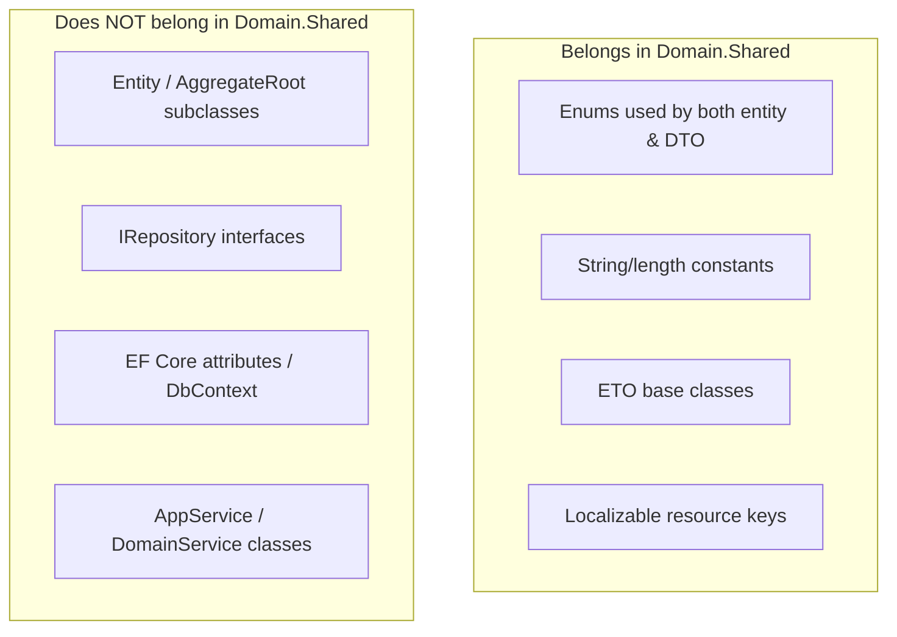

The ABP Framework places types that every layer — domain, application, contracts,
UI, and remote clients — may legitimately reference into the
`Volo.Abp.Ddd.Domain.Shared` package. This page covers what belongs there, the
module that ships with the assembly, and the distributed-event objects (ETOs) that
the package contributes to the rest of the framework. Source lives under
`framework/src/Volo.Abp.Ddd.Domain.Shared/`.

## Purpose of the Domain.Shared package

`Volo.Abp.Ddd.Domain.Shared` is deliberately the smallest of the four DDD packages.
The convention enforced across ABP modules is: a type belongs here if it must be
visible to both the domain and DTOs without dragging in EF Core, repositories, or
the unit-of-work runtime. Looking at the project file
`framework/src/Volo.Abp.Ddd.Domain.Shared/Volo.Abp.Ddd.Domain.Shared.csproj` and the
file tree under `Volo/Abp/Domain/`, the assembly currently ships only the
distributed-entity event objects plus the module class — but feature modules use
the same package to host shared enums, string constants, exception-message helpers,
and localizable resource keys.

<Info>
Types like `BookType`, `IdentityTypeNames`, or `MaxLengthConsts` in feature modules
are conventionally placed in `*.Domain.Shared` because both `*.Domain` (validating
input) and `*.Application.Contracts` (declaring DTOs) need to reference them.
</Info>

## `AbpDddDomainSharedModule`

The module class is intentionally minimal:

```csharp
[DependsOn(
    typeof(AbpMultiTenancyAbstractionsModule),
    typeof(AbpEventBusAbstractionsModule)
)]
public class AbpDddDomainSharedModule : AbpModule
{

}
```

That snippet is the entire file at
`framework/src/Volo.Abp.Ddd.Domain.Shared/Volo/Abp/Domain/AbpDddDomainSharedModule.cs`.
The two dependencies tell the story of what Domain.Shared is allowed to import:

* `AbpMultiTenancyAbstractionsModule` — supplies `IMultiTenant`,
  `MultiTenancySides`, and `IEventDataMayHaveTenantId`, which the ETOs below
  implement.
* `AbpEventBusAbstractionsModule` — supplies the `GenericEventName` attribute used
  to brand the ETO type names.

Because neither dependency drags in EF Core, change tracking, or
`Volo.Abp.Data`, modules that depend on `*.Domain.Shared` stay lightweight.

## DTO-friendly enums and constants

The package is the right home for enums shared by DTOs and entities. Although the
ABP `Volo.Abp.Ddd.Domain.Shared` assembly itself does not declare domain enums,
neighbour packages such as `Volo.Abp.Identity.Domain.Shared` follow the same
pattern. Two rules apply across the framework:

1. **Serializable shape.** Enums shared via DTOs are typically marked
   `[Serializable]` and given stable integer values so JSON contracts stay
   backward compatible.
2. **No EF Core attributes.** Anything referencing `Microsoft.EntityFrameworkCore`
   belongs in the EF Core integration package, never in Domain.Shared.

Constants follow the same shape. `ConcurrencyStampConsts` lives in the
`Volo.Abp.Ddd.Domain` assembly (see
`framework/src/Volo.Abp.Ddd.Domain/Volo/Abp/Domain/Entities/ConcurrencyStampConsts.cs`),
but feature modules routinely place length constants like
`UserConsts.MaxNameLength` in their Domain.Shared package so both the entity
configuration and the input DTO can apply them.

## `ICheckHelper` / `Check`

The `Check` helper used throughout the framework (`Check.NotNull`,
`Check.NotNullOrWhiteSpace`) is published from the core assembly and not from
`Volo.Abp.Ddd.Domain.Shared`. Domain.Shared code consumes `Check` in the same way
the rest of ABP does — for example, `EntityEto` itself does not call `Check`, but
distributed-event helpers in higher layers do. Use the core `Check` class for
guard clauses inside Domain.Shared types.

## Entity-not-found message factory

The `EntityNotFoundException` itself lives in the core (`Volo.Abp.Core`) so it can
be thrown from anywhere; its localized-message factory pulls from the
`AbpDddApplicationContractsResource` resource declared in the contracts layer
(`framework/src/Volo.Abp.Ddd.Application.Contracts/Volo/Abp/Application/Localization/Resources/AbpDdd/AbpDddApplicationContractsResource.cs`).
Domain.Shared does not own the factory directly; instead, this layering means that
when a repository throws `EntityNotFoundException<TEntity>(id)` from
`BasicRepositoryBase<TEntity,TKey>.GetAsync` (in
`framework/src/Volo.Abp.Ddd.Domain/Volo/Abp/Domain/Repositories/BasicRepositoryBase.cs`),
the message is localized using the Application.Contracts resource at the
boundary where users see errors.

## Distributed-entity ETOs

The largest piece of code that ships in `Volo.Abp.Ddd.Domain.Shared` is the family
of "Entity Transfer Objects" used by the distributed event bus. They live under
`framework/src/Volo.Abp.Ddd.Domain.Shared/Volo/Abp/Domain/Entities/Events/Distributed/`.

### `EntityEto` and `IEntityEto`

```csharp
[Serializable]
public class EntityEto : EtoBase
{
    public string EntityType { get; set; } = default!;

    public string KeysAsString { get; set; } = default!;
    ...
}

public abstract class EntityEto<TKey> : IEntityEto<TKey>
{
    public TKey Id { get; set; } = default!;
}
```

Source: `EntityEto.cs`. `EntityEto` is a generic, schema-light envelope used when
the publisher doesn't know the recipient's type; the typed `EntityEto<TKey>` is
the base class that feature modules extend with strongly-typed fields.

### Created / Updated / Deleted ETOs

The framework defines a triad — `EntityCreatedEto<TEntityEto>`,
`EntityUpdatedEto<TEntityEto>`, `EntityDeletedEto<TEntityEto>` — each tagged with
`[GenericEventName(Postfix = ".Created" | ".Updated" | ".Deleted")]` so the
distributed event bus can derive event names automatically. All three implement
`IEventDataMayHaveTenantId`:

```csharp
public virtual bool IsMultiTenant(out Guid? tenantId)
{
    if (Entity is IMultiTenant multiTenantEntity)
    {
        tenantId = multiTenantEntity.TenantId;
        return true;
    }

    tenantId = null;
    return false;
}
```

Source: `EntityCreatedEto.cs`, `EntityUpdatedEto.cs`, `EntityDeletedEto.cs`. The
flow keeps tenant identity attached to a distributed event without coupling the
domain model to the event bus.

### `AbpDistributedEntityEventOptions`

```csharp
public class AbpDistributedEntityEventOptions
{
    public IAutoEntityDistributedEventSelectorList AutoEventSelectors { get; }
    public IAutoEntityDistributedEventSelectorList IgnoredEventSelectors { get; }
    public EtoMappingDictionary EtoMappings { get; set; }
    ...
}
```

Source: `AbpDistributedEntityEventOptions.cs`. The options object is the central
configuration point for distributed entity events. Feature modules call
`Configure<AbpDistributedEntityEventOptions>(...)` in their module
`ConfigureServices` to register an auto-event selector (so a given entity raises
created/updated/deleted automatically) and to map the entity type to its ETO
type via `EtoMappings.Add<TEntity, TEntityEto>()`.

### `EtoMappingDictionary`

```csharp
public class EtoMappingDictionary : Dictionary<Type, EtoMappingDictionaryItem>
{
    public void Add<TEntity, TEntityEto>(Type? objectMappingContextType = null)
    {
        this[typeof(TEntity)] = new EtoMappingDictionaryItem(typeof(TEntityEto), objectMappingContextType);
    }
}
```

Source: `EtoMappingDictionary.cs`. Used in tandem with
`IEntityToEtoMapper` (also in the same folder) so the auto-publisher knows how to
translate `Book` → `BookEto` before publishing.

## Mental model of what belongs in Domain.Shared



The rules above are documented through the dependency graph: `*.Application.Contracts`
depends on `*.Domain.Shared`, but `*.Domain.Shared` may not depend on
`*.Domain`.

## Cross-references

* `ddd/domain-layer` — what depends on Domain.Shared from the domain side.
* `ddd/application-contracts` — DTOs that reuse Domain.Shared enums.
* `events/distributed-event-bus` — how `EntityCreatedEto<>` is published.
* `tenancy/abstractions` — `IMultiTenant`, used by every ETO above.
