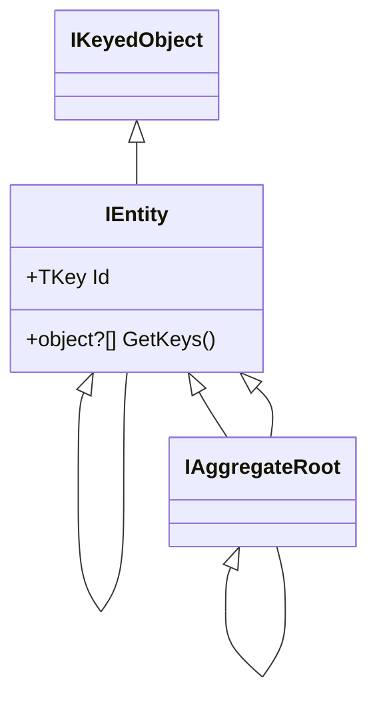
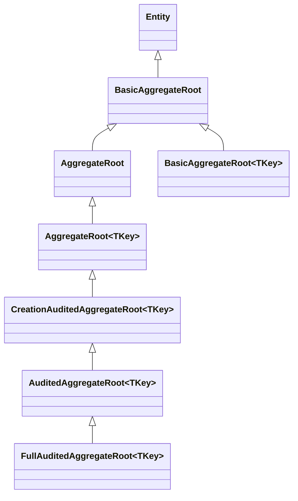

The ABP Framework's entity model lives in
`framework/src/Volo.Abp.Ddd.Domain/Volo/Abp/Domain/Entities/`. It defines the
minimal marker interfaces (`IEntity`, `IEntity<TKey>`, `IAggregateRoot`), the
concrete base classes (`Entity`, `Entity<TKey>`, `BasicAggregateRoot<TKey>`,
`AggregateRoot<TKey>`), a domain-event recording mechanism, a static
`EntityHelper`, and several auditing variants. This page covers each of these
along with the related caching base classes and the `Auditing/` and `Events/`
sub-folders.

## The interface ladder



`IEntity` and `IEntity<TKey>` are defined in
`framework/src/Volo.Abp.Ddd.Domain/Volo/Abp/Domain/Entities/IEntity.cs`:

```csharp
public interface IEntity : IKeyedObject
{
    object?[] GetKeys();
}

public interface IEntity<TKey> : IEntity
{
    TKey Id { get; }
}
```

`IKeyedObject` (defined in the ABP core) gives every entity a `GetObjectKey()`
string, which lets composite-key entities serialize their identity into one
slot for caches and audit logs. `IAggregateRoot` and `IAggregateRoot<TKey>` are
empty marker interfaces in
`framework/src/Volo.Abp.Ddd.Domain/Volo/Abp/Domain/Entities/IAggregateRoot.cs`;
their only job is to flag the boundary of a consistency cluster so the default
repository registrar can decide whether to auto-generate a repository for the
type (see `RepositoryRegistrarBase.ShouldRegisterDefaultRepositoryFor` in
`framework/src/Volo.Abp.Ddd.Domain/Volo/Abp/Domain/Repositories/RepositoryRegistrarBase.cs`).

## `Entity` and `Entity<TKey>`

`framework/src/Volo.Abp.Ddd.Domain/Volo/Abp/Domain/Entities/Entity.cs` provides the
default base class:

```csharp
[Serializable]
public abstract class Entity : IEntity
{
    protected Entity()
    {
        EntityHelper.TrySetTenantId(this);
    }

    public virtual string? GetObjectKey() { ... }

    public abstract object?[] GetKeys();

    public bool EntityEquals(IEntity other)
        => EntityHelper.EntityEquals(this, other);
}

[Serializable]
public abstract class Entity<TKey> : Entity, IEntity<TKey>
{
    public virtual TKey Id { get; protected set; } = default!;

    protected Entity(TKey id) { Id = id; }

    public override object?[] GetKeys() => [Id];
}
```

Three behaviors are worth noting:

* **Tenant-id seeding.** `Entity()` calls `EntityHelper.TrySetTenantId(this)`,
  so any `Entity` subtype that also implements `IMultiTenant` has its `TenantId`
  set from `ICurrentTenant.Id` at construction.
* **Composite-key encoding.** `GetObjectKey()` uses `KeyedObjectHelper.EncodeCompositeKey`
  when `GetKeys()` returns more than one value, giving composite-key entities a
  single string identity.
* **Equality through `EntityHelper`.** Both `EntityEquals` and the value-object
  semantics route through the static `EntityHelper`, so equality semantics live
  in one place.

## `EntityHelper`

`framework/src/Volo.Abp.Ddd.Domain/Volo/Abp/Domain/Entities/EntityHelper.cs` is a
heavily used static utility. The most important methods:

* `IsMultiTenant<TEntity>()` / `IsMultiTenant(Type)` — `typeof(IMultiTenant).IsAssignableFrom(type)`.
  Repositories and data filters use this to gate tenant filtering.
* `EntityEquals(IEntity, IEntity)` — the framework's canonical entity equality.
  Two entities are equal if they are the same instance; or share an inheritance
  chain, have matching `TenantId` (when `IMultiTenant`), have matching keys,
  and at least one is not transient. Transient entities (entities with default
  keys) are never equal to anything except themselves by reference.
* `IsValueObject(Type)` — uses the public `IsValueObjectPredicate` so callers
  can override the rule.
* `HasDefaultKeys(IEntity)` and `HasDefaultId<TKey>(IEntity<TKey>)` — used to
  detect transient entities. Special-cases `int <= 0` and `long <= 0` because
  EF Core seeds those to `int.MinValue` while attaching.
* `FindPrimaryKeyType(Type)` — reflects over the type's interfaces to find
  `IEntity<TKey>`; used by `RepositoryRegistrarBase.GetDefaultRepositoryImplementationType`
  to pick the right default repository.
* `CreateEqualityExpressionForId<TEntity, TKey>(TKey id)` — builds the
  `e => e.Id == id` predicate used by generic key-based lookups.
* `TrySetTenantId(object)` / `TrySetId(...)` — reflective writers that respect
  the protected setters on entity properties.

## Concurrency stamps

`framework/src/Volo.Abp.Ddd.Domain/Volo/Abp/Domain/Entities/ConcurrencyStampConsts.cs`:

```csharp
public static class ConcurrencyStampConsts
{
    public const int MaxLength = 40;
}
```

`IHasConcurrencyStamp` lives in `Volo.Abp.Data`. `AggregateRoot` implements it
and initializes the stamp in the constructor.

## `BasicAggregateRoot` — the domain-event queue

`framework/src/Volo.Abp.Ddd.Domain/Volo/Abp/Domain/Entities/BasicAggregateRoot.cs`
extends `Entity` and adds two private collections for local and distributed
events:

```csharp
public abstract class BasicAggregateRoot : Entity, IAggregateRoot, IGeneratesDomainEvents
{
    private ICollection<DomainEventRecord>? _distributedEvents;
    private ICollection<DomainEventRecord>? _localEvents;

    protected virtual void AddLocalEvent(object eventData)
    {
        _localEvents ??= new Collection<DomainEventRecord>();
        _localEvents.Add(new DomainEventRecord(eventData, EventOrderGenerator.GetNext()));
    }

    protected virtual void AddDistributedEvent(object eventData) { ... }

    public virtual IEnumerable<DomainEventRecord> GetLocalEvents()
        => _localEvents ?? Array.Empty<DomainEventRecord>();

    public virtual IEnumerable<DomainEventRecord> GetDistributedEvents()
        => _distributedEvents ?? Array.Empty<DomainEventRecord>();

    public virtual void ClearLocalEvents() => _localEvents?.Clear();
    public virtual void ClearDistributedEvents() => _distributedEvents?.Clear();
}
```

`IGeneratesDomainEvents` (in `IGeneratesDomainEvents.cs`) and `DomainEventRecord`
(in `DomainEventRecord.cs`) are the contracts the data provider drains when a
`SaveChanges` runs — `EntityChangeEventHelper` (under `Entities/Events/`)
publishes the recorded events through the local and distributed event buses
*after* the UoW completes.

`EventOrderGenerator` (in `framework/src/Volo.Abp.Uow/Volo/Abp/Uow/EventOrderGenerator.cs`)
gives each recorded event a monotonically increasing `long` so the bus can
preserve publication order across multiple aggregates.

## `AggregateRoot` — concurrency stamp and extra properties

`framework/src/Volo.Abp.Ddd.Domain/Volo/Abp/Domain/Entities/AggregateRoot.cs`
layers on `IHasExtraProperties` and `IHasConcurrencyStamp`:

```csharp
public abstract class AggregateRoot : BasicAggregateRoot,
    IHasExtraProperties,
    IHasConcurrencyStamp
{
    public virtual ExtraPropertyDictionary ExtraProperties { get; protected set; }

    [DisableAuditing]
    public virtual string ConcurrencyStamp { get; set; }

    protected AggregateRoot()
    {
        ConcurrencyStamp = Guid.NewGuid().ToString("N");
        ExtraProperties = new ExtraPropertyDictionary();
        this.SetDefaultsForExtraProperties();
    }

    public virtual IEnumerable<ValidationResult> Validate(ValidationContext validationContext)
        => ExtensibleObjectValidator.GetValidationErrors(this, validationContext);
}
```

The `[DisableAuditing]` attribute on `ConcurrencyStamp` keeps the stamp out of
audit-log change diffs. `ExtraProperties` plus `SetDefaultsForExtraProperties()`
are the runtime side of `concerns/object-extending`.

## The aggregate hierarchy



Pick the lowest base class that gives you the auditing properties you need.

## Auditing variants

The folder `framework/src/Volo.Abp.Ddd.Domain/Volo/Abp/Domain/Entities/Auditing/`
contains layered auditing bases:

| File | Implements | Adds |
| --- | --- | --- |
| `CreationAuditedEntity.cs` | `ICreationAuditedObject` | `CreationTime`, `CreatorId` |
| `AuditedEntity.cs` | `IAuditedObject` | `LastModificationTime`, `LastModifierId` |
| `FullAuditedEntity.cs` | `IFullAuditedObject` | `IsDeleted`, `DeleterId`, `DeletionTime` |
| `*WithUser.cs` | also navigates to `IUser` | a `Creator`/`LastModifier`/`Deleter` navigation property |
| `*AggregateRoot.cs` | inherits from `AggregateRoot<TKey>` | same auditing properties on an aggregate root |

The auditing interfaces themselves live in `Volo.Abp.Auditing`; ABP's auditing
interceptor reads them through `IAuditPropertySetter`, so an entity opts into
each behavior simply by inheriting from one of these classes. `FullAuditedEntity`
implements `ISoftDelete` via `IFullAuditedObject`, which is how repositories
filter out soft-deleted rows: `RepositoryBase.ApplyDataFilters` checks
`typeof(ISoftDelete).IsAssignableFrom(typeof(TOtherEntity))` and applies the
soft-delete filter when `IDataFilter.IsEnabled<ISoftDelete>()` is true.

## Domain-event helpers

The `Entities/Events/` folder contains the runtime that ferries
`DomainEventRecord` instances into the event bus. Key types:

* `EntityChangeEventHelper` and `IEntityChangeEventHelper` — publish
  created/changed/deleted events. The data-provider integrations (EF Core /
  MongoDB) call this from their save pipelines.
* `EntityCreatedEventData<T>`, `EntityUpdatedEventData<T>`, `EntityDeletedEventData<T>`
  — the strongly-typed local-bus events; the distributed-bus counterparts live
  in `Volo.Abp.Ddd.Domain.Shared` (see `ddd/domain-shared`).
* `EntitySelectorList` and `EntitySelectorListExtensions` — let the auto-event
  options select which entities raise events automatically.
* `DomainEventEntry` — the recorded event bundle the publisher consumes.
* `AbpEntityChangeOptions` — feature flags for tracking entity changes.

## Entity cache helpers

`framework/src/Volo.Abp.Ddd.Domain/Volo/Abp/Domain/Entities/Caching/` provides a
small framework for caching aggregates by id:

```csharp
public interface IEntityCache<TEntityCacheItem, TKey>
    where TEntityCacheItem : class
    where TKey : notnull
{
    Task<TEntityCacheItem?> FindAsync(TKey id);
    Task<TEntityCacheItem> GetAsync(TKey id);
    Task<List<TEntityCacheItem?>> FindManyAsync(IEnumerable<TKey> ids);
    ...
}
```

`EntityCacheBase` is the abstract base class; `EntityCacheWithObjectMapper`
maps from an `IEntity<TKey>` to a cache-friendly item using `IObjectMapper`;
`EntityCacheServiceCollectionExtensions` exposes
`AddEntityCache<TEntity, TItem, TKey>(...)` for registration. See
`caching/overview` for the in-memory and distributed cache wiring.

## Other entity-level attributes

* `DisableIdGenerationAttribute` (in
  `framework/src/Volo.Abp.Ddd.Domain/Volo/Abp/Domain/Entities/DisableIdGenerationAttribute.cs`)
  is a marker attribute repositories can check before calling
  `IGuidGenerator.Create()` on insertion. Used by data-provider integrations
  to honor caller-assigned ids.

## Conventional usage patterns

1. **Use `Entity<Guid>` for child entities** that do not raise domain events.
2. **Use `BasicAggregateRoot<TKey>`** when you want the domain-event queue but
   not extra properties or a concurrency stamp.
3. **Use `AggregateRoot<TKey>`** for the typical case — extensibility,
   optimistic concurrency, and event recording all in one base.
4. **Use `FullAuditedAggregateRoot<TKey>`** for aggregates that must support soft
   delete and full auditing. Repositories then automatically filter
   `IsDeleted = false` thanks to `RepositoryBase.ApplyDataFilters`.

## Related pages

* `ddd/repositories` — how `IRepository<TEntity,TKey>` consumes these types.
* `ddd/change-tracking` — the interceptor that gates repository tracking.
* `ddd/domain-shared` — the distributed-event ETOs that wrap entities for the
  remote bus.
* `concerns/auditing` — the auditing interfaces these classes implement.
* `tenancy/abstractions` — `IMultiTenant` and the tenant-id semantics
  `EntityHelper` enforces.
