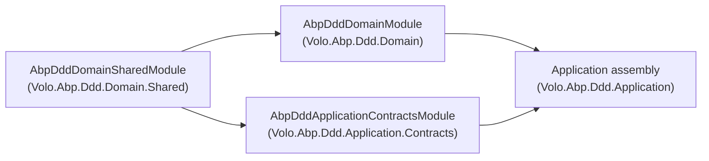

The ABP Framework ships an opinionated Domain-Driven Design (DDD) toolkit that maps
the classic four-layer module template into four NuGet packages under
`framework/src/`: `Volo.Abp.Ddd.Domain.Shared/`, `Volo.Abp.Ddd.Domain/`,
`Volo.Abp.Ddd.Application.Contracts/`, and `Volo.Abp.Ddd.Application/`. Each package
exposes a module class — `AbpDddDomainSharedModule`, `AbpDddDomainModule`,
`AbpDddApplicationContractsModule`, and the application module — that declares
inter-layer dependencies so a feature module can depend on exactly the layer it
needs. This page walks the layer map, names the canonical base types and the module
wiring, and points at the per-page deep dives that follow.

## What "DDD building blocks" means in ABP Framework

For ABP Framework, DDD is realized as a small set of marker interfaces and
abstract base classes — not a rigid framework. `IEntity` and `IAggregateRoot` in
`framework/src/Volo.Abp.Ddd.Domain/Volo/Abp/Domain/Entities/IEntity.cs` and
`IAggregateRoot.cs` identify domain objects; `IRepository<TEntity>` in
`framework/src/Volo.Abp.Ddd.Domain/Volo/Abp/Domain/Repositories/IRepository.cs`
identifies persistence boundaries; `IDomainService` in
`framework/src/Volo.Abp.Ddd.Domain/Volo/Abp/Domain/Services/IDomainService.cs` and
`IApplicationService` in
`framework/src/Volo.Abp.Ddd.Application.Contracts/Volo/Abp/Application/Services/IApplicationService.cs`
identify behavior boundaries. Concrete pieces such as `Entity<TKey>`,
`AggregateRoot<TKey>`, `RepositoryBase<TEntity,TKey>`, `DomainService`,
`ApplicationService`, and `CrudAppService<...>` give a working baseline that a module
extends only where its domain logic actually deviates from the default.

<Info>
The DDD packages are abstractions: `Volo.Abp.Ddd.Domain.Shared` and
`Volo.Abp.Ddd.Domain` describe *what* the domain looks like, while data-provider
packages such as `Volo.Abp.EntityFrameworkCore` and `Volo.Abp.MongoDB` supply the
repository implementations the abstractions expose.
</Info>

## The four layers

The layout below is enforced by `AbpDddDomainModule` (in
`framework/src/Volo.Abp.Ddd.Domain/Volo/Abp/Domain/AbpDddDomainModule.cs`) declaring
`[DependsOn(typeof(AbpDddDomainSharedModule))]` and by
`AbpDddApplicationContractsModule` (in
`framework/src/Volo.Abp.Ddd.Application.Contracts/Volo/Abp/Application/AbpDddApplicationContractsModule.cs`)
sitting above contracts only. Each project's `.csproj` references reinforce the
direction.

### Domain.Shared

`Volo.Abp.Ddd.Domain.Shared` holds types that are safe to ship to every layer,
including UI and remote clients. It contains constants, enums, and exception-message
factories — nothing that would force a transitive dependency on EF Core, a repository
implementation, or a unit-of-work runtime. Its module class
`framework/src/Volo.Abp.Ddd.Domain.Shared/Volo/Abp/Domain/AbpDddDomainSharedModule.cs`
depends only on `AbpMultiTenancyAbstractionsModule` and
`AbpEventBusAbstractionsModule`, which keeps the assembly lightweight enough for
shared DTOs and clients. The package also hosts the distributed-event ETO base
classes under
`framework/src/Volo.Abp.Ddd.Domain.Shared/Volo/Abp/Domain/Entities/Events/Distributed/`,
notably `EntityEto`, `EntityCreatedEto`, `EntityUpdatedEto`, and
`EntityDeletedEto`.

### Domain

`Volo.Abp.Ddd.Domain` owns the domain model itself. The folder
`framework/src/Volo.Abp.Ddd.Domain/Volo/Abp/Domain/` is organized as
`Entities/`, `Repositories/`, `Services/`, `Values/`, `ChangeTracking/`, and
`Telemetry/`. `AbpDddDomainModule` pulls in cross-cutting modules — `AbpAuditingModule`,
`AbpDataModule`, `AbpEventBusModule`, `AbpGuidsModule`, `AbpTimingModule`,
`AbpObjectMappingModule`, `AbpExceptionHandlingModule`, `AbpSpecificationsModule`,
and `AbpCachingModule` — and, in `PreConfigureServices`, registers
`AbpRepositoryConventionalRegistrar` and hooks
`ChangeTrackingInterceptorRegistrar.RegisterIfNeeded` into the DI registration
pipeline so repositories are wired by convention.

### Application.Contracts

`Volo.Abp.Ddd.Application.Contracts` is the *interface* layer that clients depend
on. It exposes `IApplicationService` (the marker that auto-API discovery uses),
the `ICrudAppService<...>` family, and the DTO base classes under
`framework/src/Volo.Abp.Ddd.Application.Contracts/Volo/Abp/Application/Dtos/`, such
as `EntityDto<TKey>`, `AuditedEntityDto<TKey>`, `FullAuditedEntityDto<TKey>`,
`ListResultDto<T>`, `PagedResultDto<T>`, `PagedAndSortedResultRequestDto`, and the
`Extensible*` variants. Its module
`framework/src/Volo.Abp.Ddd.Application.Contracts/Volo/Abp/Application/AbpDddApplicationContractsModule.cs`
also registers the `AbpDddApplicationContractsResource` localization resource and
the embedded virtual files under
`Volo/Abp/Application/Localization/Resources/AbpDdd`.

### Application

`Volo.Abp.Ddd.Application` supplies the implementation baseline:
`ApplicationService` in
`framework/src/Volo.Abp.Ddd.Application/Volo/Abp/Application/Services/ApplicationService.cs`
and the CRUD ladder
`AbstractKeyReadOnlyAppService` → `AbstractKeyCrudAppService` → `ReadOnlyAppService`
→ `CrudAppService`. Application services consume domain repositories and domain
services, and they map between entities and the DTOs declared in the contracts
layer.

## Module dependency map

Source for the edges: each module's `[DependsOn(...)]` attribute and the
`<ProjectReference>` entries in `Volo.Abp.Ddd.Domain.csproj`,
`Volo.Abp.Ddd.Application.Contracts.csproj`, and
`Volo.Abp.Ddd.Application.csproj`.

## Typical feature module wiring

A feature module ("Books", "Orders", etc.) usually follows the same layout. The
sequence below mirrors the dependencies a module dotted along the edges of the
diagram.

```mermaid
sequenceDiagram
    participant Client
    participant AppService as MyAppService\n(: ApplicationService)
    participant Repo as IRepository<MyEntity,Guid>\n(default impl)
    participant Domain as MyDomainService\n(: DomainService)
    participant Db as EF Core / MongoDB

    Client->>AppService: CreateAsync(input)
    AppService->>AppService: ObjectMapper.Map<input,Entity>
    AppService->>Domain: BusinessRuleAsync(entity)
    Domain-->>AppService: validated entity
    AppService->>Repo: InsertAsync(entity, autoSave: true)
    Repo->>Db: SaveChanges via UoW
    AppService-->>Client: MyDto (MapToGetOutputDto)
```

The `ApplicationService` base class pulls `IUnitOfWorkManager`, `IObjectMapper`,
`IGuidGenerator`, `ICurrentTenant`, and other services from
`IAbpLazyServiceProvider`, so feature code rarely injects them by constructor.

## Where each topic lives

| Concern | Page |
| --- | --- |
| Constants, enums, ETO DTOs | `ddd/domain-shared` |
| `AbpDddDomainModule`, registrars | `ddd/domain-layer` |
| `IEntity`, `Entity<TKey>`, `AggregateRoot<TKey>` | `ddd/entities-and-aggregate-roots` |
| `IRepository<TEntity,TKey>`, `RepositoryBase`, `RepositoryRegistrarBase` | `ddd/repositories` |
| `IDomainService`, `DomainService` | `ddd/domain-services` |
| `ValueObject` semantics | `ddd/value-objects` |
| `EntityChangeTrackingProvider`, interceptor | `ddd/change-tracking` |
| `ApplicationService`, `CrudAppService<...>` | `ddd/application-layer` |
| DTOs, `IApplicationService`, `IRemoteService` | `ddd/application-contracts` |
| `IUnitOfWork`, `IUnitOfWorkManager`, attribute, interceptor | `ddd/unit-of-work` |

## How the layers cooperate at runtime

`AbpDddDomainModule.PreConfigureServices` adds the
`AbpRepositoryConventionalRegistrar` and wires
`ChangeTrackingInterceptorRegistrar.RegisterIfNeeded` (see
`framework/src/Volo.Abp.Ddd.Domain/Volo/Abp/Domain/AbpDddDomainModule.cs`). The
unit-of-work runtime is separate — it lives in `framework/src/Volo.Abp.Uow/Volo/Abp/Uow/`
and is consumed by domain repositories (`BasicRepositoryBase` resolves
`IUnitOfWorkManager` through its lazy service provider) and by application
services (`ApplicationService.CurrentUnitOfWork`). When an HTTP request runs an
application-service method, the `UnitOfWorkInterceptor` opens or joins the UoW;
the repository calls flow through the same `IUnitOfWork` instance; and the
distributed-event ETOs from `Volo.Abp.Ddd.Domain.Shared` are queued through
`IUnitOfWorkEventPublisher` so they only publish after a successful
`CompleteAsync`.

<Tip>
When you build a feature module, the conventional layout is `Acme.MyApp.Domain.Shared`
→ `Acme.MyApp.Domain` → `Acme.MyApp.Application.Contracts` → `Acme.MyApp.Application`.
The ABP `Volo.*.Ddd.*` projects exist to give each of those layers a default base
class to inherit from.
</Tip>

## Related docs

* `core/modularity` — how `[DependsOn]` resolves module load order.
* `concerns/auditing` — the auditing interfaces that `AuditedEntity` and
  `AuditedEntityDto` implement.
* `data/overview` — how `Volo.Abp.Data` plugs into repositories.
* `tenancy/overview` — `IMultiTenant`, used by `EntityHelper.IsMultiTenant`.
