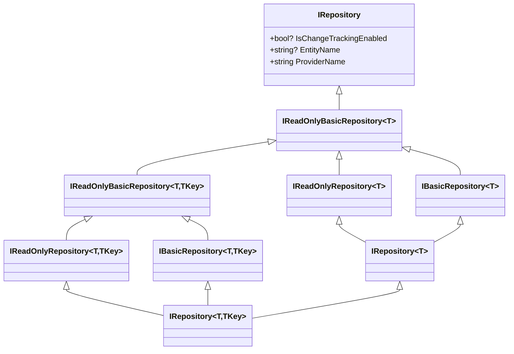
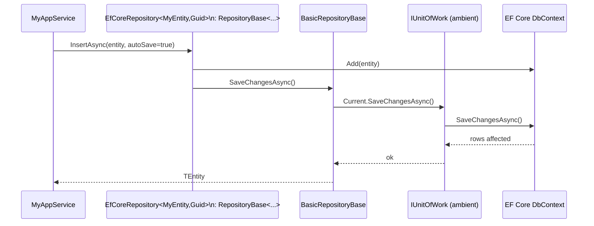

The ABP Framework's repository abstractions live in
`framework/src/Volo.Abp.Ddd.Domain/Volo/Abp/Domain/Repositories/`. They define a
provider-neutral surface for persistence: marker interfaces, paged/sorted reads,
explicit collection loading, soft-delete filtering, and an async-LINQ extension
set. Data-provider integrations (EF Core, MongoDB, Dapper, in-memory) supply the
concrete implementations. This page walks the inheritance chain, the
`RepositoryBase` runtime, the conventional registrar, and the change-tracking
hook.

## Inheritance map



## `IRepository` — the root

`framework/src/Volo.Abp.Ddd.Domain/Volo/Abp/Domain/Repositories/IRepository.cs`:

```csharp
public interface IRepository
{
    bool? IsChangeTrackingEnabled { get; }
    string? EntityName { get; set; }
    string ProviderName { get; }
}
```

`IsChangeTrackingEnabled` lets a repository opt out of EF Core change tracking
for read-heavy work; `EntityName` lets callers tag a repository for telemetry
(useful when one entity has multiple repositories); `ProviderName` is set by
each data-provider integration (`"EntityFrameworkCore"`, `"MongoDB"`, etc.).

## Read-only contracts

`framework/src/Volo.Abp.Ddd.Domain/Volo/Abp/Domain/Repositories/IReadOnlyBasicRepository.cs`
defines the minimum read surface:

```csharp
public interface IReadOnlyBasicRepository<TEntity> : IRepository
    where TEntity : class, IEntity
{
    Task<List<TEntity>> GetListAsync(bool includeDetails = false, CancellationToken cancellationToken = default);
    Task<long> GetCountAsync(CancellationToken cancellationToken = default);
    Task<List<TEntity>> GetPagedListAsync(int skipCount, int maxResultCount, string sorting,
        bool includeDetails = false, CancellationToken cancellationToken = default);
}

public interface IReadOnlyBasicRepository<TEntity, TKey> : IReadOnlyBasicRepository<TEntity>
    where TEntity : class, IEntity<TKey>
{
    [NotNull] Task<TEntity> GetAsync(TKey id, bool includeDetails = true, CancellationToken cancellationToken = default);
    Task<TEntity?> FindAsync(TKey id, bool includeDetails = true, CancellationToken cancellationToken = default);
}
```

`framework/src/Volo.Abp.Ddd.Domain/Volo/Abp/Domain/Repositories/IReadOnlyRepository.cs`
adds `IQueryable<TEntity>` access for callers willing to write LINQ:

```csharp
public interface IReadOnlyRepository<TEntity> : IReadOnlyBasicRepository<TEntity>
    where TEntity : class, IEntity
{
    IAsyncQueryableExecuter AsyncExecuter { get; }
    Task<IQueryable<TEntity>> WithDetailsAsync();
    Task<IQueryable<TEntity>> WithDetailsAsync(params Expression<Func<TEntity, object>>[] propertySelectors);
    Task<IQueryable<TEntity>> GetQueryableAsync();
    Task<List<TEntity>> GetListAsync(Expression<Func<TEntity, bool>> predicate,
        bool includeDetails = false, CancellationToken cancellationToken = default);
}
```

`IAsyncQueryableExecuter` is the abstraction over EF Core's
`EntityFrameworkQueryableExtensions` so non-EF providers can supply their own
async LINQ implementations.

## Write contracts

`framework/src/Volo.Abp.Ddd.Domain/Volo/Abp/Domain/Repositories/IBasicRepository.cs`
defines `InsertAsync`, `InsertManyAsync`, `UpdateAsync`, `UpdateManyAsync`,
`DeleteAsync`, and `DeleteManyAsync` — each with an `autoSave` flag:

> *Set true to automatically save changes to database. This is useful for ORMs /
> database APIs those only save changes with an explicit method call, but you
> need to immediately save changes to the database.*

`IRepository<TEntity>` adds predicate-based reads/deletes that throw the
ABP-standard exceptions:

```csharp
Task<TEntity?> FindAsync(Expression<Func<TEntity, bool>> predicate,
    bool includeDetails = true, CancellationToken cancellationToken = default);

Task<TEntity> GetAsync(Expression<Func<TEntity, bool>> predicate,
    bool includeDetails = true, CancellationToken cancellationToken = default);

Task DeleteAsync(Expression<Func<TEntity, bool>> predicate,
    bool autoSave = false, CancellationToken cancellationToken = default);

Task DeleteDirectAsync(Expression<Func<TEntity, bool>> predicate,
    CancellationToken cancellationToken = default);
```

`DeleteDirectAsync` skips soft-delete, audit logging, and multi-tenancy
filtering — the XML doc warns "use this method carefully when you need it."

## Explicit loading

`framework/src/Volo.Abp.Ddd.Domain/Volo/Abp/Domain/Repositories/ISupportsExplicitLoading.cs`
gives data providers an opt-in hook for lazy-loading navigation properties:

```csharp
public interface ISupportsExplicitLoading<TEntity>
    where TEntity : class, IEntity
{
    Task EnsureCollectionLoadedAsync<TProperty>(TEntity entity,
        Expression<Func<TEntity, IEnumerable<TProperty>>> propertyExpression,
        CancellationToken cancellationToken) where TProperty : class;

    Task EnsurePropertyLoadedAsync<TProperty>(TEntity entity,
        Expression<Func<TEntity, TProperty?>> propertyExpression,
        CancellationToken cancellationToken) where TProperty : class;
}
```

`RepositoryExtensions.EnsureCollectionLoadedAsync` and
`EnsurePropertyLoadedAsync` (in
`framework/src/Volo.Abp.Ddd.Domain/Volo/Abp/Domain/Repositories/RepositoryExtensions.cs`)
use `ProxyHelper.UnProxy(repository) as ISupportsExplicitLoading<TEntity>` to
forward the call when the underlying repository supports it.

## `BasicRepositoryBase<TEntity, TKey>`

`framework/src/Volo.Abp.Ddd.Domain/Volo/Abp/Domain/Repositories/BasicRepositoryBase.cs`
is the abstract base every data-provider integration extends. It implements
`IServiceProviderAccessor` and `IUnitOfWorkEnabled`, exposes a lazy service
provider, and provides shared properties:

```csharp
public IDataFilter DataFilter => LazyServiceProvider.LazyGetRequiredService<IDataFilter>();
public ICurrentTenant CurrentTenant => LazyServiceProvider.LazyGetRequiredService<ICurrentTenant>();
public IAsyncQueryableExecuter AsyncExecuter => LazyServiceProvider.LazyGetRequiredService<IAsyncQueryableExecuter>();
public IUnitOfWorkManager UnitOfWorkManager => LazyServiceProvider.LazyGetRequiredService<IUnitOfWorkManager>();
public IEntityChangeTrackingProvider EntityChangeTrackingProvider
    => LazyServiceProvider.LazyGetRequiredService<IEntityChangeTrackingProvider>();
public bool? IsChangeTrackingEnabled { get; protected set; }
public string? EntityName { get; set; }
public string ProviderName { get; }
```

The lazy service provider keeps repositories cheap to construct — none of the
listed services are resolved until the repository actually uses them.

### Auto-save through the UoW

`BasicRepositoryBase.SaveChangesAsync` routes to the ambient unit of work:

```csharp
protected virtual Task SaveChangesAsync(CancellationToken cancellationToken)
{
    if (UnitOfWorkManager?.Current != null)
    {
        return UnitOfWorkManager.Current.SaveChangesAsync(cancellationToken);
    }

    return Task.CompletedTask;
}
```

Every `*ManyAsync(..., autoSave: true, ...)` method ends with a call to
`SaveChangesAsync`, so passing `autoSave: true` in a multi-step business
transaction simply forces the UoW to flush — it does not commit it.

### `ShouldTrackingEntityChange`

`BasicRepositoryBase.ShouldTrackingEntityChange()` is the policy that decides
whether an EF Core query tracks entities. The priority order is:

1. `IsChangeTrackingEnabled` on the repository instance (set via interface
   markers like `IReadOnlyRepository`).
2. `EntityChangeTrackingProvider.Enabled` — value set by
   `EnableEntityChangeTrackingAttribute` / `DisableEntityChangeTrackingAttribute`
   through the interceptor.
3. Otherwise track.

See `ddd/change-tracking` for the interceptor side.

## `RepositoryBase<TEntity, TKey>`

`framework/src/Volo.Abp.Ddd.Domain/Volo/Abp/Domain/Repositories/RepositoryBase.cs`
extends `BasicRepositoryBase<TEntity>` and implements
`IRepository<TEntity>` plus `IUnitOfWorkManagerAccessor`. Its
`ApplyDataFilters<TQueryable>` is the canonical place for soft-delete and
multi-tenancy filtering:

```csharp
protected virtual TQueryable ApplyDataFilters<TQueryable, TOtherEntity>(TQueryable query)
    where TQueryable : IQueryable<TOtherEntity>
{
    if (typeof(ISoftDelete).IsAssignableFrom(typeof(TOtherEntity)))
    {
        query = (TQueryable)query.WhereIf(DataFilter.IsEnabled<ISoftDelete>(),
            e => ((ISoftDelete)e!).IsDeleted == false);
    }

    if (typeof(IMultiTenant).IsAssignableFrom(typeof(TOtherEntity)))
    {
        var tenantId = CurrentTenant.Id;
        query = (TQueryable)query.WhereIf(DataFilter.IsEnabled<IMultiTenant>(),
            e => ((IMultiTenant)e!).TenantId == tenantId);
    }

    return query;
}
```

Both filters are gated by `IDataFilter.IsEnabled<T>()`, so calling
`DataFilter.Disable<ISoftDelete>()` for a scope lets a feature-module method
read soft-deleted rows on purpose.

`RepositoryBase<TEntity>.GetAsync(predicate, ...)` throws
`EntityNotFoundException<TEntity>()` when `FindAsync` returns `null`; the keyed
overload `BasicRepositoryBase<TEntity, TKey>.GetAsync(TKey id, ...)` throws
`EntityNotFoundException<TEntity>(id)`.

## Async LINQ extensions

`framework/src/Volo.Abp.Ddd.Domain/Volo/Abp/Domain/Repositories/RepositoryAsyncExtensions.cs`
adds `ContainsAsync`, `AnyAsync`, `AllAsync`, `CountAsync`/`LongCountAsync`,
`FirstAsync`/`FirstOrDefaultAsync`, `LastAsync`/`LastOrDefaultAsync`,
`SingleAsync`/`SingleOrDefaultAsync`, `MinAsync`, `MaxAsync`, `SumAsync`,
`AverageAsync`, and `ToListAsync` directly on `IReadOnlyRepository<T>`:

```csharp
public async static Task<bool> AnyAsync<T>(
    [NotNull] this IReadOnlyRepository<T> repository,
    [NotNull] Expression<Func<T, bool>> predicate,
    CancellationToken cancellationToken = default)
    where T : class, IEntity
{
    var queryable = await repository.GetQueryableAsync();
    return await repository.AsyncExecuter.AnyAsync(queryable, predicate, cancellationToken);
}
```

Each method materializes the queryable via `GetQueryableAsync()` and then calls
through `AsyncExecuter`, so feature code can write
`await _repo.AnyAsync(b => b.IsPublished)` without referencing
`Microsoft.EntityFrameworkCore`.

## `RepositoryExtensions`

`framework/src/Volo.Abp.Ddd.Domain/Volo/Abp/Domain/Repositories/RepositoryExtensions.cs`
hosts higher-level helpers that data providers reuse:

* `EnsureCollectionLoadedAsync` / `EnsurePropertyLoadedAsync` — proxied through
  `ISupportsExplicitLoading<TEntity>`.
* `EnsureExistsAsync(predicate)` and `EnsureExistsAsync(id)` — call
  `AnyAsync` and throw `EntityNotFoundException<TEntity>(id)` on miss.
* `HardDeleteAsync(predicate, autoSave)` — sets
  `UnitOfWorkItemNames.HardDeletedEntities` on the current UoW so the
  soft-delete handler skips the row.

## `UnitOfWorkItemNames`

The single constant lives in
`framework/src/Volo.Abp.Ddd.Domain/Volo/Abp/Domain/Repositories/UnitOfWorkItemNames.cs`:

```csharp
public static class UnitOfWorkItemNames
{
    public const string HardDeletedEntities = "AbpHardDeletedEntities";
}
```

`IUnitOfWork.Items[HardDeletedEntities]` is the list the EF Core integration
inspects to skip the soft-delete behavior for opted-in deletions.

## Default-repository registration

`framework/src/Volo.Abp.Ddd.Domain/Volo/Abp/Domain/Repositories/RepositoryRegistrarBase.cs`
is the abstract base that each data provider extends:

```csharp
public abstract class RepositoryRegistrarBase<TOptions>
    where TOptions : AbpCommonDbContextRegistrationOptions
{
    public virtual void AddRepositories()
    {
        RegisterCustomRepositories();
        RegisterDefaultRepositories();
        RegisterSpecifiedDefaultRepositories();
    }
    ...
    protected virtual bool ShouldRegisterDefaultRepositoryFor(Type entityType)
    {
        if (!Options.RegisterDefaultRepositories) return false;
        if (Options.CustomRepositories.ContainsKey(entityType)) return false;
        if (!Options.IncludeAllEntitiesForDefaultRepositories && !typeof(IAggregateRoot).IsAssignableFrom(entityType))
            return false;
        return true;
    }
}
```

Two important rules emerge:

1. **Custom repositories win.** When a feature module registers
   `IBookRepository → EfBookRepository`, that wins over the framework default.
2. **Only aggregate roots by default.** Child entities don't get an auto
   `IRepository<Child>` unless `IncludeAllEntitiesForDefaultRepositories = true`.

`GetDefaultRepositoryImplementationType` calls
`EntityHelper.FindPrimaryKeyType(entityType)` to choose between the keyed and
keyless repository implementation generics.

### `AbpRepositoryConventionalRegistrar`

Already covered in `ddd/domain-layer`. The two rules it imposes:

1. Repositories are exposed by their interfaces only (`ExposeRepositoryClasses`
   off by default).
2. Repository lifetime defaults to `Transient`.

## Change-tracking provider

`framework/src/Volo.Abp.Ddd.Domain/Volo/Abp/Domain/Repositories/EntityChangeTrackingProvider.cs`:

```csharp
public class EntityChangeTrackingProvider : IEntityChangeTrackingProvider, ISingletonDependency
{
    public bool? Enabled => _current.Value;
    private readonly AsyncLocal<bool?> _current = new AsyncLocal<bool?>();

    public IDisposable Change(bool? enabled)
    {
        var previousValue = Enabled;
        _current.Value = enabled;
        return new DisposeAction(() => _current.Value = previousValue);
    }
}
```

The `AsyncLocal<bool?>` makes the toggle scope to the async call. Combined with
the interceptor, this is how `[DisableEntityChangeTracking]` on a method
propagates to every repository call inside that method.

## End-to-end call flow



The same pattern applies to `UpdateAsync`, `DeleteAsync`, and their `*Many`
variants — they all delegate the actual flush to the ambient UoW.

## Related pages

* `ddd/unit-of-work` — how the UoW that `SaveChangesAsync` calls is created.
* `ddd/change-tracking` — the interceptor that drives
  `EntityChangeTrackingProvider`.
* `data/overview` — the data-provider integrations that ship concrete
  `BasicRepositoryBase` subclasses.
* `concerns/specifications` — the `ISpecification<T>` API repositories support
  through `IReadOnlyRepository<T>.GetQueryableAsync()`.
