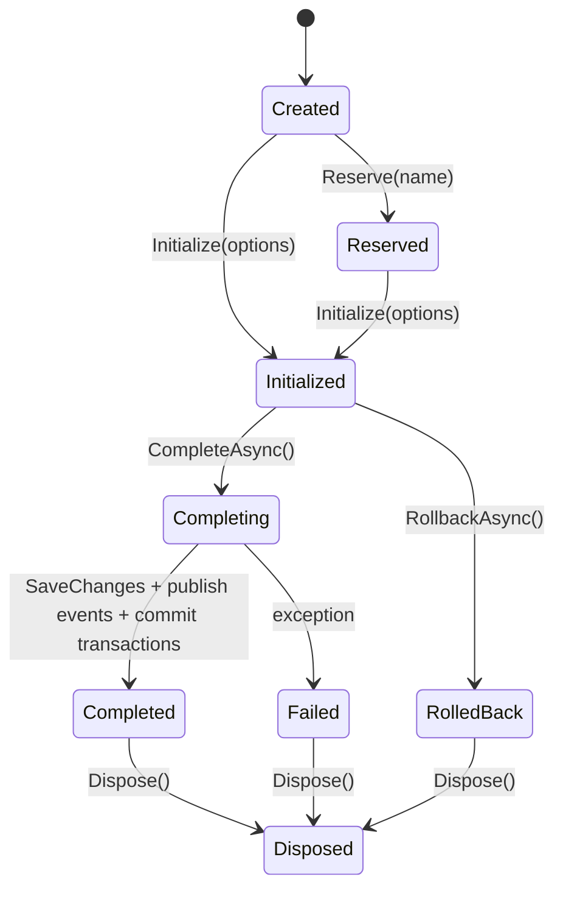
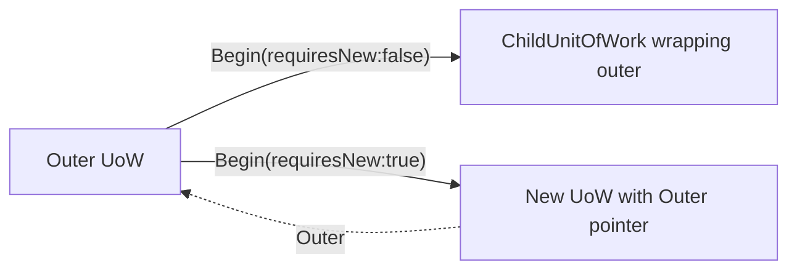
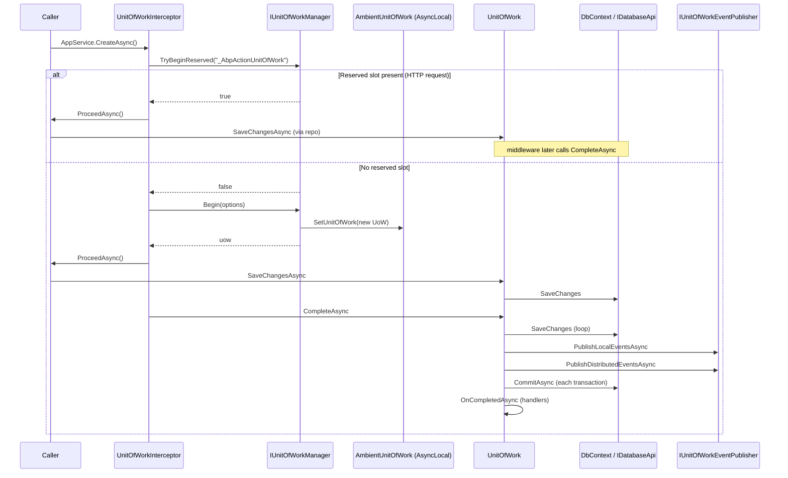

The ABP Framework's unit-of-work (UoW) runtime lives in
`framework/src/Volo.Abp.Uow/Volo/Abp/Uow/`. It supplies the ambient
transactional scope that repositories, application services, and the event
publisher coordinate around. This page walks the contract, the lifecycle (Begin
→ SaveChanges → Complete → Dispose), the interceptor that wraps service
methods, and the nested-UoW model implemented by `ChildUnitOfWork`.

## `IUnitOfWork` contract

`framework/src/Volo.Abp.Uow/Volo/Abp/Uow/IUnitOfWork.cs`:

```csharp
public interface IUnitOfWork : IDatabaseApiContainer, ITransactionApiContainer, IDisposable
{
    Guid Id { get; }
    Dictionary<string, object> Items { get; }

    event EventHandler<UnitOfWorkFailedEventArgs> Failed;
    event EventHandler<UnitOfWorkEventArgs> Disposed;

    IAbpUnitOfWorkOptions Options { get; }
    IUnitOfWork? Outer { get; }

    bool IsReserved { get; }
    bool IsDisposed { get; }
    bool IsCompleted { get; }
    string? ReservationName { get; }

    void SetOuter(IUnitOfWork? outer);
    void Initialize(AbpUnitOfWorkOptions options);
    void Reserve(string reservationName);

    Task SaveChangesAsync(CancellationToken cancellationToken = default);
    Task CompleteAsync(CancellationToken cancellationToken = default);
    Task RollbackAsync(CancellationToken cancellationToken = default);

    void OnCompleted(Func<Task> handler);

    void AddOrReplaceLocalEvent(UnitOfWorkEventRecord eventRecord,
        Predicate<UnitOfWorkEventRecord>? replacementSelector = null);

    void AddOrReplaceDistributedEvent(UnitOfWorkEventRecord eventRecord,
        Predicate<UnitOfWorkEventRecord>? replacementSelector = null);
}
```

Three things to register:

* **`IDatabaseApiContainer`, `ITransactionApiContainer`.** A UoW is a container
  of "database APIs" and "transaction APIs" — the EF Core integration registers
  one `DbContext` per UoW per connection string; the MongoDB integration
  registers a `MongoClient` session.
* **`IDisposable`.** The UoW must be disposed; otherwise the transaction stays
  open and the connection leaks.
* **Local/distributed events.** Domain events are queued onto the UoW and only
  flushed at completion time.

## `IUnitOfWorkManager`

`framework/src/Volo.Abp.Uow/Volo/Abp/Uow/IUnitOfWorkManager.cs`:

```csharp
public interface IUnitOfWorkManager
{
    IUnitOfWork? Current { get; }
    IUnitOfWork Begin(AbpUnitOfWorkOptions options, bool requiresNew = false);
    IUnitOfWork Reserve(string reservationName, bool requiresNew = false);
    void BeginReserved(string reservationName, AbpUnitOfWorkOptions options);
    bool TryBeginReserved(string reservationName, AbpUnitOfWorkOptions options);
}
```

`Begin` either starts a new scope or returns a `ChildUnitOfWork` wrapping the
ambient one. `Reserve`/`BeginReserved` is used by ASP.NET Core middleware to
pre-allocate a UoW slot before the actual request handler runs (so MVC actions
join the same UoW that the auth middleware already opened).

## `AbpUnitOfWorkOptions`

`framework/src/Volo.Abp.Uow/Volo/Abp/Uow/AbpUnitOfWorkOptions.cs`:

```csharp
public class AbpUnitOfWorkOptions : IAbpUnitOfWorkOptions
{
    public bool IsTransactional { get; set; }
    public IsolationLevel? IsolationLevel { get; set; }
    public int? Timeout { get; set; }
    ...
    public AbpUnitOfWorkOptions Clone() { ... }
}
```

Only three knobs: transactional or not, isolation level, timeout (milliseconds).

## `AbpUnitOfWorkDefaultOptions`

`framework/src/Volo.Abp.Uow/Volo/Abp/Uow/AbpUnitOfWorkDefaultOptions.cs`:

```csharp
public class AbpUnitOfWorkDefaultOptions
{
    public UnitOfWorkTransactionBehavior TransactionBehavior { get; set; }
        = UnitOfWorkTransactionBehavior.Auto;
    public IsolationLevel? IsolationLevel { get; set; }
    public int? Timeout { get; set; }

    internal AbpUnitOfWorkOptions Normalize(AbpUnitOfWorkOptions options)
    {
        if (options.IsolationLevel == null) options.IsolationLevel = IsolationLevel;
        if (options.Timeout == null) options.Timeout = Timeout;
        return options;
    }

    public bool CalculateIsTransactional(bool autoValue)
        => TransactionBehavior switch
        {
            UnitOfWorkTransactionBehavior.Enabled  => true,
            UnitOfWorkTransactionBehavior.Disabled => false,
            UnitOfWorkTransactionBehavior.Auto     => autoValue,
            _ => throw new AbpException(...)
        };
}

public enum UnitOfWorkTransactionBehavior { Auto, Enabled, Disabled }
```

The "Auto" behavior is the default: the interceptor picks transactional unless
the method name starts with `Get` (see below).

## `UnitOfWorkAttribute`

`framework/src/Volo.Abp.Uow/Volo/Abp/Uow/UnitOfWorkAttribute.cs`:

```csharp
[AttributeUsage(AttributeTargets.Method | AttributeTargets.Class | AttributeTargets.Interface)]
public class UnitOfWorkAttribute : Attribute
{
    public bool? IsTransactional { get; set; }
    public int? Timeout { get; set; }
    public IsolationLevel? IsolationLevel { get; set; }
    public bool IsDisabled { get; set; }

    public virtual void SetOptions(AbpUnitOfWorkOptions options)
    {
        if (IsTransactional.HasValue) options.IsTransactional = IsTransactional.Value;
        if (Timeout.HasValue) options.Timeout = Timeout;
        if (IsolationLevel.HasValue) options.IsolationLevel = IsolationLevel;
    }
}
```

`IsDisabled = true` opts out of the UoW entirely — even if `IUnitOfWorkEnabled`
is implemented. The XML comment explains:

> *This attribute has no effect if there is already a unit of work before
> calling this method. It uses the ambient UOW in this case.*

## `UnitOfWorkInterceptor`

`framework/src/Volo.Abp.Uow/Volo/Abp/Uow/UnitOfWorkInterceptor.cs`:

```csharp
public class UnitOfWorkInterceptor : AbpInterceptor, ITransientDependency
{
    public override async Task InterceptAsync(IAbpMethodInvocation invocation)
    {
        if (!UnitOfWorkHelper.IsUnitOfWorkMethod(invocation.Method, out var unitOfWorkAttribute))
        {
            await invocation.ProceedAsync();
            return;
        }

        using (var scope = _serviceScopeFactory.CreateScope())
        {
            var options = CreateOptions(scope.ServiceProvider, invocation, unitOfWorkAttribute);
            var unitOfWorkManager = scope.ServiceProvider.GetRequiredService<IUnitOfWorkManager>();

            // Trying to begin a reserved UOW by AbpUnitOfWorkMiddleware
            if (unitOfWorkManager.TryBeginReserved(UnitOfWork.UnitOfWorkReservationName, options))
            {
                await invocation.ProceedAsync();
                if (unitOfWorkManager.Current != null)
                {
                    await unitOfWorkManager.Current.SaveChangesAsync();
                }
                return;
            }

            using (var uow = unitOfWorkManager.Begin(options))
            {
                await invocation.ProceedAsync();
                await uow.CompleteAsync();
            }
        }
    }

    private AbpUnitOfWorkOptions CreateOptions(IServiceProvider serviceProvider,
        IAbpMethodInvocation invocation, UnitOfWorkAttribute? unitOfWorkAttribute)
    {
        var options = new AbpUnitOfWorkOptions();
        unitOfWorkAttribute?.SetOptions(options);

        if (unitOfWorkAttribute?.IsTransactional == null)
        {
            var defaultOptions = serviceProvider.GetRequiredService<IOptions<AbpUnitOfWorkDefaultOptions>>().Value;
            options.IsTransactional = defaultOptions.CalculateIsTransactional(
                autoValue: serviceProvider.GetRequiredService<IUnitOfWorkTransactionBehaviourProvider>().IsTransactional
                           ?? !invocation.Method.Name.StartsWith("Get", StringComparison.InvariantCultureIgnoreCase)
            );
        }
        return options;
    }
}
```

Three behaviors worth highlighting:

* **Method-name heuristic.** When no attribute settings exist and the default
  options are `Auto`, the interceptor decides "transactional" by checking
  whether the method name starts with `Get`. `Get*` methods are read-only;
  everything else opens a transaction.
* **Reserved-UoW handoff.** ASP.NET Core middleware reserves a UoW under
  `UnitOfWork.UnitOfWorkReservationName` ("`_AbpActionUnitOfWork`"); if found,
  the interceptor binds the reserved slot rather than creating a new one. This
  is why one HTTP request can have multiple intercepted calls share a UoW.
* **`SaveChangesAsync` vs. `CompleteAsync`.** In the reserved path the
  interceptor only calls `SaveChangesAsync` — the middleware is responsible
  for `CompleteAsync` at the end of the request. In the new-scope path the
  interceptor itself completes the UoW.

`UnitOfWorkInterceptorRegistrar` in
`framework/src/Volo.Abp.Uow/Volo/Abp/Uow/UnitOfWorkInterceptorRegistrar.cs`
attaches the interceptor to every class that either implements
`IUnitOfWorkEnabled` (`framework/src/Volo.Abp.Uow/Volo/Abp/Uow/IUnitOfWorkEnabled.cs`)
or has at least one method tagged `[UnitOfWork]`. `ApplicationService` and
`BasicRepositoryBase` both implement `IUnitOfWorkEnabled`, so every
application service and every repository is intercepted by default.

## Lifecycle state machine

The `UnitOfWork` implementation in
`framework/src/Volo.Abp.Uow/Volo/Abp/Uow/UnitOfWork.cs` runs through a precise
state machine:



Key invariants enforced by the source:

* **One `Initialize`.** `Initialize` throws "This unit of work has already been
  initialized" if `Options != null`. The interceptor always uses a fresh scope.
* **One `Complete`.** `PreventMultipleComplete` raises "Completion has already
  been requested for this unit of work" if `CompleteAsync` runs twice.
* **Rollback short-circuits.** Once `RollbackAsync` flips `_isRolledback`,
  `SaveChangesAsync` and `CompleteAsync` exit immediately. The transactions
  are released via `ISupportsRollback.RollbackAsync` on each registered API.

## What `CompleteAsync` does

The full `CompleteAsync` in `UnitOfWork.cs` runs four steps:

1. **`SaveChangesAsync`** — calls each `IDatabaseApi`'s `SaveChangesAsync` if
   it implements `ISupportsSavingChanges`.
2. **Publish events** — drains `LocalEvents` (ordered by `EventOrder`) into
   `IUnitOfWorkEventPublisher.PublishLocalEventsAsync`, then `DistributedEvents`.
   Because handlers can register more events, the publish/save loop runs until
   both queues are empty.
3. **`CommitTransactionsAsync`** — calls `CommitAsync` on every registered
   `ITransactionApi`.
4. **`OnCompletedAsync`** — invokes every handler registered via
   `OnCompleted(Func<Task>)`. Subscribers use this to schedule work that should
   only run if the transaction actually succeeded.

If any step throws, `_exception` is recorded and the exception is rethrown.
`Dispose` then sees `IsCompleted == false || _exception != null`, invokes
`OnFailed` to fire the `Failed` event, and disposes transactions.

## `IDatabaseApi` and `ITransactionApi`

`framework/src/Volo.Abp.Uow/Volo/Abp/Uow/IDatabaseApi.cs`:

```csharp
public interface IDatabaseApi { }
```

`framework/src/Volo.Abp.Uow/Volo/Abp/Uow/ITransactionApi.cs`:

```csharp
public interface ITransactionApi : IDisposable
{
    Task CommitAsync(CancellationToken cancellationToken = default);
}
```

Both are empty contract markers — the data-provider integrations supply real
classes (`EfCoreDatabaseApi`, `MongoDbDatabaseApi`, `EfCoreTransactionApi`,
etc.) that the UoW keys by connection string. `ISupportsSavingChanges` and
`ISupportsRollback` (in
`framework/src/Volo.Abp.Uow/Volo/Abp/Uow/ISupportsSavingChanges.cs` and
`ISupportsRollback.cs`) let the UoW iterate the registered APIs and ask each
to flush or roll back its own work.

## `IUnitOfWorkEventPublisher`

`framework/src/Volo.Abp.Uow/Volo/Abp/Uow/IUnitOfWorkEventPublisher.cs`:

```csharp
public interface IUnitOfWorkEventPublisher
{
    Task PublishLocalEventsAsync(IEnumerable<UnitOfWorkEventRecord> localEvents);
    Task PublishDistributedEventsAsync(IEnumerable<UnitOfWorkEventRecord> distributedEvents);
}
```

`NullUnitOfWorkEventPublisher` is the default implementation. When
`Volo.Abp.EventBus` is loaded, that module replaces the null with a real
publisher that walks the local-bus subscribers and dispatches the
distributed-bus envelopes.

`UnitOfWorkEventRecord` (in
`framework/src/Volo.Abp.Uow/Volo/Abp/Uow/UnitOfWorkEventRecord.cs`) wraps the
event with its type, the `EventOrder` from `EventOrderGenerator`, a `UseOutbox`
flag, and a free-form `Properties` dictionary.

## Ambient UoW

`framework/src/Volo.Abp.Uow/Volo/Abp/Uow/AmbientUnitOfWork.cs`:

```csharp
[ExposeServices(typeof(IAmbientUnitOfWork), typeof(IUnitOfWorkAccessor))]
public class AmbientUnitOfWork : IAmbientUnitOfWork, ISingletonDependency
{
    public IUnitOfWork? UnitOfWork => _currentUow.Value;

    private readonly AsyncLocal<IUnitOfWork?> _currentUow;

    public void SetUnitOfWork(IUnitOfWork? unitOfWork) => _currentUow.Value = unitOfWork;

    public IUnitOfWork? GetCurrentByChecking()
    {
        var uow = UnitOfWork;
        while (uow != null && (uow.IsReserved || uow.IsDisposed || uow.IsCompleted))
        {
            uow = uow.Outer;
        }
        return uow;
    }
}
```

`UnitOfWorkManager.Current` calls `GetCurrentByChecking`, so once a UoW
completes or is reserved, the manager walks `Outer` to find the next viable
one. This keeps the ambient slot from pointing at a defunct UoW.

## `ChildUnitOfWork` — nested scopes

`framework/src/Volo.Abp.Uow/Volo/Abp/Uow/ChildUnitOfWork.cs` wraps the parent
UoW for inner scopes:

```csharp
internal class ChildUnitOfWork : IUnitOfWork
{
    public Guid Id => _parent.Id;
    ...
    public Task CompleteAsync(CancellationToken cancellationToken = default)
        => Task.CompletedTask;

    public Task SaveChangesAsync(CancellationToken cancellationToken = default)
        => _parent.SaveChangesAsync(cancellationToken);

    public Task RollbackAsync(CancellationToken cancellationToken = default)
        => _parent.RollbackAsync(cancellationToken);
    ...
    public void Dispose() { }
}
```

The semantics:

* **`SaveChangesAsync` propagates.** Inner save flushes the parent.
* **`CompleteAsync` is a no-op.** Only the outermost UoW completes.
* **`RollbackAsync` cascades.** Inner rollback rolls back the parent —
  inverting nested transactions to outer-failure-on-inner-rollback
  semantics.
* **`Dispose` is a no-op.** The parent owns the lifetime.

`UnitOfWorkManager.Begin` decides whether to wrap or to start fresh:

```csharp
public IUnitOfWork Begin(AbpUnitOfWorkOptions options, bool requiresNew = false)
{
    var currentUow = Current;
    if (currentUow != null && !requiresNew)
    {
        return new ChildUnitOfWork(currentUow);
    }

    var unitOfWork = CreateNewUnitOfWork();
    unitOfWork.Initialize(options);
    return unitOfWork;
}
```

`requiresNew: true` forces a fresh UoW even when an ambient one exists — the
equivalent of `TransactionScopeOption.RequiresNew`.

## Nested-UoW state across `requiresNew`



When the fresh UoW completes, its disposer restores the ambient slot to the
outer UoW via the `Disposed` event handler set in `CreateNewUnitOfWork`:

```csharp
unitOfWork.Disposed += (sender, args) =>
{
    _ambientUnitOfWork.SetUnitOfWork(outerUow);
    scope.Dispose();
};
```

## End-to-end interception flow



## `UnitOfWorkExtensions`

`framework/src/Volo.Abp.Uow/Volo/Abp/Uow/UnitOfWorkExtensions.cs` adds typed
`Items` helpers:

```csharp
public static bool IsReservedFor(this IUnitOfWork unitOfWork, string reservationName)
    => unitOfWork.IsReserved && unitOfWork.ReservationName == reservationName;

public static void AddItem<TValue>(this IUnitOfWork unitOfWork, string key, TValue value) where TValue : class
    => unitOfWork.Items[key] = value;

public static TValue GetOrAddItem<TValue>(this IUnitOfWork unitOfWork, string key, Func<string, TValue> factory)
    where TValue : class
    => unitOfWork.Items.GetOrAdd(key, factory).As<TValue>();
```

`Volo.Abp.Ddd.Domain` uses this to store
`UnitOfWorkItemNames.HardDeletedEntities = "AbpHardDeletedEntities"` on the
UoW (see `ddd/repositories`), so soft-delete logic can opt particular entities
into a hard delete inside the same transaction.

## `IUnitOfWorkTransactionBehaviourProvider`

`framework/src/Volo.Abp.Uow/Volo/Abp/Uow/IUnitOfWorkTransactionBehaviourProvider.cs`
lets a host short-circuit the method-name heuristic by returning `IsTransactional`
explicitly. The default `NullUnitOfWorkTransactionBehaviourProvider` returns
`null`, falling back to `Get*` detection.

## `AlwaysDisableTransactionsUnitOfWorkManager`

`framework/src/Volo.Abp.Uow/Volo/Abp/Uow/AlwaysDisableTransactionsUnitOfWorkManager.cs`
is a drop-in replacement for `UnitOfWorkManager` that forces every UoW to be
non-transactional. Background workers that talk to multiple stores sometimes
register it as a scoped replacement to avoid distributed-transaction wrappers.

## Practical tips

* **Don't manually `Begin` inside an application service** unless you need
  `requiresNew: true`. The interceptor already gives you an ambient UoW.
* **Use `OnCompleted`** to schedule work (cache refresh, file write) that must
  not fire if the transaction rolls back.
* **Use `AddOrReplaceLocalEvent` with a `replacementSelector`** to collapse
  duplicate domain events for the same aggregate within one UoW — e.g. drop
  several "PriceChanged" events down to the latest one before publishing.
* **Honor `IsDisposed`** when caching UoW-scoped state. Reading `Items` from a
  disposed UoW is supported but typically meaningless.

## Related pages

* `ddd/repositories` — `BasicRepositoryBase.SaveChangesAsync` calls into the
  ambient UoW.
* `ddd/application-layer` — `ApplicationService` implements `IUnitOfWorkEnabled`,
  triggering the interceptor.
* `events/local-event-bus` and `events/distributed-event-bus` — the publisher
  side of `IUnitOfWorkEventPublisher`.
* `http/aspnetcore-core` — `AbpUnitOfWorkMiddleware` reserves the ambient UoW
  for HTTP requests.
* `core/aspects-and-dynamic-proxy` — how `UnitOfWorkInterceptor` is wired.
