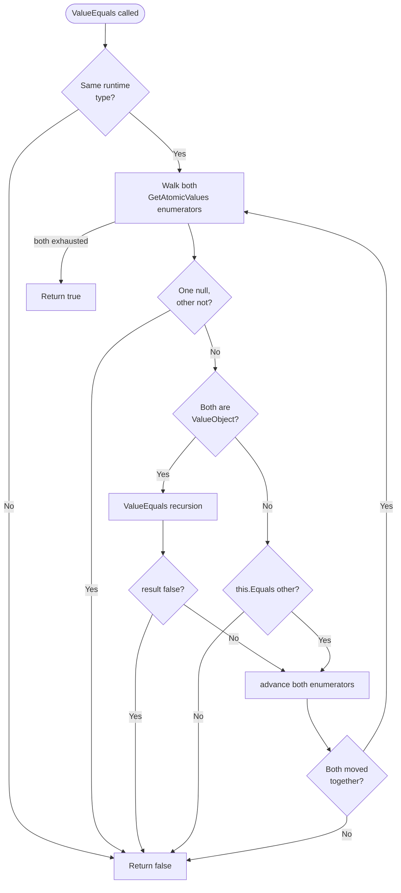

The ABP Framework's value-object primitive lives in a single file:
`framework/src/Volo.Abp.Ddd.Domain/Volo/Abp/Domain/Values/ValueObject.cs`. The
class is intentionally minimal — it provides a structural-equality helper and
nothing else, letting feature modules define their own immutability discipline.
This page covers the comparison semantics, the relationship with
`EntityHelper.IsValueObject`, and the conventional usage patterns.

## The `ValueObject` source

The full source is small enough to read end to end:

```csharp
namespace Volo.Abp.Domain.Values;

//Inspired from https://docs.microsoft.com/en-us/dotnet/standard/microservices-architecture/microservice-ddd-cqrs-patterns/implement-value-objects

public abstract class ValueObject
{
    protected abstract IEnumerable<object> GetAtomicValues();

    public bool ValueEquals(object obj)
    {
        if (obj == null || obj.GetType() != GetType())
        {
            return false;
        }

        var other = (ValueObject)obj;

        var thisValues = GetAtomicValues().GetEnumerator();
        var otherValues = other.GetAtomicValues().GetEnumerator();

        var thisMoveNext = thisValues.MoveNext();
        var otherMoveNext = otherValues.MoveNext();
        while (thisMoveNext && otherMoveNext)
        {
            if (ReferenceEquals(thisValues.Current, null) ^ ReferenceEquals(otherValues.Current, null))
            {
                return false;
            }

            if (thisValues.Current is ValueObject currentValueObject &&
                otherValues.Current is ValueObject otherValueObject)
            {
                if (!currentValueObject.ValueEquals(otherValueObject))
                {
                    return false;
                }
            }
            else if (thisValues.Current != null && !thisValues.Current.Equals(otherValues.Current))
            {
                return false;
            }

            thisMoveNext = thisValues.MoveNext();
            otherMoveNext = otherValues.MoveNext();

            if (thisMoveNext != otherMoveNext)
            {
                return false;
            }
        }

        return !thisMoveNext && !otherMoveNext;
    }
}
```

## `GetAtomicValues` — the only thing you must override

The base class is `abstract` because it has nothing to compare without the
subclass declaring which fields matter. A typical override returns the value's
constituent parts in a fixed order:

```csharp
public class Address : ValueObject
{
    public string Street { get; }
    public string City { get; }
    public string ZipCode { get; }
    public Country Country { get; } // also a ValueObject

    public Address(string street, string city, string zipCode, Country country)
    {
        Street = street;
        City = city;
        ZipCode = zipCode;
        Country = country;
    }

    protected override IEnumerable<object> GetAtomicValues()
    {
        yield return Street;
        yield return City;
        yield return ZipCode;
        yield return Country;
    }
}
```

The order must stay stable across versions of the type — `ValueEquals` walks
both enumerators in parallel and short-circuits on the first mismatch.

## How `ValueEquals` works

The algorithm is:

1. **Type check.** Reject anything whose runtime type is not exactly the same
   as `this.GetType()`. This means `Address` and `BillingAddress : Address`
   compare unequal even with identical fields, mirroring how DDD treats
   identity by subclassing.
2. **Null XOR check.** `ReferenceEquals(thisValues.Current, null) ^ ReferenceEquals(otherValues.Current, null)`
   ensures one-side null mismatches fail fast.
3. **Recursive value-object compare.** When both current values are
   `ValueObject` instances, the method recurses into `ValueEquals`. This is
   what lets `Address.Country` (also a `ValueObject`) participate in the
   parent comparison without ever falling back to `object.Equals`.
4. **Standard equality otherwise.** For scalar atomic values the call delegates
   to `thisValues.Current.Equals(otherValues.Current)`.
5. **Length consistency.** Both enumerators must end at the same time; the
   `thisMoveNext != otherMoveNext` check inside the loop catches lopsided
   sequences early.



## Identity vs. value equality

The point of `ValueObject` is to be the *negation* of `IEntity`. From the
framework's perspective:

| `IEntity` | `ValueObject` |
| --- | --- |
| Identity is the primary key (`Id`) | Identity is the combination of all atomic values |
| Two entities with the same keys are equal | Two value objects with the same atomic values are equal |
| Mutable lifecycle (created, updated, deleted) | Conventionally immutable |
| Persisted as a table row | Owned by a parent entity (e.g., EF Core owned types) |

This dichotomy is encoded in `EntityHelper.IsValueObjectPredicate` (in
`framework/src/Volo.Abp.Ddd.Domain/Volo/Abp/Domain/Entities/EntityHelper.cs`):

```csharp
public static Func<Type, bool> IsValueObjectPredicate
    = type => typeof(ValueObject).IsAssignableFrom(type);
```

Because the predicate is a public `static` `Func<Type, bool>`, a module can
swap it (for example to recognize a custom `ValueObjectBase`) before any code
that inspects entities runs.

## What `ValueObject` does *not* do

The base class deliberately leaves out:

* **`GetHashCode` / `Equals` overrides.** `ValueEquals` is a separate method.
  Subclasses that want C# `==` semantics need to override `Equals` and
  `GetHashCode` themselves — typically by delegating to `GetAtomicValues` again.
* **Immutability enforcement.** There's no `readonly` checking. The
  *convention* is that value objects are immutable, but ABP does not enforce
  that with a compile-time or runtime check.
* **Operator overloading.** No `operator ==` / `operator !=`. Subclasses are
  free to add them.

`ValueEquals` returning `bool` (rather than throwing) makes it safe to call
from collection-style code such as `list.Any(x => x.ValueEquals(target))`.

## Persistence considerations

EF Core integration in `Volo.Abp.EntityFrameworkCore` configures value objects
as **owned entity types** by convention — see the documentation under
`data/entity-framework-core`. This means the value object's fields live as
columns on the owner's table, which keeps the equality semantics consistent
with the persistence story: the value object has no identity of its own, only
its parent's.

For MongoDB integrations, value objects are stored as embedded documents under
the owning aggregate.

## Conventional usage

* **Always small.** Value objects represent one concept (Money, Address,
  TimeRange). When a value object grows past four or five fields, look for a
  hidden aggregate.
* **No side effects in `GetAtomicValues`.** It is called repeatedly by
  `ValueEquals`; treat it as a pure projection of the value's state.
* **Order matters.** Two `Money` instances with `{Amount = 10, Currency = "EUR"}`
  vs `{Amount = "EUR", Currency = 10}` would compare equal if `GetAtomicValues`
  changed order between versions. Lock the order in once.
* **Combine with `BusinessException`.** When constructing a value object would
  violate a domain rule (negative `Money`, invalid `ISO` country code), throw
  `BusinessException` from the constructor. The value object should never
  exist in an invalid state.

## Cross-references

* `ddd/entities-and-aggregate-roots` — the entity side of the dichotomy.
* `data/entity-framework-core` — how value objects are persisted as EF Core
  owned types.
* `core/reflection-and-internal` — `TypeHelper.IsDefaultValue`, used together
  with `ValueObject` for default-detection in some scenarios.
