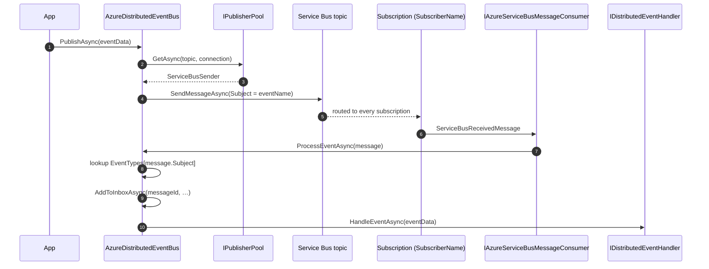

`Volo.Abp.EventBus.Azure` is the Azure Service Bus provider for ABP
Framework's distributed event bus. The integration code is in
`framework/src/Volo.Abp.EventBus.Azure/Volo/Abp/EventBus/Azure/`. It
delegates connection, processor, and publisher pooling to
`framework/src/Volo.Abp.AzureServiceBus/Volo/Abp/AzureServiceBus/`.

## Module composition

```csharp
// AbpEventBusAzureModule.cs
[DependsOn(
    typeof(AbpEventBusModule),
    typeof(AbpAzureServiceBusModule))]
public class AbpEventBusAzureModule : AbpModule
{
    public override void ConfigureServices(ServiceConfigurationContext context)
    {
        var configuration = context.Services.GetConfiguration();
        Configure<AbpAzureEventBusOptions>(configuration.GetSection("Azure:EventBus"));
    }

    public override void OnApplicationInitialization(ApplicationInitializationContext context)
    {
        var options = context.ServiceProvider
            .GetRequiredService<IOptions<AbpAzureEventBusOptions>>().Value;

        if (!options.IsServiceBusDisabled)
        {
            context.ServiceProvider
                .GetRequiredService<AzureDistributedEventBus>()
                .Initialize();
        }
    }
}
```

The `IsServiceBusDisabled` switch is a convenient escape hatch: setting
it to `true` keeps the package referenced (so DI still resolves
`IDistributedEventBus`) but skips creating any topic/subscription
resources — useful for unit tests and integration test environments
where Service Bus is not available.

## Configuration

`appsettings.json`:

```json
{
  "Azure": {
    "ServiceBus": {
      "Connections": {
        "Default": {
          "ConnectionString":
            "Endpoint=sb://acme-bus.servicebus.windows.net/;SharedAccessKeyName=…;SharedAccessKey=…"
        }
      }
    },
    "EventBus": {
      "ConnectionName": "Default",
      "TopicName": "acme-shop",
      "SubscriberName": "orders-service",
      "IsServiceBusDisabled": false
    }
  }
}
```

The options class:

```csharp
// AbpAzureEventBusOptions.cs
public class AbpAzureEventBusOptions
{
    public string? ConnectionName { get; set; }
    public string SubscriberName { get; set; } = default!;
    public string TopicName { get; set; } = default!;
    public bool IsServiceBusDisabled { get; set; }
}
```

| Field | Meaning |
| --- | --- |
| `ConnectionName` | Key into `AzureServiceBusConnections`; defaults to `Default`. |
| `TopicName` | Shared Service Bus topic. All publishers and subscribers use this single topic. |
| `SubscriberName` | Subscription name on the topic — unique per service so each service has its own subscription that receives a copy of every message. |
| `IsServiceBusDisabled` | When `true`, `Initialize` is skipped at startup. |

`AbpAzureServiceBusModule` registers the `Azure:ServiceBus:Connections`
section into `AbpAzureServiceBusOptions.Connections`:

```csharp
// AbpAzureServiceBusOptions.cs
public class AbpAzureServiceBusOptions
{
    public AzureServiceBusConnections Connections { get; } = new();
}
```

## `AzureDistributedEventBus`

```csharp
// AzureDistributedEventBus.cs
[Dependency(ReplaceServices = true)]
[ExposeServices(typeof(IDistributedEventBus), typeof(AzureDistributedEventBus))]
public class AzureDistributedEventBus : DistributedEventBusBase, ISingletonDependency
{
    protected AbpAzureEventBusOptions Options { get; }
    protected IAzureServiceBusMessageConsumerFactory MessageConsumerFactory { get; }
    protected IPublisherPool PublisherPool { get; }
    protected IAzureServiceBusSerializer Serializer { get; }
    protected IAzureServiceBusMessageConsumer Consumer { get; private set; } = default!;
}
```

### Initialization

```csharp
public void Initialize()
{
    Consumer = MessageConsumerFactory.CreateMessageConsumer(
        Options.TopicName,
        Options.SubscriberName,
        Options.ConnectionName);

    Consumer.OnMessageReceived(ProcessEventAsync);
    SubscribeHandlers(AbpDistributedEventBusOptions.Handlers);
}
```

`CreateMessageConsumer` looks up the topic/subscription pair and
returns a long-lived consumer that wraps a
`ServiceBusProcessor`. The factory may create the subscription if it
doesn't exist — see
`ServiceBusAdministrationClientExtensions.cs` in
`Volo.Abp.AzureServiceBus`.

## Publish path

```csharp
protected async override Task PublishToEventBusAsync(Type eventType, object eventData)
{
    var (eventName, resolvedData) = ResolveEventForPublishing(eventType, eventData);
    await PublishAsync(eventName, resolvedData);
}

protected virtual async Task PublishAsync(
    string eventName, byte[] body, string? correlationId, Guid? eventId)
{
    var message = new ServiceBusMessage(body) { Subject = eventName };

    if (message.MessageId.IsNullOrWhiteSpace())
        message.MessageId = (eventId ?? GuidGenerator.Create()).ToString("N");

    message.CorrelationId = correlationId;

    var publisher = await PublisherPool.GetAsync(
        Options.TopicName, Options.ConnectionName);

    await publisher.SendMessageAsync(message);
}
```

The Azure-native fields that ABP populates:

| ServiceBus field | ABP value |
| --- | --- |
| `Subject` | `EventNameAttribute.GetNameOrDefault(eventType)` — used by the consumer to look up the CLR type. |
| `MessageId` | `OutgoingEventInfo.Id.ToString("N")` for outbox publishes, or a fresh GUID for direct publishes. Used for inbox deduplication. |
| `CorrelationId` | Value from `ICorrelationIdProvider`. |
| `Body` | `IAzureServiceBusSerializer.Serialize(eventData)` — JSON by default. |

`IPublisherPool.GetAsync(topicName, connectionName)` returns a cached
`ServiceBusSender` so opening one `ServiceBusClient` per host is enough.

### Outbox batch path

`AzureDistributedEventBus.PublishManyFromOutboxAsync` uses
`ServiceBusMessageBatch` to bundle outbox rows into a single broker
call:

```csharp
var publisher = await PublisherPool.GetAsync(Options.TopicName, Options.ConnectionName);
using var messageBatch = await publisher.CreateMessageBatchAsync();

foreach (var outgoingEvent in outgoingEvents)
{
    var message = new ServiceBusMessage(outgoingEvent.EventData)
    {
        Subject = outgoingEvent.EventName
    };
    // …MessageId, CorrelationId…
    messageBatch.TryAddMessage(message);
}

await publisher.SendMessagesAsync(messageBatch);
```

Combined with `AbpEventBusBoxesOptions.BatchPublishOutboxEvents = true`
(the default), this drastically reduces round-trips when a UoW
generates many events.

## Receive path

```csharp
private async Task ProcessEventAsync(ServiceBusReceivedMessage message)
{
    var eventName = message.Subject;
    if (eventName == null) return;

    var eventType = EventTypes.GetOrDefault(eventName);
    object eventData;

    if (eventType != null)
    {
        eventData = Serializer.Deserialize(message.Body.ToArray(), eventType);
    }
    else if (DynamicHandlerFactories.ContainsKey(eventName))
    {
        eventData = new DynamicEventData(eventName,
            Serializer.Deserialize<object>(message.Body.ToArray()));
        eventType = typeof(DynamicEventData);
    }
    else
    {
        return;
    }

    if (await AddToInboxAsync(message.MessageId, eventName,
            eventType, eventData, message.CorrelationId))
    {
        return;
    }

    using (CorrelationIdProvider.Change(message.CorrelationId))
    {
        await TriggerHandlersDirectAsync(eventType, eventData);
    }
}
```

The message id and correlation id are first-class fields on
`ServiceBusReceivedMessage`, so no header parsing is needed — they are
fed straight into `AddToInboxAsync` for deduplication.

## End-to-end flow



## Underlying infrastructure

| Service | Source | Role |
| --- | --- | --- |
| `IConnectionPool` | `Volo.Abp.AzureServiceBus/ConnectionPool.cs` | Caches `ServiceBusClient`. |
| `IPublisherPool` | `Volo.Abp.AzureServiceBus/PublisherPool.cs` | Caches `ServiceBusSender` per topic. |
| `IProcessorPool` | `Volo.Abp.AzureServiceBus/ProcessorPool.cs` | Caches `ServiceBusProcessor` per subscription. |
| `IAzureServiceBusMessageConsumerFactory` | `Volo.Abp.AzureServiceBus/IAzureServiceBusMessageConsumerFactory.cs` | Builds the long-lived `IAzureServiceBusMessageConsumer`. |
| `IAzureServiceBusSerializer` | `Utf8JsonAzureServiceBusSerializer.cs` | Default JSON serializer; replaceable. |
| `ServiceBusAdministrationClientExtensions` | Same folder | Creates the topic/subscription if missing. |

`AzureServiceBusConnections` is a `Dictionary<string, ClientConfig>`
keyed by connection name, with a required `"Default"` entry whose
`ConnectionString` is bound from configuration.

## Topic / subscription topology

<Info>
  - **Topic** is shared. Every publisher writes to one topic;
    Service Bus replicates each message to every subscription that
    survives its filter.
  - **Subscription** is per service. Each `SubscriberName` represents
    one logical consumer that receives a copy of every message.
  - Multiple replicas of the same service share the subscription and
    compete for messages — Service Bus delivers each message to exactly
    one of them.
</Info>

If you want a service to receive only a subset of events, add a
Service Bus rule/filter on the subscription that matches on `Subject`
(the ABP event name). The provider does not configure rules itself —
manage them through ARM templates, the Azure CLI, or Bicep.

## Pairing with the outbox

```csharp
Configure<AbpDistributedEventBusOptions>(o =>
{
    o.Outboxes.Configure("Default", c => c.UseDbContext<OrdersDbContext>());
    o.Inboxes.Configure("Default", c => c.UseDbContext<OrdersDbContext>());
});

Configure<AbpEventBusBoxesOptions>(o =>
{
    o.BatchPublishOutboxEvents = true; // default — uses SendMessagesAsync(batch)
    o.PeriodTimeSpan = TimeSpan.FromSeconds(2);
});
```

<Tip>
  Need to disable Service Bus in tests but keep handlers compiled? Set
  `Azure:EventBus:IsServiceBusDisabled = true` in the test
  `appsettings.json` and inject `ILocalEventBus` directly to drive
  handlers in-process.
</Tip>

`OnAddToOutboxAsync` also registers the type in `EventTypes` for
strongly typed events, so that the outbox sender can correctly identify
events when they later arrive at the subscription:

```csharp
protected override Task OnAddToOutboxAsync(string eventName, Type eventType, object eventData)
{
    if (typeof(DynamicEventData) != eventType)
    {
        EventTypes.GetOrAdd(eventName, eventType);
    }
    return base.OnAddToOutboxAsync(eventName, eventType, eventData);
}
```

This is the Azure provider's small but important contribution to the
otherwise-shared outbox pipeline.
